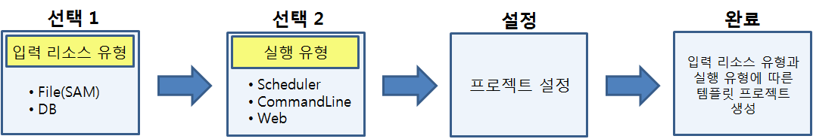
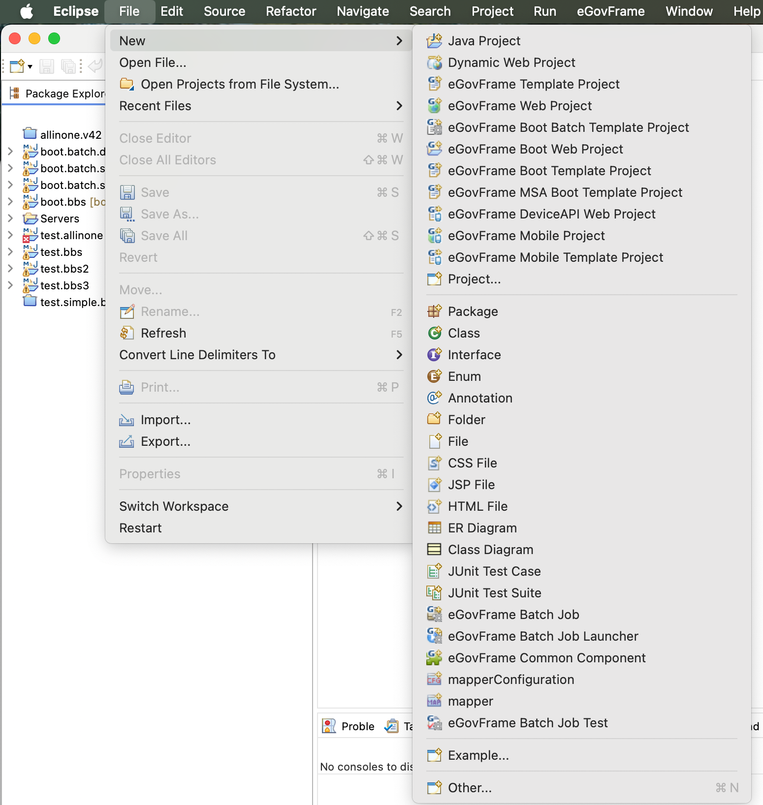
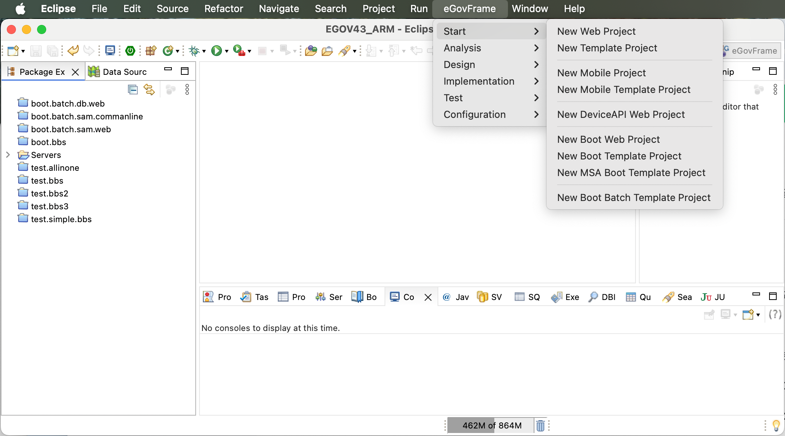

# Batch Template Project Wizard

## 개요

eGovFrame기반의 배치 어플리케이션 개발시 개발자 편의성을 위하여 기본적인 코드등을 포함하고 있는 배치 템플릿 프로젝트 자동 생성 마법사를 제공한다.

## 설명

배치 템플릿 입력 리소스 유형과 실행 유형을 선택할 수 있는 eGovFrame기반의 배치 템플릿 프로젝트 자동 생성 마법사를 제공한다.

#### 배치 템플릿 마법사 진행 과정

* 배치 템플릿 **입력 리소스 유형에** 따른 구분
  * File(SAM) : 입력 리소스 유형이 File(SAM)인 배치실행환경을 제공한다. '입력 리소스 유형이 File(SAM)'이라는 것은 아래와 같이 File to File, File to DB 두 가지 유형을 지칭한다.
    * File to File : File(SAM) 형태의 자료에서 원천 데이터를 입력받아 File 형태의 배치실행 결과물을 제공하는 유형
    * File to DB : File(SAM) 형태의 자료에서 원천 데이터를 입력받아 데이터베이스 테이블 형태의 배치실행 결과물을 제공하는 유형
  * DB : 입력 리소스 유형이 데이터베이스 테이블인 배치실행환경을 제공한다. '입력 리소스 유형이 DB'라는 것은 아래와 같이 DB to File, DB to DB 두 가지 유형을 지칭한다.
    * DB to File : 데이터베이스 테이블 형태의 자료에서 원천 데이터를 입력받아 File 형태의 배치실행 결과물을 제공하는 유형
    * DB to DB : 데이터베이스 테이블 형태의 자료에서 원천 데이터를 입력받아 데이터베이스 테이블 형태의 배치실행 결과물을 제공하는 유형
* 배치 템플릿 **실행 유형에** 따른 구분
  * Scheduler : Scheduler를 이용하여 사용자가 설정한 날짜나 주기에 따라 배치작업을 실행할 수 있는 배치실행환경
  * CommandLine : 명령 프롬프트 혹은 명령 실행 파일을 이용하여 배치작업을 실행할 수 있는 배치실행환경
  * Web : 웹 기반 어플리케이션에서 배치작업을 실행할 수 있는 배치실행환경

## 사용법

1. 배치 템플릿 마법사 시작하기

   * 메뉴 표시줄에서 **File** > **New** > **eGovFrame Boot Batch Template Project**를 선택한다. (단 eGovFrame Perspective내에서)

     

   * 또는, 메뉴 표시줄에서 **eGovFrame** > **Start** > **eGovFrame Boot Batch Template Project**를 선택한다.

     

   * 또는, **Ctrl+N** 단축키를 이용하여 새로작성 마법사를 실행한 후 **eGovFrame** > **eGovFrame Boot Batch Template Project**을 선택하고 **Next**를 클릭한다.

     

2. 배치 템플릿 입력 리소스 유형(File(SAM), DB)을 선택하고, **Next**를 클릭한다.

   

3. 배치 템플릿 실행 유형(Scheduler, CommandLine, Web)을 선택하고, **Next**를 클릭한다.

   

4. 위의 2, 3 과정에서 선택한 입력 리소스 유형(File(SAM), DB)과 실행 유형(Scheduler, CommandLine, Web)에 따라 배치 템플릿 마법사 프로젝트 설정 단계를 계속 진행한다.

#### (계속 진행)

| 과정 2    | 과정 3      | 프로젝트 설정(계속)                      |
| --------- | ----------- | ---------------------------------------- |
| File(SAM) | Scheduler   | [SAM + Scheduler 템플릿 설정 진행](https://www.egovframe.go.kr/wiki/doku.php?id=egovframework:dev4:imp:batch_template_wizard:sam_scheduler_template_mgmt)         |
|           | CommandLine | [SAM + CommandLine 템플릿 설정 진행](https://www.egovframe.go.kr/wiki/doku.php?id=egovframework:dev4:imp:batch_template_wizard:sam_commandline_template_mgmt)       |
|           | Web         | [SAM + Web 템플릿 설정 진행](https://www.egovframe.go.kr/wiki/doku.php?id=egovframework:dev4:imp:batch_template_wizard:sam_web_template_mgmt)               |
| DB        | Scheduler   | [DB + Scheduler 템플릿 설정 진행](https://www.egovframe.go.kr/wiki/doku.php?id=egovframework:dev4:imp:batch_template_wizard:db_scheduler_template_mgmt)          |
|           | CommandLine | [DB + CommandLine 템플릿 설정 진행](https://www.egovframe.go.kr/wiki/doku.php?id=egovframework:dev4:imp:batch_template_wizard:db_commandline_template_mgmt)        |
|           | Web         | [DB + Web 템플릿 설정 진행](https://www.egovframe.go.kr/wiki/doku.php?id=egovframework:dev4:imp:batch_template_wizard:db_web_template_mgmt)                |