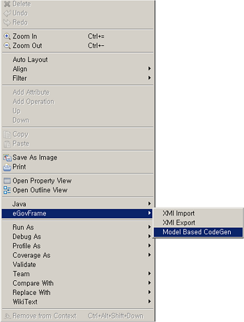
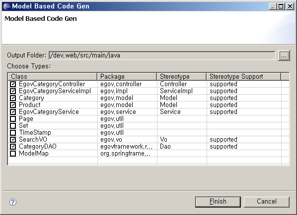
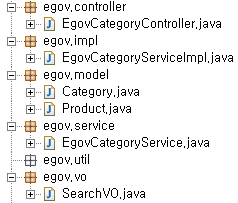

# UML 기반 Code Generation

## 개요

클래스 다이어그램에서 정의한 모델을 통해 eGovFrame에 기반한 자바 코드를 자동 생성하는 기능이다. Model, Service, ServiceImpl, Controller, Vo, Dao 등의 스테레오 타입을 지원하여 모델간 관계에 따른 Spring Annotation을 자동생성한다.

## 사용법

1. 개발하고자 하는 프로그램의 클래스 다이어그램을 작성한다.

   

2. 마우스 오른쪽 버튼을 클릭하여 **eGovFrame** > **Model Based CodeGen**을 선택한다.

   

3. Code Gen. 할 대상 클래스를 선택하고 소스를 저장할 프로젝트와 폴더를 선택하고 **Finish** 버튼을 클릭한다.

   

4. 생성된 소스파일을 확인한다.

   