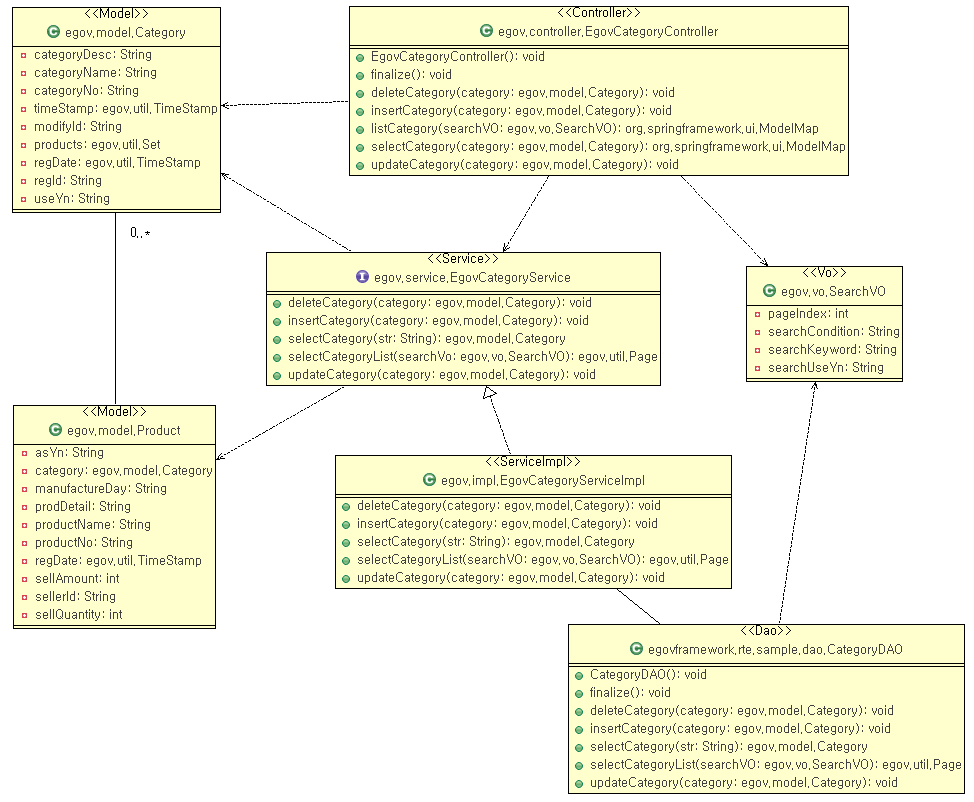
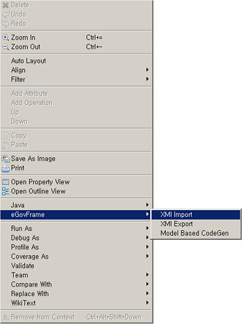
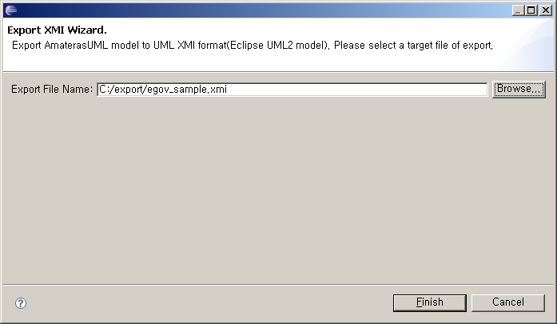

# XMI Export

## 개요

eGovFrame Code Gen은 XMI Export 기능을 통해 타 UML 모델링 도구와의 모델 호환성을 제공한다. (Export 되는 XMI 파일은 UML 2.1, XMI 2.1 버전이므로, 해당 버전을 지원하는 모델링 툴에 한한다.)

## 사용법

1. 전자정부 개발환경 UML 도구를 사용하여 클래스 다이어그램을 작성한다.

   

2. 마우스 오른쪽 버튼을 클릭하여 **eGovFrame** > **XMI Export**를 선택한다.

   

3. XMI 파일을 저장할 위치를 선택한 후 **Finish** 버튼을 클릭한다.

   

4. 생성된 XMI 파일을 확인하고, XMI 2.1, UML2.1 버전을 지원하는 타 UML 모델링 도구에서 Import하여 사용한다.