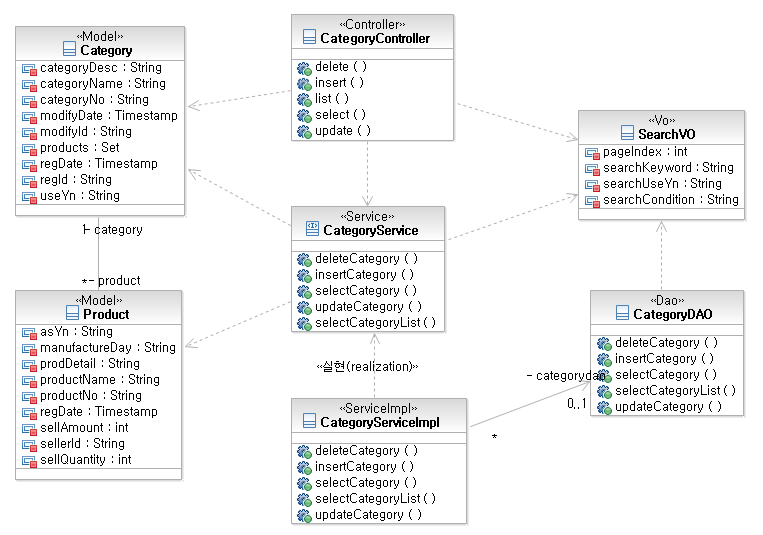
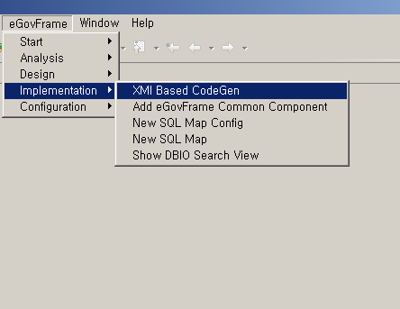
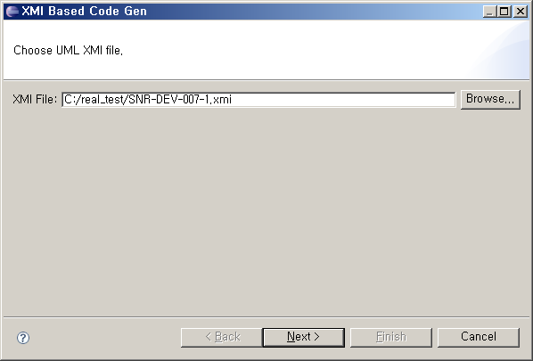
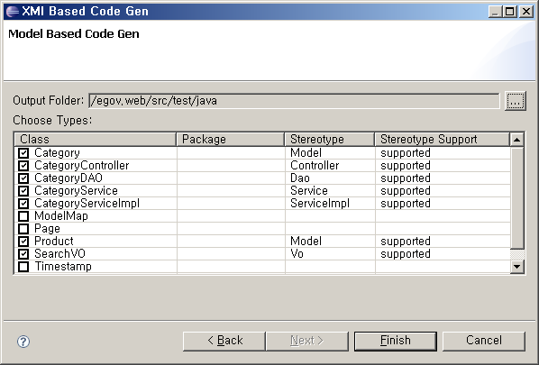
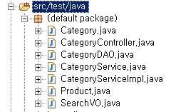

# XMI 기반 Code Generation

## 개요

eGovFrame Code Gen.은 XMI Code Gen. 기능을 통해 타 UML 모델링 도구에서 작성한 모델에 대한 호환성을 제공한다. (단, UML 2.1, XMI 2.1 버전을 지원한다.)

## 사용법

1. 타 UML 모델링 도구에서 클래스 다이어그램을 작성한 후 XMI파일로 Export 한다. (UML 2.1, XMI 2.1 버전에 한함)

   

2. eGovFrame 퍼스펙티브 상에서 상단 메뉴 **eGovFrame** > **Implementation** > **XMI Based CodeGen**을 선택한다.

   

3. XMI 파일을 선택하고 **Next** 버튼을 클릭한다.

   

4. Code Gen. 할 클래스 모델을 선택하고, 소스를 생성할 폴더를 선택한 다음, **Finish** 버튼을 클릭한다.

   

5. 생성된 리소스 파일을 확인한다.

   