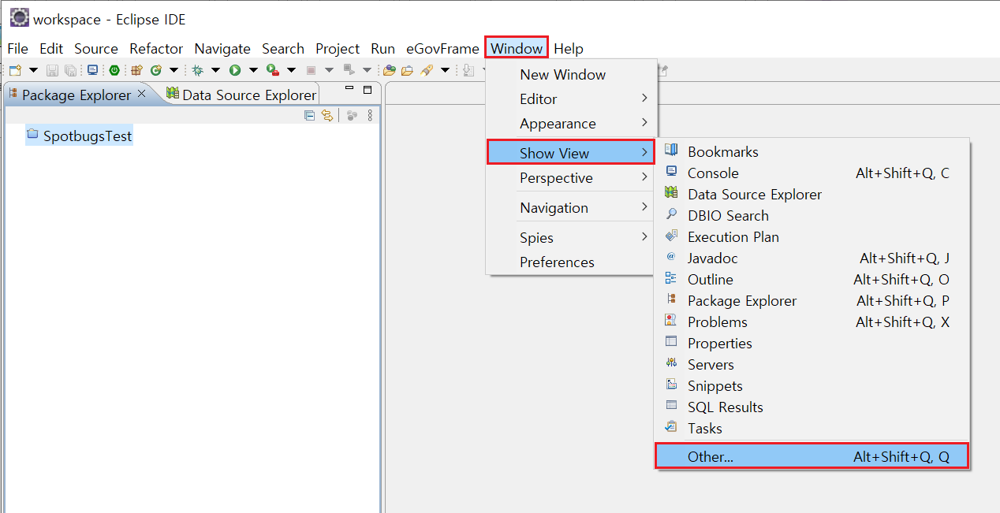
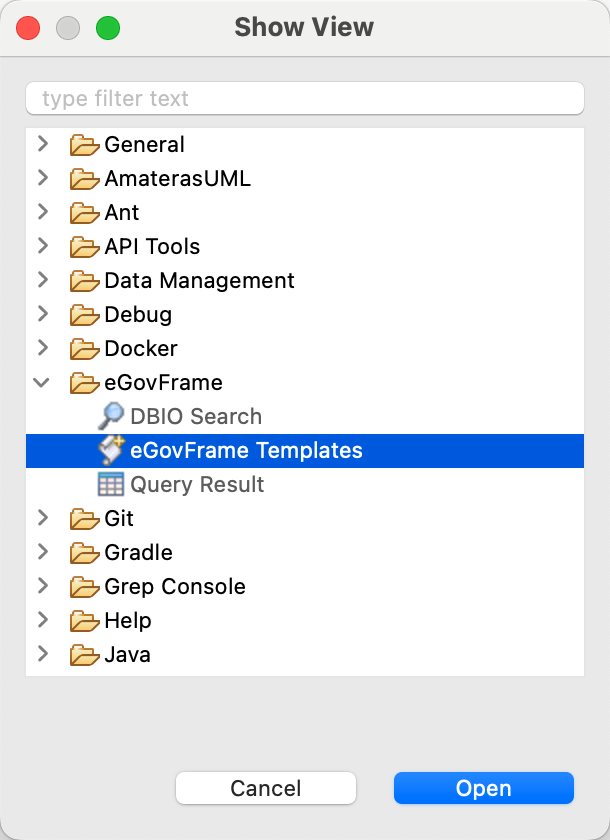
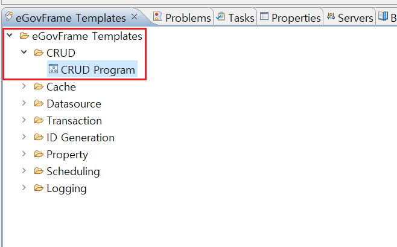
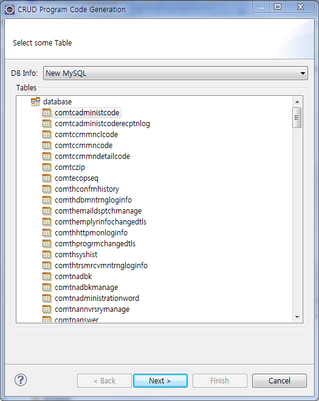
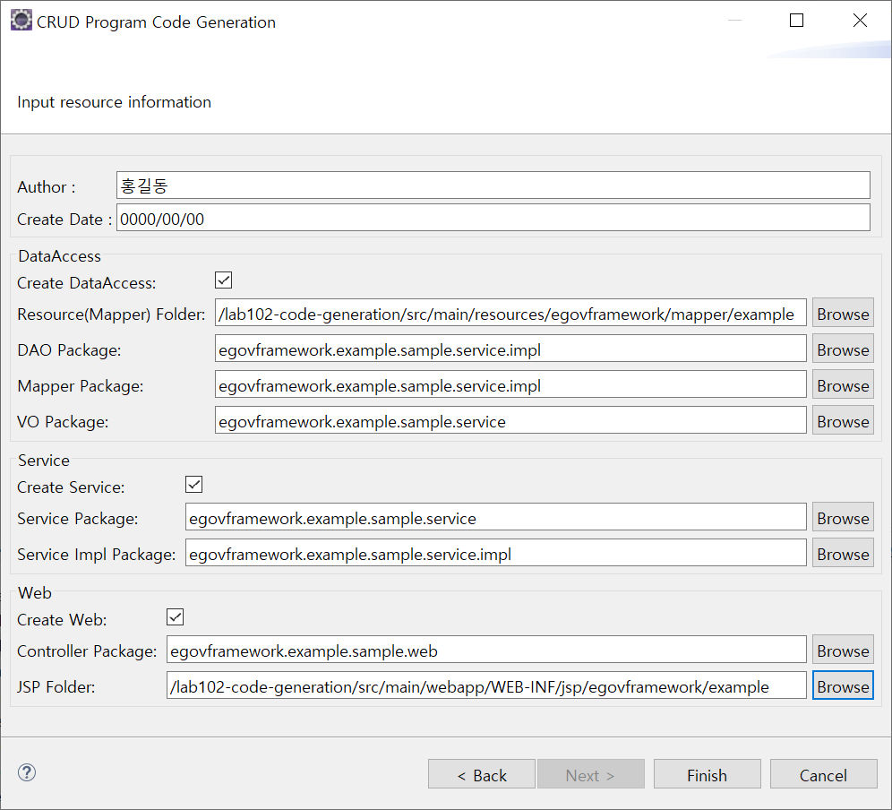
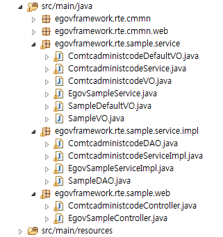

# CRUD Code Generation

## 개요

데이터베이스의 특정 테이블을 지정하면 선택된 테이블에 대한 목록, 조회, 수정, 삭제 등의 기본 기능을 수행하는 프로그램을 자동생성하는 기능이다. 전자정부 프레임워크 MVC 서비스의 개발표준에 따라 작성되어 있으며, 생성되는 리소스의 종류는 다음과 같다.

**XML**

* Mapper : 목록, 조회, 수정, 삭제 등을 수행하는 기본 쿼리를 갖고 있는 Mapper 파일.

**JAVA**

* VO : 데이터베이스에서 가져온 데이터를 1:1매핑시켜주는 Value Object 클래스.
* DAO : 데이터베이스 처리를 담당하는 Database Access Object 클래스.
* Service : 서비스 인터페이스 클래스.
* ServiceImpl : 서비스 구현 클래스.
* Controller : 전달받은 사용자의 요청을 서비스로 연결해주는 Controller 클래스.

**JSP**

* List : 목록 화면
* Register(Form) : 상세조회, 수정 화면

## 사용법

패키지 브라우저 창에서 코드를 생성할 프로젝트를 먼저 선택한 후 다음과 같이 진행한다.

1. 이클립스 **Window** > **Show View** > **Other…**를 선택하여 Show View 창을 연다.

   

2. **eGovFrame Templates** 선택 : Show View에서 **eGovFrame** > **eGovFrame Templates**를 선택한다.

   

3. **CRUD Template** 선택 : eGovFrame Templates View에서 **eGovFrame Templates** > **CRUD** > **CRUD Program**을 선택한다.

   

4. **테이블 선택** : 테이블 선택 마법사 페이지를 통해 DB를 연결하고 테이블 목록에서 테이블을 선택한다. 테이블을 선택하고 "Next" 버튼을 클릭한다. (DB 연결 참조: [Data Source Explorer](./dbio-editor-data-source-explorer.md))

   

5. 생성 리소스명과 위치를 입력한다. 모든 항목을 입력하고 "Finish" 버튼을 클릭한다.
   * 개발자 정보와 날짜 정보 입력
   * Data Access: 리소스가 생성될 디렉토리를 선택한 뒤, DAO와 VO의 패키지 명을 입력
   * Service: Service, Service Impl의 패키지 명을 입력
   * Web: Controller의 패키지 명과 JSP가 생성될 디렉토리를 선택

   

6. 생성된 리소스를 확인한다.

   