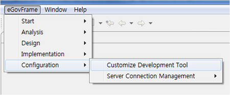
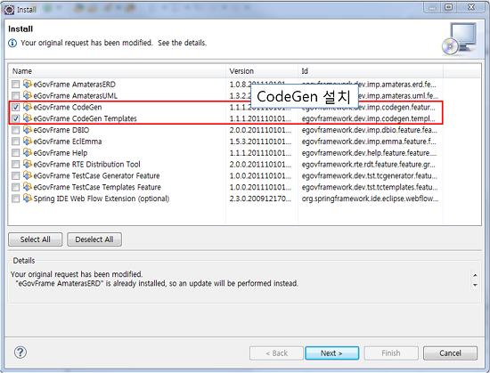
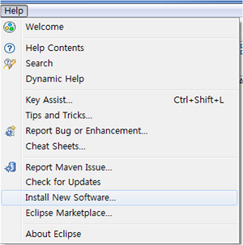
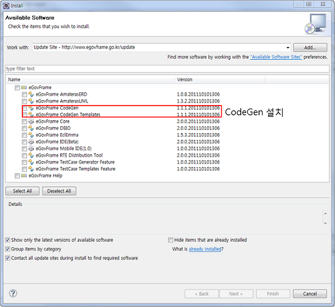
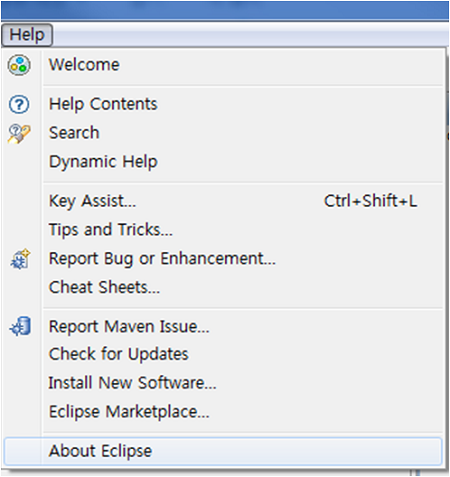
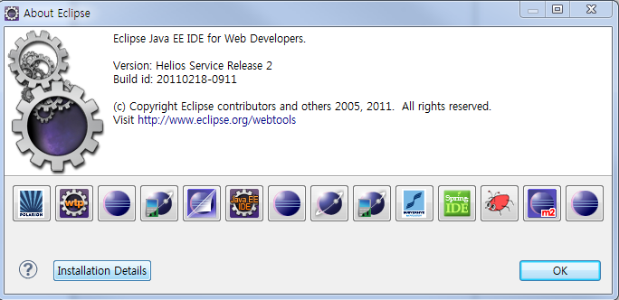
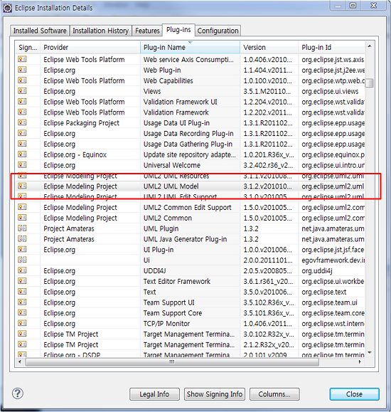

# Code Generation

## 개요

eGovFrame의 개발환경 구현도구에서는 다음과 같은 Code Generation 기능을 제공한다.

**Template 기반 Code Gen**

미리 정의된 템플릿을 사용하여 eGovFrame을 기반으로 하는 CRUD 프로그램을 생성하거나 필요한 Configuration/Property 파일을 쉽게 작성할 수 있다.

**Model 기반 Code Gen**

클래스 다이어그램에서 정의한 모델을 통해 eGovFrame에 기반한 자바 코드를 자동생성한다.

## 설명

eGovFrame 구현도구의 Code Generation 기능은 다음과 같은 편의성을 제공한다.

| 역할 | 설명 |
| ---- | ---- |
| 설계자 | 응용 프로그램 설계 모형 집중과 Prototype을 통해 위험 예방 가능 |
| 개발자 | Source Code 개발 집중과 빠른 테스트 수행 가능 |
| 유지보수자 | 표준 템플릿 형태로 높은 이해 제공, 신뢰성 높은 유지보수 가능 |

## 사용법

* [Template 기반 Code Gen](./code-generation-template.md)
  * [CRUD 프로그램 자동 생성 기능](./code-generation-template-crud.md)
  * [Configuration 자동 생성 기능](./code-generation-template-configuration.md)
  * [사용자 정의 템플릿 추가 기능](./code-generation-template-custom.md)

* [Model 기반 Code Gen](./code-generation-model.md)
  * [구현도구의 UML 클래스 다이어그램을 사용한 코드 자동 생성](./code-generation-model-uml.md)
  * [XMI 파일을 이용한 코드 자동 생성](./code-generation-model-xmi.md)
  * [구현도구의 UML 클래스 다이어그램을 XMI 파일로 Export하는 기능](./code-generation-model-xmi-export.md)

## 업데이트

사용자가 Code Generation을 사용하기 위해서는 eGovFrame 구현도구를 포털에서 다운 받거나 구현도구를 업데이트해야 한다.

### 1. eGovFrame Perspective를 이용한 업데이트

eGovFrame에서 제공하는 업데이트 방법은 다음과 같다.

1. eGovFrame 메인 메뉴에서 **eGovFrame** > **Configuration** > **Customize Development Tool**을 클릭한다.

   

2. 하위 항목중 "eGovFrame CodeGen", "eGovFrame CodeGen Templates"를 체크한 후 "Next"를 클릭하여 설치를 진행한다.

   

### 2. URL을 이용한 업데이트

URL을 이용하여 업데이트하는 방법은 다음과 같다.

1. 사용자의 eclipse 개발환경에서 메뉴 > **Help** > **Install New Software**를 클릭한다.

   

2. "Work with:" 텍스트 창에서 업데이트 URL `http://www.egovframe.go.kr/update`을 입력한다.
3. URL의 하위 트리 항목을 확장하여 eGovFrame의 "eGovFrame CodeGen", "eGovFrame CodeGen Templates"를 체크한 후 "Next"를 클릭하여 설치를 진행한다.

   

## 업데이트 주의사항

* 기존 개발환경에 Code Generation 기능을 업데이트하여 사용하기 위해서는 인코딩을 UTF-8로 설정해야 한다. 개발환경 실행 폴더에 있는 eclipse.ini 파일에 다음과 같이 Encoding 설정 옵션을 추가해야 한다.

  `-Dfile.encoding=UTF-8`

* Model Based Code Generation 기능은 기본적으로 Eclipse UML 2.0 라이브러리를 사용한다. eGovFrame CodeGen 플러그인을 업데이트한 후 IDE를 업데이트하면 자동으로 해당 라이브러리를 업데이트받게 된다. IDE Update를 추가적으로 수행한 후에도 메뉴가 보이지 않는 등 이상 동작을 보이면 Eclipse UML 2.0이 제대로 설치되었는지 확인해야 한다. 다음은 Eclipse UML 2.0 설치 확인 방법이다.

  

  

  

* 위에서 Eclipse UML 2.0 설치가 안되어 있는 경우 다음 플러그인을 수동으로 업데이트받기 바람.

  ```
  Helios Update Site > Models and Model Development > UML 2 End-User Features
  Helios Update Site > Models and Model Development > UML 2 Extender SDK
  ```