# Inspection 사용자정의 룰 활용

## 개요

전자정부 표준프레임워크에서 제공하는 표준 Inspection 룰 이외에, 사용자가 직접 새로운 룰을 작성하고 등록하는 방법에 대하여 설명한다.

## 사용자정의 룰 작성

사용자가 Inspection 룰을 직접 작성하는 방법은 다음의 두 가지가 있다.

1. Java 클래스를 사용한 룰 작성
2. XPath를 사용한 룰 작성

### Java 클래스를 사용한 룰 작성

PMD는 소스를 직접 Parsing하지 않고, [JavaCC generated parser]를 사용하여 EBNF(Extended Backus-Naur Form) 문법을 준수하여 만들어진 [AST](http://www.eclipse.org/articles/article.php?file=Article-JavaCodeManipulation_AST/index.html)(Abstract Syntax Tree)를 참조한다. 즉, AST를 통해 소스에 접근할 수 있는 것이다.

클래스의 Member변수와 Method의 Local변수의 이름이 중복되는 것을 방지하는 것이 좋다.
이를 검사하기위해 Java 클래스를 사용한 룰을 만들어 보기로 한다.

1. AbstractRule을 상속받는다.

```java
public class DuplicateMemberLocalVariableNameRule extends AbstractRule {
}
```

2. visit() Method를 Override하여 Check Logic을 작성한다.

```java
public class DuplicateMemberLocalVariableNameRule extends AbstractRule {
    private HashSet mVarName = new HashSet();

    //클래스의 변수명을 가져온다.
    public Object visit(ASTFieldDeclaration node, Object data){
        ASTVariableDeclarator childNodeName = (ASTVariableDeclarator)node.jjtGetChild(1);
        ASTVariableDeclaratorId childNodeId = (ASTVariableDeclaratorId)childNodeName.jjtGetChild(0);
        String varName = childNodeId.getImage();
        mVarName.add(varName);

        return data;
    }

    //메소드의 변수명과 같으면 addViolation을 호출하여 Rule에 위배되었음을 알려준다.
    //getVarName()은 AbstractRule에서 제공하는 메소드이다.
    public Object visit(ASTLocalVariableDeclaration node, Object data){
        final String varName = getVarName(node);
        if(mVarName.contains(varname)){
            addViolation(data, node);
        }

        return data;
    }
}
```

위의 코드에서 visit() 메소드는 소스에 해당하는 AST Node가 존재하면 호출된다.(Visit Pattern적용)

`public Object visit(ASTFieldDeclaration node, Object data)` 메소드는 클래스의 Member변수를 의미하는 ASTNode인 ASTFieldDeclaration이 선언되어있으므로 소스상에서 Member변수의 갯수만큼 호출될 것이다.

`public Object visit(ASTLocalVariableDeclaration node, Object data)` 메소드는 메소드의 Local변수를 의미하는 ASTNode인 ASTLocalVariableDeclaration이 선언되어있으므로 소스상에서 메소드의 Local변수가 파싱될 때 호출될 것이다.

visit()메소드 내에서 해당 규칙에 위배되는 코드가 존재하면 그때 `addViolation()` 메소드를 호출하면 된다.

* AST에 대한 상세한 사용법은 [Eclipse Corner Articles:Abstract Syntax Tree](http://www.eclipse.org/articles/article.php?file=Article-JavaCodeManipulation_AST/index.html) 및 기타 웹 문서들을 참고한다.

### XPath를 사용한 룰 작성

PMD에는 XPath 규칙을 쓸 수 있도록 **Rule Designer**라는 도구를 제공한다. PMD를 독립적으로 설치한 경우 bin/ 디렉토리에 있다.
Eclipse에서 Rule Designer를 실행하기 위해서는 다음과 같은 순서로 실행한다.

* Eclipse IDE의 메뉴에서, Window > **Preferences** 선택

  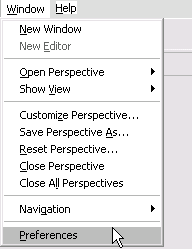

* Preferences 창의 좌측 메뉴 구조에서, PMD > **Rules Configuration** 선택

  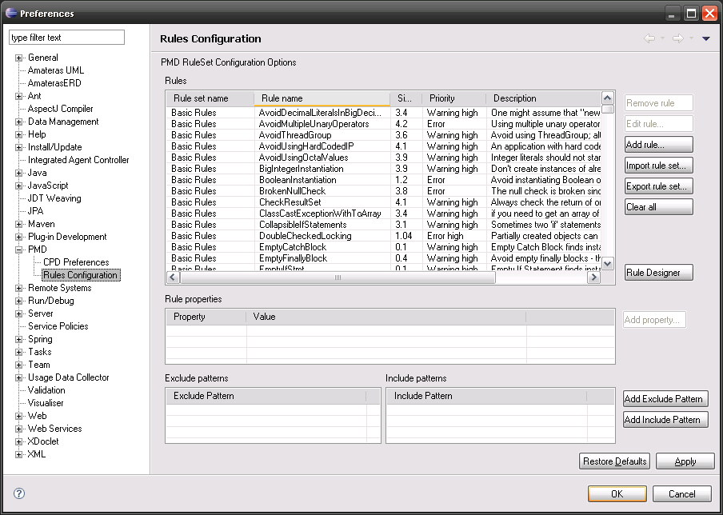

* Rules Configuration 속성 창에서 오른쪽 중앙의 **Rule Designer** 버튼를 클릭
* 별도의 창으로 PMD Rule Designer가 실행된다.

  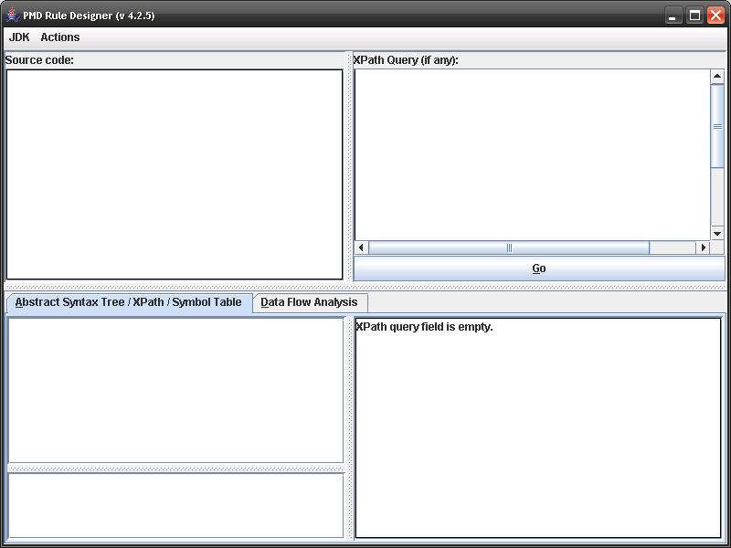

XPath 규칙을 작성하기 위해서는 PMD Rule Designer에서 다음과 순서로 한다.

1. 좌측 상단의 **Source code:** 텍스트 입력 상자에 샘플 Java 코드를 작성하여 입력한다.

   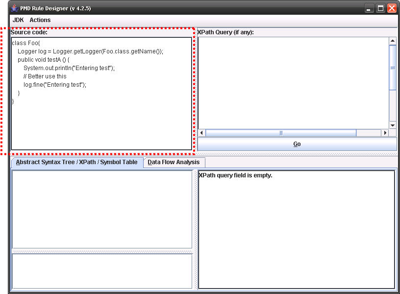

2. 우측 중앙의 **Go** 버튼을 클릭한다.

   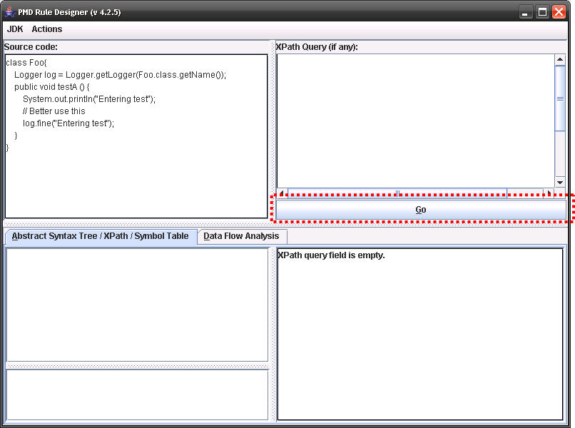

3. 좌측 하단의 'AST/XPath/Symbol Table' 탭과 'Data Flow Analysis' 탭의 내용이 자동으로 작성됨을 확인한다.

   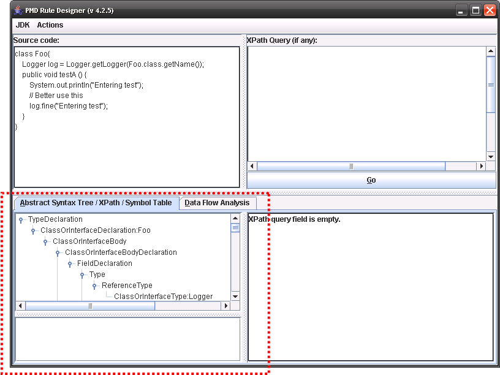

4. 우측 상단의 **XPath Query(if any)** 텍스트 입력 상자에 찾고 있는 violation에 맞는 XPath 식을 작성한다.

   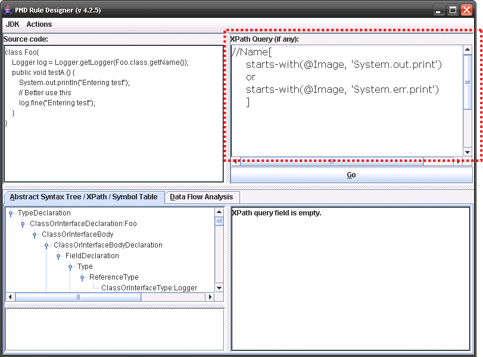

XPath의 좀 더 자세한 설명은 다음 URL을 참고한다.

* http://www.w3schools.com/xpath/default.asp

## 사용자정의 룰셋 파일 작성

사용자가 Java 클래스 또는 XPath로 작성한 룰은 RuleSet이라는 형식을 가진 XML 파일을 통해 등록, 수정, 삭제할 수 있다.

다음은 생성한 룰을 RuleSet 파일로 작성하는 방법을 설명한다.

### Java 클래스로 작성한 룰에 대한 RuleSet 파일 작성하기

RuleSet XML 파일에 등록하고자 하는 룰을 `<ruleset>` 엘리먼트의 하위로 `<rule>` 엘리먼트를 통해 등록하면 된다.  
다음 XML 파일은 AvoidReassigningParameters라는 이름의 룰을 전자정부 표준 Inspection 룰셋에 등록하는 RuleSet 파일의 예이다.  
예제의 XML 코드와 같이 작성한 후, 'eGovFrameworkRuleSet.xml'과 같이 이름을 부여하고, 확장자는 XML으로 하여 저장한다.  

```xml
<ruleset name="eGovFrameworkRuleSet">
    <rule name="AvoidReassigningParameters" message="''{0}'' 처럼 파라미터 값을 직접 변경하지 말것" 
          class="net.sourceforge.pmd.rules.AvoidReassigningParameters">
        <description>Reassigning values to parameters is a questionable practice.
                    Use a temporary local variable instead.</description>
        <example><![CDATA[
                   public class Foo {
                       private void foo(String bar) {
                           bar = "something else";
                       }
                   }]]>
        </example>
        <priority>2</priority>
    </rule>
</ruleset>
```

위의 예제에서 `<rule>` 엘리먼트를 구성하는 XML 요소들에 설명은 다음의 표와 같다.

| 항목 | 구분 | 설명 |
|---|---|---|
| name | Attribute | Rule의 이름 |
| message | Attribute | 소스가 해당 Rule에 위배되었을 경우, 표시되는 메세지 |
| **class** | Attribute | **사용자가 직접 작성한 Rule 자바 클래스의 Full Name** |
| description | Element | Rule에 대한 설명 |
| example | Element | Rule에 위배되었을 경우에 함께 표시해주는 위배샘플소스 |
| priority | Element | Rule의 우선순위 |

### XPath로 작성한 룰에 대한 RuleSet 파일 작성하기

RuleSet XML파일에 등록하고자 하는 룰을 `<ruleset>` 엘리먼트의 하위로 `<rule>` 엘리먼트를 통해 등록하면 된다.
다음 XML 파일은 AvoidThrowingRawExceptionTypes라는 이름의 룰을 전자정부 표준 Inspection 룰셋에 등록하는 RuleSet 파일이다.

```xml
<ruleset name="eGovFrameworkRuleSet">
    <rule name="AvoidThrowingRawExceptionTypes" message="가공되지 않은 Exception을 throw하는 것은 비추천"
          class="net.sourceforge.pmd.rules.XPathRule">
        <description>Avoid throwing certain exception types.  Rather than throw a raw RuntimeException, 
                     Throwable, Exception, or Error, use a subclassed exception or error instead.
        </description>
        <example><![CDATA[
                    public class Foo {
                        public void bar() throws Exception {
                            throw new Exception();
                        }
                    }]]>
        </example>
        <priority>2</priority>
        <properties>
            <property name="xpath">
                <value><![CDATA[
                         //AllocationExpression
                          /ClassOrInterfaceType[
                          @Image='Throwable' or
                          @Image='Exception' or
                          @Image='Error' or
                          @Image='RuntimeException']]]>
                </value>
            </property>
        </properties>
    </rule>
</ruleset>
```

위의 예제에서 `<rule>` 엘리먼트를 구성하는 XML 요소들에 설명은 다음의 표와 같다.

| 항목 | 구분 | 설명 |
|---|---|---|
| name | Attribute | Rule의 이름 |
| message | Attribute | 소스가 해당 Rule에 위배되었을 경우, 표시되는 메세지 |
| **class** | Attribute | **XPath로 Rule을 만들 때에는 net.sourceforge.pmd.rules.XPathRule로 선언해야 함** |
| description | Element | Rule에 대한 설명 |
| example | Element | Rule에 위배되었을 경우에 함께 표시해주는 위배샘플소스 |
| priority | Element | Rule의 우선순위 |
| **properties** | Element | **XPath를 등록. 등록하기 위해서는 하위노드로 `<property name="xpath">`를 선언한 후 `<value>`에 XPath를 선언하면 됨** |

XPath로 룰을 작성하였을 경우에는 위의 XML 코드 예제와 같이 직접 타이핑하여 작성해도 되고,
다음과 같은 순서로 PMD Rule Designer를 이용하여 생성할 수도 된다.
단, [XPath를 사용한 룰 작성](#xpath를-사용한-룰-작성)에 기술된 전 과정을 수행했을 경우에만 가능하다.

1. PMD Rule Designer의 메뉴에서, Actions > **Create Rule XML** 선택

   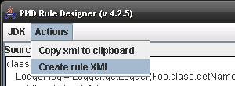

2. Create XML Rule 창에서, **Rule name:**, **Rule msg:**, **Rule desc:**의 텍스트 입력 상자에 각각의 내용을 입력

   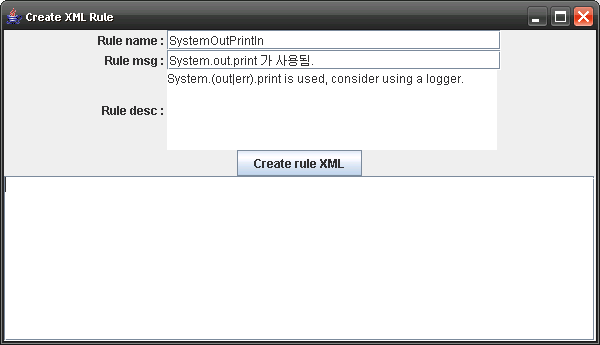

3. Create XML Rule 창에서, **Create rule XML** 버튼을 클릭

4. Create XML Rule 창 하단의 큰 텍스트 입력 상자에 XML 형태의 룰이 출력된다. 이를 복사하여 활용하면 된다.

   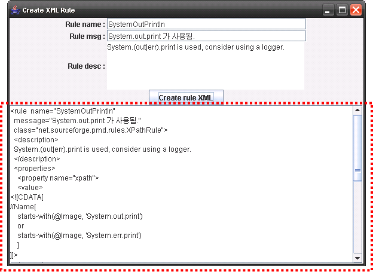

위의 두 가지 방법 중 하나를 선택해서 룰셋 파일의 내용을 작성하고, 이를 'eGovFrameworkRuleSet.xml'과 같이 이름을 부여하고, 확장자는 XML으로 하여 저장한다.

## 사용자정의 룰 등록, 반영

사용자정의 룰셋 파일까지 작성을 완료하였으면, Eclipse PMD 플러그인을 이용하여 룰을 등록, 반영할 수 있다.
다만 XPath를 이용한 룰이 아니라 Java 클래스로 작성한 룰일 경우, 아래의 절차들에 앞서 다음 두 가지 작업을 먼저 수행하여야 한다.

* [Java 클래스를 사용한 룰 작성](#java-클래스를-사용한-룰-작성)에서 생성한 룰 정의 Java 클래스를 컴파일
* 컴파일 된 바이너리 파일을 아래의 PMD Eclipse Plugin 라이브러리 파일에 포함시켜 재패키징
  * 파일경로: %개발도구 Eclipse 설치경로%\plugins\net.sourceforge.pmd.eclipse.plugin_xxx\lib\pmdxx-x.x.x.jar (x는 버전정보)

Eclipse PMD 플러그인을 이용한 룰 등록 방법은 룰을 하나씩 작업하여 등록하는 방법과 룰셋 파일 단위로 한 번에 하나 이상의 룰들을 등록하는 두 가지 방법이 있다.

* Rules Configuration의 **Add rule...** 버튼을 이용한 룰 단위 등록, 반영
* Rules Configuration의 **Import rule set...** 버튼을 이용한 룰셋 파일 단위 등록, 반영

### 룰 단위 등록, 반영

1. Eclipse IDE의 메뉴에서, Window > **Preferences** 선택
2. Preferences 창의 좌측 메뉴 구조에서, PMD > **Rules Configuration** 선택
3. Preferences 창의 오른쪽의 **Add rule...** 버튼 클릭

   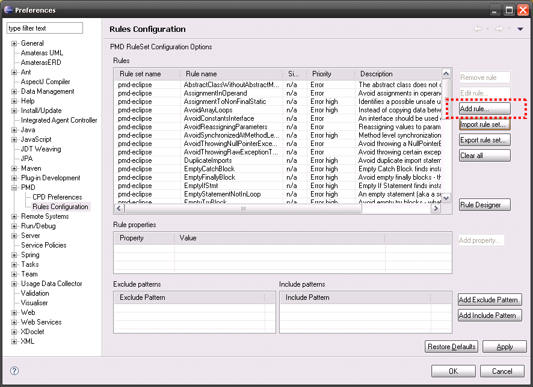

4. PMD Plugin 창에서, Ruleset 파일 작성할 때의 XML 항목을 참고해서 다음 그림과 같이 필요한 항목을 모두 입력 후, **OK** 버튼 클릭(Java 클래스로 작성한 룰일 경우, **XPath rule** 항목을 체크해제)

   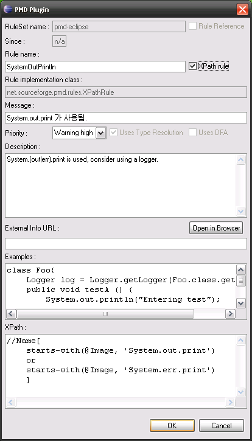

5. Preferences 창의 Rules 그리드 목록에서 방금 Add한 룰 확인

   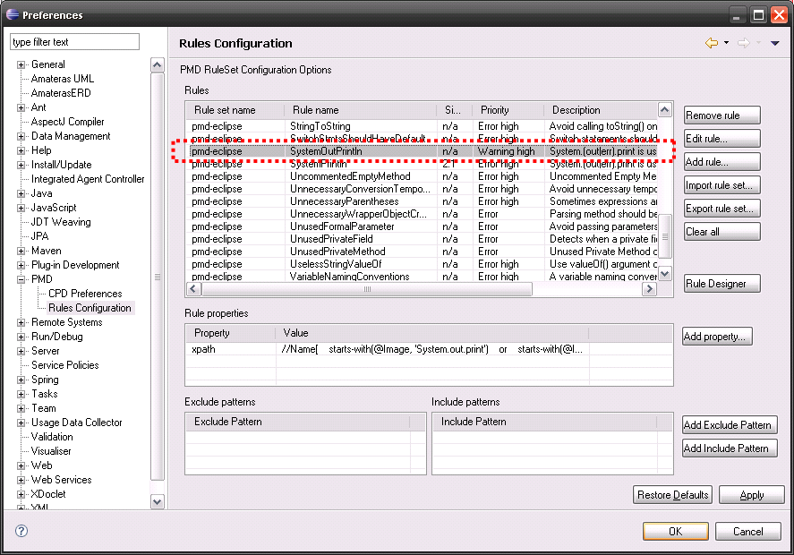

6. Preferences 창의 **OK** 버튼을 클릭하여, 들여온 룰을 Eclipse IDE에 반영

### 룰셋 파일 단위 등록, 반영

1. Eclipse IDE의 메뉴에서, Window > **Preferences** 선택
2. Preferences 창의 왼쪽 메뉴 구조에서, PMD > **Rules Configuration** 선택
3. Preferences 창의 오른쪽의 **Import rule set...** 버튼 클릭

   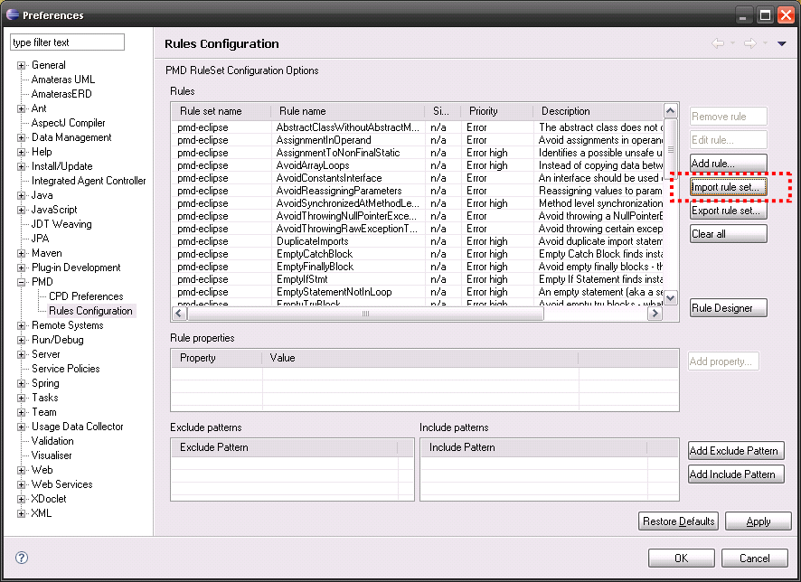

4. PMD Plugin 창에서, **Browse...** 버튼을 클릭하여 앞서 작성한 룰셋 파일을 선택
5. **Import by Copy** 항목 선택하고 **OK** 버튼을 클릭

   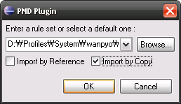

6. Preferences 창의 Rules 그리드 목록에서 방금 들여온 룰 확인

   

7. Preferences 창의 **OK** 버튼을 클릭하여, 들여온 룰을 Eclipse IDE에 반영

## 참고자료

* http://pmd.sourceforge.net
* http://www.w3schools.com/xpath/default.asp