# Inspection 도구 활용

## 개요

전자정부 표준프레임워크에서 제공하는 Code Inspection 도구인 PMD의 기본 사용법에 대하여 설명한다.

## Inspection 도구 기본 사용법

일괄적인 Inspection 작업 수행과 작업의 편의성을 위하여 Eclipse IDE의 PMD Perpective에서 Code Inspection 기능을 수행한다.

### PMD Perpective 전환

다음과 같은 과정으로 PMD Perpective로 전환할 수 있다.

1. Eclipse 메뉴에서, 'Window' > 'Open Perspective' > 'Other...' 선택

   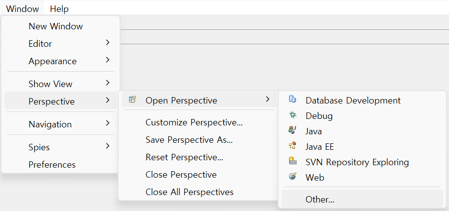

2. Open Perpective 창에서, **PMD**를 선택

   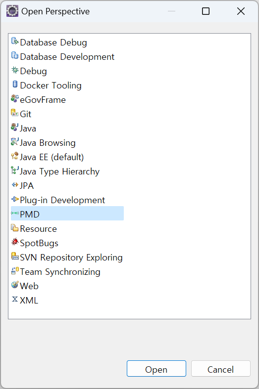

3. 다음 그림과 같은 PMD Perspective로 전환되며, 기본적으로 Package Explorer, Violaton Outline, Violation Overview와 같은 뷰 들로 구성

   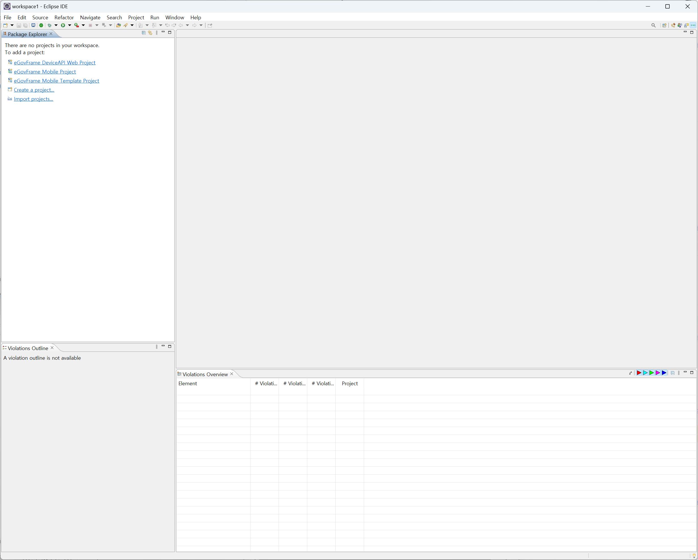

### Inspection 실행

Inspection을 수행하고자 하는 프로젝트를 선택하여 Inspection을 수행한다.

* Package Explorer에서, 대상 프로젝트에서 마우스 오른쪽 버튼 클릭 > PMD > **Check Code with PMD** 선택

  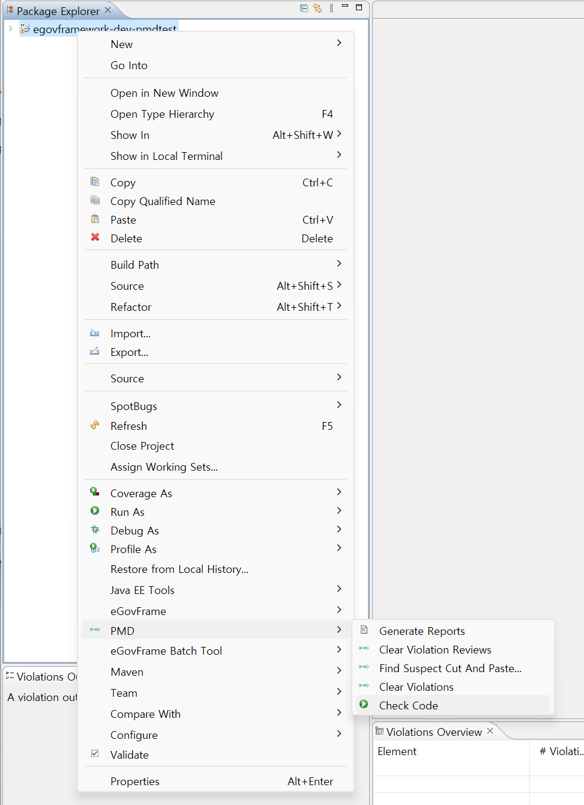

* 선택한 프로젝트의 전체 소스를 대상으로 Inspection이 수행된다. Inspection 범위를 프로젝트 전체가 아닌 소스 단위로 줄이고자 할 경우, Package Explorer에서 원하는 소스 코드들만을 선택하여 앞의 방법을 반복한다.

기본적으로 java 소스 코드를 대상으로 Inspection을 수행하며, 다음 조건의 경우는 Inspection을 수행하지 않는다.

* Include된 파일
* JAR 파일과 같은 바이너리 소스 코드

### Inspection 결과 보기

Inspection을 수행한 후에는 Inspection의 결과를 확인하고 룰에 위배되는 코드를 수정할 수 있다.
PMD Perspective에서는 다음 그림과 같이 다양한 뷰에서 위배 결과를 확인할 수 있다.

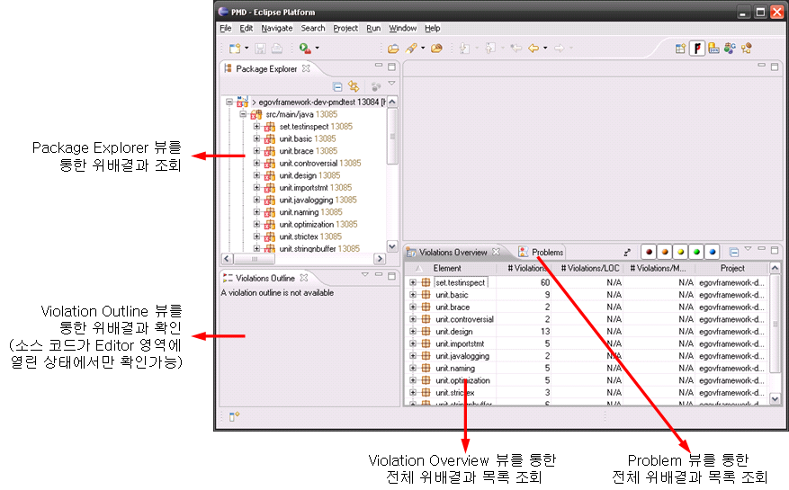

---

#### Package Explorer 뷰에서 확인하기

Inspection 결과 해당 프로젝트 내에서 위배사항이 발생하였을 경우, 일반적인 오류가 있을 때와 마찬가지로 Package Explorer 뷰의 프로젝트 아이콘과 하위 패키지 아이콘들이  또는 와 같이 붉은색 X자 모양의 상자가 추가된 아이콘으로 변경된다.
이 아이콘은 일반 오류 상황과 마찬가지로 해당 위배 내역이 수정될 때까지 정상상태의 아이콘으로 변경되지 않는다.

---

#### Problem 뷰에서 확인하기

Problem 뷰에서도 Inspection의 위배 결과를 확인할 수 있다. PMD Perspective에서 다음과 같은 순서로 Problem 뷰를 열 수 있다.

1. Eclipse IDE의 메뉴에서, Window > Show View > **Other...** 선택

   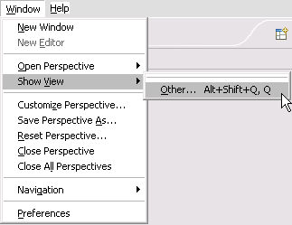

2. Show View 창에서 General 하위의 **Problem** 선택

   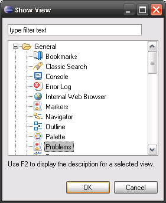

위배결과 내용 중, Problem 뷰를 통하여 다음의 주요 항목을 확인하고 위배된 코드에 접근하여 수정할 수 있다.

| 항목 | 설명 |
|---|---|
| Description | 소스코드의 위배된 룰항목에 대한 상세 설명을 표시한다. |
| Resource | 위배된 소스코드 이름을 표시한다. |
| Path | 위배된 소스코드의 Path를 표시한다. |
| Location | 소스코드에서 위배된 해당 Line을 표시한다. |

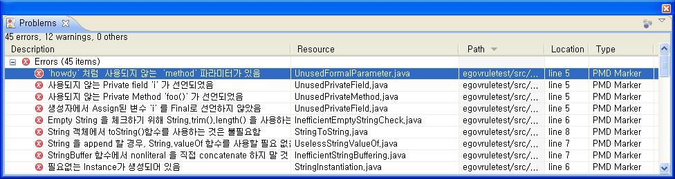

위 위배결과에서 해당 항목을 더블 클릭하면 Editor 영역에서 위배된 코드를 볼 수 있어, 바로 코드를 수정할 수 있다.

---

#### Violations Overview 뷰에서 확인하기

Violations Overview 뷰를 이용한 위배사항 확인은 [Inspection 결과 리포팅](#inspection-결과-리포팅)에서 상세히 설명한다.

### Inspection 결과 초기화

Inspection을 수행하면 위배된 결과는 수정하기 전까지 계속해서 소스 상에 남아있다. 소스 상에 Inspection의 위배사항이 남아 있으면 코드 상의 실제 오류(컴파일 오류 등)와 구분하기 힘들기 때문에 Inspection결과를 초기화 할 필요가 있다. 또는 Inspection을 재수행하기 위해 기존의 Inspection 결과를 초기화할 수 있다.

Inspection 결과를 초기화하기 위해서는 다음과 같이 프로젝트를 선택하고 초기화를 수행한다.

* Package Explorer에서, 대상 프로젝트에서 마우스 오른쪽 버튼 클릭 > PMD > **Clear PMD Violoations** 선택

  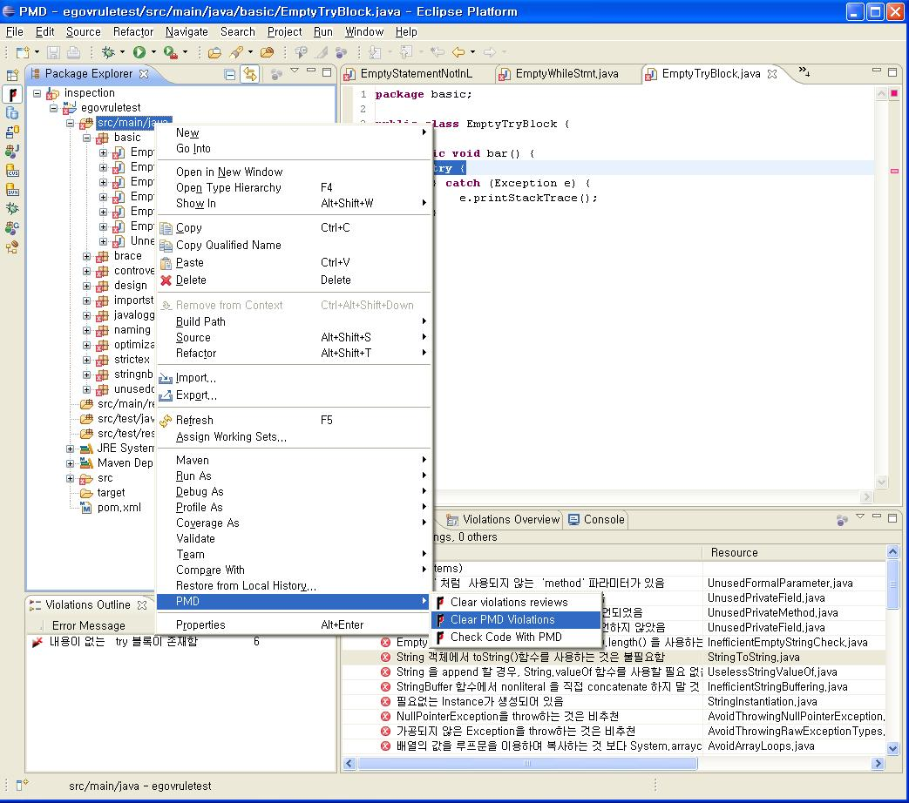

결과를 초기화하면 소스의 위배결과가 초기화되며, Problem 뷰, Violations Overview 뷰와 Package Explore 뷰에서도 사라진다.

## 전자정부 표준 Inspection 룰셋

전자정부 표준프레임워크에서는 Code Inpsection을 위한 룰셋으로 논리오류/구문오류/참조오류 영역을 대상으로 하는 총 44개의 룰을 표준으로 선정하였다.
전자정부 표준 Inspection 룰셋은 [전자정부 표준 Inspection 룰셋 설치 지침](./code-inspection.md#전자정부-표준프레임워크-표준-inspection-룰셋-적용하기)을 참조하여 소스코드 Inspection 대상자의 PC에 설치하며, 개별 룰에 대한 설명과 오류코드(룰 위배 코드) 예제, 권장방안(위배 대응방안 또는 소스코드) 예제는 다음과 같다.

---

### Rule#01. AbstractClassWithoutAbstractMethod

* 설명: 추상클래스 정의 오류
* 오류코드:

```java
public abstract class Foo {
    void int method1() { ... }
    void int method2() { ... }
    // consider using abstract methods or removing
    // the abstract modifier and adding protected constructors
}
```

* 권장방안: Abstract Class내에 Abstract Method가 존재하지 않음

---

### Rule#02. ArrayIsStoredDirectly

* 설명: Public 메소드부터 반환된 Private 배열
* 오류코드:

```java
public class Foo {
    private String [] x;
    public void foo (String [] param) {
        // Don't do this, make a copy of the array at least
        this.x=param;
    }
}
```

* 권장방안: 배열이 직접 저장되는 것을 피하도록 함

---

### Rule#03. AssignmentInOperand

* 설명: 피연산자 내 할당문 사용
* 오류코드:

```java
public class Foo {
    public void bar() {
        int x = 2;
        if ((x = getX()) == 3) {
            System.out.println("3!");
        }
    }
}
```

* 권장방안: 피연산자내에 할당문이 없어야 함. 해당 코드를 복잡하고 가독성이 떨어지게 만듦

---

### Rule#04. AssignmentToNonFinalStatic

* 설명: static 필드의 잘못된 사용
* 오류코드:

```java
public class StaticField {
   static int x;
   public FinalFields(int y) {
    x = y; // unsafe
   }
}
```

* 권장방안: static 필드의 안전하지 않은 사용 가능성이 존재

---

### Rule#05. AvoidArrayLoops

* 설명: static 필드의 잘못된 사용
* 오류코드:

```java
class Scratch {
    void copy_a_to_b() {
        int[] a = new int[10];
        int[] b = new int[10];
        for (int i = 0; i < a.length; i++) {
            b[i] = a[i];
        }
        // equivalent
        b = Arrays.copyOf(a, a.length);
        // equivalent
        System.arraycopy(a, 0, b, 0, a.length);
        int[] c = new int[10];
        // this will not trigger the rule
        for (int i = 0; i < c.length; i++) {
            b[i] = a[c[i]];
        }
    }
}
```

* 권장방안: 배열의 값을 루프문을 이용하여 복사하는 것 보다, System.arraycopy() 메소드를 이용하여 복사하는 것이 효율적이며 수행 속도가 빠름

---

### Rule#06. AvoidCatchingGenericException

* 설명: 부적절한 예외처리
* 오류코드:

```java
package com.igate.primitive;
public class PrimitiveType {
    public void downCastPrimitiveType() {
        try {
            System.out.println(" i [" + i + "]");
        } catch(Exception e) {
            e.printStackTrace();
        } catch(RuntimeException e) {
            e.printStackTrace();
        } catch(NullPointerException e) {
            e.printStackTrace();
        }
    }
}
```

* 권장방안: Exception 사용 탐지, NullPointerException 탐지

---

### Rule#07. AvoidPrintStackTrace

* 설명: 오류 메시지를 통한 정보 노출 (시스템 데이터 정보 노출)
* 오류코드:

```java
class Foo {
    void bar() {
        try {
            // do something
        } catch (Exception e) {
            e.printStackTrace();
        }
    }
}
```

* 권장방안: PrintStackTrace 호출 탐지

---

### Rule#08. AvoidReassigningParameters

* 설명: parameter 값 재할당 시도
* 오류코드:

```java
public class Hello {
    private void greet(String name) {
        name = name.trim();
        System.out.println("Hello " + name);
        // preferred
        String trimmedName = name.trim();
        System.out.println("Hello " + trimmedName);
    }
}
```

* 권장방안: 넘겨받는 메소드 parameter 값을 직접 변경하지 말아야 함.

---

### Rule#09. AvoidSynchronizedAtMethodLevel

* 설명: synchronization의 과다적용
* 오류코드:

```java
public class Foo {
    // Try to avoid this:
    synchronized void foo() {
        // code, that doesn't need synchronization
        // ...
        // code, that requires synchronization
        if (!sharedData.has("bar")) {
            sharedData.add("bar");
        }
        // more code, that doesn't need synchronization
        // ...
    }
    // Prefer this:
    void bar() {
        // code, that doesn't need synchronization
        // ...
        synchronized(this) {
            if (!sharedData.has("bar")) {
                sharedData.add("bar");
            }
        }
        // more code, that doesn't need synchronization
        // ...
    }
    // Try to avoid this for static methods:
    static synchronized void fooStatic() {
    }
    // Prefer this:
    static void barStatic() {
        // code, that doesn't need synchronization
        // ...
        synchronized(Foo.class) {
            // code, that requires synchronization
        }
        // more code, that doesn't need synchronization
        // ...
    }
}
```

* 권장방안: mothod 레벨의 synchronization 보다 block 레벨 synchronization 을 사용하는 것이 바람직함

---

### Rule#10. AvoidThrowingNullPointerException

* 설명: NullPointerException 사용
* 오류코드:

```java
public class Foo {
    void bar() {
        throw new NullPointerException();
    }
}
```

* 권장방안: NullPointerException을 throw하는 것은 비추천

---

### Rule#11. AvoidThrowingRawExceptionTypes

* 설명: 비가공 Exception 사용
* 오류코드:

```java
public class Foo {
    public void bar() throws Exception {
        throw new Exception();
    }
}
```

* 권장방안: 가공되지 않은 Exception을 throw하는 것은 비추천

---

### Rule#12. AvoidUsingHardCodedIP

* 설명: 하드코드된 중요정보
* 오류코드:

```java
public class Foo {
    private String ip = "127.0.0.1";     // not recommended
}
```

* 권장방안: IP를 하드코드하는 것을 피하도록 함

---

### Rule#13. BrokenNullCheck

* 설명: 널(Null) 포인터 역참조
* 오류코드:

```java
public String bar(String string) {
    // should be &&
    if (string!=null || !string.equals(""))
        return string;
    // should be ||
    if (string==null && string.equals(""))
        return string;
}
```

* 권장방안: 잘못된 Null 검사 이후 Null Pointer 사용을 피하도록 함

---

### Rule#14. CloseResource

* 설명: 부적절한 자원 해제
* 오류코드:

```java
public class Bar {
    public void withSQL() {
        Connection c = pool.getConnection();
        try {
            // do stuff
        } catch (SQLException ex) {
           // handle exception
        } finally {
            // oops, should close the connection using 'close'!
            // c.close();
        }
    }

    public void withFile() {
        InputStream file = new FileInputStream(new File("/tmp/foo"));
        try {
            int c = file.in();
        } catch (IOException e) {
            // handle exception
        } finally {
            // TODO: close file
        }
    }
}
```

* 권장방안: 자원 할당 후 미해제는 피하도록 함

---

### Rule#15. ConstantsInterface

* 설명: 인터페이스에 상수 적용
* 오류코드:

```java
public interface ConstantInterface {
    public static final int CONST1 = 1; // violation, no fields allowed in interface!
    static final int CONST2 = 1;        // violation, no fields allowed in interface!
    final int CONST3 = 1;               // violation, no fields allowed in interface!
    int CONST4 = 1;                     // violation, no fields allowed in interface!
}
// with ignoreIfHasMethods = false
public interface AnotherConstantInterface {
    public static final int CONST1 = 1; // violation, no fields allowed in interface!
    int anyMethod();
}
// with ignoreIfHasMethods = true
public interface YetAnotherConstantInterface {
    public static final int CONST1 = 1; // no violation
    int anyMethod();
}
```

* 권장방안: Interface는 클래스의 behavior 을 구현하는 데에만 사용해야 함

---

### Rule#16. EmptyCatchBlock

* 설명: 빈 catch 문 사용, 오류 상황 대응 부재
* 오류코드:

```java
public void doSomething() {
    try {
        FileInputStream fis = new FileInputStream("/tmp/bugger");
    } catch (IOException ioe) {
        // not good
    }
}
```

* 권장방안: Catch Block에 반드시 예외를 다루는 코드를 작성

---

### Rule#17. EmptyControlStatement

* 설명: 빈 finally 블록 사용, 빈 if 문 사용, 빈 try 블록 사용, 빈 while문 사용
* 오류코드:

```java
class Foo {
    {
        if (true); // empty if statement
        if (true) { // empty as well
        }
    }
    {} // empty initializer
}
```

* 권장방안: 빈 finally 블록 사용, 빈 if 문 사용, 빈 try 블록 사용, 빈 while문 사용을 피하도록 함

---

### Rule#18. EqualsNull

* 설명: equals()을 이용한 null 비교
* 오류코드:

```java
String x = "foo";
if (x.equals(null)) {   // bad form
    doSomething();
}
if (x == null) {        // preferred
    doSomething();
}
```

* 권장방안: null 값과 비교하기 위해 equals 메소드를 사용하지 말아야 함

---

### Rule#19. FieldNamingConventions

* 설명: 변수명에 밑줄 사용
* 오류코드:

```java
class Foo {
    int myField = 1; // This is in camel case, so it's ok
    int my_Field = 1; // This contains an underscore, it's not ok by default
                      // but you may allow it, or even require the "my_" prefix
    final int FinalField = 1; // you may configure a different convention for final fields,
                              // e.g. here PascalCase: [A-Z][a-zA-Z0-9]*
    interface Interface {
        double PI = 3.14; // interface "fields" use the constantPattern property
    }
    enum AnEnum {
        ORG, NET, COM; // These use a separate property but are set to ALL_UPPER by default
    }
}
```

* 권장방안: 필드 이름 명명규칙 준수 필요

---

### Rule#20. FinalFieldCouldBeStatic

* 설명: final field의 static 전환
* 오류코드:

```java
public class Foo {
    public final int BAR = 42; // this could be static and save some space
}
```

* 권장방안: final field를 static으로 변경하면 overhead를 줄일 수 있음

---

### Rule#21. FormalParameterNamingConventions

* 설명: 변수명에 밑줄 사용
* 오류코드:

```java
class Foo {
    abstract void bar(int myInt); // This is Camel case, so it's ok
    void bar(int my_i) { // this will be reported
    }
    void lambdas() {
        // lambdas parameters can be configured separately
        Consumer<String> lambda1 = s_str -> { };
        // lambda parameters with an explicit type can be configured separately
        Consumer<String> lambda1 = (String str) -> { };
    }
}
```

* 권장방안: 메서드 및 람다의 형식 매개변수에 대한 구성 가능한 명명 규칙 준수 필요

---

### Rule#22. HardCodedCryptoKey

* 설명: 하드코드된 중요정보
* 오류코드:

```java
public class Foo {
    void good() {
        SecretKeySpec secretKeySpec = new SecretKeySpec(Properties.getKey(), "AES");
    }

    void bad() {
        SecretKeySpec secretKeySpec = new SecretKeySpec("my secret here".getBytes(), "AES");
    }
}
```

* 권장방안: 암호화 작업에 하드코딩은 피하도록 함

---

### Rule#23. ImmutableField

* 설명: 생성자 지정 변수의 final 미적용
* 오류코드:

```java
public class Foo {
    private int x; // could be final
    public Foo() {
        x = 7;
    }
    public void foo() {
        int a = x + 2;
    }
}
```

* 권장방안: 생성자를 통해 할당된 변수를 Final로 선언하는 것이 바람직함

---

### Rule#24. InefficientEmptyStringCheck

* 설명: 빈문자열 확인
* 오류코드:

```java
public void bar(String string) {
    if (string != null && string.trim().length() > 0) {
        doSomething();
    }
}
```

* 권장방안: 빈 문자열 확인을 위해 String.trim().length() 을 사용하는 것은 피하도록 함. whitespace/Non-whitespace 확인을 위한 별도의 로직 구현을 권장

---

### Rule#25. InefficientStringBuffering

* 설명: StringBuffer 함수내 결합코드 사용
* 오류코드:

```java
// Avoid this, two buffers are actually being created here
StringBuffer sb = new StringBuffer("tmp = "+System.getProperty("java.io.tmpdir"));
// do this instead
StringBuffer sb = new StringBuffer("tmp = ");
sb.append(System.getProperty("java.io.tmpdir"));
```

* 권장방안: StringBuffer 함수내에서 비문자열 연산 이용하여 직접 결합하는 코드 사용을 탐지. append 메소드 사용을 권장

---

### Rule#26. LocalVariableNamingConventions

* 설명: 변수명에 잘못된 prefix 사용
* 오류코드:

```java
class Foo {
    void bar() {
        int localVariable = 1; // This is in camel case, so it's ok
        int local_variable = 1; // This will be reported unless you change the regex
        final int i_var = 1; // final local variables can be configured separately
        try {
            foo();
        } catch (IllegalArgumentException e_illegal) {
            // exception block parameters can be configured separately
        }
    }
}
```

* 권장방안: 로컬 변수 선언 및 다른 로컬 범위 변수에 대한 구성 가능한 명명 규칙을 따르도록 함

---

### Rule#27. MethodReturnsInternalArray

* 설명: Private 배열에 Public 데이터 할당
* 오류코드:

```java
public class SecureSystem {
    UserData [] ud;
    public UserData [] getUserData() {
        // Don't return directly the internal array, return a copy
        return ud;
    }
}
```

* 권장방안: 내부 배열을 호출자에 노출시키는 것을 피하도록 함

---

### Rule#28. MisplacedNullCheck

* 설명: 널(Null) 포인터 역참조
* 오류코드:

```java
public class Foo {
    void bar() {
        if (a.equals(baz) && a != null) {} // a could be null, misplaced null check
        if (a != null && a.equals(baz)) {} // correct null check
    }
}
```

* 권장방안: 잘못된 null 체크를 피하도록 함

---

### Rule#29. SimpleDateFormatNeedsLocale

* 설명: 지역코드없는 SimpleDateFormat 사용
* 오류코드:

```java
public class Foo {
    // Should specify Locale.US (or whatever)
    private SimpleDateFormat sdf = new SimpleDateFormat("pattern");
}
```

* 권장방안: SimpleDateFormat 인스턴스를 생성할 때 Locale 을 지정하는 것이 바람직함

---

### Rule#30. SimplifyBooleanExpressions

* 설명: 불필요 boolean 연산 시도
* 오류코드:

```java
public class Bar {
    // can be simplified to
    // bar = isFoo();
    private boolean bar = (isFoo() == true);
    public isFoo() { return false;}
}
```

* 권장방안: boolean 사용 시 불필요한 비교 연산을 피하도록 함

---

### Rule#31. StringInstantiation

* 설명: 불필요 String Instance 생성
* 오류코드:

```java
private String bar = new String("bar"); // just do a String bar = "bar";
```

* 권장방안: 불필요한 String Instance를 생성하는 코드가 없어야 함. 간단한 형태의 코드로 변경 필요

---

### Rule#32. StringToString

* 설명: 불필요한 toString() 메소드 사용
* 오류코드:

```java
private String baz() {
    String bar = "howdy";
    return bar.toString();
};
```

* 권장방안: String 객체에서 toString()함수를 사용하는 것은 불필요함. 해당 코드 제거 필요

---

### Rule#33. SwitchStmtsShouldHaveDefault

* 설명: 불필요한 default 없는 switch 구문 사용
* 오류코드:

```java
class Foo {{
    int x = 2;
    switch (x) {
      case 1: int j = 6;
      case 2: int j = 8;
      // missing default: here
    }
}}
```

* 권장방안: Switch구문에는 반드시 default label이 있어야 함

---

### Rule#34. SystemPrintln

* 설명: System.out.print 사용
* 오류코드:

```java
class Foo{
    Logger log = Logger.getLogger(Foo.class.getName());
    public void testA () {
        System.out.println("Entering test");
        // Better use this
        log.fine("Entering test");
    }
}
```

* 권장방안: System.out.print 사용을 피해야 함. 전용 로거를 사용할 것을 권장

---

### Rule#35. UncommentedEmptyMethodBody

* 설명: 빈 메소드 주석표기
* 오류코드:

```java
public void doSomething() {
}
```

* 권장방안: 메서드 본문에 문장이 없는 경우 주석을 넣어야 함

---

### Rule#36. UnnecessaryBoxing

* 설명: 불필요한 WrapperObject 생성
* 오류코드:

```java
{
    // Instead of
    Integer integer = Integer.valueOf(2);
    // you may just write
    Integer integer = 2;
    int i = integer.intValue(); // similarly for unboxing
    // Instead of
    int x = Integer.valueOf("42");
    // you may just write
    int x = Integer.parseInt("42");
}
```

* 권장방안: 명시적인 박싱(boxing)과 언박싱(unboxing) 변환은 성능 저하와 코드 복잡성을 야기할 수 있음

---

### Rule#37. UnnecessaryConversionTemporary

* 설명: 불필요한 String 변환작업
* 오류코드:

```java
public String convert(int x) {
    String foo = new Integer(x).toString(); // this wastes an object
    return Integer.toString(x);             // preferred approach
}
```

* 권장방안: 기본 데이터 타입을 String으로 변환할 때 불필요한 임시 변환 작업을 피하도록 함

---

### Rule#38. UnnecessaryImport

* 설명: 불필요한 import문 선언
* 오류코드:

```java
import java.io.File;            // not used, can be removed
import java.util.Collections;   // used below
import java.util.*;             // so this one is not used
import java.lang.Object;        // imports from java.lang, unnecessary
import java.lang.Object;        // duplicate, unnecessary
public class Foo {
    static Object emptyList() {
        return Collections.emptyList();
    }
}
```

* 권장방안: 사용되지 않는 import 문, 중복된 import 문, import되는 멤버들이 이미 java.lang이나 현재 패키지에 있는 경우 import를 피하도록 함

---

### Rule#39. UnnecessarySemicolon

* 설명: 필요없는 ; 문장 존재
* 오류코드:

```java
class Foo {
    {
        toString();; // one of these semicolons is unnecessary
        if (true); // this semicolon is not unnecessary, but it could be an empty block instead (not reported)
    }
}; // this semicolon is unnecessary
```

* 권장방안: 필요없는 ; 문장은 피하도록 함

---

### Rule#40. UnusedFormalParameter

* 설명: 미사용 method parameter
* 오류코드:

```java
public class Foo {
    private void bar(String howdy) {
        // howdy is not used
    }
}
```

* 권장방안: 메소드 선언 내에사용되지 않는 파라미터를 탐지 → 해당 소스 확인 후, 삭제 등의 조치

---

### Rule#41. UnusedPrivateField

* 설명: 미사용 private field
* 오류코드:

```java
public class Something {
    private static int FOO = 2; // Unused
    private int i = 5; // Unused
    private int j = 6;
    public int addOne() {
        return j++;
    }
}
```

* 권장방안: 사용되지 않는 Private field의 탐지 → 해당 소스 확인 후, 삭제 등의 조치

---

### Rule#42. UnusedPrivateMethod

* 설명: 미사용 private method
* 오류코드:

```java
public class Something {
    private void foo() {} // unused
}
```

* 권장방안: 사용되지 않는 Private Method 선언을 탐지 → 해당 소스 확인 후, 삭제 등의 조치

---

### Rule#43. UselessParentheses

* 설명: 불필요한 괄호사용
* 오류코드:

```java
public class Foo {
    {
        int n = 0;
        n = (n);         // here
        n = (n * 2) * 3; // and here
        n = n * (2 * 3); // and here
    }
}
```

* 권장방안: 불필요한 괄호사용은 피하도록 함

---

### Rule#44. UselessStringValueOf

* 설명: 불필요한 String.valueOf 사용
* 오류코드:

```java
public String convert(int i) {
    String s;
    s = "a" + String.valueOf(i);    // not required
    s = "a" + i;                    // preferred approach
    return s;
}
```

* 권장방안: String 을 append 할 경우, String.valueOf 함수를 사용할 필요 없음

## Inspection 결과 리포팅

Inspection을 수행한 후 수행결과를 종합하여 리포팅할 수 있다.

* 개인 개발환경: Eclipse IDE의 Violations Overview 뷰에서 바로 확인하거나, 별도의 CSV(Comma Separated Value), HTML, TXT, XML 등의 파일 형태로 리포팅할 수 있다.
* 서버 개발환경: CI(Continuous integration) 서버인 Hudson에서 Hudson PMD Plugin을 활용하여 리포팅할 수 있다. 서버 개발환경에서의 리포팅 설정 방법은 전자정부 표준프레임워크 개발환경 가이드의 [Hudson - 코드 인스펙션 도구 연동](../deployment-tool/integration-build.md)을 참고한다.

### Violations Overview 뷰에서 바로 확인

Inspection을 수행한 후, 개발자 환경에서 바로 확인할 수 있는 통계 정보로써, 다음과 같은 화면을 가지고 있다.

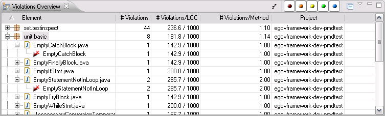

Violations Overview 뷰의 화면 구성은 위배 사항의 통계 정보를 조회할 수 있는 그리드와 상단의 그리드의 내용을 제어할 수 있는 우측상단의 기능 버튼들로 구성된다.

---

#### 기능버튼 설명

* (통계 정보 갱신 버튼): 그리드에 나타는 통계 정보를 갱신하는 버튼이다. 중요도 버튼을 변경하였을 때나, 소스 코드 상의 위배사항을 수정할 때마다 눌러서, Violations Overview 뷰를 갱신해 준다.
* (중요도 선택 버튼): 그리드에 나타낼 위배 항목을 중요도로 필터링하는 버튼이다. 각기 다른 색깔의 5개의 버튼으로 구성되며 왼쪽부터 오른쪽 순(1부터 5까지)으로 중요도가 낮아진다. 중요도 1(붉은색 원)과 중요도 2(주황색 원)의 위배사항은 반드시 수정토록 한다. 5개의 버튼은 클릭할 때마다 On/Off로 토글된다.
* (통계 정보 접기 버튼): 그리드에 나타는 통계 정보가 복잡하게 열려있을 때 클릭하면, 모든 통계 정보를 초기상태로 접어준다.
* (보기 메뉴): 그리드에 나타는 통계 정보를 정렬하는 방법을 선택하는 메뉴 버튼이다. 다음과 같은 유형으로 통계 정보 정렬할 수 있다.
  * Show violations to packages: 위배 정보를 패키지별로 정렬한다.
  * Show violations to files: 위배 정보를 파일 단위로 정렬한다.
  * Show packages with files: 위배 정보를 패키지별로 정렬하되, 해당 패키지의 파일 정보도 함께 보여준다.

---

#### 그리드 영역 구성항목 설명

* **Element**: 위배가 발생한 패키지, 패키지 내의 파일, 해당 위배 정보를 표시한다.
* **Violations**: 해당 항목(Element:패키지/파일/위배 항목)에서의 위배 수를 나타내는 통계 정보이다.
* **Violations/LOC**: 단일 소스 코드가 1000 줄(1000 LOC(Line Of Code))로 구성되었다고 가정했을 때의 해당 항목(Element)에서의 위배가 발생한 라인수를 나타내는 통계 정보(천분율)이다. 즉, 위 그림을 예로, 백분율로 환산하여 보면 'unit.basic' 패키지는 약 18.2%의 위배률을 가지며, 'EmptyCatchBlock.java' 소스 코드는 14.3%의 위배율을 가진다.
* **Violations/Method**: 메소드 당 발생한 위배 건수 또는 평균(패키지 항목의 경우)이다.
* **Project**: 해당 위배 항목이 발생한 프로젝트 이름을 나타낸다.

개발자는 Violations Overview 뷰로 조회할 수 있는 이러한 유형별 통계 정보를 이용하여, 소스 코드의 품질 개선활동을 개발도구 상에서 바로 수행할 수 있다.

### 별도 리포팅 수행

Inspection의 결과를 별도 파일로 리포팅하기 위해서는 프로젝트를 선택하고 리포팅 생성 작업을 수행한다.

* Package Explorer에서, 프로젝트 선택 > 마우스 오른쪽 버튼 클릭
* 팝업된 컨텍스트 메뉴에서, PMD > **Generate reports** 선택

  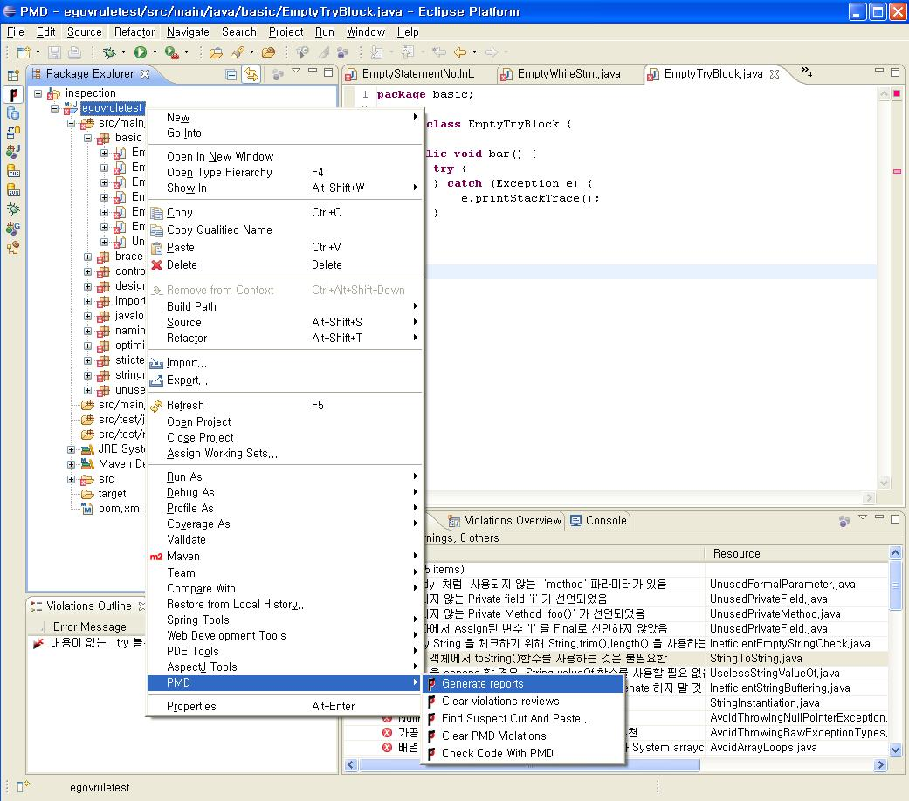

### 리포팅 파일생성 확인

Inspection의 별도 리포팅을 수행하게되면 다양한 형태의 리포팅 파일 들이 생성되는 것을 확인할 수 있다.
다음의 그림에서와 같이, 별도 리포팅을 수행한 프로젝트 루트 아래에 있는 reports 폴더에 CSV, HTML, TXT, XML 형태의 리포팅 파일이 생성된다.

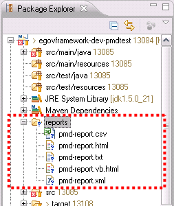

### 리포팅 결과 확인

Inspection 수행을 통해 위배된 결과를 생성된 리포팅 파일로 한 눈에 확인할 수 있다.
다음은 리포팅 파일 중, HTML 형태로 생성된 리포팅 파일을 웹 브라우저로 확인한 결과이다.

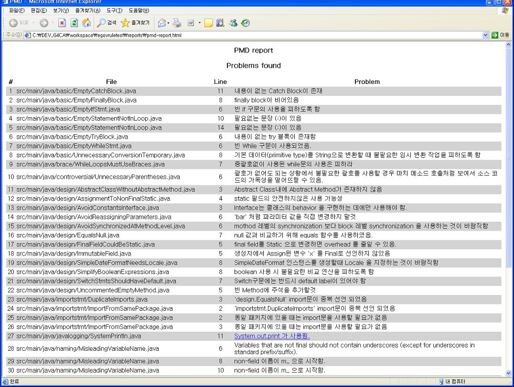

---

#### 리포팅 결과 확인시 한글깨짐 처리

PMD의 리포팅 파일들은 기본적으로 UTF-8으로 인코딩되어 생성되므로, 다음과 같은 상황에서 한글이 깨질 수 있다.

* **웹 브라우저**: HTML 형식의 리포팅 파일을 조회시, 웹 브라우저의 페이지 인코딩 설정이 '한국어'인 경우
  * **웹 브라우저의 해당 웹 페이지 인코딩 설정을 '유니코드(UTF-8)'로 전환**하면 한글 메시지를 확인 할 수 있다.
  * Microsoft Internet Explorer에서는 다음과 같이 변경한다.
    * 메뉴에서, 보기 > 인코딩 > **유니코드(UTF-8)** 선택
  * Mozilla Firefox에서는 다음과 같이 변경한다.
    * 메뉴에서, 보기 > 문자 인코딩 > **유니코드(UTF-8)** 선택
  * Google 크롬에서는 다음과 같이 변경한다.
    * URL 표시줄 우측의 '현재 페이지 관리' 아이콘(문서모양 아이콘) 클릭, 인코딩 > **유니코드(UTF-8)** 선택
* **Microsoft Excel**: UTF-8 형식의 CSV 파일 조회를 지원하지 않음
  * CSV 형식의 리포팅 파일을 메모장과 같은 문서편집기로 열고 UTF-8이 아닌 다른 형식으로 변경/저장한 후, Excel에서 불러오면 깨지지 않은 한글 메시지를 확인할 수 있다.
  * 메모장을 이용하는 방법은 다음과 같다.
    1. CSV 형식의 리포트 파일을 메모장으로 열고, 파일 > **다른 이름으로 저장...** 선택
    2. '다른 이름으로 저장' 창에서, 파일 형식 항목을 **모든 파일**로 선택
    3. '다른 이름으로 저장' 창에서, 하단의 인코딩 항목을 **ANSI나 유니코드로 변경 후 저장**
    4. 저장한 파일을 Excel에서 불러온다.
* **Hudson PMD Plugin**: 원격 CI 서버인 Hudson을 이용한 PMD 리포팅시 사용되는 Hudson PMD Plugin의 버그로, 한글(또는 UTF-8 인코딩의 동아시아 문자)로 된 룰 관련 파일 해석시 오류 발생
  * Hudson PMD Plugin 버그가 패치될 때까지 한글로 된 룰 파일은 사용할 수 없으므로, 전자정부 표준 Inspection 룰 한글용 파일과 함께 제공되는 영문용 파일을 PMD Plugin의 룰 파일로 설정하여 활용한다.

### Inspection 결과 리포팅의 통계 정보 활용

Hudson PMD Plugin을 이용하면, Inspection 수행 결과 리포팅에 대한 통계 정보를 활용할 수 있다. Hudson에서 위배사항에 대한 통계 자료를 조회하기 위해서는 다음과 같은 순서로 확인할 수 있다.

* Hudson Dashboard에서 > 조회를 원하는 Project를 선택
* 해당 Project의 화면에서 > 좌측 메뉴에서 **PMD Warning**을 선택하면, 다음과 같은 통계 초기 화면을 볼 수 있다.

  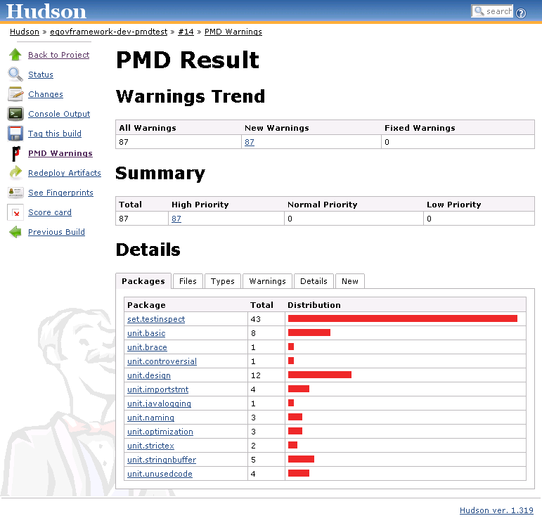

---

#### 통계 초기 화면 구성 설명

* Warnings Trend: 해당 프로젝트에서 발생한 위배건 수에 대한 통계 정보를 보여준다.
  * All Warnings: 해당 프로젝트에서 발생한 전체 위배건 수를 표시
  * New Warnings: 이번 빌드에서 발생한 위배건 수
  * Fixed Warnings: 이전 통계 자료와 비교하여 이전 빌드 작업시 발생한 위배건 중 이번 빌드에서 해결된 위배건 수
* Summary: 해당 프로젝트에서 발생한 위배건의 중요도별(High/Normal/Low) 통계 정보를 보여준다.
* Detail: 상세 통계 정보를 보여주며, 다음과 같은 항목들을 탭별로 조회할 수 있다.
  * Packages: 위배상황에 대한 패키지별 통계 정보 표시
  * Files: 위배상황에 대한 파일별 통계 정보 표시
  * Types: 위배상황에 대한 위배 유형별 통계 정보 표시
  * Warnings: 모든 위배사항들의 목록을 표시
  * Details: 모든 위배사항들의 목록을 상세 내역과 함께 표시
  * New: 이번 빌드에서 새로이 발생한 또는 이전 빌드에서 해결이 안된 위배건에 대한 목록을 상세 내역과 함께 표시

---

#### 상세 통계 화면 설명

Hudson PMD Plugin이 제공하는 다음과 같은 다양한 통계 정보를 토대로, 개인별/팀별 성과 측정 및 품질보증활동의 결과로써 활용할 수 있다.

##### Packages

다음 그림과 같이 위배건에 대한 패키지별 통계정보를 나타낸다.

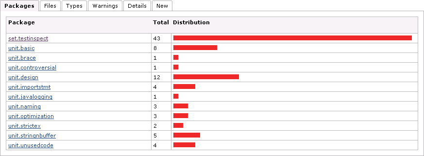

##### Files

다음 그림과 같이 위배건에 대한 파일별 통계정보를 나타낸다.

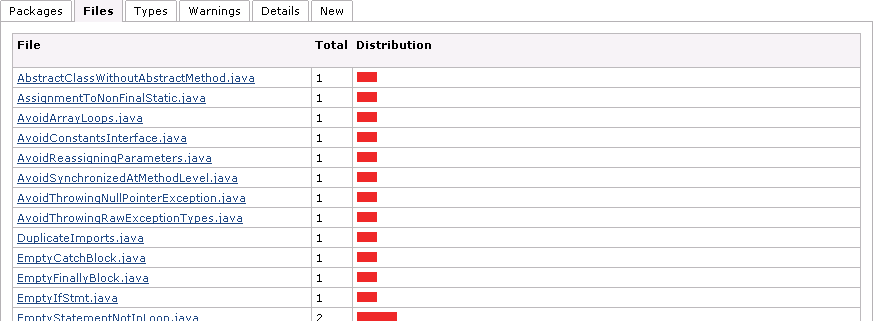

##### Types

다음 그림과 같이 위배 유형별 통계정보를 나타낸다.

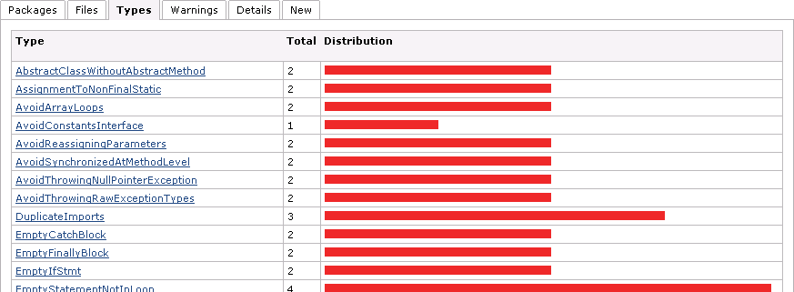

##### Warnings

다음 그림과 같이 전체 위배건의 상세 목록을 나타낸다.

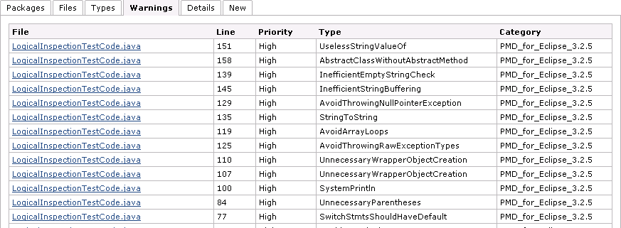