# Code Inspection

## 개요

정의된 규칙(Rule)을 기반으로 개발자가 작성한 소스 코드를 검사하여, 오류 및 위험 요인을 식별하여 알려 주는 기능을 제공한다.

## 설명

전자정부 표준프레임워크 적용 시 Code Inspection 구현도구를 통해 개발자가 작성한 소스 코드를 검사할 수 있다.
소스 코드 검사(Inspection) 작업을 통해 오류 및 위험 요인을 식별하여 개발자에게 편의성 및 효율성을 향상시킬 수 있다.

Code Inspection에서 제공하는 주요기능은 다음과 같다.

| 주요기능 | 설명 |
|---|---|
| Syntax Error Inspection | 작성한 소스 코드의 Syntax 오류를 검사하는 기능을 제공한다. |
| Logical Error Inspection | 작성한 소스 코드에서 실행 시 발생 가능한 오류를 찾아내는 기능을 제공한다. |
| Reference Inspection | 작성한 소스 코드에서 실행 시 사용되지 않는 부분을 찾아내는 기능을 제공한다. |
| Reporting | 인스펙션을 수행한 결과를 Excel, HTML등이 문서 형식으로 제공하는 기능을 제공한다. |
| Rule Customizing | Rule을 정의하는 API를 사용하여 새로운 Rule을 정의하여 추가할 수 있는 기능을 제공한다. |

전자정부 표준프레임워크의 Code Inspection 도구는 여러 오픈소스 Inspection 도구들 중에서 [PMD](https://pmd.github.io/)가 선정되었으며, 이는 전자정부 표준프레임워크 개발도구에 PMD Plugin으로 포함되어 배포되고 있다.

### 전자정부 표준프레임워크 표준 Inspection 룰셋

PMD를 이용한 Code Inspection 시 기준이 되는 요소는 룰이며, 전자정부 표준프레임워크에서는 PMD가 제공하는 수 많은 룰 중에서 기본이 될 만한 것들을 간추려 전자정부 표준프레임워크 표준 Inspection 룰셋이라는 이름으로 구성하였다.
전자정부 표준프레임워크의 표준 Inspection 룰셋은 다음의 표와 같은 44개의 룰들로 구성된다. 개별 룰에 대한 상세한 설명은 [전자정부 표준 Inspection 룰셋](./code-inspection-tool.md#전자정부-표준-inspection-룰셋)을 참고한다.

| 번호 | PMD 룰 | 설명 | SW 보안 약점 |
|---|---|---|---|
| 1 | AbstractClassWithoutAbstractMethod | Abstract Class내에 Abstract Method가 존재하지 않음 | |
| 2 | ArrayIsStoredDirectly | 배열객체 참조 외부 노출 | Public 메소드부터 반환된 Private 배열 |
| 3 | AssignmentInOperand | 피연산자내에 할당문이 사용됨. 해당 코드를 복잡하고 가독성이 떨어지게 만듦 | |
| 4 | AssignmentToNonFinalStatic | static 필드의 안전하지않은 사용 가능성이 존재 | |
| 5 | AvoidArrayLoops | 배열의 값을 루프문을 이용하여 복사하는 것 보다, System.arraycopy() 메소드를 이용하여 복사하는 것이 효율적이며 수행 속도가 빠름 | |
| 6 | AvoidCatchingGenericException | 부적절한 예외처리 | 부적절한 예외처리 |
| 7 | AvoidPrintStackTrace | 오류 메시지를 통한 정보 노출 (시스템 데이터 정보 노출) | 오류 메시지를 통한 정보 노출 |
| 8 | AvoidReassigningParameters | 넘겨받는 메소드 parameter 값을 직접 변경하는 코드 탐지 | |
| 9 | AvoidSynchronizedAtMethodLevel | mothod 레벨의 synchronization 보다 block 레벨 synchronization 을 사용하는 것이 바람직함 | |
| 10 | AvoidThrowingNullPointerException | NullPointerException을 throw하는 것은 비추천 | |
| 11 | AvoidThrowingRawExceptionTypes | 가공되지 않은 Exception을 throw하는 것은 비추천 | |
| 12 | AvoidUsingHardCodedIP | 하드코드된 IP 사용 | 하드코드된 중요정보 |
| 13 | BrokenNullCheck | 잘못된 널(Null) 체크 | 널(Null) 포인터 역참조 |
| 14 | CloseResource | 부적절한 자원 해제 | 부적절한 자원 해제 |
| 15 | ConstantsInterface | 인터페이스에 상수 적용 | |
| 16 | EmptyCatchBlock | 내용이 없는 Catch Block이 존재, 오류 상황 대응 부재 | 빈 Catch 문 사용, 오류 상황 대응 부재 |
| 17 | EmptyControlStatement | 빈 finally 블록 사용, 빈 if 문 사용, 빈 try 블록 사용, 빈 while문 사용 | |
| 18 | EqualsNull | null 값과 비교하기 위해 equals 메소드를 사용하였음 | |
| 19 | FieldNamingConventions | 변수명에 밑줄 사용 | |
| 20 | FinalFieldCouldBeStatic | final field를 static으로 변경하면 overhead를 줄일 수 있음 | |
| 21 | FormalParameterNamingConventions | 변수명에 밑줄 사용 | |
| 22 | HardCodedCryptoKey | 하드코드된 암호화키 사용 | 하드코드된 중요정보 |
| 23 | ImmutableField | 생성자를 통해 할당된 변수를 Final로 선언하지 않았음 | |
| 24 | InefficientEmptyStringCheck | 빈 문자열 확인을 위해 String.trim().length() 을 사용하는 것은 피하도록 함. whitespace/Non-whitespace 확인을 위한 별도의 로직 구현을 권장 | |
| 25 | InefficientStringBuffering | StringBuffer 함수내에서 비문자열 연산 이용하여 직접 결합하는 코드 사용을 탐지. append 메소드 사용을 권장 | |
| 26 | LocalVariableNamingConventions | final이 아닌 변수는 밑줄을 포함할 수 없음 | |
| 27 | MethodReturnsInternalArray | 클래스내 내부배열을 직접 반환하는 메소드 | Private 배열에 Public 데이터 할당 |
| 28 | MisplacedNullCheck | 널(Null) 체크의 잘못된 위치 | 널(Null) 포인터 역참조 |
| 29 | SimpleDateFormatNeedsLocale | SimpleDateFormat 인스턴스를 생성할 때 Locale 을 지정하는 것이 바람직함 | |
| 30 | SimplifyBooleanExpressions | boolean 사용 시 불필요한 비교 연산을 피하도록 함 | |
| 31 | StringInstantiation | 불필요한 String Instance를 생성하는 코드를 탐지. 간단한 형태의 코드로 변경 필요 | |
| 32 | StringToString | String 객체에서 toString()함수를 사용하는 것은 불필요함. 해당 코드 제거 필요 | |
| 33 | SwitchStmtsShouldHaveDefault | Switch구문에는 반드시 default label이 있어야 함 | |
| 34 | SystemPrintln | System.out.print 가 사용됨. 전용 로거를 사용할 것을 권장 | |
| 35 | UncommentedEmptyMethodBody | 빈 메소드에 빈메소드임을 나타내는 주석을 추가할 것 | |
| 36 | UnnecessaryBoxing | 불필요한 WrapperObject 생성 | |
| 37 | UnnecessaryConversionTemporary | 기본 데이터 타입을 String으로 변환할 때 불필요한 임시 변환 작업을 피하도록 함 | |
| 38 | UnnecessaryImport | 불필요한 import문 선언 | |
| 39 | UnnecessarySemicolon | 필요없는 ; 문장 존재 | |
| 40 | UnusedFormalParameter | 메소드 선언 내에사용되지 않는 파라미터를 탐지 | |
| 41 | UnusedPrivateField | 사용되지 않는 Private field의 탐지 | |
| 42 | UnusedPrivateMethod | 사용되지 않는 Private Method 선언을 탐지 | |
| 43 | UselessParentheses | 불필요한 괄호사용 | |
| 44 | UselessStringValueOf | String 을 append 할 경우, String.valueOf 함수를 사용할 필요 없음 | |

## 설치

전자정부 표준프레임워크 Inspection 도구인 PMD는 다음의 두 가지 방법으로 적용/설치할 수 있다.

* 전자정부 표준프레임워크 개발도구의 구현도구(Eclipse IDE)를 다운로드 후 포함된 PMD 확인
* Eclipse IDE의 Software Updates 기능을 사용

### 전자정부 표준프레임워크 개발도구 다운로드 후 포함된 PMD 확인

전자정부 표준프레임워크 개발도구는 [전자정부 표준프레임워크 온라인 지원 포탈사이트](http://www.egovframe.go.kr)의 다운로드 > 개발환경 > **구현도구**에서 다운로드 받을 수 있다.
다운로드 받은 구현도구 파일의 압축을 풀고, 실행시키면 다음의 작업으로 PMD의 설치내역과 버전을 확인할 수 있다.

1. Eclipse IDE의 메뉴에서, Help > **About Eclipse** 선택

   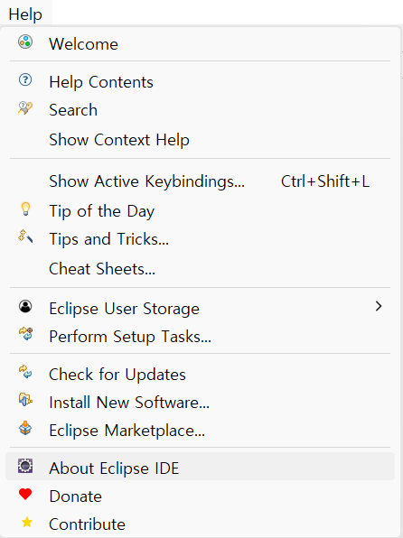

2. About Eclipse 창에서, 하단 중앙의 **Installation Details** 버튼을 클릭

   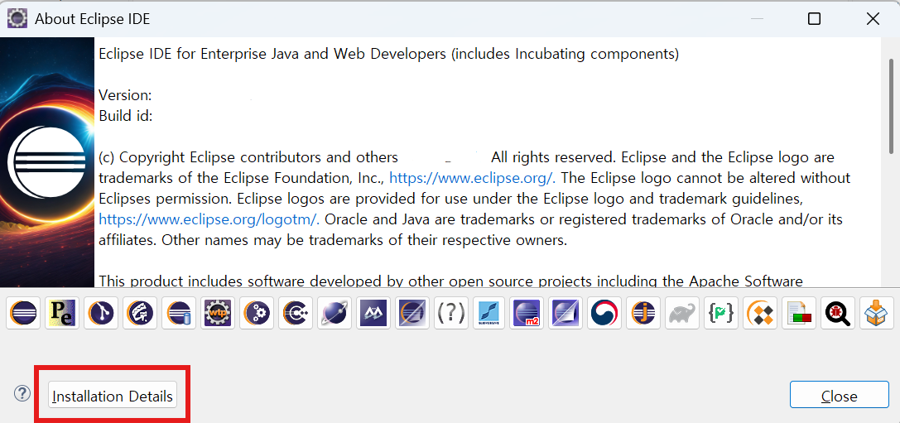

3. About Eclipse Installation Details 창의 Installed software 목록에서 PMD Plug-in 항목과 버전을 확인

   (PMD 설치 버전은 [개발환경 구성가이드](../individual-install-guide/individual-install-guide.md)에 표에서 PMD를 확인한다)

   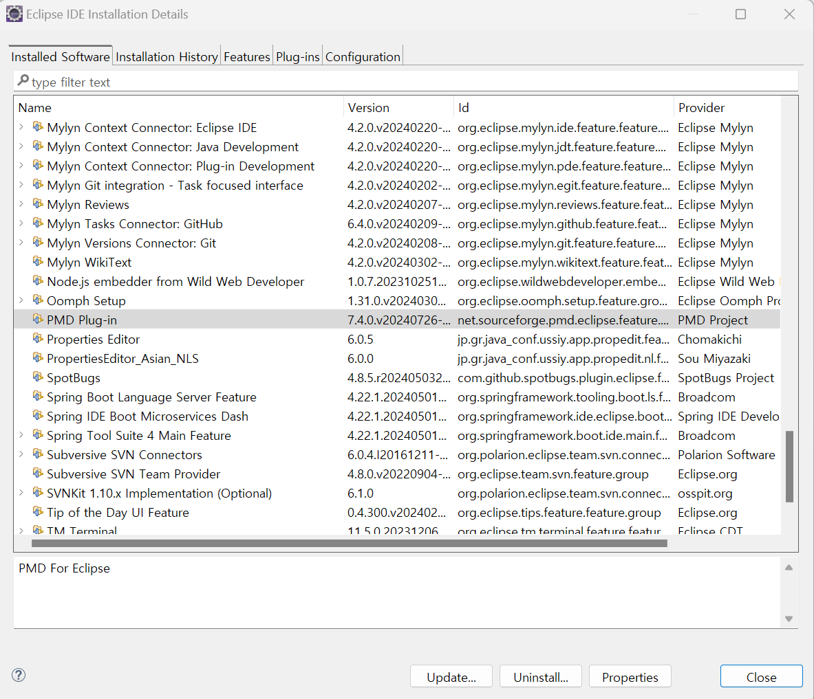

### Eclipse IDE의 Software Updates 기능을 사용

Eclipse IDE의 Software Updates 기능을 사용한 PMD 설치 방법은 [업데이트](#업데이트) 항목에 기술된 방법과 동일하므로 해당 설명을 참조하여 최초 PMD 설치 작업을 진행한다.

## 환경설정

Eclipse IDE의 환경설정을 통해, 전자정부 표준프레임워크 표준 Inspection 룰셋을 PMD Plugin에 적용할 수 있으며, 다음과 같은 순서로 수행한다.

### 전자정부 표준프레임워크 표준 Inspection 룰셋 적용하기

1. 다음 두가지 경로 중, 하나를 선택해서 전자정부 표준프레임워크 표준 Inspection 룰셋을 내려받기
   * [표준 Inspection 룰셋 한글/영문판의 압축파일](https://www.egovframe.go.kr/wiki/lib/exe/fetch.php?media=egovframework:dev2:imp:egovinspectionrules.zip) : 개발환경 2.5 이하 버전 사용
   * [표준 Inspection 룰셋 한글/영문판의 압축파일](https://www.egovframe.go.kr/wiki/lib/exe/fetch.php?media=egovframework:dev2:imp:egovinspectionrules-2.7.zip) : 개발환경 2.7 이상 버전 사용
   * [표준 Inspection 룰셋 한글/영문판의 압축파일](https://www.egovframe.go.kr/wiki/lib/exe/fetch.php?media=egovframework:dev3.5:imp:egovinspectionrules-3.5.zip) : 개발환경 3.5 이상 버전 사용
   * [표준 Inspection 룰셋 한글/영문판의 압축파일](https://www.egovframe.go.kr/wiki/lib/exe/fetch.php?media=egovframework:dev3.8:imp:egovinspectionrules-3.8.zip) : 개발환경 3.8 이상 버전 사용
   * [표준 Inspection 룰셋 한글/영문판의 압축파일](https://www.egovframe.go.kr/wiki/lib/exe/fetch.php?media=egovframework:dev4.2:imp:egovinspectionrules-4.2.zip) : 개발환경 4.2 이상 버전 사용
   * [표준 Inspection 룰셋 한글/영문판의 압축파일](https://www.egovframe.go.kr/wiki/lib/exe/fetch.php?media=egovframework:dev4.3:imp:egovinspectionrules-4.3.zip) : 개발환경 4.3 이상 버전 사용

2. 내려받은 파일을 임의의 디렉터리에 압축 해제

3. Eclipse IDE의 메뉴에서, Window > **Preferences** 선택

   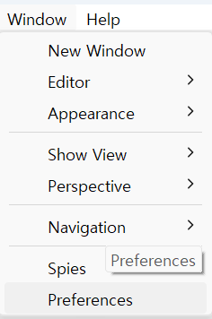

4. Preferences 창의 왼쪽 메뉴 구조에서, PMD > **Rules Configuration** 선택

   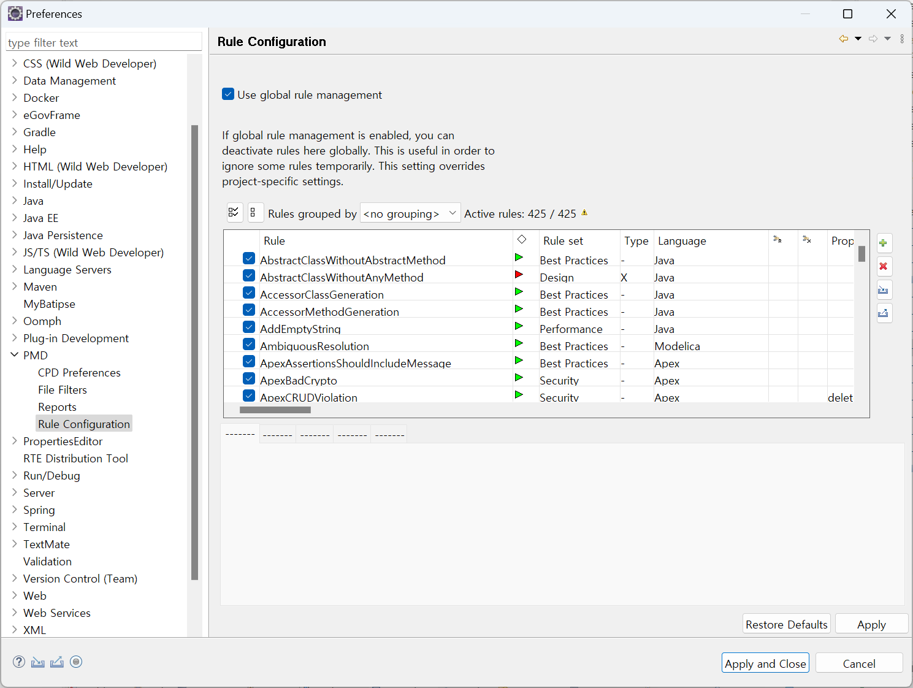

5. Preferences 창에서, use global rule management 선택후 ruleset 목록 전체선택후 우측의 [x] Remove rules 아이콘 클릭

   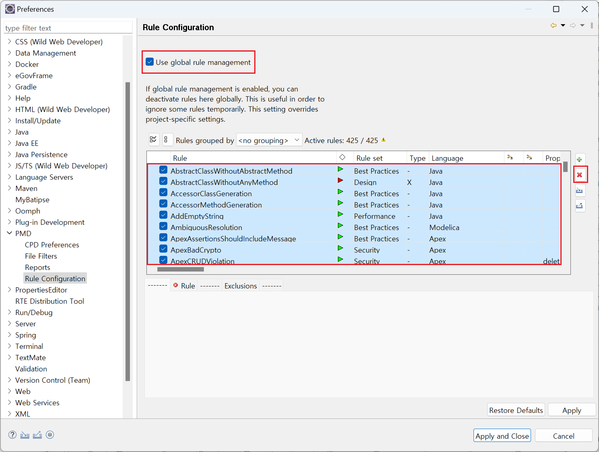

6. Preferences 창에서, 우측의 Import ruleset 아이콘 클릭

   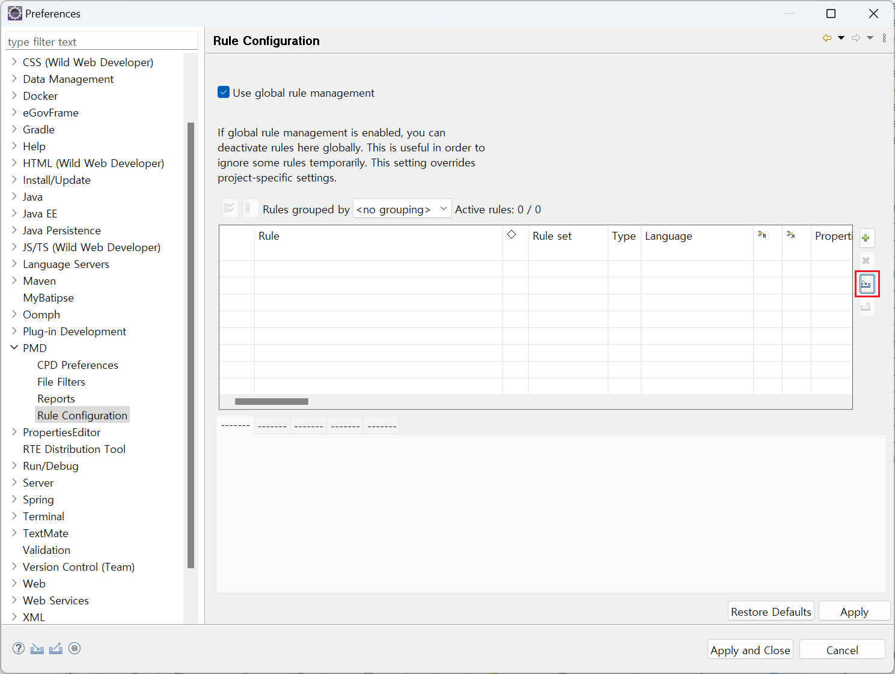

7. Ruleset 가져오기 팝업창에서, 우측의 Browse...버튼 클릭한후 앞서 압축해제한 룰셋 파일 중 한글판인 **EgovInspectionRules_kor-4.3.xml** 파일을 선택

   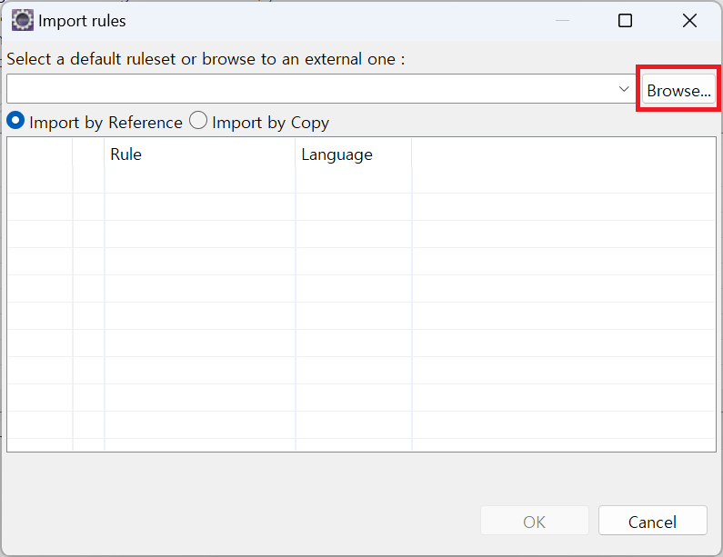

8. Ruleset 가져오기 팝업창에서, ruleset목록이 확인되면 OK버튼을 클릭

   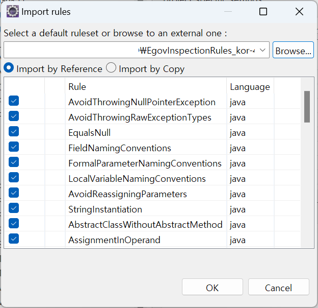

9. 룰셋을 반영하여도 설정 창에 바로 보이지 않는다. 설정 창에 Apply and Close 버튼을 눌러 적용하고 다시 설정 창을 키면 반영된 것을 확인할 수 있다.

   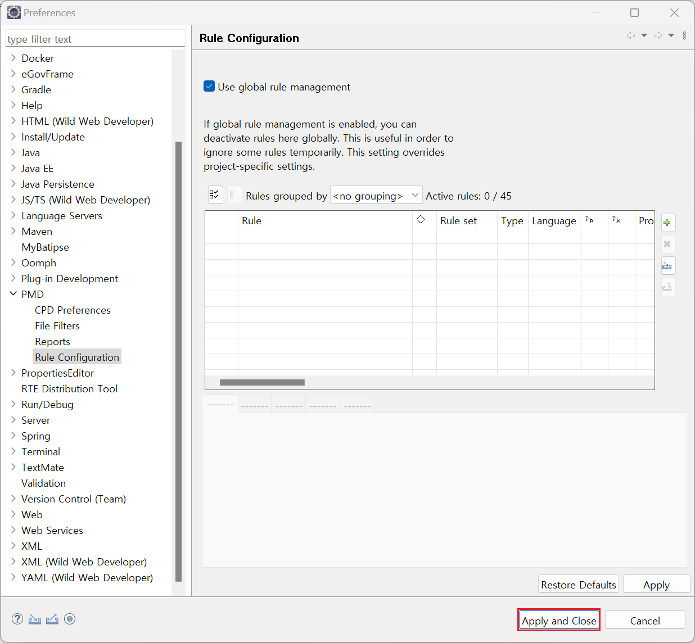

10. 룰셋을 적용하겠냐는 질문에 YES버튼을 클릭하여 최종 확인한다.

    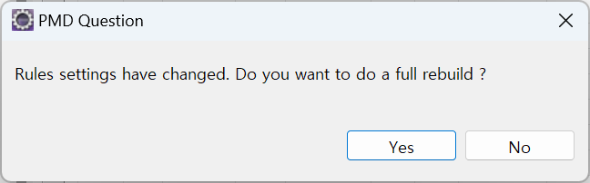

11. 다시 설정 창을 키면 반영된 것을 확인할 수 있다.

    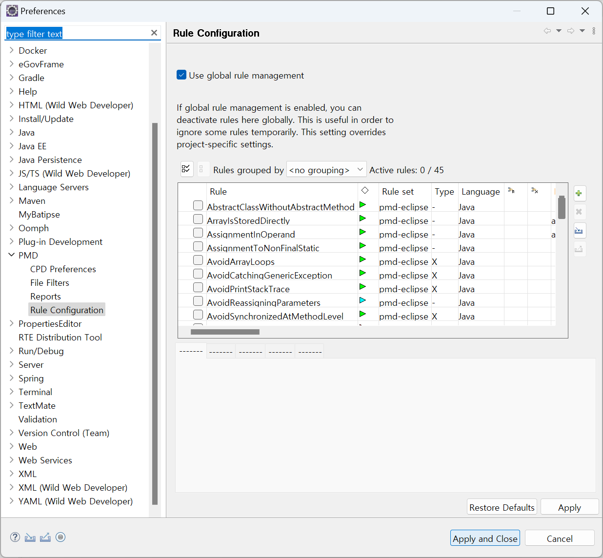

### 룰 환경설정(Rules Configuration) 항목 설명

PMD 플러그인의 룰 환경설정을 구성하고 있는 항목은 다음과 같다.

| 구성 항목 | 유형 | 설명 |
|---|---|---|
| Rules | 그리드 | 전자정부 표준 Inspection 룰셋을 구성하고 있는 전체 룰의 목록을 표시하는 그리드 |
| Remove rule | 버튼 | Rules 그리드에서 선택한 항목의 룰을 삭제 |
| Edit rule | 버튼 | Rules 그리드에서 선택한 항목의 룰을 수정 |
| Add rule | 버튼 | Rules 그리드의 룰셋에 새로운 룰을 추가 |
| Import rule set... | 버튼 | 하나 이상의 룰들을 파일단위로 룰셋에 추가 |
| Export rule set... | 버튼 | 하나 이상의 룰들을 추출하여 외부 파일로 저장 |
| Clear all | 버튼 | Rules 그리드에 나타난 모든 룰들을 삭제 |
| Rule Designer | 버튼 | XPath 기반의 새로운 룰을 만들기위한 외부 프로그램 실행(PMD 플러그인 제공) |
| Rule properties | 그리드 | 개별 룰에 대한 Key-Value 형태의 속성 목록을 표시, 주로 룰에 대한 XPath 쿼리(XQuery)를 표시 |
| Add property... | 버튼 | 개별 룰에 새로운 property 추가 |
| Exclude patterns | 그리드 | 전체 룰셋을 프로젝트에 적용할 때, 예외 대상 패턴을 정의한 목록을 표시 |
| Include patterns | 그리드 | 전체 룰셋을 프로젝트에 적용할 때, 포함 대상 패턴을 정의한 목록을 표시 |
| Add Exclude Patterns | 버튼 | 룰셋 적용 예외 대상 패턴을 새로이 추가 |
| Add Include Patterns | 버튼 | 룰셋 적용 포함 대상 패턴을 새로이 추가 |

위의 항목 중, Rules 그리드와 관련된 기능에 대한 상세설명은 [사용자정의 룰 등록,반영](./code-inspection-custom-rule.md#사용자정의-룰-등록-반영)을 참조하면 되고, 예외/포함 패턴과 관련된 설명은 다음과 같다.

---

#### Exclude patterns

Rule Configuration 오른쪽 하단의 **Add Exclude Patterns** 버튼을 클릭하면, 룰셋 적용의 예외항목에 대한 패턴을 다음 그림과 추가할 수 있다.

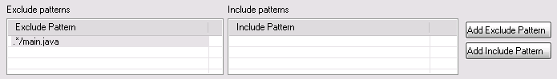

기본적으로 '.*/PATTERN/.*'와 같은 형태의 패턴이 기본으로 입력되며, 이를 더블 클릭해서 해당 항목을 수정할 수 있다.
위 그림에 기술된 패턴 예는 'main.java' 라는 이름을 가진 파일에 대해서는 Inspection 룰을 적용하지 않음을 의미한다.

#### Include patterns

Rule Configuration 오른쪽 하단의 **Add Include Patterns** 버튼을 클릭하면, 룰셋 적용의 포함항목에 대한 패턴을 다음 그림과 추가할 수 있다.

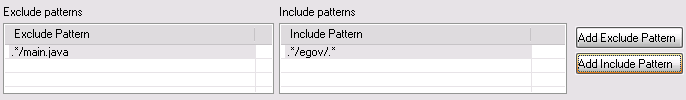

기본적으로 '.*/PATTERN/.*'와 같은 형태의 패턴이 기본으로 입력되며, 이를 더블 클릭해서 해당 항목을 수정할 수 있다.
위 그림에 기술된 패턴 예는 'egov' 라는 경로를 포함한 모든 파일에 대해서 Inspection 룰을 적용함을 의미한다.

## 업데이트

사용자는 Eclipse IDE에서 PMD를 최신 버전으로 업데이트할 수 있다. 업데이트하는 방법은 다음과 같다.

1. Eclipse IDE의 메뉴에서, Help > **Install New Software** 를 클릭한다.

   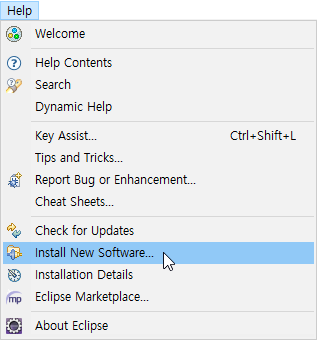

2. 'Available Software' 창에서 **Manage...** 버튼을 클릭한다(Available Software Sites 메뉴가 뜬다).

   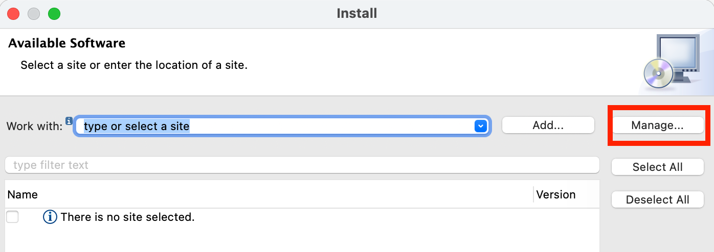

3. 'Available Software Sites' 목록 우측에 있는 **Add** 버튼을 클릭한다.

   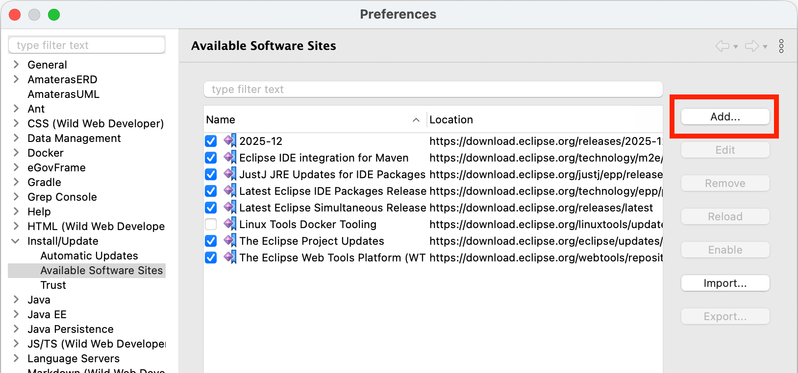

4. 'Add Site' 창에서, **Location** 입력 항목에 `https://pmd.github.io/pmd-eclipse-plugin-p2-site/` 를 입력하고 **OK** 버튼을 클릭한다.

   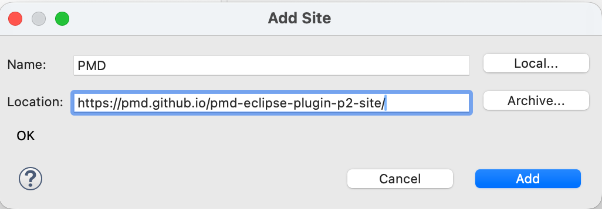

5. 'Available Software' 목록에 입력한 URL 이 추가된다. 우측 하단에 Apply and Close 버튼을 클릭한다.

6. 다시 Install New Software 메뉴로 돌아온 후, Work with에 선택 가능한 목록 중 PMD를 선택한다.

7. 입력한 URL의 트리에서 **PMD for Eclipse > PMD Plug-in**을 선택한다.

   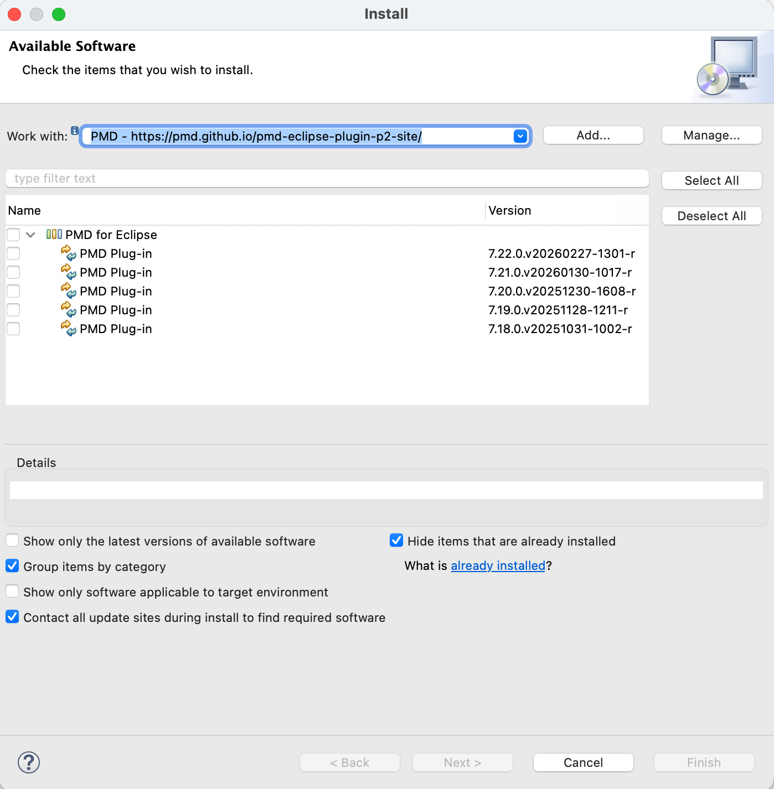

8. 하단에 있는 **Next** 버튼을 클릭하여 업데이트를 시작한다.

## 개발환경의 보안 항목별 관련 룰 보유 여부

| 보안 항목 | Spotbugs | FindSecurityBugs | PMD |
|---|---|---|---|
| ==**입력 데이터 검증 및 표현**== | | | |
| SQL Injection | ○ | ○ | |
| 코드 삽입 | | ○ | |
| 경로 조작 및 자원 삽입 | ○ | ○ | |
| XSS (Cross Site Scripting) | ○ | ○ | |
| 운영체제 명령어 삽입 | | ○ | |
| 위험한 형식 파일 업로드 | | ○ | |
| 신뢰되지 않는 URL 주소로 자동접속 연결 | | ○ | |
| 부적절한 XML 외부개체 참조 | | ○ | |
| XML 삽입 | | ○ | |
| LDAP 삽입 | | ○ | |
| 크로스사이트 요청 위조 | | ○ | |
| 서버사이드 요청 위조 | | ○ | |
| HTTP 응답분할 | ○ | ○ | |
| 정수형 오버플로우 | ○ | | |
| 보안기능 결정에 사용되는 부적절한 입력값 | | ○ | |
| 포맷 스트링 삽입 | | ○ | |
| ==**보안기능**== | | | |
| 적절한 인증 없는 중요기능 허용 | | ○ | |
| 부적절한 인가 | | ○ | |
| 중요한 자원에 대한 잘못된 권한 설정 | | ○ | |
| 취약한 암호화 알고리즘 사용 | | ○ | |
| 암호화되지 않은 중요정보 | | ○ | |
| 하드코드된 중요정보 | | ○ | ○ |
| 충분하지 않은 키 길이 사용 | | ○ | |
| 적절하지 않은 난수값 사용 | ○ | ○ | |
| 취약한 비밀번호 허용 | | | |
| 부적절한 전자서명 확인 | | | |
| 부적절한 인증서 유효성 검증 | ○ | ○ | |
| 사용자 하드디스크에 저장되는 쿠키를 통한 정보노출 | | ○ | |
| 주석문 안에 포함된 시스템 주요정보 | | | |
| 솔트없이 일방향 해쉬함수 사용 | | ○ | |
| 무결성 검사 없는 코드 다운로드 | | ○ | |
| 반복된 인증시도 제한 기능 부재 | | | |
| ==**시간 및 상태**== | | | |
| 경쟁조건: 검사시점과 사용시점 | ○ | | |
| 종료되지 않는 반복문 또는 재귀함수 | ○ | | |
| ==**에러 처리**== | | | |
| 오류 메시지를 통한 정보노출 | | ○ | ○ |
| 오류 상황 대응 부재 | | | ○ |
| 부적절한 예외 처리 | ○ | | ○ |
| ==**코드 오류**== | | | |
| Null Pointer 역참조 | ○ | | ○ |
| 부적절한 자원 해제 | ○ | ○ | ○ |
| 신뢰할 수 없는 데이터의 역직렬화 | | ○ | |
| ==**캡슐화**== | | | |
| 잘못된 세션에 의한 데이터 정보노출 | | ○ | |
| 제거 되지 않고 남은 디버그 코드 | | | |
| Public 메소드로부터 반환된 Private 배열 | ○ | | ○ |
| Private 배열에 Public 데이터 할당 | ○ | | ○ |
| ==**API 오용**== | | | |
| DNS lookup에 의존한 보안결정 | | | |
| 취약한 API 사용 | | ○ | |

## 표준프레임워크 예제 포함된 보안 항목

| 보안 항목 | 표준프레임워크 예제 포함 | 가이드문서 참조 추가 | 비고 |
|---|---|---|---|
| ==**입력 데이터 검증 및 표현**== | | | |
| SQL Injection | | | |
| 코드 삽입 | | | |
| 경로 조작 및 자원 삽입 | ○ | | 2018년 공통컴포넌트 취약점 패치 내용 |
| XSS (Cross Site Scripting) | | ○ | |
| 운영체제 명령어 삽입 | ○ | | 2023년 공통컴포넌트 취약점 패치 내용 |
| 위험한 형식 파일 업로드 | | | |
| 신뢰되지 않는 URL 주소로 자동접속 연결 | ○ | | 2019년 공통컴포넌트 보안 패치 (화이트 리스트) |
| 부적절한 XML 외부개체 참조 | | | |
| XML 삽입 | | | |
| LDAP 삽입 | | | |
| 크로스사이트 요청 위조 | ○ | ○ | Spring Security 설정 간소화 서비스 |
| 서버사이드 요청 위조 | | | |
| HTTP 응답분할 | | | |
| 정수형 오버플로우 | | | |
| 보안기능 결정에 사용되는 부적절한 입력값 | | | |
| 포맷 스트링 삽입 | | | |
| ==**보안기능**== | | | |
| 적절한 인증 없는 중요기능 허용 | | | |
| 부적절한 인가 | | | |
| 중요한 자원에 대한 잘못된 권한 설정 | | | |
| 취약한 암호화 알고리즘 사용 | ○ | ○ | 2018년 공통컴포넌트 취약점 패치 내용 |
| 암호화되지 않은 중요정보 | | | |
| 하드코드된 중요정보 | ○ | ○ | Crypto 간소화 서비스 |
| 충분하지 않은 키 길이 사용 | | | |
| 적절하지 않은 난수값 사용 | ○ | | |
| 취약한 비밀번호 허용 | | | |
| 부적절한 전자서명 확인 | | | |
| 부적절한 인증서 유효성 검증 | | | |
| 사용자 하드디스크에 저장되는 쿠키를 통한 정보노출 | ○ | | |
| 주석문 안에 포함된 시스템 주요정보 | | | |
| 솔트없이 일방향 해쉬함수 사용 | ○ | | |
| 무결성 검사 없는 코드 다운로드 | | | |
| 반복된 인증시도 제한 기능 부재 | | | |
| ==**시간 및 상태**== | | | |
| 경쟁조건: 검사시점과 사용시점 | ○ | | |
| 종료되지 않는 반복문 또는 재귀함수 | | | |
| ==**에러 처리**== | | | |
| 오류 메시지를 통한 정보노출 | | | |
| 오류 상황 대응 부재 | ○ | | |
| 부적절한 예외 처리 | | | |
| ==**코드 오류**== | | | |
| Null Pointer 역참조 | | | |
| 부적절한 자원 해제 | | | |
| 신뢰할 수 없는 데이터의 역직렬화 | | | |
| ==**캡슐화**== | | | |
| 잘못된 세션에 의한 데이터 정보노출 | | | |
| 제거 되지 않고 남은 디버그 코드 | | | |
| Public 메소드로부터 반환된 Private 배열 | | | |
| Private 배열에 Public 데이터 할당 | | | |
| ==**API 오용**== | | | |
| DNS lookup에 의존한 보안결정 | | | |
| 취약한 API 사용 | | | |

## 참고 사이트

* [표준프레임워크 보안 개발 가이드](https://www.egovframe.go.kr/home/ntt/nttRead.do?pagerOffset=0&searchKey=&searchValue=&menuNo=76&bbsId=171&nttId=1813)