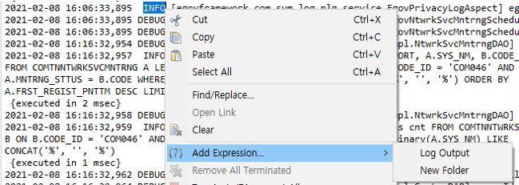
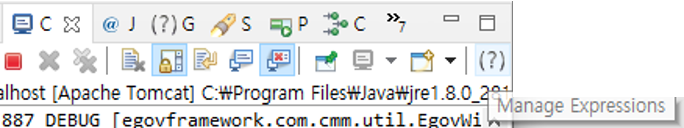
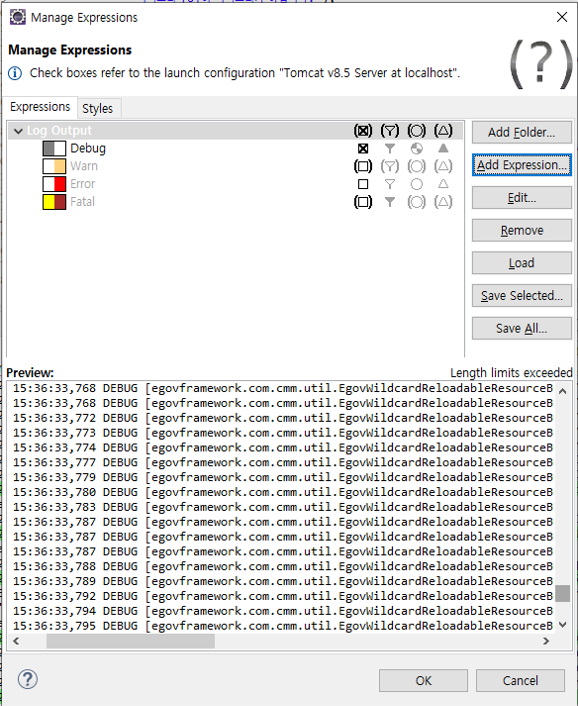
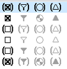
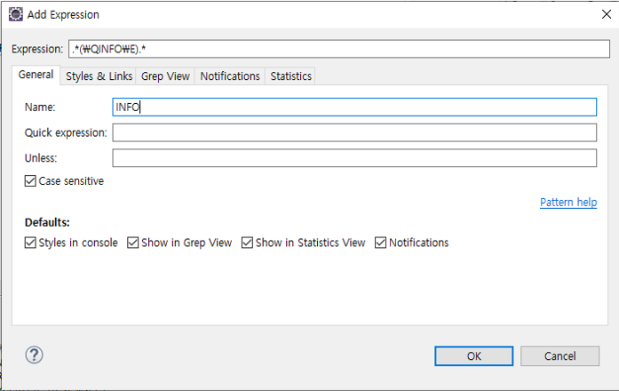
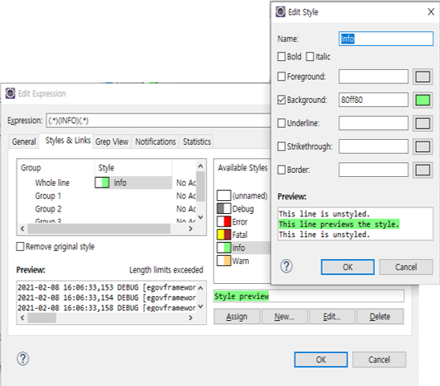
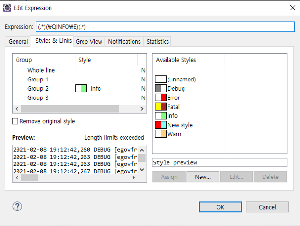
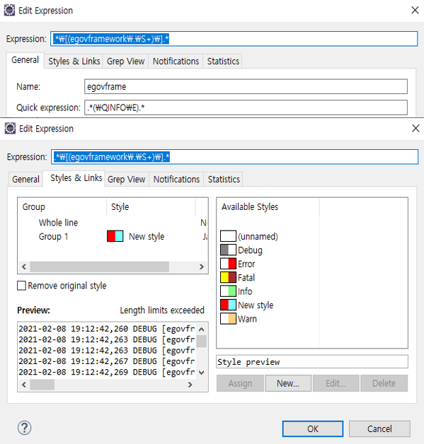
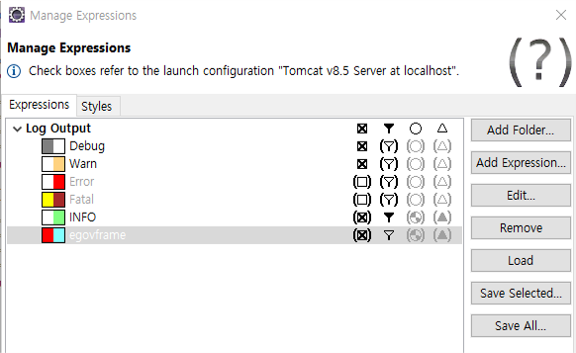
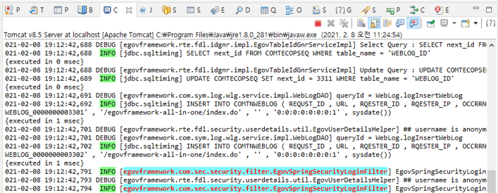

# GrepConsole

## 개요

개발 과정에서 많은 양의 로그가 생성 될 때 원하는 정보를 쉽게 얻기가 어려울 수 있다.  
Grep Console은 이클립스 기반의 플러인으로 정규식을 사용하여 매칭되는 정보를 사용자 지정 스타일을 적용하여 콘솔 출력의 가독성을 높일 수 있다.  
또한 원하는 로그만 모아서 볼 수 있거나, 통계를 볼 수 있는 기능들을 제공한다.  

## 기본설정

### 설정 방법

#### 설정 화면 들어가는 방법

방법 1. console 창에서 등록을 원하는 글자 패턴을 드래그 한 후 마우스 우클릭을 통해 Add Expression 메뉴를 선택한다.

방법 2. 콘솔창 우측 상단에 (?) 아이콘을 클릭하여 누른다.

#### 설정 화면

기본적으로 Debug, Warn, Error, Fatal의 console 정보에 대한 항목들이 설정되어 있다.

원하는 정보의 가독성을 변경하기 위하여 새로운 규칙을 추가 해 본다.

**아이콘 모양의 의미**

* 사각형 : 지정된 스타일을 콘솔에 적용할지를 나타냄.
* 깔때기 : Grep View에 보여 지는지 여부 지정.
* 원 : Grep Statics에 보여 지는지 여부 지정.
* 삼각형 : 알림을 사용하는지 여부 지정.

각 항목의 속이 차 있으면 사용한다는 것이고, 괄호는 상위 폴더에 지정된 설정을 상속한다는 의미

**정규식 등록**

먼저 우측의 Add Expression을 눌러 규칙 등록화면을 연다.

* Expression : 찾고자 하는 문자열의 정규 표현식을 나타낸다.
  * 기본적으로 [java 정규 표현식](https://docs.oracle.com/javase/6/docs/api/java/util/regex/Pattern.html)을 사용한다.
* Expression : 규칙 항목명을 설정한다.
* Quick expression : Expression의 정규식을 테스트 하기 전에 존재여부를 빠르게 평가한다.
* Unless : Expression으로 평가된 정규식 중 제외할 정규식 패턴을 지정한다.

* Style in console : 스타일을 콘솔에 적용할 지 여부를 체크한다.
* Show in Grep View : Grep View에 따로 모아 볼지 여부를 체크한다.
* Show in Statics in View : 통계 View에 나타낼지를 체크한다.
* Notifications : 알람을 알릴 것인지 체크한다.

**Style 등록**

Style 정보를 등록 한다.

각 항목별 Style 영역을 더블클릭 하거나 우측 하단의 Edit..버튼을 눌러 스타일을 수정 할 수 있는 Edit Style 창을 띄운다.
원하는 스타일을 적용한 후 OK를 누른다.

## 설정 예제

### 특정 TEXT 설정

1. Expression : `(.*)(\QINFO\E)(.*)`
   * `()`는 캡쳐단위. 3개의 캡쳐 group 사용
   * `\Q \E` 는 Quote롤 TEXT 그대로를 의미
   * => INFO라는 TEXT 들어가면 캡쳐
2. Style : 2번째 그룹 `(\QINFO\E)` 부분만 스타일 적용

### 특정 클래스 설정

1. Expression : `.*\[(egovframework\.\S+)\].*`
   * `[ ]` 안 클래스명의 풀패키지형식.
   * => egovframework로 시작하는 풀패키지명 캡쳐
2. Quick Expression : `.*(\QINFO\E).*`
   * => INFO의 TEXT들어간 것
   * ==> INFO라는 TEXT 가 들어간 로그중 패키지명이 egovframework.으로 시작하는 클래스명 탐지
3. Style : `(egovframework\.\S+)` 캡쳐한 그룹 만 스타일 적용

### Grep View 설정 상황

* Log Output 폴더 : 스타일 적용 (사용), GrepView (사용), 통계(사용안함), 알람(사용안함)
* INFO 설정 : 스타일 적용 (상속,사용), GrepView (사용)
* egovframe 설정 (특정 패키지 및 클래스) : 스타일 적용 (상속,사용), GrepView (사용안함)

### 설정 결과

