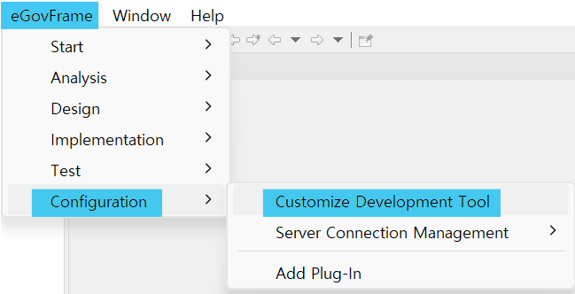
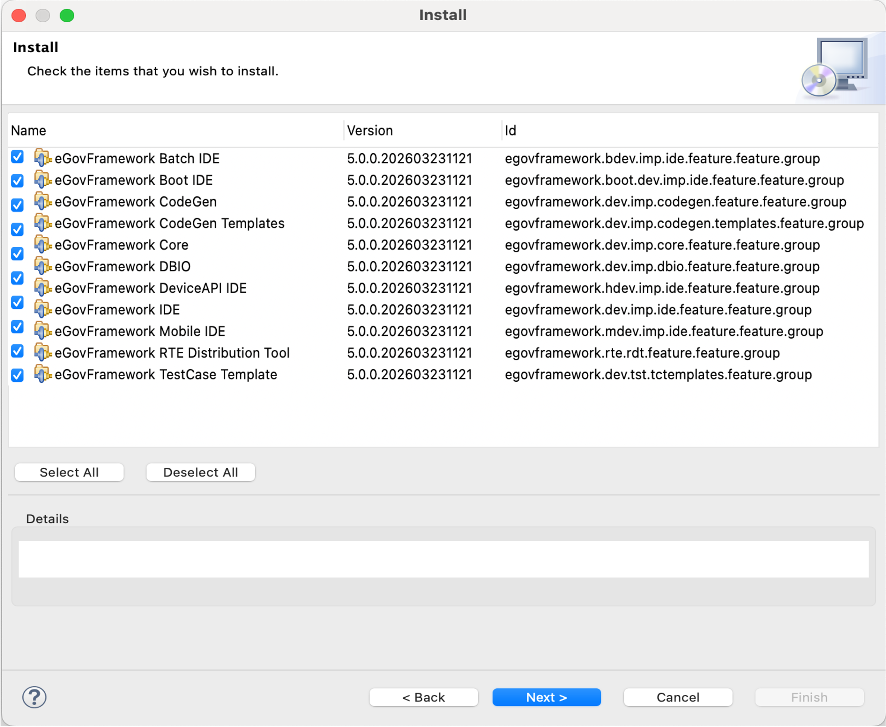

# Customize Development Tool

## 개요

eGovFrame 기반으로 개발자에게 원하는 기능만을 선택하여 개발환경을 구성 할 수 있는 기능을 제공한다.

## 설명

개발자가 개발 편의성 향상을 위한 선택 기능을 필요로 할 경우 맞춤형 개발환경 위저드를 통해 필요한 기능을 설치할 수 있다.
전자정부 표준프레임워크에서 제공하는 기능은 다음과 같다.

**제공 기능**

* eGovFramework Batch IDE
* eGovFramework Boot IDE
* eGovFramework CodeGen
* eGovFramework CodeGen Templates
* eGovFramework DBIO
* eGovFramework DeviceAPI IDE
* eGovFramework Mobile IDE
* eGovFramework RTE Distribution Tool
* eGovFramework TestCase Templates
* eGovFramework Web Standard Verification

## 사용법

### 맞춤형 개발환경

1. eGovFrame 통합 메뉴에서 Configuration > Customize Development Tool 메뉴를 선택한다.

   

2. Install Wizard에서 필요 기능을 선택하고 Next 버튼을 눌러 설치를 완료한다.

   

✔ 설치 완료된 항목은 동일 소프트웨어의 중복 설치를 막기 위해 Install Wizard에서 숨김 기능을 제공하며, 새로운 버전이 존재할 경우 Install Wizard에서 선택하여 설치할 수 있다.