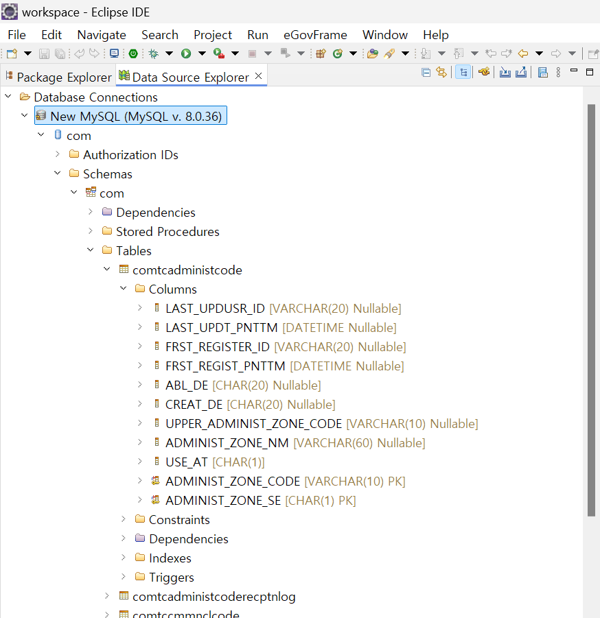
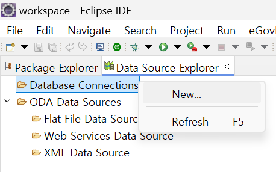
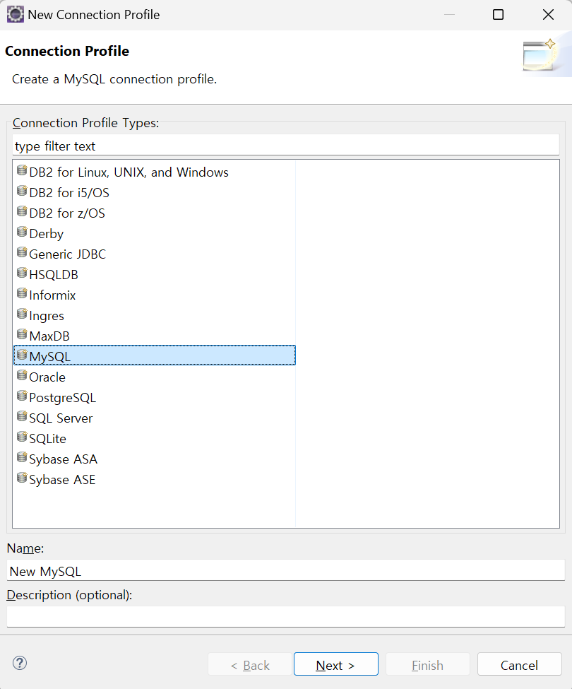
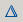
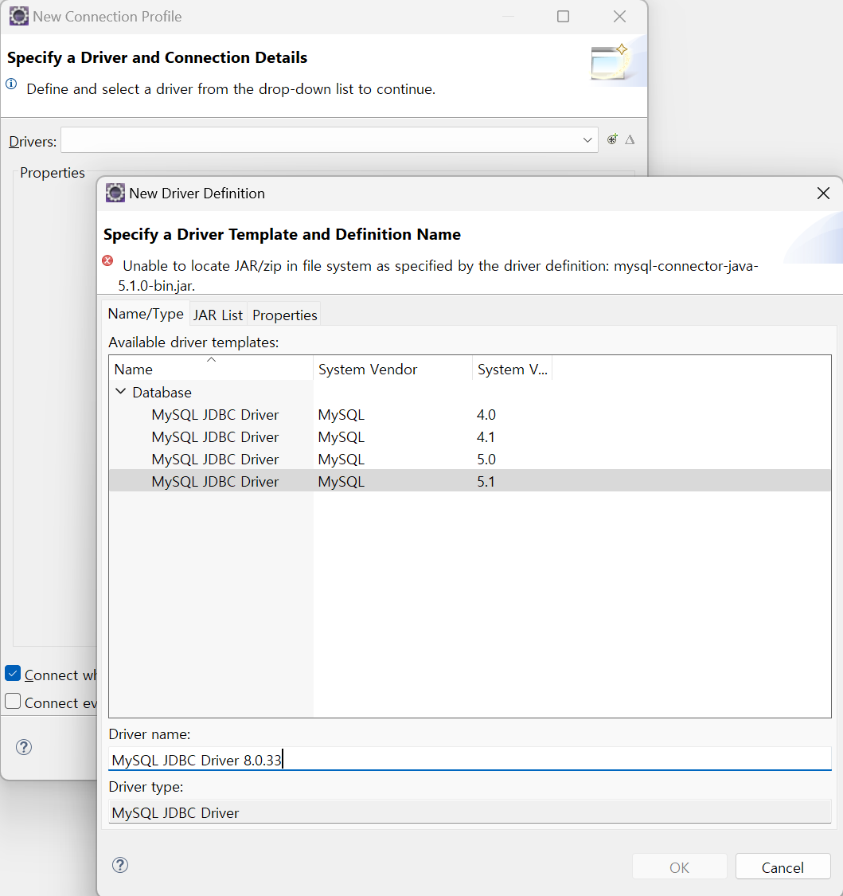
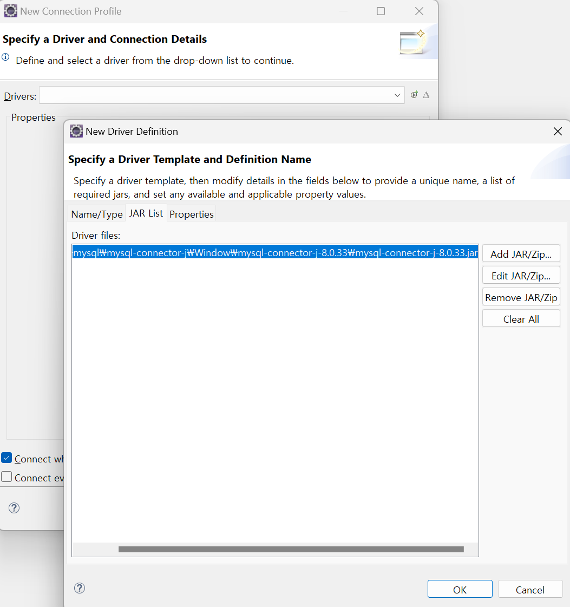
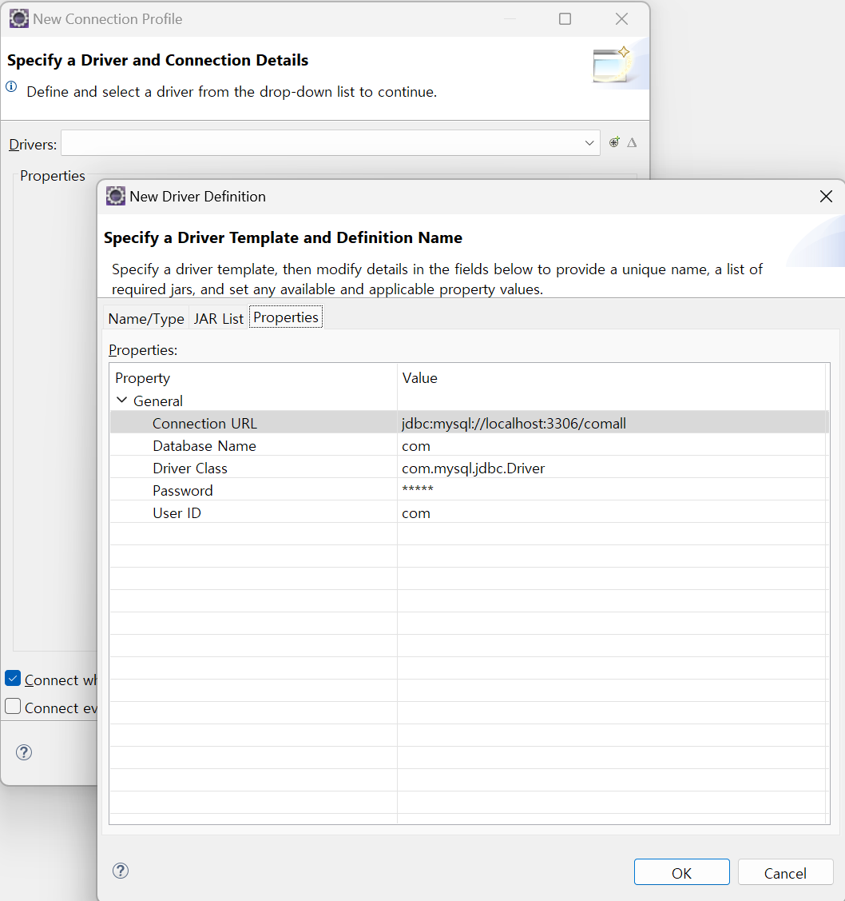
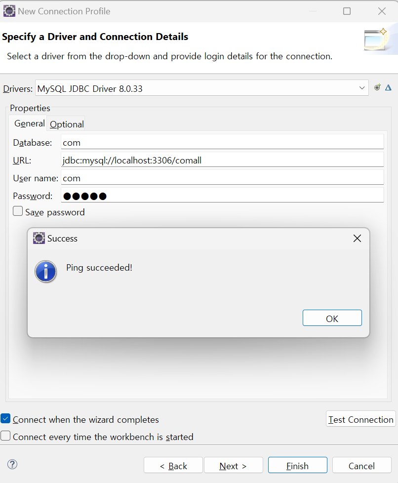

# Data Source Explorer

## 개요

Data Source Explorer는 Database Source를 설정하고, Data Source 내의 하위 객체를 조회할 수 있도록 지원한다.
주요 기능은 다음과 같다.

1. Database Connection 설정
2. Database 스키마 조회 및 기타 작업
3. ODA DataSource 설정

## 설명

### 화면

Data Source Explorer View의 메인 화면은 다음과 같다. Database를 연결시켜주고 하위의 다양한 정보를 보여주고 있다.

### 주요 기능

#### Database Connection 설정

Datasource Explorer는 사용자의 Database Connection을 생성, 추가, 수정, 삭제하는 등의 작업을 지원한다. 사용자는 하나 이상의 데이타베이스 연결을 생성할 수 있으며, 생성된 데이타베이스 연결은 작업환경 내의 모든 프로젝트에서 공유하여 사용할 수 있다.

#### Database Schema 조회 및 기타 작업

Database Source Explorer는 Database Connection에 대한 설정 뿐 아니라 사용자가 생성한 Database Source에 대해서 schema를 조회하고 일련의 작업을 수행할 수 있도록 지원한다. 테이블을 정의하는 DDL 또는 테이블 데이타를 추출할 수 있고, 권한이 주어진 경우 테이블을 삭제할 수도 있다. 권한에 따라 USER, ROLE, TABLE, INDEX, SEQUENCE 등 데이타베이스 내에 정의된 스키마를 조회하고 조작할 수 있다.

#### ODA DataSource 설정

ODA(Open Data Access) 구성 요소는 유연한 개방형 데이터 액세스 프레임워크이며, 이 구성 요소를 사용하는 애플리케이션에서는 표준 데이터 소스뿐 아니라 사용자 정의 데이터 소스의 데이터에도 액세스할 수 있다.

## 사용법

### 새 Database Connection 생성하기

1. Data Source Explorer에 있는 "Database Connections" 위에서 마우스 오른쪽 키를 누르고, Menu에서 "New"를 클릭한다.

   

2. "New Connection Profile" 다이얼로그 창에서 Connection Profile Type을 선택하고, 목록 하단에 있는 "Next" 버튼을 누른다.

   

3. "Drivers" 선택항목에서 적절한 Driver를 선택한다.
4. 선택 가능한 Driver가 목록에 뜨지 않는다면 Driver에 대한 Driver Definition을 지정해야 하는데, "Drivers" 선택항목 우측에 있는  (New Driver Definition) 버튼과  (Edit Driver Definition) 버튼을 사용하여 Driver Definition 창에 진입한다.
5. "New Driver Definition" 창이 열리면, Name/Type 탭에서 임의의 Driver를 선택한 후 Driver name을 입력한다.

   

6. "New Driver Definition" 창의 JAR List 탭에서 Edit Jar/Zip을 클릭해 실제 드라이버가 있는 경로를 지정한다.

   

7. "New Driver Definition" 창의 Properties 탭에서 필요한 Property 값을 입력한 후 OK 버튼을 클릭해 창을 나간다.

   

8. "New Connection Profile" 다이얼로그 창의 Properties 탭을 보면 앞서 작성한 property 값을 확인할 수 있다. Test Connection 버튼을 클릭해 Ping 결과를 확인한 후 succeeded가 뜨는지 확인한다.

   

9. succeeded가 뜨면 Finish 버튼을 눌러 Database Connection을 완료한다. 그러면 Database Source Explorer 뷰에 작성한 Database Connection이 추가된다.

**일반적인 경우, 설치된 DBMS에 포함된 jdbc 드라이버를 이용하면 문제 없으나, Tibero의 경우 DBMS에 포함된 jdbc 드라이버에서 Schema 정보를 불러올 수 없는 경우가 있음.**
**Tibero 홈페이지에서 tar.gz로 구성된 파일을 받아 압축을 푼 후, tibero5/client/lib/jar에 있는 tibero5-jdbc.jar(java 1.6 이상) 파일을 사용하도록 한다.**

### Database Schema 조회하기

1. Data Source Explorer에 있는 "Database Connections"을 확장하면 사용자가 연결한 DB 항목이 나타난다.
2. 하단의 Schemas를 확장하면 하위 Database Schema가 조회된다.
3. 사용자는 테이블 및 컬럼, 인덱스 정보 등을 조회할 수 있다.

### 테이블 데이터 추출하기

1. Data Source Explorer에서 "Database Connections" 하단의 사용자가 설정한 DB의 Tree를 확장하여 데이타베이스 테이블을 조회한다.
2. 데이타베이스 테이블을 선택하고 마우스 오른쪽 키를 누르면 context menu가 나타난다.
3. context menu에서 **Data** > **Extract**를 선택하면 "Extract Data" 다이얼로그 창이 오픈된다.
4. Output File 입력항목 우측에 있는 "Browse..." 버튼을 사용하여 파일 경로 및 파일명을 입력한다.
5. "File format" 그룹에 있는 "Column delimiter"와 Character string delimiter를 선택한다.
6. "Finish" 버튼을 누르면 데이타가 추출되어 file로 저장된다.