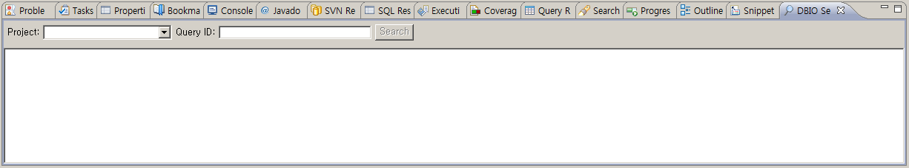
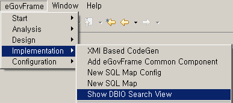
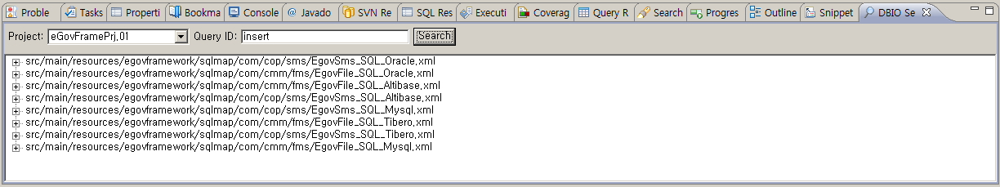

# DBIO Search View

## 개요

DBIO Search View는 SQL Map 파일 내에 있는 Query Id를 검색하는 기능을 제공한다.

## 화면 구성

DBIO Search View의 화면은 다음과 같이 구성되어 있다.

## 사용법

1. DBIO Search View를 활성화하기 위해서는 사용자의 작업환경에서 **eGovFrame** > **Implementation** > **Show DBIO Search View**를 선택해야 한다. (단 eGovFrame Perspective내에서)
2. "Project" 선택항목에서 검색할 프로젝트를 선택하고 "Query ID" 입력항목에 검색 텍스트를 입력한다.
3. "Search" 버튼을 클릭하면 입력한 검색어를 포함하는 Query ID와 이 QueryMap을 포함하는 SQL Map 파일이 모두 조회된다.
4. 검색결과에 조회된 SQL Map 파일명 또는 Query ID를 클릭하면 해당 QueryMap을 편집할 수 있도록 선택한 SQL Map 파일이 오픈된다.

