# Mapper Configuration Editor

## 개요

Mapper Configuration Editor는 Mapper 설정 파일을 편리하게 작성할 수 있도록 도와주는 개발도구이다.
Mapper Configuration Editor는 TypeAlias와 Mapper 목록으로 구성되어 있으며, 주요 기능은 다음과 같다.

* TypeAlias 편집 기능이다.
* Mapper 목록 편집 기능이다.

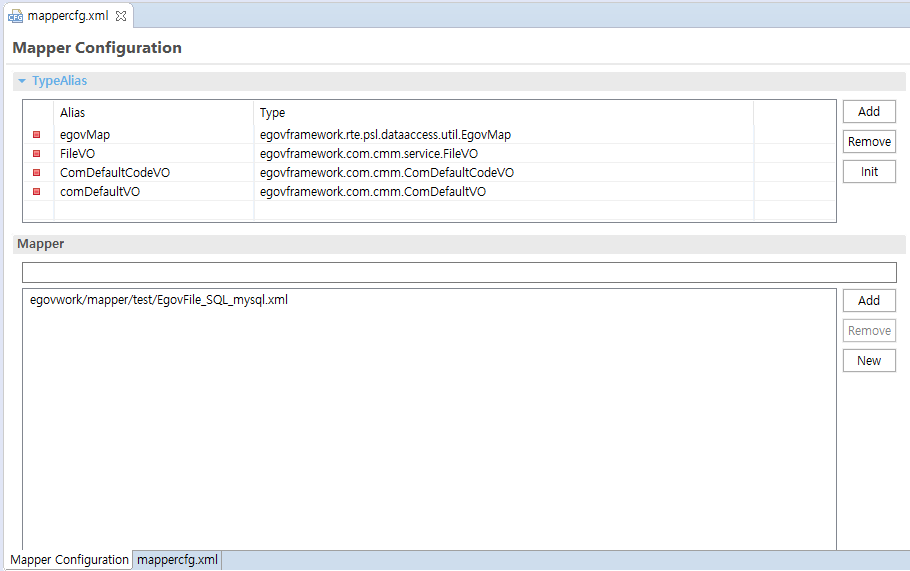

## 설명

### TypeAlias

Mapper Configuration Editor는 개발자가 간단한 선택작업과 입력작업만으로도 TypeAlias를 설정할 수 있다. TypeAlias의 설정항목은 Alias, Type이며, 세부사항은 다음과 같다.

#### TypeAliases

TypeAlias의 Alias, Type 속성은 설정을 좀 더 일반화하기 위해서 이름/값 쌍의 리스트를 제공한다.

##### Add

사용자가 필요한 Alias, Type를 추가한다.

##### Remove

TypeAlias 항목 중에 불필요한 항목을 선택하여 Alias, Type를 제거한다.

##### Init

TypeAlias 항목을 모두 초기화한다.

### Mapper 목록

Mapper 목록에서는 사용할 Mapper 맵핑 파일을 지정한다.

#### Add

Mapper 맵핑 파일을 추가한다.

#### Remove

Mapper 목록 중에서 불필요한 Mapper 맵핑 파일을 선택하여 제거한다.
단, Mapper 목록에서 제거될 뿐, 실제 파일이 삭제되는 것은 아니다.

#### New

Mapper 맵핑 파일을 새로 생성하는 동시에 Mapper 목록 중에 새로 생성된 Mapper 맵핑 파일을 추가한다.

## 사용법

### Mapper Configuration File 새로 만들기

1. 상단 메뉴의 eGovFrame(eGovFrame 메뉴는 eGovFrame Perspective 환경에서만 나타난다) > **Implementation** > **New Mapper Configuration** 또는 Context Menu의 **New** > **mapperConfiguration**을 통해 파일을 생성한다.

   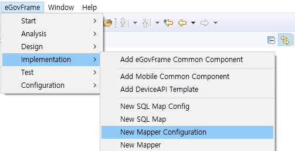

   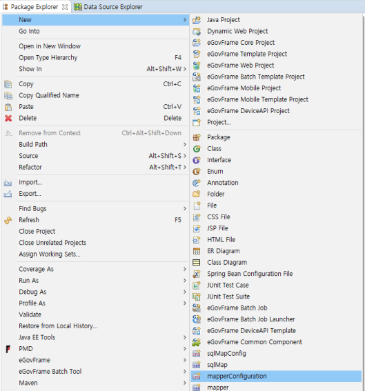

2. mapperConfiguration 파일이 위치할 폴더를 선택하고 파일명을 입력한다.

### Mapper Configuration Editor 열기

Package Explorer에서 해당 Mapper Configuration File을 선택하고 더블클릭하거나 열기를 누르면 자동으로 Mapper Configuration Editor로 열리게 된다.

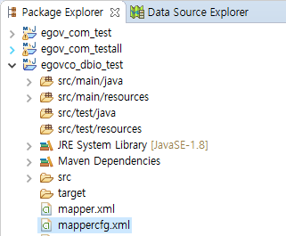

단, Mapper Configuration file에 이상이 있거나, 다른 이유로 Mapper Configuration Editor로 열리지 않을 때에는 context menu의 open with 기능을 사용하여 editor를 Mapper Configuration Editor로 선택해야 한다.

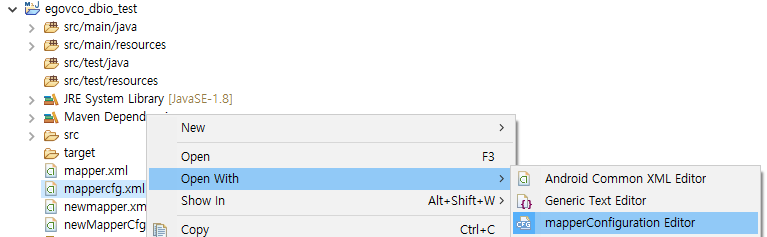

### TypeAlias 사용법

1. Mapper Configuration Editor에서 "TypeAlias" 타이틀을 클릭하면 "TypeAlias" Tab이 확장되면서 편집가능한 상태가 된다.
2. Alias, Type 항목에 적절한 값을 입력한다.
3. 필요한 경우, TypeAlias 항목을 추가 또는 삭제하려면 TypeAlias 목록 우측에 있는 "Add", "Remove" 버튼을 활용한다. TypeAlias를 초기화할 경우에는 "Init" 버튼을 눌러 모든 항목을 초기화한다.

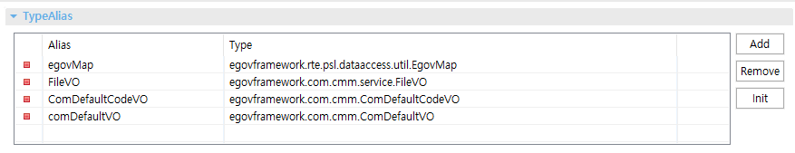

### Mapper 목록 사용법

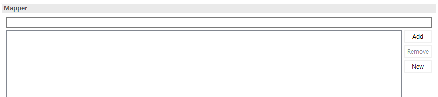

1. Mapper 목록 우측에 있는 "add" 버튼을 클릭하여 Mapper 파일을 검색하고 하나 이상의 Mapper 파일을 선택하여 추가할 수 있다.

   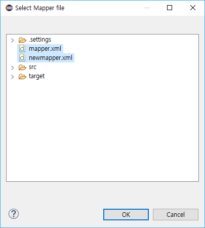

2. Mapper 목록에 불필요한 Mapper 파일이 있는 경우 해당항목을 선택하고 "Remove" 버튼을 클릭하여 선택된 항목을 제거한다. 단, 실제 파일이 삭제되는 것은 아니다.
3. 사용할 Mapper 파일이 존재하지 않는 경우 "New" 버튼을 클릭하여 새 Mapper 파일을 생성함과 동시에 새로 생성된 Mapper 파일을 목록에 추가할 수 있다.

   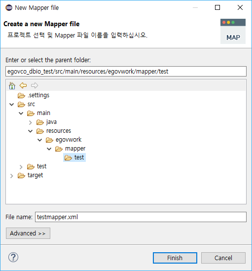

4. Mapper 목록의 항목이 하나 이상인 경우 Mapper 목록 바로 위에 있는 filter를 사용하여 Mapper 파일 항목을 선택적으로 조회할 수 있다.

   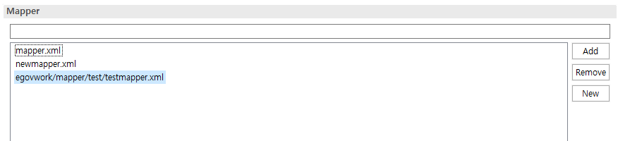

### Mapper Configuration File의 소스 직접 수정하기

1. Mapper Configuration Editor에는 Form UI를 사용하지 않고 XML을 직접 수정할 수 있는 기능을 제공하고 있다.
2. Mapper Configuration Editor에서 편집화면 하단에 보이는 "파일명.xml"이라는 제목의 Tab을 클릭하면 Form UI를 사용하지 않고 XML Source를 직접 수정할 수 있다.

   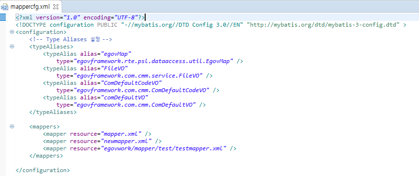