# Mapper Editor

## 개요

Mapper Editor는 Mapper File을 쉽고 편리하게 편집할 수 있도록 지원하는 개발도구이다. 사용자는 XML 문법을 잘 알지 못해도 Mapper Editor의 Form UI를 사용하여 쉽게 Mapper File을 작성할 수 있다. 또한 Mapper Editor는 XML 작성 시에 사용자가 범할 수 있는 오타로 인한 오작동을 최소화할 수 있다.
Mapper Editor의 주요기능은 다음과 같다.

* CRUD Query의 추가/수정/삭제 한다.
* Query Builder 기능이다.
* Query Test 기능이다.
* ResultMap 설정한다.
* Alias 설정한다.
* 각 그룹별 ID 중복체크 기능이다.
* Outline을 통한 각 그룹별 ID 바로가기 기능이다.
* Custom Layout 조정 기능이다.

## 설명

### 화면

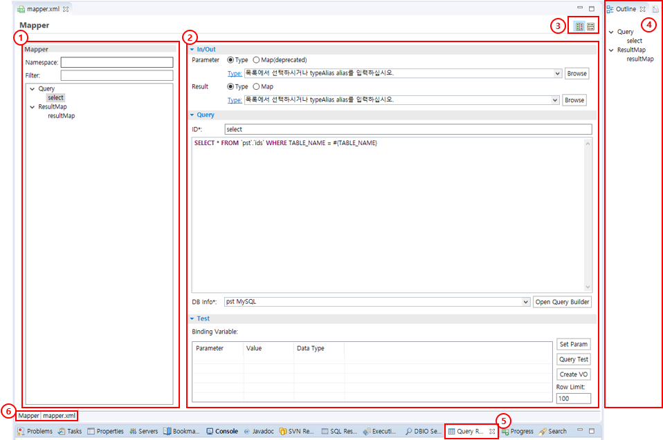

① Mapper Namespace, 그룹별 구성요소 Tree 편집 화면이다.
② Mapper 내에 속한 Query, ResultMap 각 구성요소에 대한 편집 화면, 구성요소별 편집화면이 다르다.
③ 사용자 LayOut 조정 기능이다. (Horizontal, Vertical 선택)
④ Mapper 구성 Outline이다.
⑤ Query Result View 화면, Query Test 결과를 보여준다.
⑥ Mapper 파일을 수정할 때 사용자는 Form UI를 사용할 것인지 XML 소스를 직접 수정할 것인지 선택할 수 있다.

### 주요기능

#### Mapper Tree

Mapper Editor에서는 Mapper 파일 내에 있는 Query, ResultMap에 대한 각 구성요소를 Tree 형태로 표현하여 사용자가 Mapper 구성을 쉽게 이해할 수 있도록 도와준다. (화면 ① 참조) 또한 Mapper Tree는 각 구성요소를 쉽게 접근하여 추가, 수정, 삭제 등의 작업을 수월하게 할 수 있도록 도와준다.

#### CRUD Query 작성

Mapper 파일은 쿼리 매핑 구문에 따라 그에 관련된 XML 요소가 다르다. Mapper Editor는 해당 구문타입 속성에 적합한 편집화면을 제공하므로 편리하게 작성할 수 있다. (화면 ② 참조)

| 구문타입 | 속성 | 설명 |
| -------- | ---- | ---- |
| select | id, parameterType, parameterMap(deprecated), resultType, resultMap | 데이터 조회 |
| insert | id, parameterType, parameterMap(deprecated) | 데이터 입력 |
| update | id, parameterType, parameterMap(deprecated) | 데이터 수정 |
| delete | id, parameterType, parameterMap(deprecated) | 데이터 삭제 |

Query 편집화면은 In/Out, Query, Test 탭으로 구분된다.

##### In/Out

Query에 사용될 Parameter, Result를 작성한다. Parameter나 Result는 둘 다 Type 또는 Map 중 하나를 선택하여 지정할 수 있다. Result는 select Query인 경우에만 해당한다.

##### Query

Query ID를 변경하거나, Query 내용을 편집하고, Query Test에 필요한 데이타베이스 접속 정보를 선택할 수 있다.

##### Test

Query에 대한 Binding Variable 값을 지정하거나 입력하고, 해당 쿼리를 Test할 수 있다. Row Limit 값을 입력하면 Query Result View에 조회되는 결과 행수를 제한할 수 있다.

#### Query Builder 기능

Mapper Editor는 Query Builder 기능을 제공하기 때문에, 사용자가 쿼리를 작성할 때, 별도의 Database Client를 사용하여 테이블명과 컬럼명을 확인할 필요가 없다. Mapper Editor의 Query Builder는 Database 내의 Table List, Column Name 등을 조회, 확인할 수 있도록 해줄 뿐 아니라 단순 쿼리의 경우 자동생성 기능으로 신속하게 쿼리를 작성할 수 있다. 물론, 별도의 쿼리 테스트 기능을 가지고 있지만, 단순쿼리의 경우 Query Builder 상에서도 쿼리 결과를 확인할 수 있다.

#### Query Test 기능

사용자는 단순 Query 외에도 Parameters를 적용하여 복잡한 쿼리를 작성할 가능성이 높다. 해당 쿼리에 대해서는 먼저 Query Test를 통해 Query에 대한 Validation이 이루어져야 할 것이다. SQL Map Editor는 쿼리 테스트 기능을 통해 Query에 대한 Validation을 제공한다.

#### ResultMap 작성

ResultMap은 Mapper 파일의 구성요소 중 `<resultMap>` 요소에 해당한다. Mapper Editor의 Form UI를 통해 `<resultMap>` 요소를 쉽게 작성할 수 있다. id와 type 속성 외의 항목은 Property 목록에 사용자가 프로젝트에 맞게 개별적으로 추가할 수 있다. 사용자가 정의한 resultMap 요소는 select Query의 Result를 지정할 때 활용할 수 있다.

#### 각 그룹별 ID 중복체크 기능

사용자가 다수의 Mapper 구성요소를 작성하고 편집하는 과정에서 구성요소의 ID가 중복될 경우 작성된 Mapper가 오작동할 가능성이 높다. Mapper Editor는 사용자가 각 그룹별 구성요소를 추가/수정/삭제할 때, ID 중복체크를 자동으로 처리한다. ID가 중복되었거나 공백인 경우 경고메시지를 보여줌으로써 사용자의 실수를 미연에 방지할 수 있다.

#### Custom Layout 조정 기능

사용자 작성의 편이성을 고려하여 Mapper Editor는 Horizontal, Vertical 2가지의 화면 Layout을 제공한다. 사용자가 적절히 선택해서 사용하면 된다. (화면 ③ 참조)

#### Mapper Outline

Mapper Editor는 사용자가 XML 소스를 직접 수정할 때, Mapper Outline View를 제공하여 현재 작성중인 Mapper 구성에 대한 이해를 도와준다. Mapper Outline에서 특정 구성요소를 클릭할 경우 해당 구성요소의 편집화면으로 이동한다. (화면 ④ 참조)

## 사용법

### Mapper File 새로 만들기

1. 상단 메뉴의 eGovFrame(eGovFrame 메뉴는 eGovFrame Perspective 환경에서만 나타난다) > **Implementation** > **New Mapper** 또는 Context Menu의 **New** > **mapper**를 통해 파일을 생성한다.

   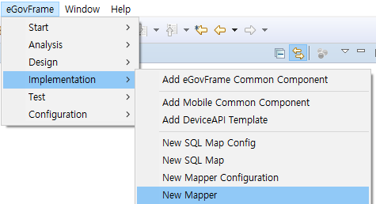

   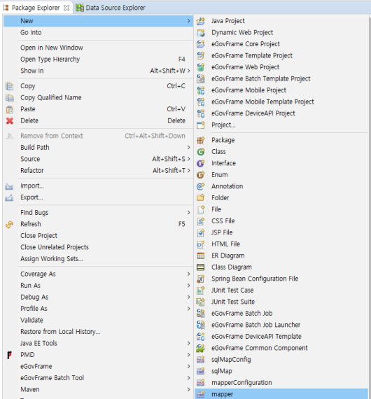

2. Mapper 파일이 위치할 폴더를 선택하고 파일명을 입력한다.

   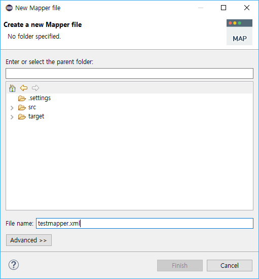

### Mapper Editor 열기

Package Explorer에서 해당 Mapper File을 선택하고 더블클릭하거나 열기를 누르면 자동으로 Mapper Editor로 열리게 된다.
단, Mapper file에 이상이 있거나, 다른 이유로 Mapper Editor로 열리지 않을 때에는 context menu의 open with 기능을 사용하여 editor를 Mapper Editor로 선택해야 한다.

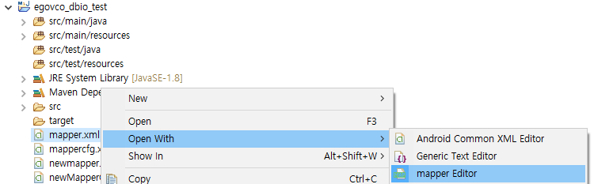

### 신규 Query Map의 작성

1. Mapper Editor 화면 중 좌측(Mapper Editor 편집화면 LayOut은 사용자의 선택에 따라 Horizontal, Vertical 등으로 바뀔 수 있다. 여기서는 초기상태인 Vertical Layout 상태를 가정하고 설명한다)에 있는 Mapper Tree에서 마우스 오른쪽 키를 누르면 context menu가 나타난다.

   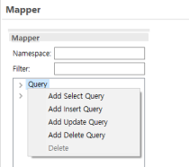

2. context menu에서 "Add XXX Query"를 선택한다. (단, Select/Insert/Update/Delete 속성에 따라 적합한 쿼리 생성을 선택한다.)
3. 신규로 생성한 Query 속성에 따른 편집화면이 Mapper Tree 우측에 나타난다.
4. In/Out 탭에서 Parameter의 Type 또는 Map(deprecated)를 선택한 후 적절한 항목을 선택한다. 라디오 버튼을 사용하여 Type 또는 Map(deprecated) 방식을 선택하면 선택한 방식에 따라서 Type 또는 Map(deprecated) 입력항목이 활성화되거나 비활성화된다.

   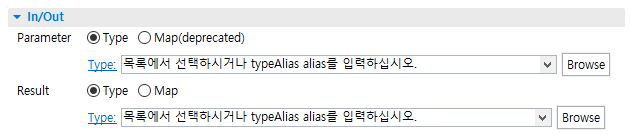

5. Select Query의 경우 In/Out 탭에 Result 항목이 추가되어 나타나므로 Parameter 항목과 동일한 방법으로 Result 항목을 입력한다.
6. Query 탭에서 Query ID를 수정하거나, 쿼리를 작성할 수 있다. Query 작성이 어려운 경우에는 Query Builder를 사용하면 보다 쉽게 Query를 작성할 수 있다. 단, Query Builder를 사용하려면 먼저 적절한 데이타베이스 연결을 선택해야 하는데, 데이타베이스 연결을 미리 설정하지 않은 경우 데이타베이스 연결을 선택할 수 없다. 데이타베이스 연결 설정은 Data source explorer를 사용하여 설정할 수 있다.

   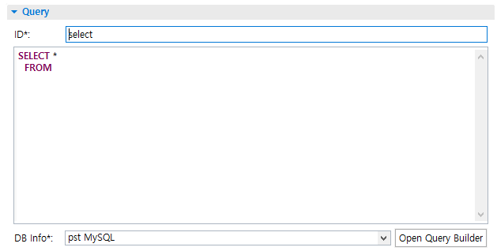

### Query Builder 사용하기

1. Mapper Editor의 Query 편집화면에서 Query 탭에는 Query Builder 기능을 내장하고 있다.
2. Query Builder를 사용하기 위해 먼저 "DB Info*:" 항목에서 적절한 데이타베이스 연결을 선택한다. 항목이 보이지 않는 경우 데이타베이스 연결을 미리 설정하지 않은 경우이다.
3. "DB Info*:" 항목 우측에 있는 "Open Query Builder"를 클릭하면 SQL Query Builder 화면이 오픈된다. Query Builder의 세부 사용법은 다음과 같다.

#### Query Builder

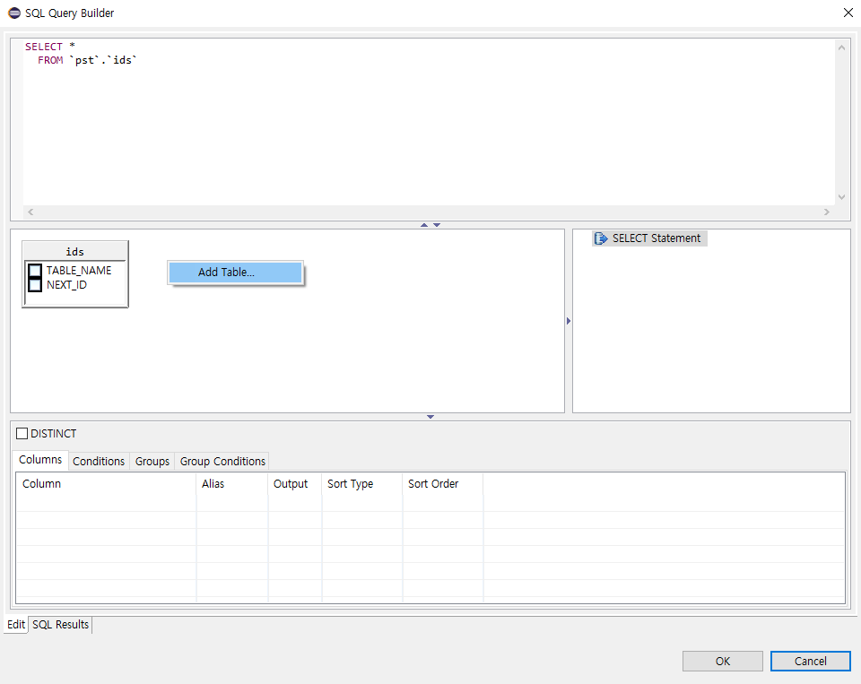

##### 사용할 테이블 추가하기

1. 테이블 조회 화면에서 마우스 오른쪽 버튼을 클릭하면 "Add Table..." 메뉴가 나타난다.
2. "Add Table..." 메뉴를 선택하면 "Add Table" 다이어로그 창이 오픈된다.
3. "Add Table" 다이어로그 창에서 사용할 Table 또는 View를 선택한다.
4. "Add Table" 다이어로그 창에 있는 "Table Alias" 입력 항목을 통해 Table Alias를 지정할 수 있다.
5. "OK"를 클릭하면 테이블 조회 화면에 해당 테이블의 스키마가 나타나고, Query Builder의 쿼리 편집화면에 해당 테이블이 추가된다.

##### 테이블간 JOIN하기

1. 테이블 조회 화면에 둘 이상의 테이블을 추가한다.
2. JOIN할 컬럼을 클릭하고 대상 컬럼에 드래그하면 선이 연결되면서 Query Builder의 쿼리 편집화면에 JOIN 구문이 추가된다.
3. JOIN을 나타내는 LINE 상에서 마우스 오른쪽키를 누르면 JOIN TYPE을 지정할 수도 있다.

##### 조회할 컬럼 지정하기

1. Query Builder에서 SELECT 쿼리의 초기 상태는 특정 컬럼이 명시되어 있지 않은 "SELECT * FROM"이다.
2. 테이블 조회 화면에 추가된 테이블 내에는 조회/사용 가능한 컬럼명이 명시되어 있다.
3. 마우스를 사용하여 컬럼명 좌측에 있는 CHECK BOX를 클릭하면 특정 컬럼의 조회 여부를 결정할 수 있다.
4. 조회할 컬럼명에 ALIAS를 적용하기 위해서는 Query Builder 하단에 있는 columns 탭을 활용하여 Column Alias를 입력할 수 있다.

##### Where 조건절 만들기

1. Select Query에서 Where 조건절을 만들기 위해서는 Query Builder 하단에 있는 Conditions 탭을 사용한다.
2. column 항목에 기준 컬럼명을 선택하고 Operator와 Value 값을 지정하면 where 조건절을 생성할 수 있다.
3. 하나 이상의 where 조건절을 사용하는 경우 AND/OR을 선택하여 조건절을 결합할 수 있다.

##### Group By 절 만들기

1. Query Builder에서 Group By 절을 생성하기 위해서는 Query Builder 하단에 있는 Groups 탭을 사용하면 된다.
2. Groups 탭 오른쪽에 있는 Grouping할 Column 항목을 적절히 선택한다.
3. Group By 절에서 Having 조건을 사용하기 원할 때는 Group Conditions 탭을 사용하면 된다. Group Conditions의 사용법은 Conditions의 사용법과 같다.

##### Union 절 만들기

1. Union 절을 생성하려면 Query Builder 중앙 우측에 있는 Query Tree를 사용하면 된다.
2. Query Tree에서 마우스 오른쪽 키를 클릭하면 context menu가 나타난다.
3. context menu 중 Convert to FULLSELECT (UNION) 메뉴를 선택하면 작성한 쿼리에 UNION이 추가되고, Query Tree도 확장된다.

##### 쿼리 실행하기

1. 작성한 쿼리는 Query Builder 내에서도 결과 조회가 가능하다. Query에 대한 결과 조회를 하려면 Query Builder 상단에 있는 쿼리편집기를 사용한다.
2. 쿼리편집기 화면에서 마우스 오른쪽 키를 누르면 context menu가 나타난다.
3. context menu 중에서 Run SQL 메뉴를 선택한다.
4. Query Builder 내에 있는 "SQL Result" 탭으로 이동하면서 쿼리 수행결과를 보여준다.

##### 기타 기능

* 여기에 기술된 기능외에도 Query Builder는 사용자가 쿼리를 쉽고 편리하게 작성할 수 있도록 많은 기능을 제공한다.

### 작성한 쿼리 테스트하기

1. 작성한 쿼리를 테스트하기 위해서는 Database 연결 설정이 먼저 요구된다. Database 연결 설정은 "DBIO: Database 연결 설정" 도움말을 참고한다.
2. 쿼리를 작성한 후 Mapper Editor의 Query 탭 상단에 있는 "DB Info*:" 항목에서 적절한 데이타베이스 연결이 선택되었는지 확인한다.
3. 쿼리 내에 variable을 사용한 경우 Mapper Editor의 Test 탭에서 Binding Variables 값을 입력해 주어야 한다. 쿼리 내의 variable은 `#{ }`을 사용하여 지정할 수 있다. (컬럼명=#{변수명})
4. Mapper Editor의 Test 탭에서 "Binding Variables" 목록 우측에 있는 "Set Param" 버튼을 누르면 쿼리에서 사용한 변수명이 자동으로 Parameter 항목에 추가된다.
5. "Binding Variables" 목록에 나열된 Parameter별로 적절한 테스트 value 값을 입력한다.

   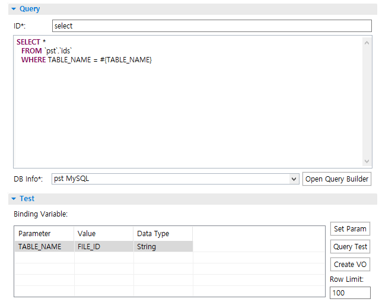

6. SqlMap Editor의 Test 탭에서 "Binding Variables" 목록 우측에 있는 "Test Query" 버튼을 누르면 하단에 Result View가 자동으로 보이면서 쿼리결과를 보여준다.

   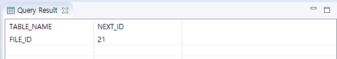

7. "Binding Variables" 목록 우측에 있는 Row Limit 항목을 사용하여 결과 행수를 제한할 수도 있다.

**바인더 변수에 설정 가능한 데이터 타입들**

| 타입 | 설명 |
| ---- | ---- |
| String | 문자열 표현. |
| Byte | byte값 표현. |
| Integer | 정수값 표현. 범위는 -2<sup>31</sup> ~ 2<sup>31</sup>-1 이다. |
| Long | 정수값 표현. 범위는 -2<sup>63</sup> ~ 2<sup>63</sup>-1 이다. |
| Float | 부동소수값을 표현. 범위는 2<sup>-149</sup> ~ (2-2<sup>-23</sup>) · 2<sup>127</sup> 이다. |
| Double | 부동소수값을 표현. 범위는 2<sup>-1074</sup> ~ (2-2<sup>-52</sup>) · 2<sup>1023</sup> 이다. |
| BigDecimal | 수를 표현. 범위는 unscaledValue × 10<sup>-scale</sup> 이다. |

※ 위에서 제공되는 타입과 대응되는 Database의 데이터 타입은 각 Vendor에서 제공하는 문서를 참조

**테스트 가능한 SQL** ("?" 바인딩 변수 테스트 불가)

* **CDATA 사용**

  ```xml
  <![CDATA[
  SELECT *
  FROM PERSON
  WHERE AGE > #{value}
  ]]>
  ```

* **간단한 동적 SQL요소**: `#{바인딩변수}`

### 신규 ResultMap 생성

1. Mapper Editor 화면 중 좌측에 있는 Mapper Tree에서 마우스 오른쪽 키를 누르면 context menu가 나타난다.
2. context menu에서 "Add ResultMap"을 선택한다.
3. 신규로 생성한 ResultMap 편집화면이 Mapper Tree 우측에 나타난다.
4. ResultMap ID를 수정하거나, ResultMap Type를 지정할 수 있다. ResultMap Type이 기본형인 경우 선택항목에서 선택이 가능하다. 기본형이 아닌 경우 "Browse" 버튼을 사용하여 해당 클래스를 검색할 수 있으며 기존에 없는 경우에는 "Type *"를 눌러 신규로 클래스를 생성해야 한다.
5. Property를 추가하려면 Property 목록 우측에 있는 "Add"버튼을 사용하여 추가 Property 값을 입력할 수 있다.
6. Property를 삭제하려면 Property 목록에서 삭제할 Property 항목을 선택하고 우측에 있는 "Remove"버튼을 사용하여 삭제한다.

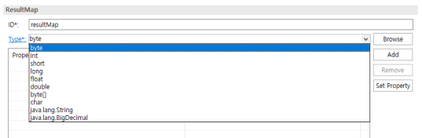

### Mapper.XML 소스 직접 수정하기

1. Mapper Editor 하단에 있는 "Mapper" 탭 오른쪽에 있는 "화일명.XML" 탭을 클릭하면 사용자가 XML 소스를 직접 수정할 수 있다.
2. 이 경우 Mapper Outline이 자동으로 Open되면서 현재 작성중인 Mapper Tree를 보여주어 사용자의 XML 작성을 도와준다.

   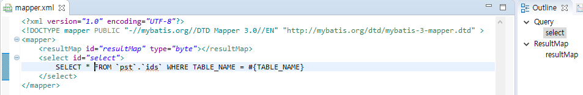