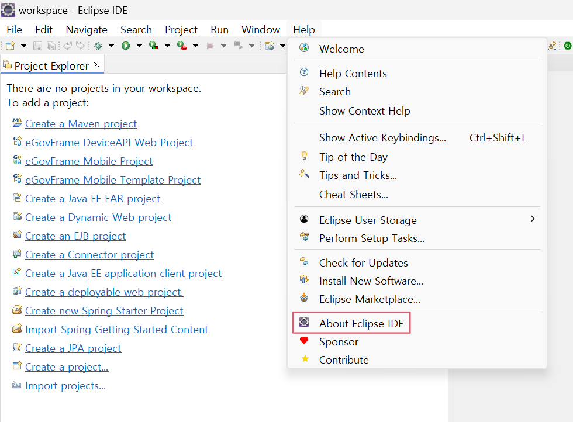
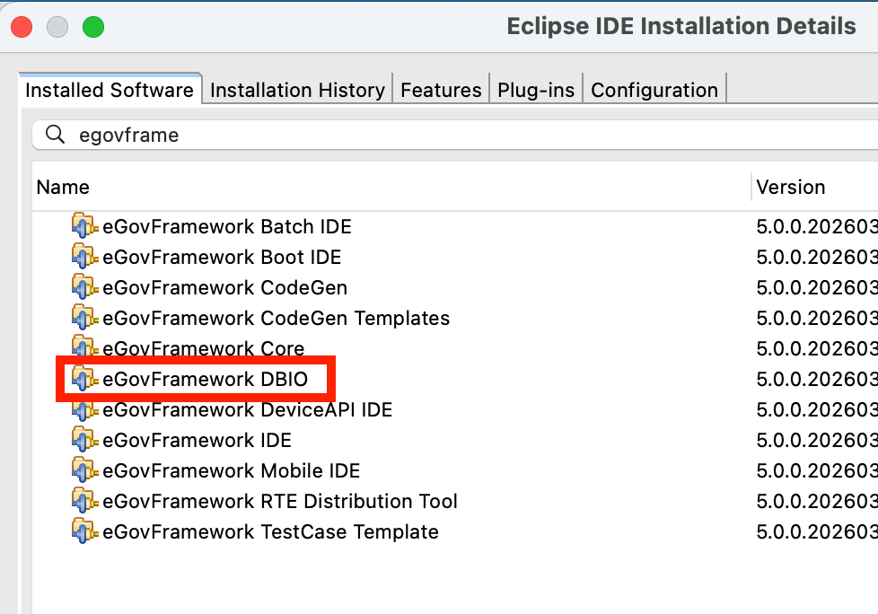

# DBIO Editor

## 개요

DBIO는 DataBase Input/Output의 약자로 개발환경에서 제공하는 데이터베이스 접근에 관한 표준적인 방법이다.
데이터베이스를 쉽고 일관된 API로 접근할 수 있도록 해주며 업무컴포넌트 개발 시에 데이터베이스 벤더에 관계없이 코딩할 수 있도록 해준다.
eGovFrame의 DBIO Editor는 DBIO를 쉽게 가공할 수 있도록 유용한 기능을 제공한다.

주요기능은 다음과 같다.

* **SQL MAP Config File 편집기** : DB 접속정보와 SQL Map File 목록 정보를 편집하는 기능이다.
* **SQL MAP File 편집기** : Query정보, Parameter와 Result의 처리방법을 편집하는 기능이다.
* **Data Source Explorer** : Database Source를 설정하고, Data Source 내의 하위 객체를 조회할 수 있는 기능이다.
* **DBIO Search View** : SQL Map 파일 내에 있는 Query Id를 검색하는 기능이다.

## 환경설정

사용자가 DBIO Editor를 사용하기 위해서는 사용자의 eclipse 개발환경에 eGovFrame DBIO 모듈이 설치되어 있어야 한다. 설치확인 방법은 다음과 같다.

1. 사용자의 eclipse 개발환경에서 메뉴 > **Help** > **About Eclipse IDE**를 클릭한다.

   

2. **Installation Details**를 클릭한다.

   

3. "Installed Software" 탭에서 "eGovframe"을 검색하여 "eGovframework DBIO"을 확인한다.

   

4. 설치가 되어있지 않는 경우 [eGovFrame 플러그인 설치](../install-guide/implementation-tool-manual-install.md)를 통하여 플러그인을 설치한다.

   ✔ eGovframework 플러그인은 서로 디펜던시(Dependency)가 존재하여 모두 설치를 권장한다.