# Local Debug

## 개요

로컬 디버거는 프로그램과 동일한 시스템에서 수행 중인 프로그램을 디버깅할 수 있도록 다음과 같은 기능을 제공한다.

### 중단점(Breakpoint) 설정

Debug View를 통해 코드를 집중적 분석하기 위해 Break point를 설정하도록 기능을 지원한다.

### 스텝단위 디버깅

프로그램을 한 스텝씩 진행하면서 프로그램의 실행흐름과 내부 상태를 확인할 수 있다.

### 스탭 필터링

스탭 필터 기능을 통해 특정 메소드 내부로 들어가지 않는 기능을 제공한다.

### Evaluating_Expressions

수행 중인 프로그램을 중지시키지 않고 상태를 확인할 수 있는 기능을 제공한다.

### Variables View

프로그램의 진행 중인 변수의 값을 확인하도록 지원한다.

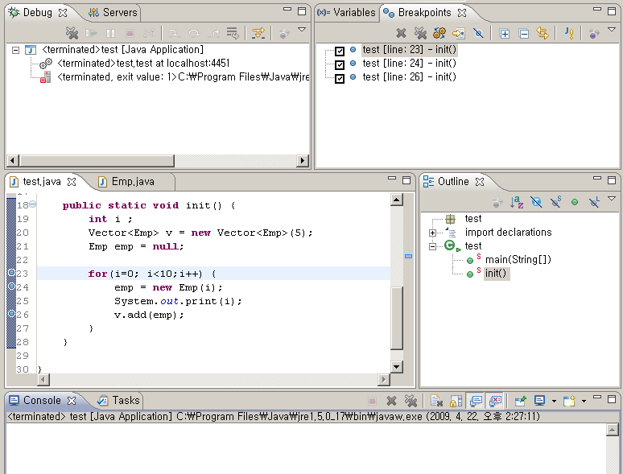

## 사용법

### 중단점(Breakpoint) 설정

디버깅 중 프로그램의 의심되는 부분을 집중적으로 분석하기 위해 Break point를 설정해 디버깅 포인트를 지정한 부분을 하이라이트 한다.

#### Breakpoint 추가/삭제

에디터의 왼쪽에 있는 Marker bar를 더블클릭 하거나 팝업 메뉴를 통해 Toggle Breakpoint를 선택하여 추가한다.

#### Breakpoint 활성화/비활성화

Marker bar에서 팝업 메뉴를 통해 Disable Breakpoint 를 선택하면 비활성화되어 특정 Breakpoint에서 실행을 멈추지 않고 수행하거나 Breakpoint를 삭제하지 않아도 된다.

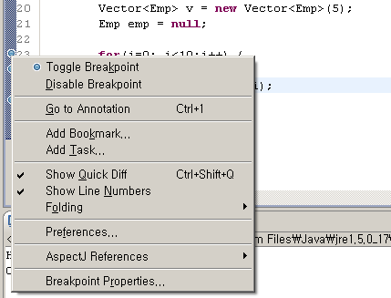

#### Breakpoints View

워크스페이스에서 설정한 모든 Breakpoint를 View를 통해 보여주어 관리 편의성을 제공한다.

#### Hit Count

특정 횟수에 도달한 경우에 멈추게 정의하여 프로그램을 멈추도록 지원한다.

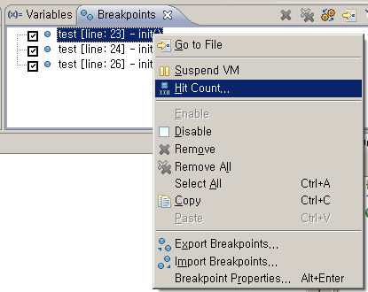

### 스텝단위 디버깅

디버깅 중 프로그램의 의심되는 부분을 집중적으로 분석하기 위해 Break point를 설정해 디버깅 포인트를 지정한 부분을 하이라이트 한다.

Debug View의 Toolbar에서

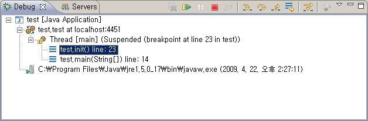

#### Step Into(F5)

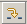

프로그램을 한 스텝 진행하되, Method 호출부라면 실행 코드를 Method 안으로 옮긴다. 호출하는 Method 내부 동작을 확인할 때 사용한다.

#### Step Over(F6)

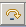

Method 호출부라도 Method 안으로 들어가지 않고 현재 코드에서 한 스텝식 진행한다. 호출하는 Method 내부 동작엔 관심이 없고, 현재 코드 블록에 집중할 때 사용한다.

#### Step Return(F7)

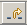

현재의 Method에서 리턴 후, Method 호출부에서 다시 멈춘다.

#### Resume(F5)

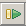

멈춰있던 쓰레드를 다시 진행한다. 다음 Breakpoint 시점까지 진행한다.

#### Suspend

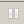

Dubug View에서 선택한(실행 중이던) 쓰레드를 멈춘다. 이렇게 멈춘 경우 멈춘 쓰레드의 현재 호출 스택이 표시되고 Variables View에 최상위 스택 프레임에서 볼 수 있는 변수들이 보여진다.

#### Drop to Frame

선택한 스택 프레임의 첫행으로 실행 포인트를 옮긴다. 특정 메소드를 수행 중 그 메소드의 처음부터 다시 디버깅 수행할 때 사용한다.

#### Terminate

디버깅 중인 프로그램을 종료한다.

### 스탭 필터링

스탭 필터링 기능을 통해 필터링 대상 프로그램의 경우 Step Over와 같이 동작하고, 필터링 대상이 아니면 Step Into와 같이 동작한다.
Debug View의 Use Step Filters 버튼을 눌러 활성화 시킬 수 있다.

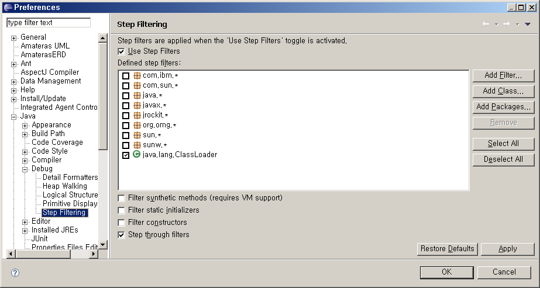

#### Filter synthetic methods

모든 synthetic method를 필터링한다.
synthetic method는 어떤 클래스를 컴파일할 때 언어 스펙을 만족시키기 위해 컴파일러가 임의로 정의해 바이트 코드에 추가한 method를 의미한다. 이런 method는 일반적으로 Application 프로그래머가 디버깅할 필요가 없다.

#### Filter static initializers

모든 클래스의 정적 초기화 블록과 정적 멤버 초기화 코드를 필터링한다.

#### Filter constructors

모든 생성자를 필터링한다.

#### Step through filters

스텝 필터링을 위한 default 옵션값으로 동작한다.

### Evaluating_Expressions

#### Display

* Display View를 사용하면 특정객체변수의 null 여부, Value, 정렬여부 등을 확인하기 위하여 굳이 프로그램 실행을 멈추고 프로그램을 수정하지 않아도 된다. Display View는 디버깅을 진행하는 도중에 특정객체의 Value 를 출력하거나 메소드를 실행하여 상태 정보들을 확인할 수 있도록 도와준다.

1. 스텝단위 진행 또는 BreakPoint 설정 등을 통해 원하는 위치까지 프로그램을 실행한다.
2. 메뉴바에서 Window > Show View > Display를 선택하면 Display View가 나타난다.
3. Display View에서 상태를 확인할 객체명 또는 메소드를 입력하고 입력한 텍스트를 블럭지정한다.
4. Display View 오른쪽 상단에 있는 "Display Result Evaluating Selected Text" 버튼을 눌러 값을 확인한다.

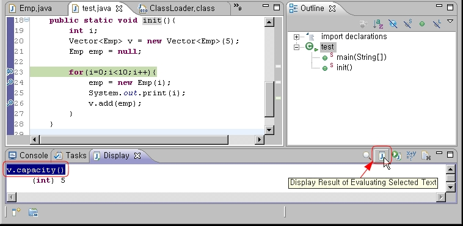

#### Inspect

* Display View는 결과값이 항상 문자열로만 표시되는 단점이 있다. Inspect 기능을 사용하면 객체변수를 좀 더 자세히 확인할 수 있다.

1. 자바 소스 에디터 또는 Display 뷰 상에서 객체를 선택한다.
2. 마우스 오른쪽 버튼을 눌러 Context 메뉴가 나오면 Inspect 를 선택한다. (또는 단축키 Ctrl+Shift+I)

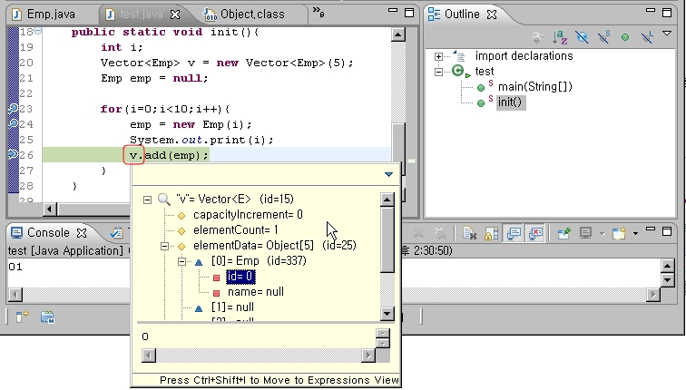

#### Watch

* 스텝단위 진행을 하면서 특정객체변수의 값이나 임의의 수식 결과를 지속적으로 평가할 때 Watch 기능을 사용할 수 있다. 해당 수식이 이미 변수에 저장되어 사용되고 있다면 그 변수를 Variables 뷰와는 달리 특정 변수에 대입하지 않고도 임의의 수식을 작성하여, 복잡한 수식 중 일부분의 값이 어떻게 변하는지 추적할 수 있다는 장점이 있다.

1. 에디터 또는 display 뷰에서 추적할 수식을 선택한다.
2. 마우스 오른쪽 버튼을 눌러 Context 메뉴가 나오면 Watch를 선택한다.
3. Expressions 뷰에 Watch 항목이 추가된다.
4. Expressions 뷰의 Context 메뉴에서 "add Watch Expression..." 을 누르면 임의의 수식을 작성하여 변화를 추적할 수도 있다.

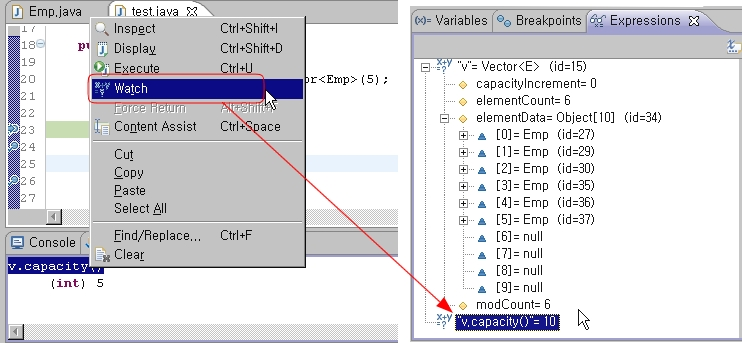

Watch 대상 지정

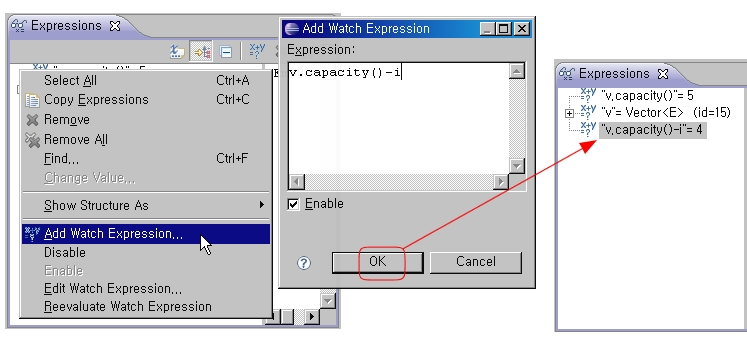

Expressions 뷰에 임의의 수식 추가하기

#### 논리적 구조 보기

* 논리적 구조 보기를 이용하면 해당 객체를 좀더 컴팩트하고 의미 있는 형태로 볼 수 있다. 뷰 툴바에 있는 Show Logical Structure 버튼을 누르면 알고자 하는 데이터 객체의 목록만 표시된다.

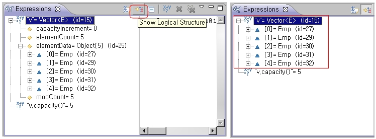

#### 디테일 포맷터

* 디테일 포맷터는 원하는 타입에 대해 디테일 패널에 표시할 내용을 얻는 방법을 지정하는 것으로, 별도로 지정한 디테일 포맷터가 없는 경우에는 객체의 toString() 메서드가 사용된다. 디테일 포맷터를 지정하려면 Expressions 뷰에서 수식을 선택한 다음 컨텍스트 메뉴에서 New Detail Formatter를 선택한다. 그 후 다이얼로그에 객체를 원하는 형태로 표현하도록 수식을 입력하면 된다.

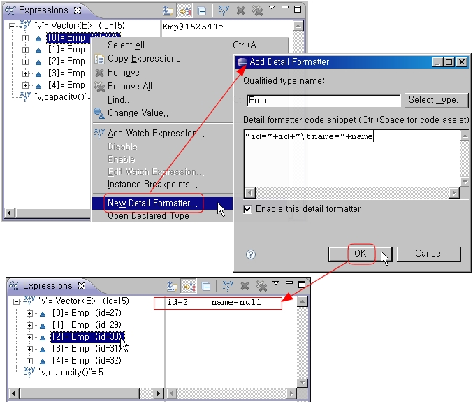

#### 변수 값 수정하기

* 디버깅하는 도중에 사용자가 변수값을 임의의 값으로 수정하여 테스트할 수 있다.

1. Variable 뷰에서 특정 변수 값을 선택한다.
2. 컨텍스트 메뉴에서 Change Value를 선택하고 임의의 값을 입력한다.

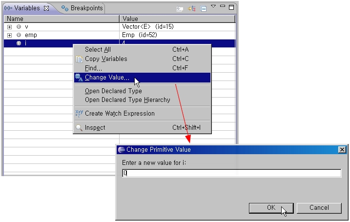

#### Hot Code Replace

* 디버깅하는 도중에도 코드를 수정하여 컴파일한 결과를 반영할 수 있는데, 이를 Hot Code Replace라 한다. 프로그램을 다시 실행할 필요 없이 컴파일 결과를 바로 반영하여 디버깅할 수 있으므로 편리하다. 자바 소스 편집기에서 코드를 수정한 다음 컨트롤+S를 눌러 저장하면 컴파일 결과가 바로 실행중인 프로그램에 반영된다. 단, 특정 멤버 변수나 메소드를 새로 추가한 경우에는 Hot Code Replace가 적용되지 않는다.

#### Drop to Frame

* 디버깅을 하면서 스텝 단위로 코드를 진행하다가 Drop to Frame 기능을 이용해 메서드의 처음 시작 부분으로 되돌아 갈 수 있다.(단, 버전 1.4 이상의 VM 에서 디버깅할 때만 사용가능)

1. Debug 뷰에서 다시 시작하고 싶은 메서드에 대응되는 스택 프레임을 선택한다.
2. 뷰 툴바에서 Drop to Frame 버튼을 누르거나 컨텍스트 메뉴에서 Drop to Frame 을 선택한다.
3. 실행 포인트가 해당 메서드의 첫 행으로 이동한다.

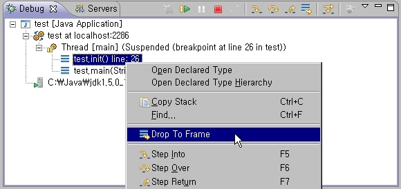

### Variables View

Variables View를 통해 메소드에서 사용 중인 변수값의 상태를 확인할 수 있는 기능을 지원한다.

#### Variables View 표시

Debug Perspective 에서 Variables View를 통해 변수 값을 확인할 수 있다.

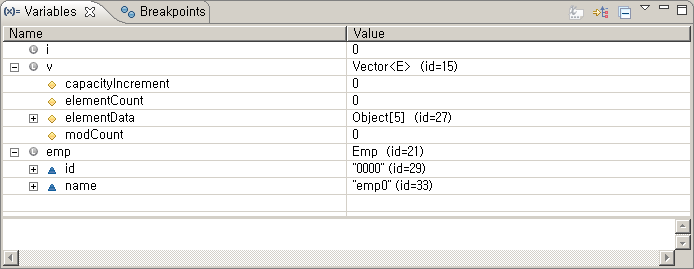

### Sample

다음에 첨부된 Java 소스를 사용하여 위의 디버깅 방법을 테스트할 수 있다.

## 참고자료

* Eclipse Help - Java development user guide
* http://help.eclipse.org/help32/topic/org.eclipse.jdt.doc.user/concepts/clocdbug.htm