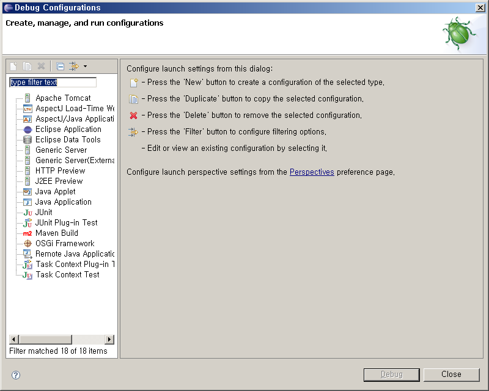
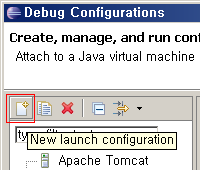
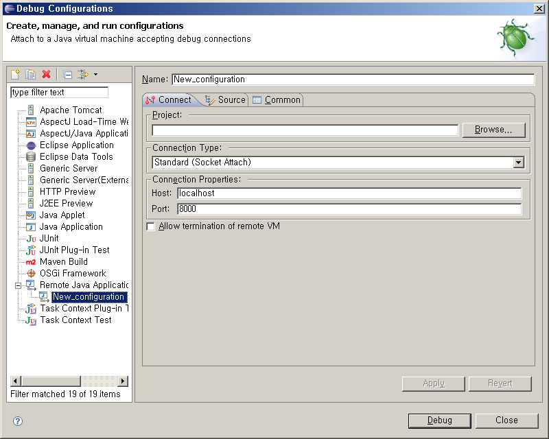
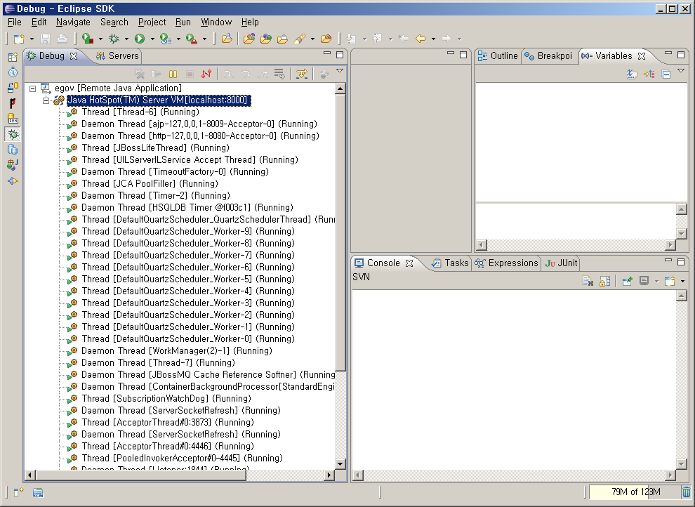

# Remote Debug

## 개요

원격 컴퓨터의 WAS(Jboss, JEUS, WebLogic)에서 실행되는 어플리케이션에 대한 디버깅 기능을 제공한다.

## 설명

Java 디버거의 클라이언트/서버 디자인을 사용하면 네트워크에 있는 컴퓨터에서 Java 프로그램을 실행하고 플랫폼을 실행하는 워크스테이션에서 이 프로그램을 디버그 할 수 있다.

참고 : 원격 디버깅을 사용하려면 이 기능을 지원하는 JVM을 사용하고 있어야 합니다.

### 디버깅 절차

1. Java 프로그램 빌드
2. Java 프로그램 원격 컴퓨터에 Deploy
3. 원격 컴퓨터에 JVM 옵션 설정 후 서버 구동
4. 워크스테이션에서 원격 컴퓨터의 주소 및 포트를 지정하여 디버깅

## 환경설정

원격 디버깅을 위해서는 원격 컴퓨터의 WAS 서버 시작시 JVM 옵션에 다음과 같은 내용을 추가해야 한다.

```
-Xdebug -Xrunjdwp:transport=dt_socket,address=8000,server=y,suspend=n
```

### Jboss

run 배치 스크립트 파일의 **JAVA_OPTS**변수에 위 옵션을 추가한다.

```
set JAVA_OPTS=-Xdebug 
  -Xrunjdwp:transport=dt_socket,address=8000,server=y,suspend=n 
  %JAVA_OPTS%
```

### JEUS

JEUSMain.xml의 컨테이너 설정의 **command-option**에 아래 부분을 추가한다.

```
-Xdebug -Xnoagent 
  -Xrunjdwp:transport=dt_socket,address=8000,server=y,suspend=n 
  -server
```

### Weblogic

startWebLogic 배치 스크립트 파일의 **JAVA_OPTS**변수에 위 옵션을 다음과 같이 추가한다.

```
set JAVA_OPTS= -Xdebug -Xnoagent 
  -Xrunjdwp:transport=dt_socket,address=8000,server=y,suspend=n 
  %JAVA_OPTS%
```

위와 같이 지정하면 8000 포트를 이용하여 원격 디버깅이 가능하도록 지원하겠다는 의미이다.

## 사용법

원격 Java 응용프로그램 실행 구성을 작성하려면 다음을 수행한다.

* Workbench 메뉴 표시줄에서 **Run** > **Debug Configurations...**을 선택하여 실행 구성 대화 상자를 표시한다.

  

* 왼쪽 구성 유형 목록에서 **Remote Java Application**을 선택한다.

* **New launch Configuration** 도구 모음 단추를 클릭한다. 새 원격 실행 구성이 작성되고 **Connect**, **Source**, **Common**의 세가지 탭이 표시된다.

  

  

* 연결 탭의 프로젝트 필드에서 실행의 참조(소스 찾아보기용)로 사용할 프로젝트를 입력하거나 찾아서 선택한다.

* 연결 탭의 호스트 필드에서 Java 프로그램이 실행될 호스트의 IP 주소 또는 도메인 이름을 입력한다. 프로그램이 Workbench와 동일한 시스템에서 실행되고 있으면 localhost를 입력한다.

* 연결 탭의 포트 필드에서 원격 VM이 연결을 허용할 포트를 입력한다.

* 원격 VM 종료 허용 플래그는 디버거에서 종료 명령을 사용 할 수 있는지 여부를 토글하여 판별합니다. 연결 중인 VM을 종료할 수 있도록 하려면 이 옵션을 선택한다.

* 디버그를 클릭한다.

* 디버그 퍼스펙트브로 변환하면 원격 컴퓨터의 Thread정보가 표시 된다.

  

* 디버깅 할 프로그램의 특정 위치에 중단점을 설정 한 후 해당 프로그램이 실행되도록 웹브라우저를 이용하여 서비스를 호출한다.

## 참고자료

* http://help.eclipse.org/help32/topic/org.eclipse.jdt.doc.user/concepts/cremdbug.htm