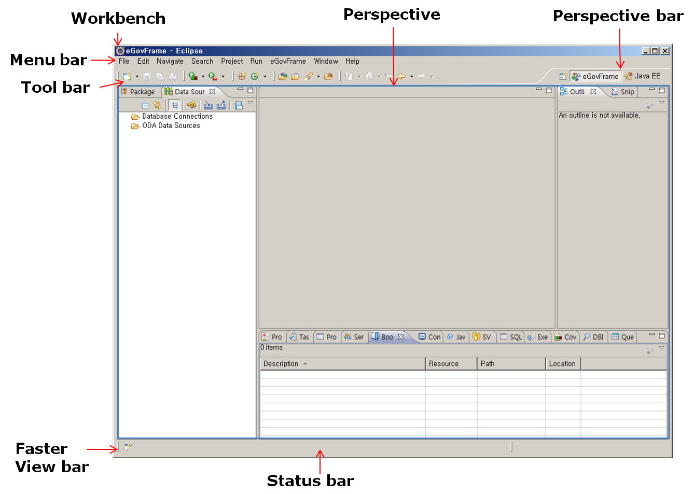
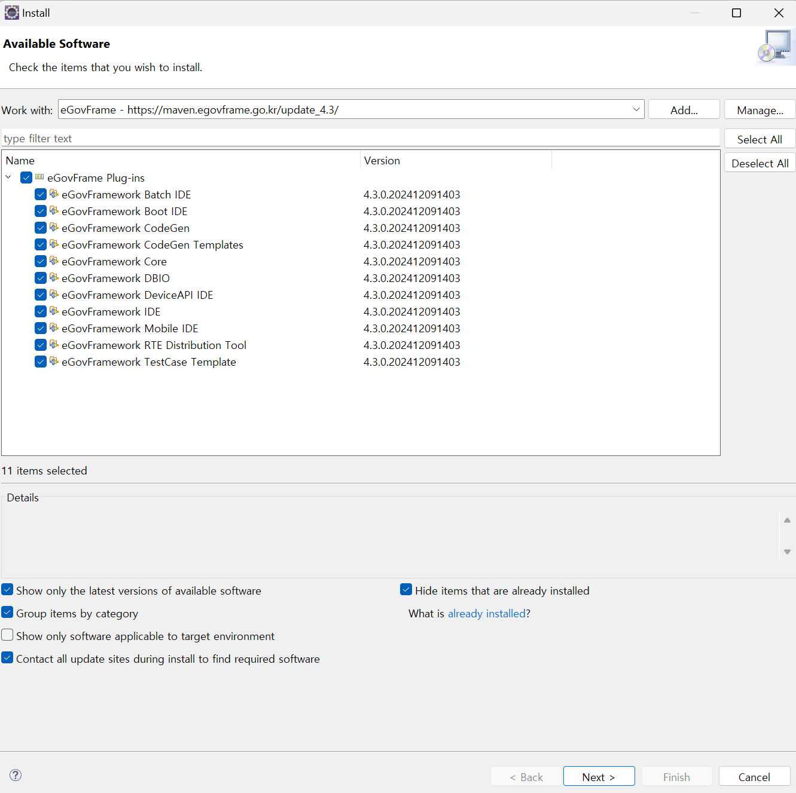

## 개요

eGovFrame Editor는 전자정부 개발 도구 통합을 위한 개방형 플랫폼으로, IDE(Integrated Development Environment) 기반으로 Edit 기능을 제공한다.

## 설명

eGovFrame Editor에서 기본 eclipse tool에서 제공하는 Editor외에 다음과 같은 Edit 기능을 제공한다.

* UML Editor : UML 작성도구로써 Activity/Class/Sequence/UseCase Diagram 작성을 지원
* ERD Editor : 통합개발환경에서 ER 의 논리모델과 물리모델 작성을 지원하는 Editor
* DBIO Editor :DataBase 접근에 관한 표준적인 방법을 제공하는 Editor
* SourceCode Editor : 자바 개발도구로써 eGovFrame기반의 어플리케이션 개발을 지원

각 editor 는 기본적으로 이클립스 워크벤치 사용자 인터페이스를 따르고 있으며 기본 주요 구성 영역은 다음과 같다.

<그림 1> eGovFrame Editor의 기본 주요 구성 영역

| 영역          | 설명                                                                                               |
| ------------- | -------------------------------------------------------------------------------------------------- |
| Workbench     | WindowEditor, Menu Bar, toolbar, shortcut bar 등의 다양한 Window와 하나 이상의 Perspective 로 구성 |
| Perspective   | View와 Content editor로 구성된 집합                                                                |
| Views         | workbench 페이지 내에서 시각적 구성 요소로서 기본 작업을 위한 지원 역할에 사용                     |
| Editor        | 한 workbench 페이지 내에서 시각적 구성 요소로서 문서 또는 데이터 변경 등의 역할에 사용             |
| Menu bar      | 일반적으로 파일, 편집, 이동, 프로젝트, 창, 도움말 수준의 메뉴가 포함                               |
| Tool bar      | 툴 실행의 편의성 제공을 위해 제공된 아이콘                                                         |
| Short cut bar | Perspective 또는 View의 바로가기 아이콘                                                            |
| Status line   | 개발자 지원을 위한 콘텐츠 정보로서 현재의 라인과 컬럼 번호 등의 글로벌 상태 표시                   |

## 업데이트

개발환경의 구현도구 최신버전을 사용하기 위해서는 포털의 Full Version을 다운 받거나 Update Site를 통해 부분 Update 를 받을 수 있다.
구현도구 내 Dependency 문제로 인해 Full Version을 다운 받아 사용하는 것을 권장하며 불가피한 경우는 Update Site를 통해 Update 를 받을 수 있다.
업데이트하는 방법은 다음과 같다.

1. 사용자의 eclipse 개발환경에서 Help > Install New Software… 를 클릭한다.
   
2. site 목록 우측에 있는 “Add…” 버튼을 클릭한다.
   
3. “Add Repository” 다이얼로그 창에 있는 Location 입력 항목에 “[https://maven.egovframe.go.kr/update_](https://maven.egovframe.go.kr/update_ "https://maven.egovframe.go.kr/update_")버전” 를 입력하고 “OK” 버튼을 클릭한다.
   
4. “Available Software” 목록에 입력한 Url 이 추가된다.
5. 입력한 Url 의 하위 트리 항목을 확장하여 필요사항을 선택한다.
6. “Available Software” 목록 하단에 있는 “Finish” 버튼을 클릭한다.
   