# ERD Editor

## 개요

통합개발환경에서 ER(Entity Relationship)의 물리모델 작성을 위한 도구로써 좌측의 툴바, 중앙의 편집화면 우측의 Outline 이 배치되어 있다.
또한 DDL 생성, 테이블 명세서 생성, Reverse engineering 등의 추가 기능도 제공된다.

타 도구간의 직접적인 호환성은 없지만 모델에 의해 생성된 DDL 이나 DB를 대상으로한 Reverse 기능을 통해 간접적인 호환성을 제공한다.

## 설명

ER Diagram Editor는 ER Diagram을 작성하기 위한 다음과 같은 기능을 제공한다.

### 툴바

Select, marquee, Table, Reference 아이콘이 제공된다.

* Select 아이콘: 편집창에 작성된 개체를 선택하여 원하는 위치에 배치할 수 있는 기능을 제공한다.
* Marquee 아이콘: 편집창에 작성된 개체를 선택하는 기능만을 제공한다.
* Table 아이콘 : Entity를 표현하기 위한 것으로 편집창에 작성 후 Logical/Physical Mode 보여주기를 선택할 수 있다.
* Reference : 편집창에서 개체간의 관계를 표현하기 위한 도구이다.

### 편집창

툴바에서 제공되는 기능을 이용하여 Entity 정의와 Entity 간의 관계를 표현할 수 있는 작업창이다.

### Outline

전체의 내용을 한눈에 확인하고 원하는 개체에 바로 접근할 수 있도록 방법을 제공한다.

* Table : 편집창에 정의된 Entity 들의 목록을 보여주고 원하는 테이블을 선택하면 편집창 위의 해당 테이블이 선택되고 더블클릭을 할 경우 해당 테이블의 속성창을 띄운다.
* Domain : 테이블 정의 시에 사용할 필드 중 공통으로 사용되어질 필드를 미리 정의할 수 있도록 한다.
* 테이블 전체보기 : 작성된 Entity 들의 배치 모습을 한눈에 볼 수 있도록 한다.

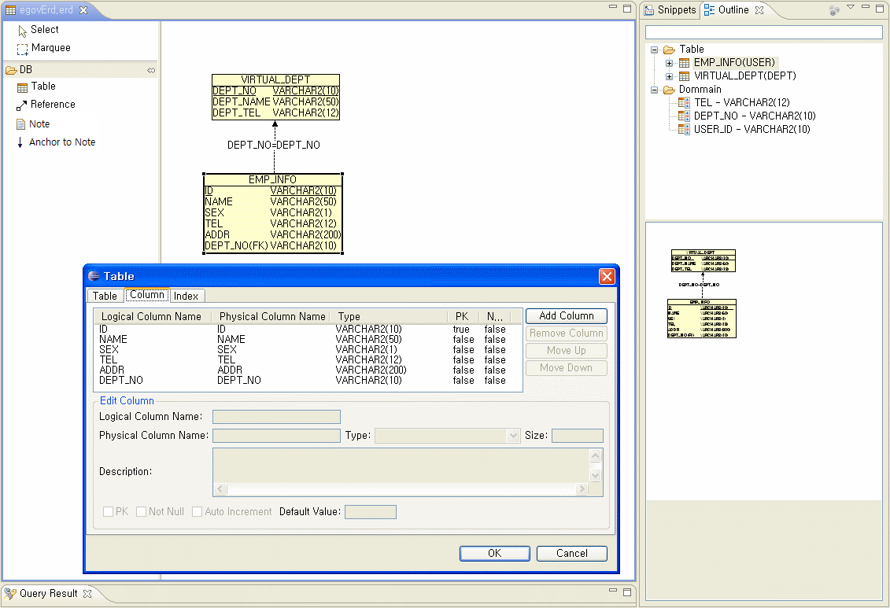

* ER Diagram Editor는 기본 ER Diagram 작성 외에 다음과 같은 기능을 제공한다.

  * Reverse engineering : Oracle, PostgreSQL, hsqldb 등의 Database로부터 테이블 Import가 가능하다.
  * DDL 생성 기능: Oracle, PostgreSQL, MySQL, hsqldb 등에 맞게 DDL 스크립트를 생성한다.
  * 테이블 명세서 Export 기능: Table Entity 에 대한 명세서를 HTML 형식으로 Export한다.

## 사용법

### ER Diagram 편집

#### ERD 파일 생성

1. eGovFrame > Design > New ER Diagram 을 선택하여 클래스 다이어그램을 생성한다.

   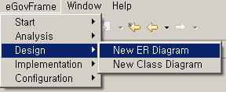

2. 파일명을 입력한다.

   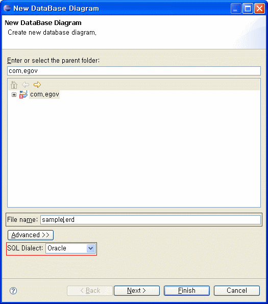

3. Database Vendor 를 선택한다. (윗그림 참조)

4. 기존 DB상의 Table 들 Import 하기 [선택사항]

   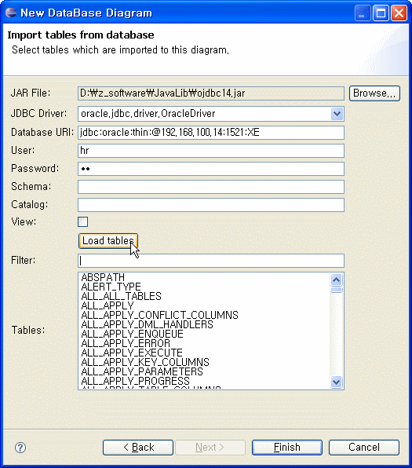

5. sample.erd 편집화면

   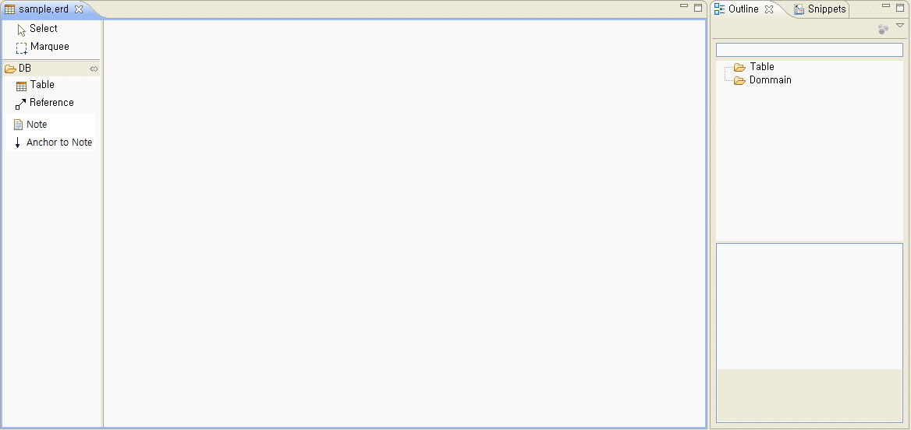

#### Domain 등록

1. 도메인 폴더 아이콘을 더블클릭하여 작성창을 띄운다.
2. [Add Domain] 버튼을 클릭한다.
3. 추가된 도메인을 선택한다.
4. 도메인 내용을 수정한다.
5. [OK]버튼을 클릭하면 도메인 폴더에 추가된 목록이 나타난다.

   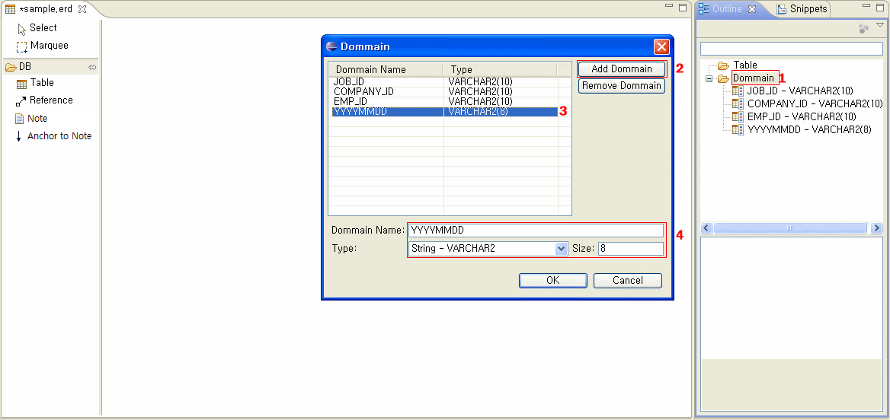

#### ER 작성

1. 툴바에서 테이블 아이콘 선택 후 편집창에 마우스를 클릭한다.

   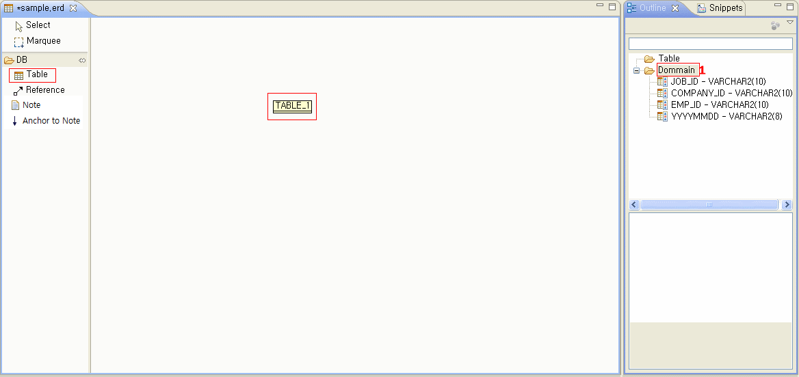

2. 만들어진 테이블 이미지에 마우스로 더블클릭하여 테이블 정의 팝업창을 띄운다.

   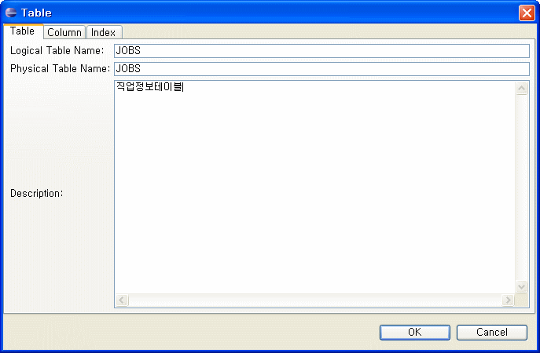

3. 테이블탭에서 테이블에 대한 이름, 설명을 입력한다.

4. 컬럼탭에서 [Add Column]을 눌러 필드정보를 추가한다. (Type으로 도메인 선택 가능)

   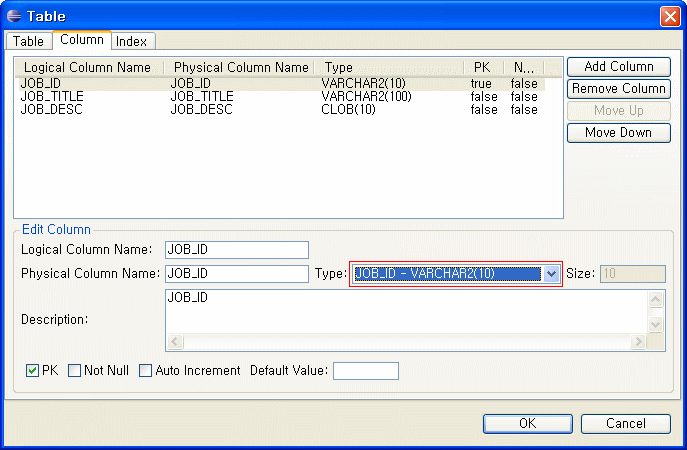

5. 인덱스탭에서 인덱스를 추가한다.

   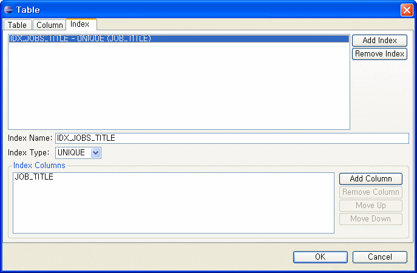

6. 테이블 정의를 완료한다.

   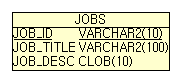

7. Reference 아이콘 선택 후 EMP 테이블에서 JOBS 테이블로 관계를 맺는다.

   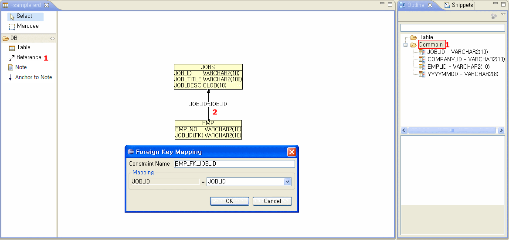

8. Reference 선을 더블클릭 후 관계정보를 수정한다.

### Reverse engineering

Oracle, PostgreSQL, MySQL, hsqldb 등의 Database로부터 테이블 Import.

1. 편집창에서 Import from Database 메뉴를 선택한다.

   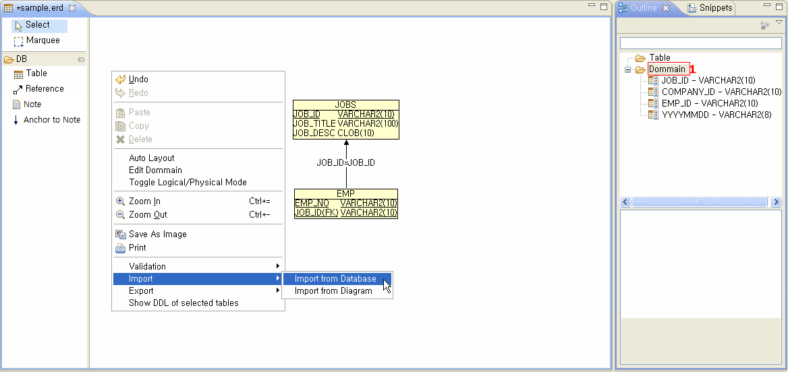

2. 팝업창의 [Browse] 버튼을 클릭하여 JDBC LIB를 선택한다.

   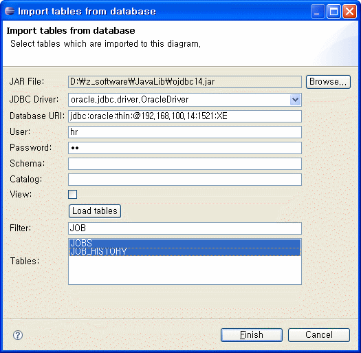

3. Database 접속정보를 입력한다.

4. [Load tables] 버튼을 클릭하여 테이블 목록을 조회한다.

5. Import 할 테이블을 선택한 후 [Finish]버튼을 클릭한다.

   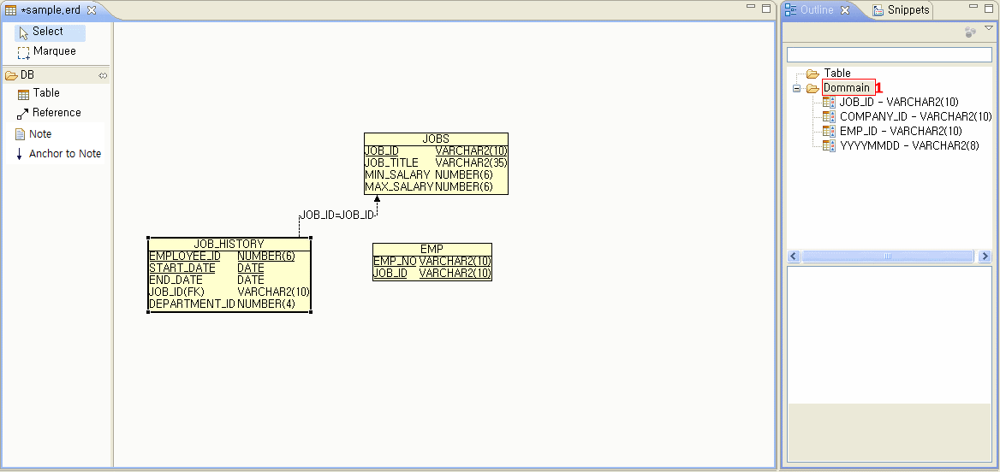

### DDL 생성 및 스키마 생성

작성된 ERD 를 이용한 DDL 생성

1. 편집창에서 DDL 메뉴를 선택한다.

   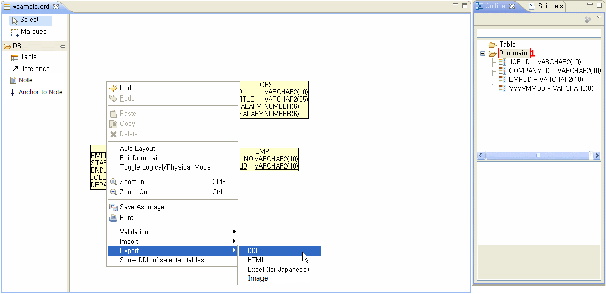

2. 생성할 DDL의 파일명 입력

   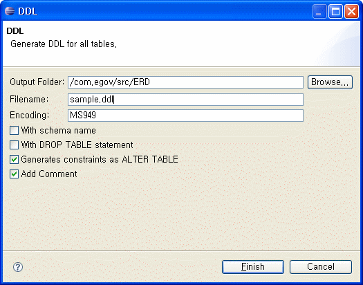

3. Package Explorer 에서 마우스로 더블클릭하여 생성된 DDL 파일 열기

   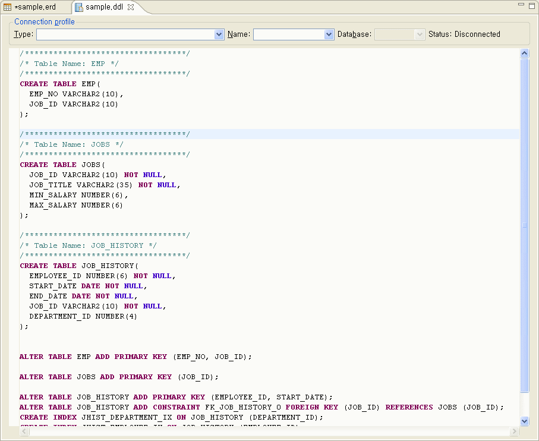

4. Database 선택하기

   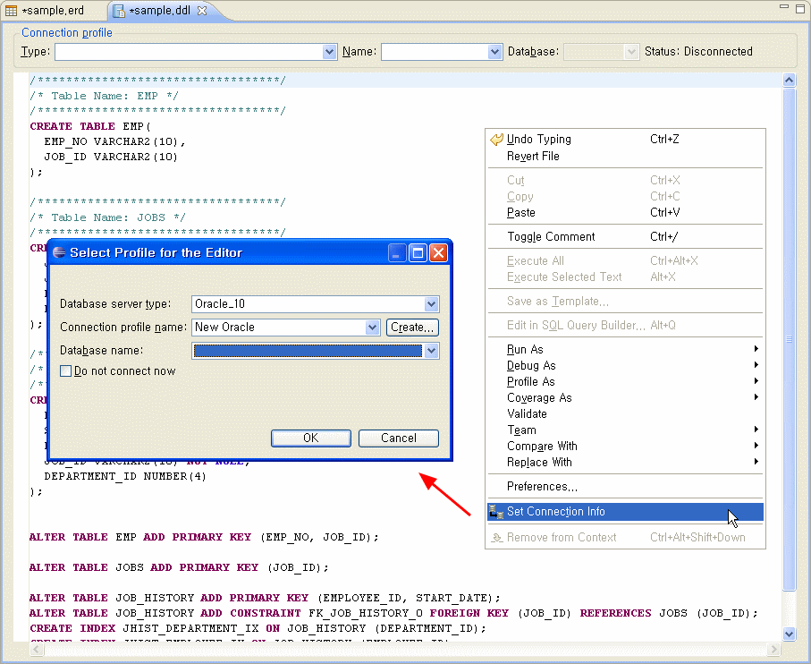

5. 스키마 생성 (선택 실행시 세미콜론 반드시 뺀다.)

   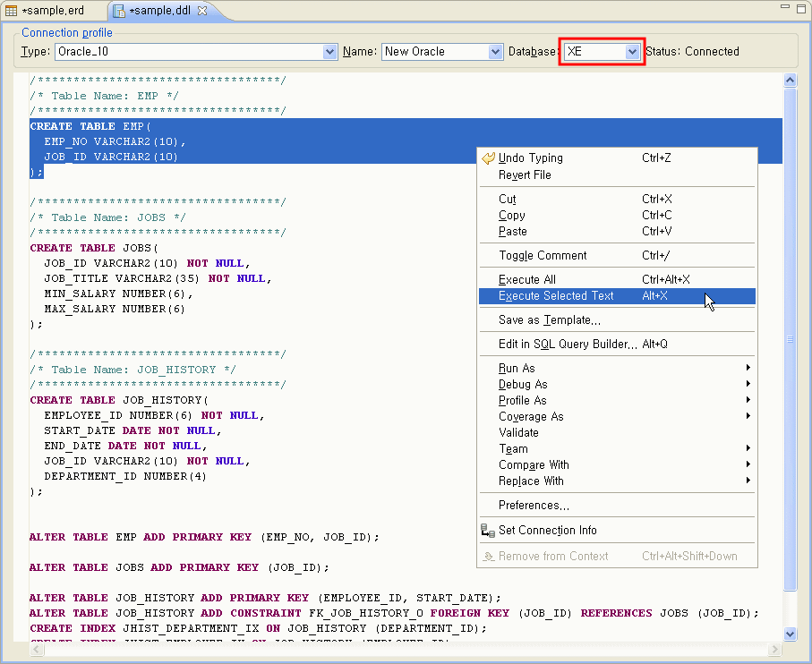

### 테이블 명세서 생성

HTML 형식으로 테이블 명세서 Export 한다.

1. 편집창의 메뉴에서 HTML 을 선택한다.

   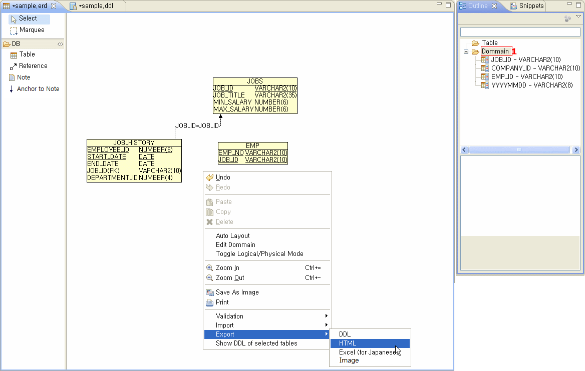

2. HTML 파일을 저장할 폴더를 선택한다.

   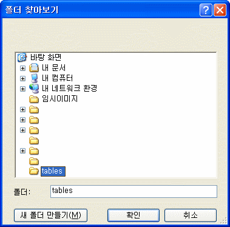

3. 생성파일 확인

   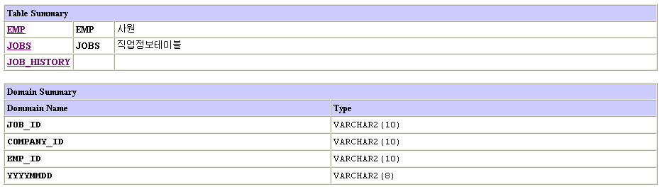

   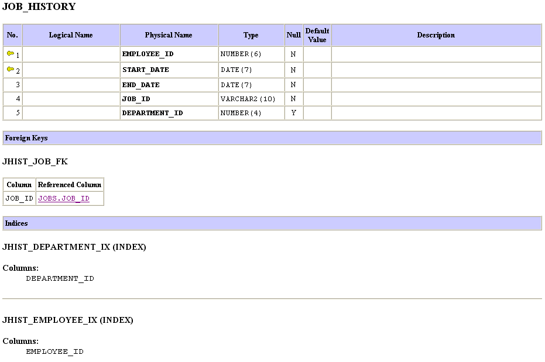

## 환경설정(설치)

전자정부에서 제공하는 개발환경을 다운받으면 이미 설치되어 있으므로 별도로 설치하지 않아도 된다.
재설치가 필요할 경우 [UML Editor 환경설정](./uml-editor.md)을 참조한다.

## 참고자료

* [AmaterasERD](https://github.com/takezoe/amateras-modeler)