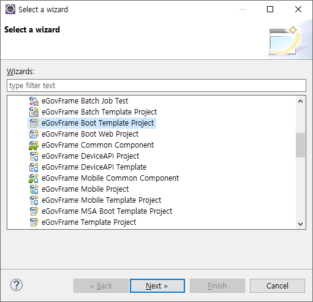
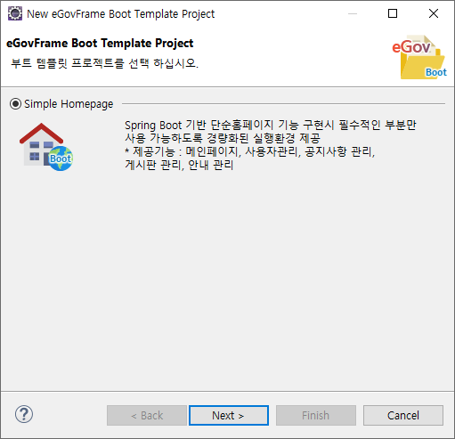
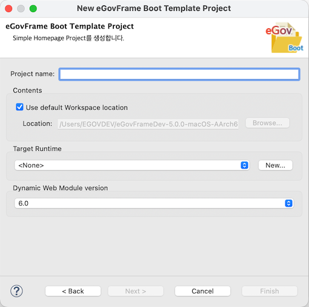
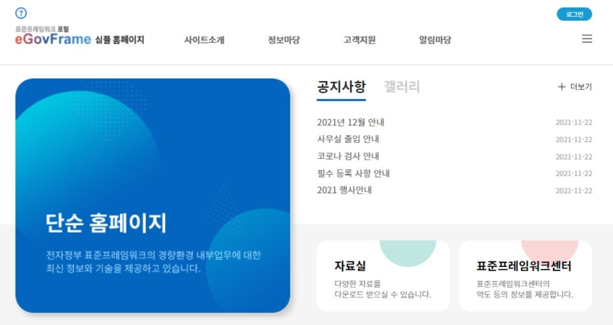

# Boot Template Project Wizard

## 개요

eGovFrame 기반의 어플리케이션 개발 시 개발자 편의성을 위하여 기본적인 코드 등을 포함하고 있는 부트 템플릿 프로젝트 자동 생성 마법사를 제공한다.

## 설명

eGovFrame기반의 부트 템플릿 프로젝트 자동 생성 마법사를 제공한다.

* Simple Homepage : 단순 홈페이지 기능 구현 시 필수적인 부분만 사용 가능하도록 경량화 된 실행환경 제공
  * 메인 페이지, 사용자 관리, 공지사항 관리, 게시판 관리, 안내 관리 기능을 제공한다.

## 사용법

1. 메뉴 표시줄에서 **File** > **New** > **eGovFrame Boot Template Project**를 선택한다. (단 eGovFrame Perspective 내에서)
   또는, **Ctrl+N** 단축키를 이용하여 새로 작성 마법사를 실행한 후 **eGovFrame** > **eGovFrame Boot Template Project**을 선택하고 **Next**를 클릭한다.

   

2. 생성하려는 Template 유형(단순 홈페이지)을 선택하고 **Next**를 클릭한다.

   

3. 프로젝트 명과 필요한 값들을 입력하고 **Finish**를 클릭한다.

   

4. 서버를 실행하여 생성한 템플릿 프로젝트를 확인한다.

   1. 단순 홈페이지

      

### 참고사항

**Create a eGovFrame Template Project 페이지**

| 옵션                           | 설명                                                                                                                                                              | 기본값  |
| ------------------------------ | ----------------------------------------------------------------------------------------------------------------------------------------------------------------- | ------- |
| Project Name                   | 새 프로젝트 이름을 입력한다.                                                                                                                                      | 공백    |
| Use default Workspace location | 체크 시 기본 작업공간에 프로젝트 명으로 프로젝트 디렉토리가 생성된다. 임의의 디렉토리 선택 시 옵션을 해제하고 **Browse** 버튼을 클릭하여 위치를 선택한다. | Checked |
| Target Runtime                 | 웹 어플리케이션을 실행할 타겟 서버를 선택한다.                                                                                                                    | \<None> |
| Dynamic Web Module Version     | 동적 웹 모듈 버젼을 선택한다.                                                                                                                                     | 6.0     |

**주의**

✔ 구동방법은 다음을 참고한다. [egovframe-template-simple-react](https://github.com/eGovFramework/egovframe-template-simple-react)