# Common Component Wizard

## 개요

개발자의 편의성을 위하여 eGovFrame기반의 웹 공통컴포넌트 254종의 설치를 돕는 생성 마법사를 제공한다.

## 설명

eGovFrame기반으로 생성한 프로젝트에 공통컴포넌트 관련 파일 복사 기능을 담고 있는 공통컴포넌트 생성 마법사를 제공한다.

## 사용법

### 공통컴포넌트 생성

#### 공통컴포넌트 생성 마법사

1. 메뉴표시줄에서 우클릭 > New > eGovFrame Web Project를 선택한다. (단 eGovFrame 퍼스펙티브 내에서)

   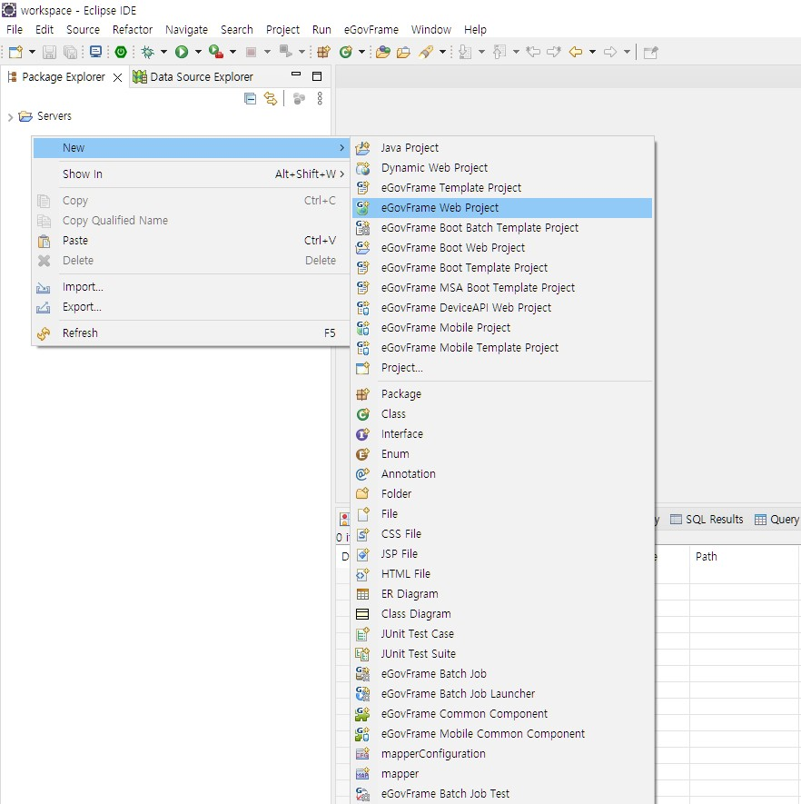

2. Project name을 입력하고, Dynamic Web Module version을 **6.0**에 맞추고, Group Id & Artifact Id를 기입한 뒤, Finish 버튼을 클릭한다.

   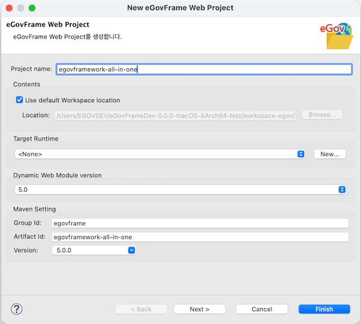

3. 만약 위에서 Finish 버튼이 아니라 Next 버튼을 클릭했다면, Generate Example 버튼을 체크하지 **않고** Finish 버튼을 클릭한다.

   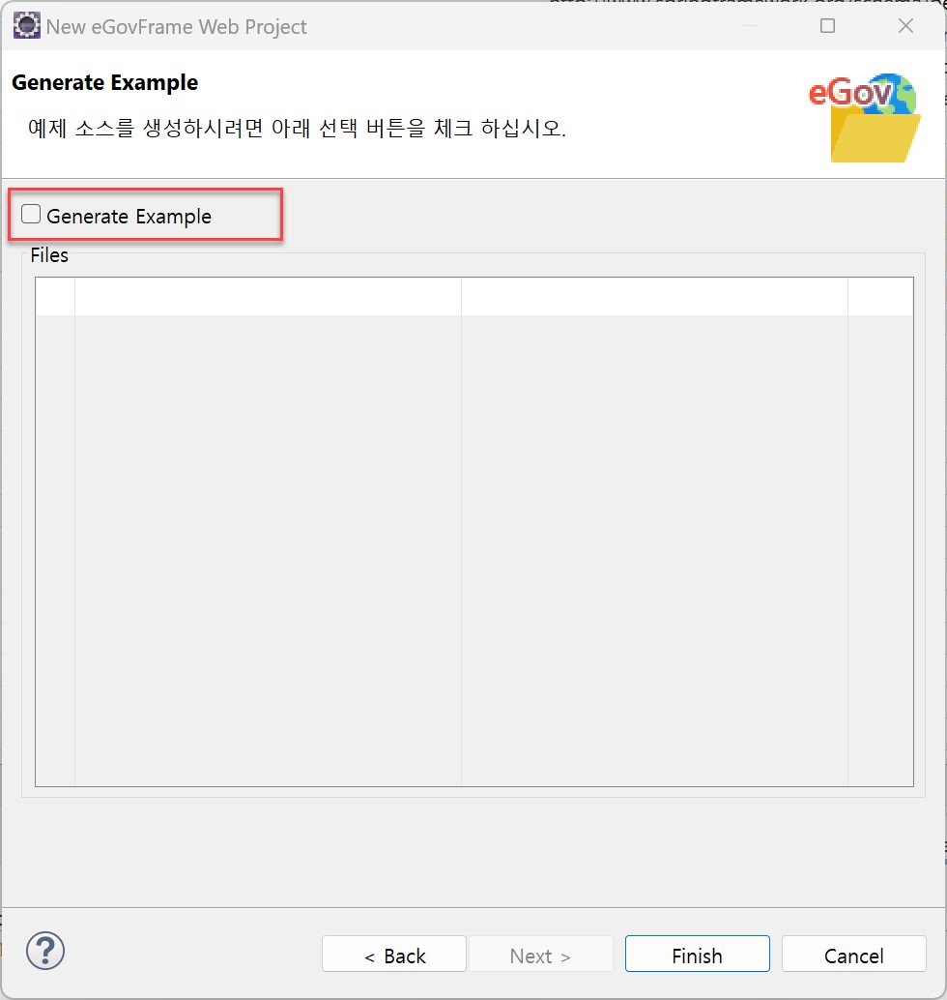

4. 메뉴 표시줄에서 File > New > eGovFrame Common Component를 선택한다.

   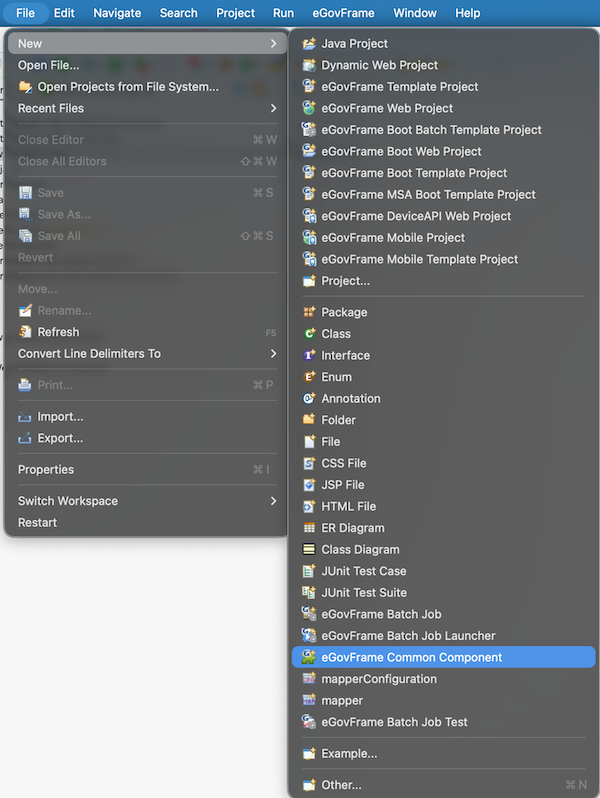

   또는 메뉴 표시줄에서 eGovFrame > Implementation > Add eGovFrame Common Component를 선택한다.

   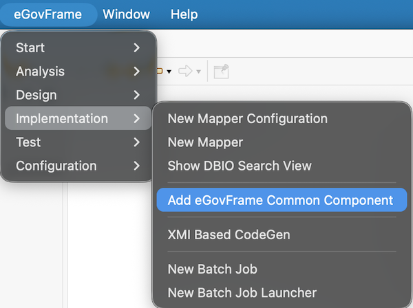

5. 앞서 생성한 프로젝트를 선택한다.

   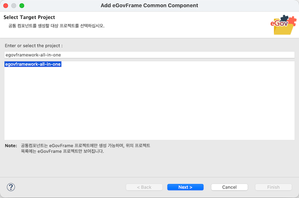

6. 공통컴포넌트 목록 중 설치하고자 하는 컴포넌트를 선택하고 Next를 클릭한다.

   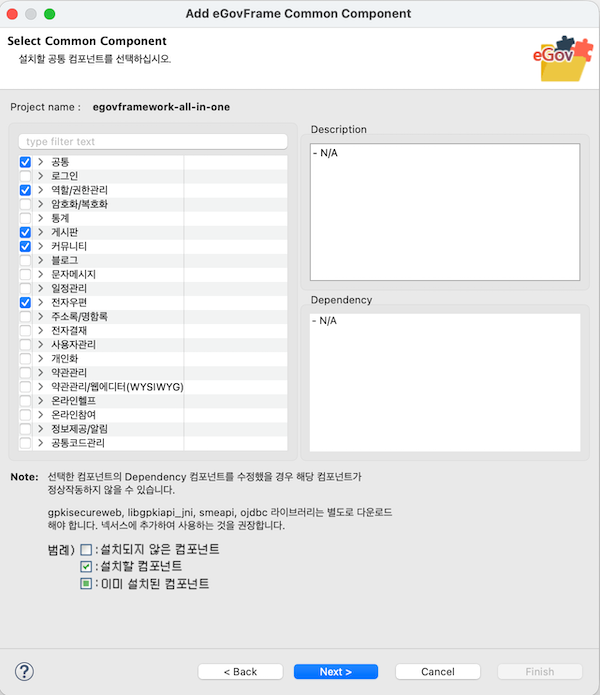

7. 선택한 컴포넌트를 확인하고 테이블 설치여부를 선택한다.
   "생성하지 않음(기본설치)"를 하는 경우 Finish가 가능하다.
   사용자 DB에 생성(사용자지정)"을 선택한 경우, DB를 선택해야 한다.

   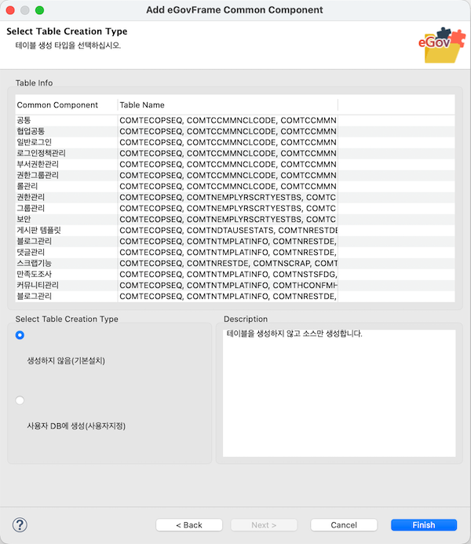

8. Data Source Explorer에 등록한 사용자의 DB 중 하나를 선택하고 Connection Test를 클릭한다.
   (이전 페이지인 Select Table Creation Type페이지에서 사용자 지정을 선택한 경우에만 가능하다)

   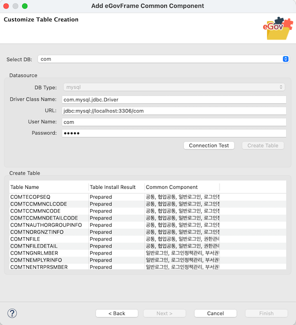

9. DB의 Connection Test가 정상적으로 종료되면 아래와 같은 메시지 창이 뜬다.

   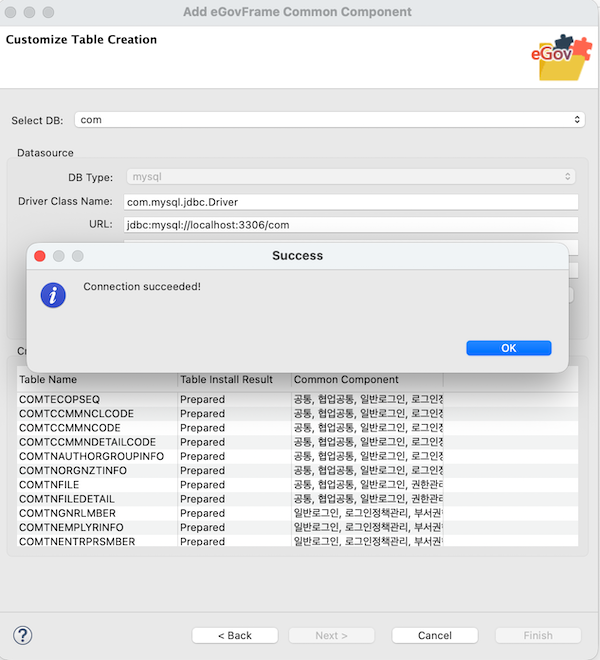

10. Connection Test 이후에 활성화된 Create Table 버튼을 클릭하여 선택한 컴포넌트의 table들을 사용자가 선택한 DB에 생성하고, Finish를 선택한다.
   (화면 하단의 Table Install Result의 상태로는 'Prepared', 'Success', 'Already Exist', 'Failed'의 4가지 상태가 존재한다.)

   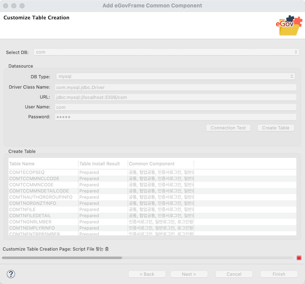

11. Table 생성이 완료되면, Finish를 선택한다.

   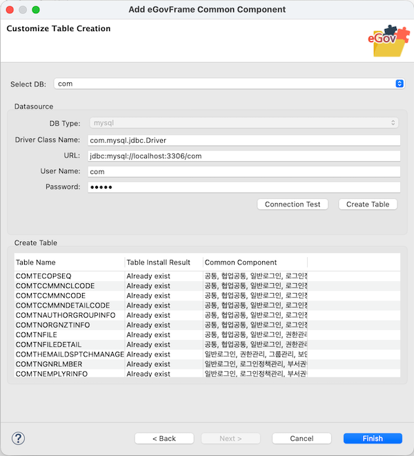

12. 프로젝트를 실행한다.

   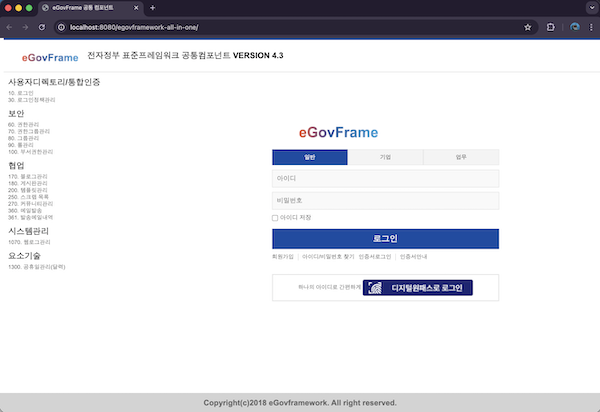

4. 포털에 접속하여 "**다운로드 > 공통컴포넌트 > 다운로드 > 공통컴포넌트 4.3.0 all-in-one 배포파일**"을 다운로드 받는다.

   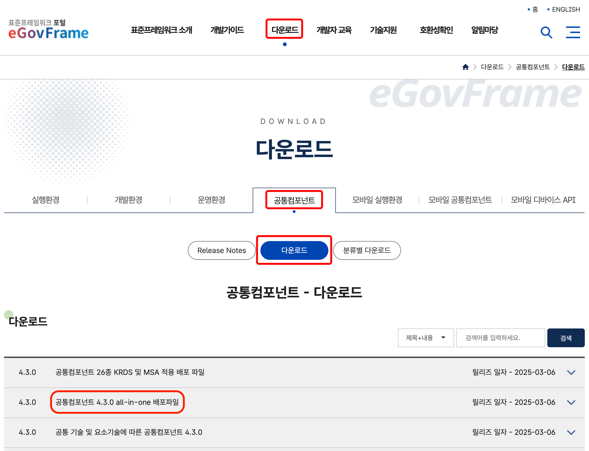

   배포파일 다운로드 창을 열고 다운로드 받는다.

   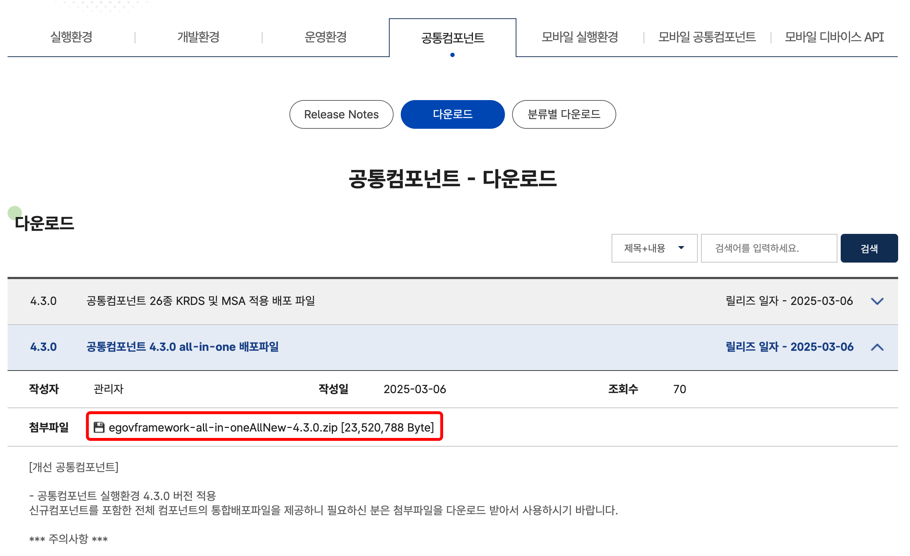

5. 다운로드 받은 배포파일의 압축을 푼다. 그리고 압축을 푼 파일들을 복사해서 이클립스의 egovframework-all-in-one 프로젝트 아래에 붙여넣는다.

   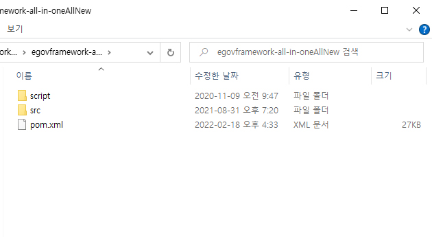

6. 프로젝트명을 마우스 우클릭하여 Maven > Update Project... > Force Update of Snapshots/Releases 체크 후 Update를 실행한다.

   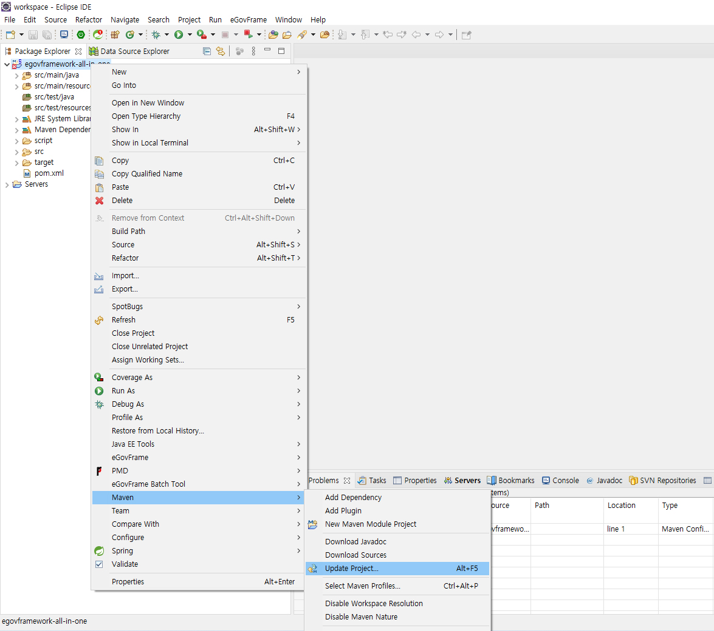

7. 프로젝트명을 마우스 우클릭하여 run as > maven install을 실행한다.

   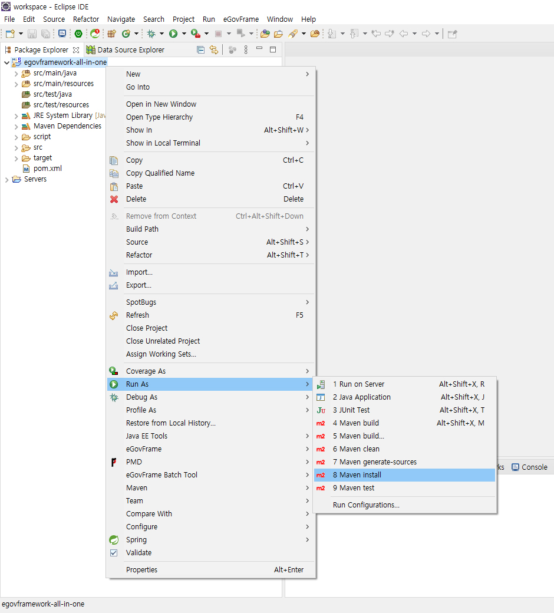

8. 프로젝트명을 마우스 우클릭하여 run as > run on server을 실행한다.

   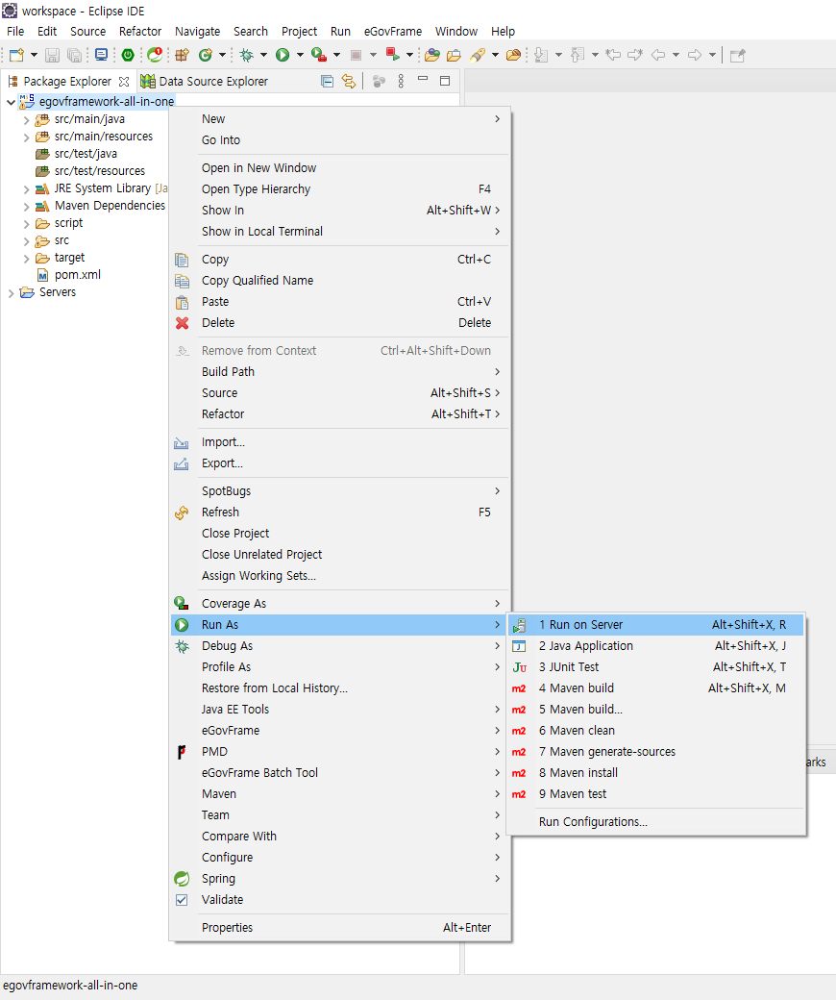

9. 공통컴포넌트를 설치한 뒤, 실행시키면 아래와 같은 창을 확인할 수 있다.

   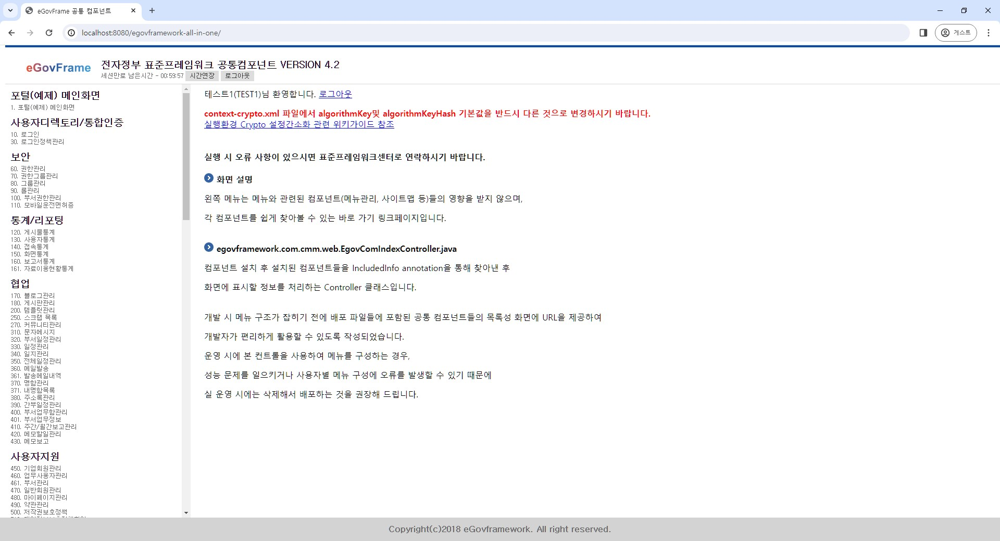

### 공통컴포넌트 생성 주의사항

1. eGovFrame기반으로 생성한 프로젝트가 없을 경우 위저드를 종료하고 프로젝트를 생성해야 한다.(eGovFrame기반의 프로젝트 생성)

2. 기본 설치 선택시 소스만 복사되고 사용자 지정 선택시 Data Source Explorer에 등록한 사용자 DB 중 하나를 선택해서 테이블을 생성해야 한다.

3. Data Source Explorer에 DB 정보를 등록하지 않았을 경우에는 위저드를 종료하고 [Data Source Explorer](./dbio-editor-data-source-explorer.md)에 DB정보를 등록해야 한다.

4. Data Source Explorer에 등록한 DB 중 전자정부 표준프레임워크가 지원하는 4가지의 DB(MySql, Oracle, Tibero, Altibase)외의 DB는 기본설치 후 사용자가 DB에 Table을 직접 생성해야 한다.

5. 템플릿은 공통컴포넌트를 사용하여 만들어졌기 때문에 템플릿 생성도구로 생성한 프로젝트 위에 공통컴포넌트를 설치하면 bean id가 중복 될 수 있다. 이때, bean id를 수정하여야 정상 구동된다.

6. 기설치된 공통컴포넌트를 재설치 할 경우 수정된 내용이 있으면 overwrite 된다.

7. 공통컴포넌트 설치 확인시 프로젝트 내의 web.xml에서 “welcome-file-list”로 설정된 jsp를 참고하여 ”/index.do”를 Controller에서 변경해주어야 한다.

8. 공통컴포넌트 설치 후 Maven install시 Fail이 될 경우 공통컴포넌트에서 사용하는 4가지의 3rd party 라이브러리에 대해서는 별도의 설치가 필요하다. (gpkisecureweb, libgpkiapi_jni, smeapi, ojdbc)

9. 공통컴포넌트 설치 후 Workspace의 .metadata 폴더에 설치한 컴포넌트에 대한 정보파일이 생성된다. 이는 로그성 파일이므로 삭제해도 무방하다.

### 공통컴포넌트 설정

#### 공통컴포넌트 설정 도구

1. 공통컴포넌트를 설치한 프로젝트 내에 위치한 "globals.properties" 파일의 정보를 바꿔야 한다. (globals.properties 파일의 위치: src/main/resources > egovframework > egovProps > globals.properties을 확인한다.) 해당 properties 파일에 수동으로 정보를 입력한다. 그리고 maven clean, maven install을 한 후 run as-run on server 를 실행한다.

   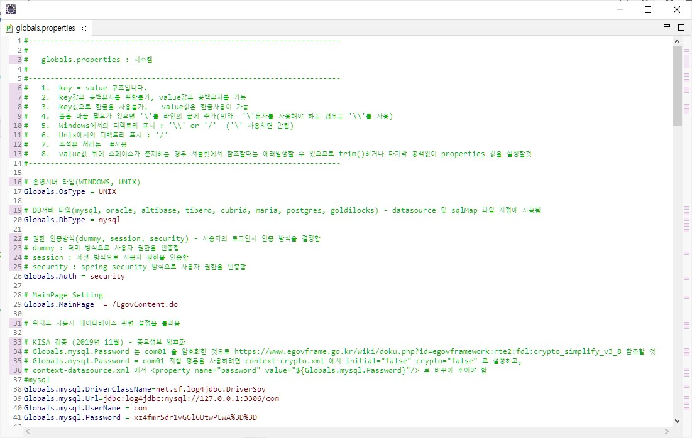