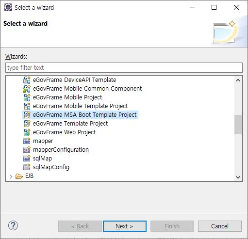
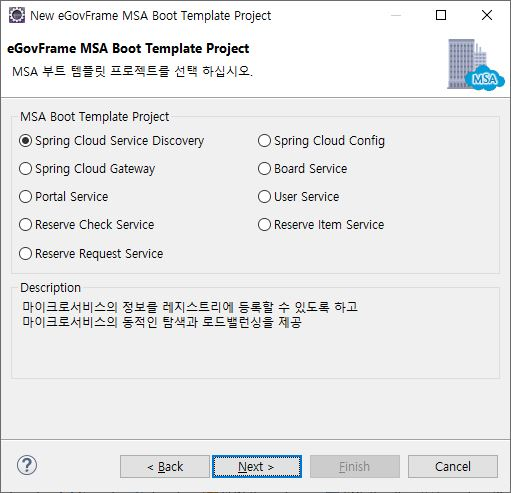
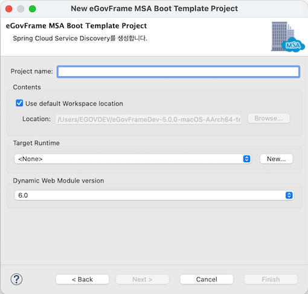

# MSA Boot Template Project Wizard

## 개요

eGovFrame 기반의 어플리케이션 개발 시 개발자 편의성을 위하여 기본적인 코드 등을 포함하고 있는 MSA 부트 템플릿 프로젝트 자동 생성 마법사를 제공한다.

## 설명

eGovFrame기반의 부트 템플릿 프로젝트 자동 생성 마법사를 제공한다.

* Spring Cloud Service Discovery : 마이크로서비스의 정보를 레지스트리에 등록할 수 있도록 하고 마이크로서비스의 동적인 탐색과 로드밸런싱을 제공
* Spring Cloud Config : 마이크로서비스에서 설정파일을 서비스 외부로 분리하여 다양한 환경에서 사용하도록 할 수 있고, 설정 변경 시 서비스의 재배포 없이 적용 가능
* Spring Cloud Gateway : API 라우팅 및 보안, 모니터링/메트릭 등의 기능을 간단하고 효과적인 방법으로 제공
* Board Service : 게시판관리, 게시물관리, 첨부파일관리 기능을 제공
* Portal Service : 메뉴관리, 권한관리, 공통코드관리 및 컨텐츠관리 등의 기능을 제공
* User Service : 로그인, 회원관리 및 관리자 기능을 제공
* Reserve Check Service : 예약시스템 기능 중 예약확인, 예약승인/취소 기능을 제공
* Reserve Item Service : 예약시스템 기능 중 예약지역, 예약물품 관리 기능을 제공
* Reserve Request Service : 예약시스템 기능 중 예약신청 기능을 제공

## 사용법

1. 메뉴 표시줄에서 **File** > **New** > **eGovFrame MSA Boot Template Project**를 선택한다. (단 eGovFrame Perspective 내에서)
   또는, **Ctrl+N** 단축키를 이용하여 새로 작성 마법사를 실행한 후 **eGovFrame** > **eGovFrame MSA Boot Template Project**을 선택하고 **Next**를 클릭한다.

   

2. 생성하려는 Template 유형(단순 홈페이지)을 선택하고 **Next**를 클릭한다.

   

3. 프로젝트 명과 필요한 값들을 입력하고 **Finish**를 클릭한다.

   

4. 생성한 템플릿 프로젝트를 확인한다.

### 참고사항

**Create MSA Boot eGovFrame Template Project 페이지**

| 옵션                           | 설명                                                                                                                                                              | 기본값  |
| ------------------------------ | ----------------------------------------------------------------------------------------------------------------------------------------------------------------- | ------- |
| Project Name                   | 새 프로젝트 이름을 입력한다.                                                                                                                                      | 공백    |
| Use default Workspace location | 체크 시 기본 작업공간에 프로젝트 명으로 프로젝트 디렉토리가 생성된다. 임의의 디렉토리 선택 시 옵션을 해제하고 **Browse** 버튼을 클릭하여 위치를 선택한다. | Checked |
| Target Runtime                 | 웹 어플리케이션을 실행할 타겟 서버를 선택한다.                                                                                                                    | \<None> |
| Dynamic Web Module Version     | 동적 웹 모듈 버젼을 선택한다.                                                                                                                                     | 6.0     |

**주의**

✔ 구동방법은 다음을 참고한다. [클라우드 네이티브 안내서](https://www.egovframe.go.kr/home/sub.do?menuNo=95)