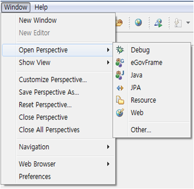
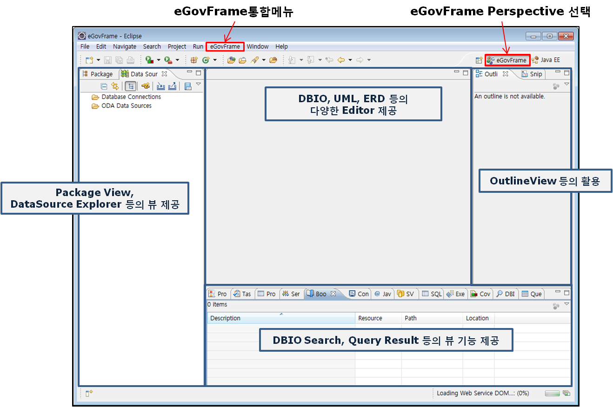
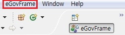
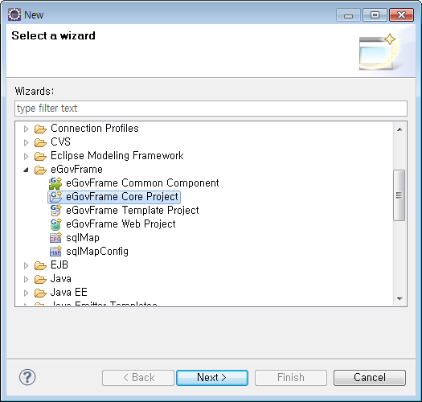
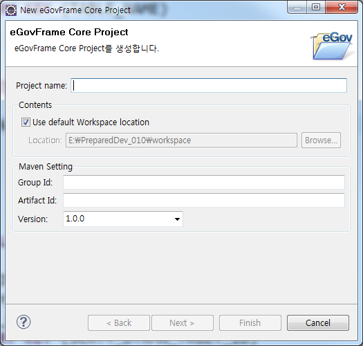
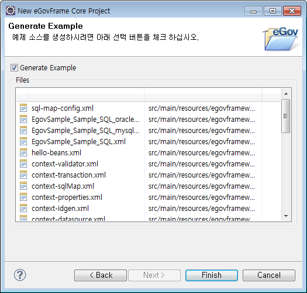
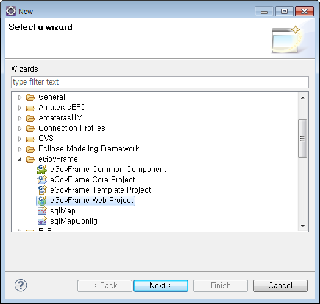
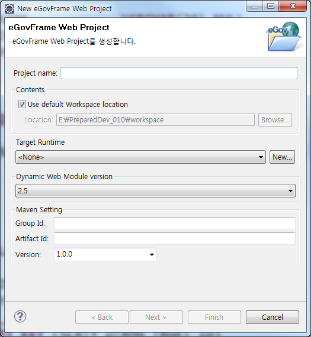
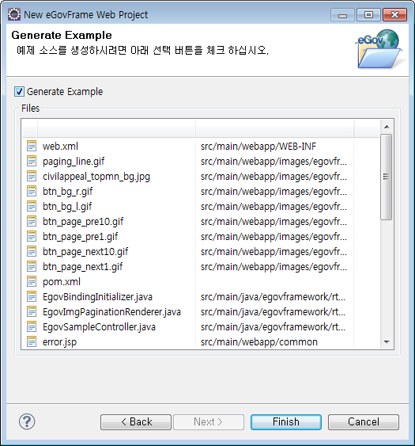

## 개요

eGovFrame기반의 어플리케이션 개발 시 개발자 편의성을 위하여 eclipse기반의 Perspective, Menu, 프로젝트 생성 마법사 등을 제공한다.

## 설명

기본 Eclipse IDE 에 eGovFrame기반의 어플리케이션 개발을 위한 View 초기세트와 LayOut, 메뉴, 프로젝트 생성 마법사 등을 추가하였고 그에 대한 상세내용은 다음과 같다.

##### Perspective

eGovFrame기반의 어플리케이션 개발을 위한 최적의 View 초기 세트와 레이아웃을 제공한다.

##### Menu

eGovFrame Perspective에서만 활성화 되는 메뉴로 eclipse내에서 분산되어 있는 플러그인들의 기능(eGovFrame에서 필히 사용되어지는 기능)을 빠르게 접근할 수 있는 통합 메뉴를 제공한다.

##### 프로젝트 생성 마법사

eGovFrame기반의 어플리케이션을 빌드하기 위한 소스 코드 및 관련 파일의 구조와 빌더 설정을 담고 있는 프로젝트 생성 마법사를 제공한다.

* Core Project : 비즈니스 서비스 개발을 위한 프로젝트로 Model, Vo, DAO, Service 등을 제공한다.
* Web Project : 웹 어플리케이션의 UI 개발을 위한 프로젝트로 Web Application설정 및 Controller, JSP, Css, JavaScript 등을 제공한다.

## 사용법

#### 1. eGovFrame Perspective

1. Workbench 오른쪽 위의 바로가기 표시줄에 있는 **Open Perspective**단추 를 클릭한다. 메뉴 표시줄의 **Window** > **Open Perspective** 메뉴와 동일한 기능을 제공한다.
2. 전체 Perspective 목록을 보려면 드롭 다운 메뉴에서  **Other…** 를 선택한다.
3. **eGovFrame** Perspective를 선택한다.

   

4. 제목 표시줄이 변경되어 **eGovFrame**이 표시된다.

   

#### 2. eGovFrame Menu

Perspective를 eGovFrame으로 변경하면 메뉴 표시줄에 **eGovFrame** 메뉴가 표시된다.

| 구분           | 메뉴                         | 소메뉴                     | 설명                                            |
| -------------- | ---------------------------- | -------------------------- | ----------------------------------------------- |
| Start          | New Core Project             |                            | New eGovFrame Core Project 생성 마법사 실행     |
|                | New Web Project              |                            | New eGovFrame Web Project 생성 마법사 실행      |
|                | New Template Project         |                            | New eGovFrame Template Project 생성 마법사 실행 |
| Analysis       | New Usecase Diagram          |                            | New Usecase Diagram 생성 마법사 실행            |
| Design         | New ER Diagram               |                            | New ER Diagram 생성 마법사 실행                 |
|                | New Class Diagram            |                            | New Class Diagram 생성 마법사 실행              |
| Implementation | New SQL Map Config           |                            | New SQLMap Config 생성 마법사 실행              |
|                | New SQL Map                  |                            | New SQLMap 생성 마법사 실행                     |
|                | Show DBIO Search View        |                            | DBIO Search View 표시                           |
| Configuration  | Customize Development Tool   |                            | 맞춤형 개발환경 설치 마법사 실행                |
|                | Server Connection Management | Show SVN Repositories View | SVN Reopsitories View를 실행                    |
|                |                              | Nexus                      | Nexus 설정 관련 Preference page를 실행          |

#### 3. eGovFrame 프로젝트 생성 마법사

##### 3.1. Core Project 생성 마법사

1. 메뉴 표시줄에서 **File** > **New** > **eGovFrame Core Project**를 선택한다. (단 eGovFrame Perspective내에서)
   또는, **Ctrl+N** 단축키를 이용하여 새로작성 마법사를 실행한 후 **eGovFrame** > **eGovFrame Core Project**을 선택하고 **Next**를 클릭한다.

   

2. 프로젝트명과 메이븐 설정에 필요한 값들을 입력하고 **Next**를 클릭한다.

   

3. 예제 소스 파일 생성 여부를 체크하고 **Finish**를 클릭한다.

   

**Create a eGovFrame Core Project 페이지**

| 옵션         | 설명                                                                                                                                                                                               | 기본값                         |
| ------------ | -------------------------------------------------------------------------------------------------------------------------------------------------------------------------------------------------- | ------------------------------ |
| Project Name | 새 프로젝트 이름을 입력한다.                                                                                                                                                                       | 공백                           |
| Contents     | Use default Workspace location체크시 기본 작업공간에 프로젝트 명으로 프로젝트 디렉토리가 생성된다.``임의의 디렉토리 선택시 옵션을 해제하고 **Browse**버튼을 클릭하여 위치를 선택한다. | Use default Workspace location |
| Group Id     | Maven에서의 Group Id를 입력한다.                                                                                                                                                                   | 공백                           |
| Artifact Id  | Maven에서의 Artifact Id를 입력한다.                                                                                                                                                                | 공백                           |
| Version      | Maven에서의 버젼을 입력한다.                                                                                                                                                                       | 1.0.0                          |

**Generate Example 페이지**

| 옵션             | 설명                                            | 기본값 |
| ---------------- | ----------------------------------------------- | ------ |
| Generate Example | 프로젝트 생성시 예제 소스 포함 여부를 선택한다. | false  |

##### 3.2. Web Project 생성 마법사

1. 메뉴 표시줄에서 **File** > **New** > **eGovFrame Web Project**를 선택한다. (단 eGovFrame Perspective내에서)
   또는, **Ctrl+N** 단축키를 이용하여 새로작성 마법사를 실행한 후 **eGovFrame** > **eGovFrame Web Project**을 선택하고 **Next**를 클릭한다.

   

2. 프로젝트명과 메이븐 설정에 필요한 값들을 입력하고 **Next**를 클릭한다.

   

3. 예제 소스 파일 생성 여부를 체크하고 **Finish**를 클릭한다.

   

**Create a eGovFrame Web Project 페이지**

| 옵션                           | 설명                                                                                                                                                                 | 기본값     |
| ------------------------------ | -------------------------------------------------------------------------------------------------------------------------------------------------------------------- | ---------- |
| Project Name                   | 새 프로젝트 이름을 입력한다.                                                                                                                                         | 공백       |
| Use default Workspace location | 체크시 기본 작업공간에 프로젝트 명으로 프로젝트 디렉토리가 생성된다.``임의의 디렉토리 선택시 옵션을 해제하고 **Browse**버튼을 클릭하여 위치를 선택한다. | Checked    |
| Target Runtime                 | 웹 어플리케이션을 실행할 타겟 서버를 선택한다.                                                                                                                       | None |
| Dynamic Web Module Version     | 동적 웹 모듈 버젼을 선택한다.                                                                                                                                        | 2.5        |
| Group Id                       | Maven에서의 Group Id를 입력한다.                                                                                                                                     | 공백       |
| Artifact Id                    | Maven에서의 Artifact Id를 입력한다.                                                                                                                                  | 공백       |
| Version                        | Maven에서의 버젼을 입력한다.                                                                                                                                         | 1.0.0      |

**Generate Example 페이지**

| 옵션             | 설명                                            | 기본값 |
| ---------------- | ----------------------------------------------- | ------ |
| Generate Example | 프로젝트 생성시 예제 소스 포함 여부를 선택한다. | false  |

**※ 프로젝트 생성 후 pom.xml파일의 레파지토리 정보를 각 프로젝트의 개발환경 정보로 변경한다.**