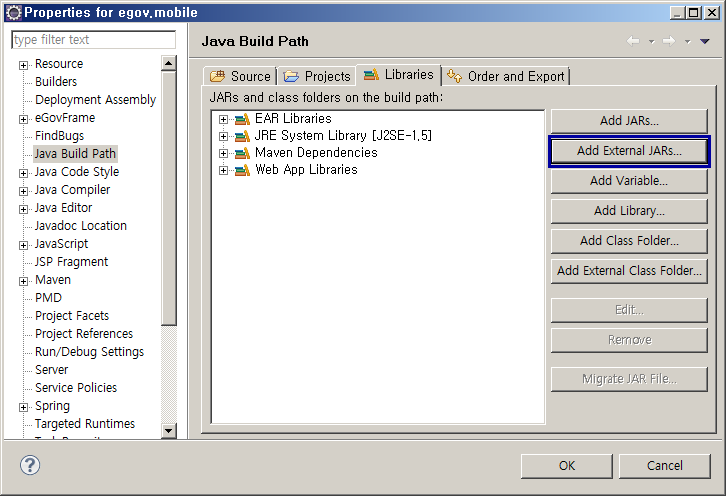
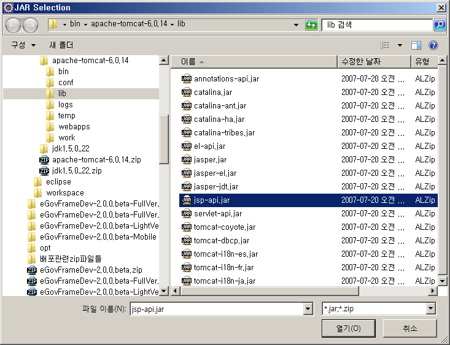
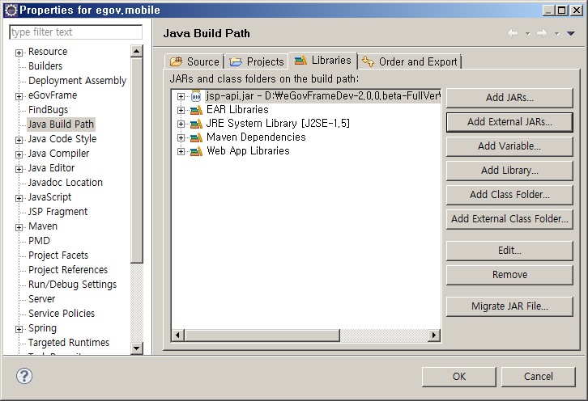
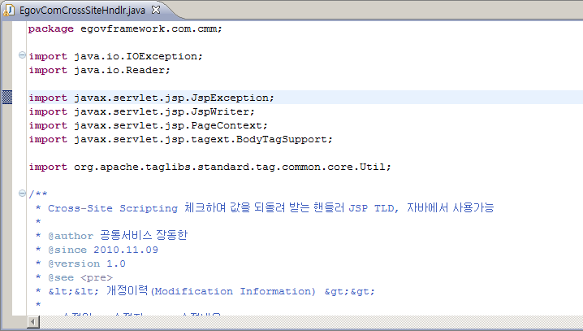

## 개요

jsp-api.jar 파일을 import하는 방법을 설명한다.

## 설명

모바일 사이트 템플릿 프로젝트 생성 후 EgovComCrossSiteHndlr.java 파일에서 javax.servlet.jsp. 로 시작하는 파일들의 import 에러가 나타날 때 본 가이드를 참고한다.

## 사용방법

1. 프로젝트 우클릭 > Build Path > Configure Build Path… 메뉴를 클릭한다.
2. 나타나는 Java Build Path 창에서 Libraries 탭의 Add External JARs… 버튼을 클릭한다.

   

3. Tomcat이 설치되어 있는 폴더의 lib 폴더에 있는 jsp-api.jar 파일을 선택한다.
   
   

4. jsp-api.jar 파일이 목록에 추가되었음을 확인 후 OK 버튼을 클릭한다.

   

5. EgovComCrossSiteHndlr.java 파일을 열어 javax.servlet.jsp.* 의 import 관련 에러가 사라졌음을 확인한다.

   
