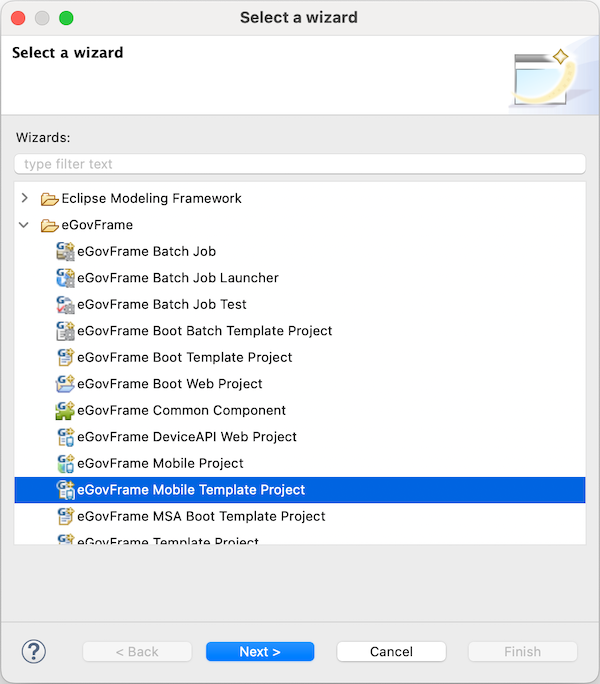
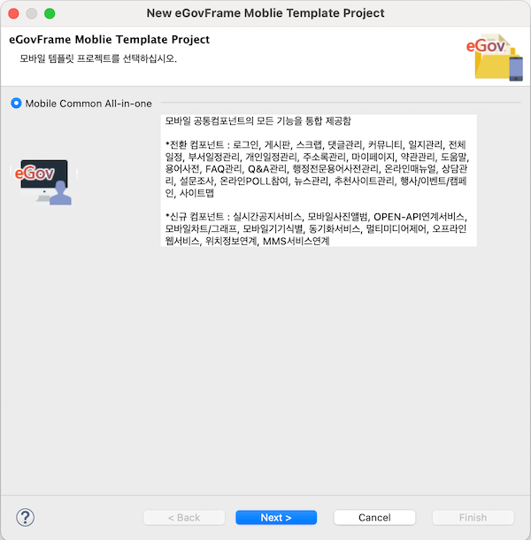
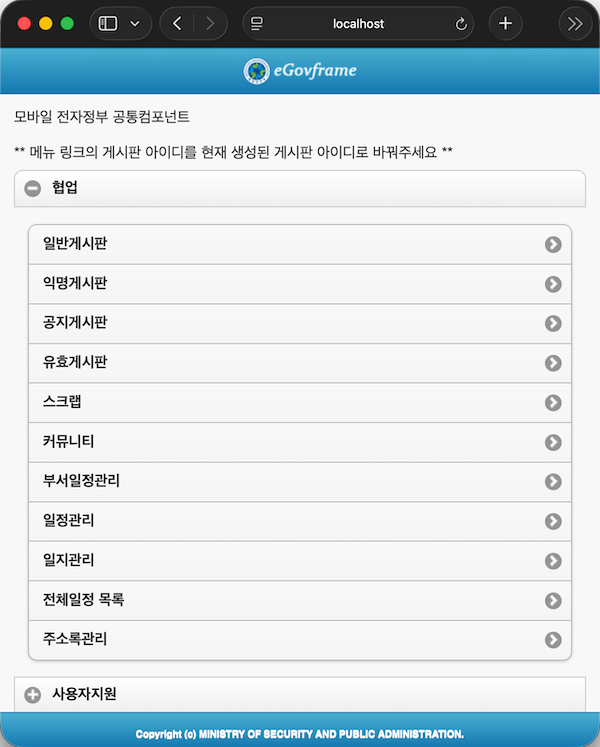
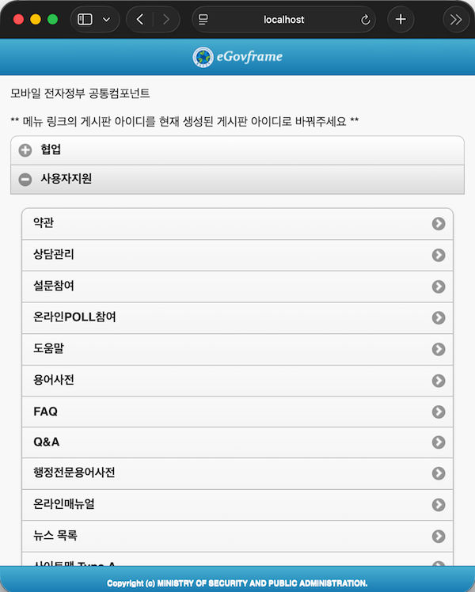

# Mobile Template Project Wizard

## 개요

eGovFrame기반의 모바일 어플리케이션 개발 시 개발자 편의성을 위하여 모바일 사이트 템플릿 자동 생성 마법사를 제공한다.

## 설명

eGovFrame을 기반으로 모바일 전자정부 표준프레임워크 공통컴포넌트를 포함하고 있는 모바일 사이트 템플릿 프로젝트 자동 생성 마법사를 제공한다.

* 협업 : 모바일용 공통컴포넌트 포팅 및 협업 템플릿이 설치, 진행 될 수 있는 프로젝트 기본구성을 제공한다.
  * 게시판, 댓글, 스크랩 일정, 주소록 관리 기능을 제공한다.
* 사용자 지원 : 모바일용 공통컴포넌트 포팅 및 사용자 지원 템플릿이 설치, 진행 될 수 있는 프로젝트 기본구성을 제공한다.
  * 뉴스, FAQ, Q&A, 상담, 사이트맵, 마이페이지, 용어사전, 행정전문용어사전, 추천사이트, 온라인메뉴얼, 모바일도움말, 모바일행사, 모바일약관, 모바일일지 관리 기능을 제공한다.

## 사용법

1. (eGovFrame Perspective로 들어온 후)
   메뉴 표시줄에서 **eGovFrame** > **Start** > **New Mobile Template Project**를 선택하거나,
   **File** > **New** > **eGovFrame Mobile Template Project**를 선택한다.
   또는 **Ctrl+N** 단축키를 이용하여 새로작성 마법사를 실행한 후 **eGovFrame** > **eGovFrame Mobile Template Project**을 선택하고 **Next**를 클릭한다.

   

2. 생성하고자 하는 템플릿(Mobile Common All-in-one)을 선택하고 **Next**를 클릭한다.

   

3. 프로젝트 명과 Maven 설정에 필요한 값들을 입력하고 **Finish**를 클릭한다.

   

4. 서버를 실행하여 템플릿 프로젝트가 올바르게 생성되었는지 확인한다.

   1. 협업

      

   2. 사용자 지원

      

### 참고사항

**Create a eGovFrame Mobile Template Project 페이지**

| 옵션                           | 설명                                                                                                                                                              | 기본값                         |
| ------------------------------ | ----------------------------------------------------------------------------------------------------------------------------------------------------------------- | ------------------------------ |
| Project Name                   | 새 프로젝트 이름을 입력한다.                                                                                                                                      | 공백                           |
| Contents                       | Use default Workspace location체크시 기본 작업공간에 프로젝트 명으로 프로젝트 디렉토리가 생성된다. 임의의 디렉토리 선택시 옵션을 해제하고 **Browse** 버튼을 클릭하여 위치를 선택한다. | Use default Workspace location |
| Target Runtime                 | 웹 어플리케이션을 실행할 타겟 서버를 선택한다.                                                                                                                    | \<None>                        |
| Dynamic Web Module Version     | 동적 웹 모듈 버젼을 선택한다.                                                                                                                                     | 5.0                            |
| Group Id                       | Maven에서의 Group Id를 입력한다.                                                                                                                                  | 공백                           |
| Artifact Id                    | Maven에서의 Artifact Id를 입력한다.                                                                                                                               | 공백                           |
| Version                        | Maven에서의 버전을 입력한다.                                                                                                                                      | 1.0.0                          |

**주의**

✔ 프로젝트 생성 후 pom.xml파일의 레파지토리 정보를 각 프로젝트의 개발환경 정보로 변경한다.
✔ 프로젝트 생성 후 EgovComCrossSiteHndlr.java 파일에서 javax.servlet.jsp.* 의 import 관련 에러가 나타나면 [jsp-api.jar import 가이드](./importjspapi-guide.md)를 참고한다.
✔ 프로젝트 생성 후 css 깨짐 현상, 하위 컴포넌트 메뉴 링크 실행시 오류현상이 나타나면 프로젝트 Path 설정 가이드를 참고한다.
✔ 프로젝트 생성 후 모바일 환경에 최적화된 브라우저로 실행할 경우 외부 브라우저 설정 가이드를 참고한다.
✔ 모바일 전자정부 표준프레임워크에서는 모바일 표준 JSP 템플릿을 제공한다. 템플릿을 적용하기 위해서는 모바일 표준 JSP 템플릿 설정을 참고한다.