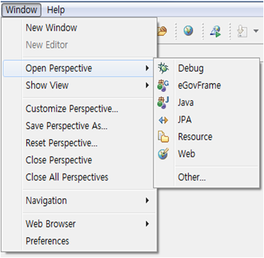
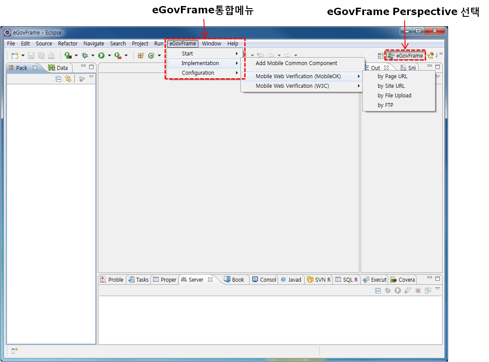
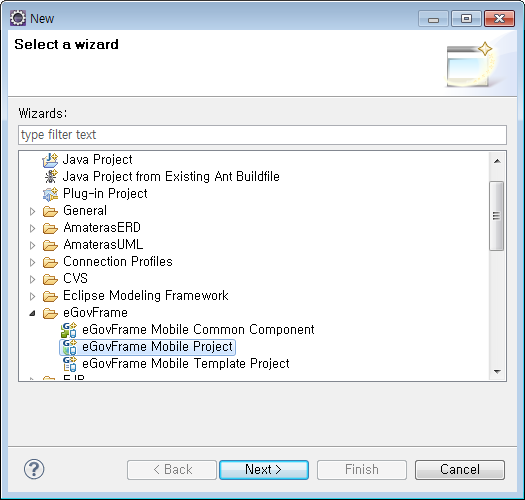
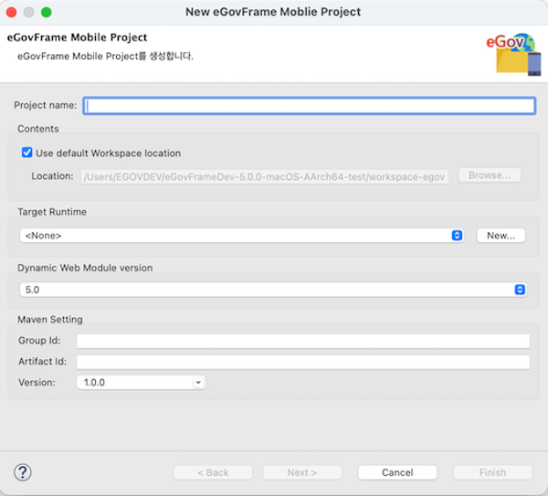
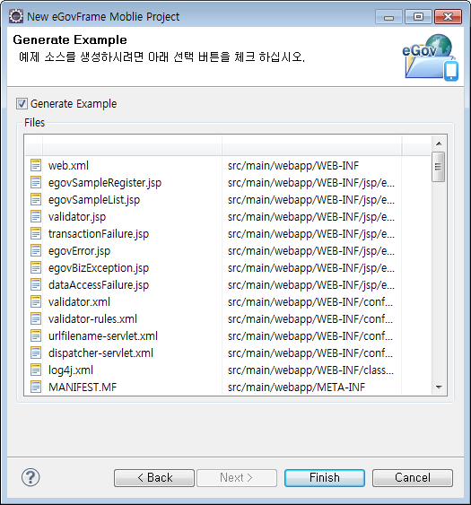

# Mobile IDE

## 개요

eGovFrame기반의 모바일 어플리케이션 개발 시 개발자 편의성을 위하여 eclipse기반의 Perspective, Menu, 모바일 표준 소스 코드 생성 마법사등을 제공한다.

## 설명

기본 eGovFrame Mobile IDE 기반에 모바일 어플리케이션 개발을 위한 메뉴, 프로젝트 생성 마법사 등을 추가하였고, 상세 내용은 다음과 같다.

##### Perspective

eGovFrame Mobile IDE 기반으로 모바일 메뉴가 추가되며 모바일 어플리케이션 개발을 위한 메뉴를 제공한다.

##### Menu

eGovFrame Perspective에서만 활성화되는 메뉴로 eclipse내에서 분산되어 있는 플러그인들의 기능(eGovFrame에서 필히 사용되어지는 기능)을 빠르게 접근할 수 있는 통합 메뉴를 제공한다.

##### 모바일 표준 소스 코드 생성 마법사

eGovFrame기반의 모바일 어플리케이션을 빌드하기 위한 소스 코드 및 관련 파일의 구조와 빌더 설정을 담고 있는 프로젝트 생성 마법사를 제공한다.

* Mobile Project
  * 예제를 포함하지 않은 프로젝트 : 모바일 웹 어플리케이션의 개발을 위한 기본적인 CSS, JavaScript 등을 제공한다.
  * 예제를 포함한 프로젝트 : 모바일 웹 어플리케이션의 UI 개발을 위한 프로젝트로 기본적인 Web Application설정 및 Controller, JSP, CSS, JavaScript 등을 제공한다.

## 사용법

#### 1. eGovFrame Perspective

1. Workbench 오른쪽 위의 바로가기 표시줄에 있는 **Open Perspective**단추 를 클릭한다. 메뉴 표시줄의 **Windows** > **Open Perspective** 메뉴와 동일한 기능을 제공한다.
2. 전체 Perspective 목록을 보려면 드롭 다운 메뉴에서 **Other…** 를 선택한다.
3. **eGovFrame** Perspective를 선택한다.

   

4. 제목 표시줄이 변경되어 **eGovFrame**이 표시된다.

   

   ✔ 퍼스펙티브 변경 후에도 모바일용 메뉴가 보이지 않을 경우 퍼스펙티브 선택 아이콘에서 **우클릭 > Reset** 을 실행한다.

#### 2. eGovFrame Menu

Perspective를 eGovFrame으로 변경하면 메뉴 표시줄에 **eGovFrame** 메뉴가 표시된다.

| 구분           | 메뉴                         | 설명                                                    |
| -------------- | ---------------------------- | ------------------------------------------------------- |
| Start          | New Mobile Project           | New eGovFrame Mobile Project 생성 마법사 실행           |
|                | New Mobile Template Project  | New eGovFrame Mobile Template Project 생성 마법사 실행  |
| Implementation | Add Mobile Common Component  | 모바일용 공통컴포넌트 조립 마법사 실행                  |
| Configuration  | Add Plug-In                  | 플러그인을 추가하는 페이지를 실행                       |

#### 3. eGovFrame 모바일 프로젝트 생성 마법사

##### 3.1. eGovFrame Mobile Project 생성 마법사

1. (eGovFrame Perspective로 들어온 후)
   메뉴 표시줄에서 **eGovFrame** > **Start** > **New Mobile Project**를 선택하거나,
   **File** > **New** > **eGovFrame Mobile Project**를 선택한다.
   또는 **Ctrl+N** 단축키를 이용하여 새로작성 마법사를 실행한 후 **eGovFrame** > **eGovFrame Mobile Project**을 선택하고 **Next**를 클릭한다.

   

2. 프로젝트 명과 Maven 설정에 필요한 값들을 입력하고 **Next**를 클릭한다.

   

3. 예제 소스 파일 생성 여부를 체크하고 **Finish**를 클릭한다.

   

**Create a eGovFrame Mobile Project 페이지**

| 옵션                           | 설명                                                                                                                                                              | 기본값                         |
| ------------------------------ | ----------------------------------------------------------------------------------------------------------------------------------------------------------------- | ------------------------------ |
| Project Name                   | 새 프로젝트 이름을 입력한다.                                                                                                                                      | 공백                           |
| Contents                       | Use default Workspace location체크시 기본 작업공간에 프로젝트 명으로 프로젝트 디렉토리가 생성된다. 임의의 디렉토리 선택시 옵션을 해제하고 **Browse** 버튼을 클릭하여 위치를 선택한다. | Use default Workspace location |
| Target Runtime                 | 웹 어플리케이션을 실행할 타겟 서버를 선택한다.                                                                                                                    | \<None>                        |
| Dynamic Web Module Version     | 동적 웹 모듈 버젼을 선택한다.                                                                                                                                     | 5.0                            |
| Group Id                       | Maven에서의 Group Id를 입력한다.                                                                                                                                  | 공백                           |
| Artifact Id                    | Maven에서의 Artifact Id를 입력한다.                                                                                                                               | 공백                           |
| Version                        | Maven에서의 버젼을 입력한다.                                                                                                                                      | 1.0.0                          |

**Generate Example 페이지**

| 옵션             | 설명                                            | 기본값 |
| ---------------- | ----------------------------------------------- | ------ |
| Generate Example | 프로젝트 생성시 예제 소스 포함 여부를 선택한다. | false  |

**※ 프로젝트 생성 후 pom.xml파일의 레파지토리 정보를 각 프로젝트의 개발환경 정보로 변경한다.**