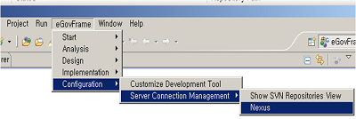
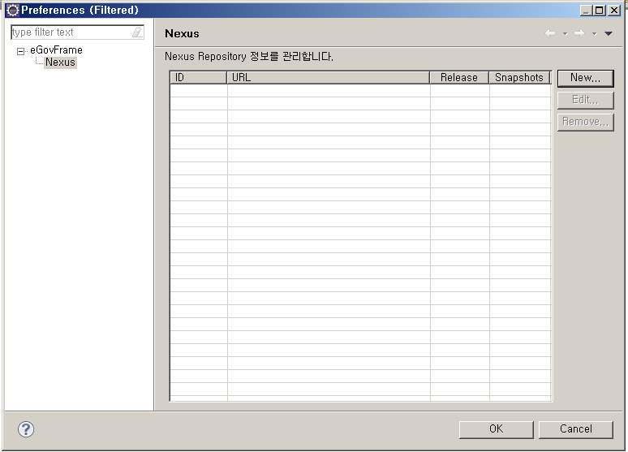
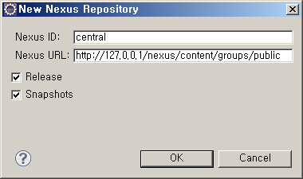
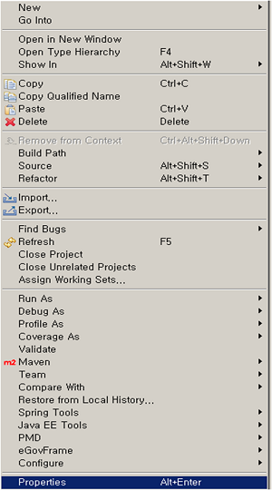
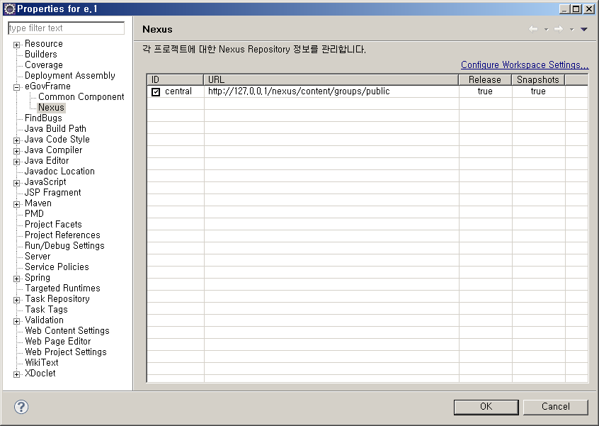

# Nexus

## 개요

표준프레임워크 개발환경에서 Nexus 환경을 직관적으로 관리하기 위해 제공하는 Nexus 관리환경

## 설명

Nexus 사용시 수동으로 직접 수정해야했던 Nexus repository의 정보 등을 통합 관리하여 관리를 용이하게 함으로써, 개발의 편의를 높이는 기능을 제공한다.

## 사용법

### Nexus 구성

1. eGovFrame 통합메뉴에서 eGovFrame > Configuration > Server Connection Management > Nexus를 선택한다.

   

2. Preferences 페이지에서 New 버튼을 클릭하여 새로운 Nexus repository를 추가한다.

   

   

   * Release : 라이브러리의 사용시 가장 최신버전과의 의존관계를 갖도록 설정한다.
   * Snapshots : 빌드할 때마다 가장 최근에 배포한 라이브러리가 있는지 파악하여, 로컬에 있는 라이브러리보다 최신의 라이브러리가 있을 경우 다운로드 한다.

✔ 주의: Nexus URL 입력 시 실제 운영되고 있는 Nexus Repository 주소를 입력하여 프로젝트 빌드 시 필요한 dependency가 잘 반영되도록 한다.(제대로 입력되지 않았을 경우 Missing Artifact 오류가 발생한다)

### Project 별 Nexus Reopsitory 적용

1. eGovFrame Perspective에서 대상이 되는 프로젝트를 선택 > 우클릭하여 Properties를 선택한다.

   

2. 프로퍼티 페이지에서 eGovFrame > Nexus를 선택한다.

3. 기 설정된 Nexus 정보 중 대상 프로젝트에서 사용할 repository를 선택(체크박스) 후 OK버튼을 클릭하여 적용한다.

   