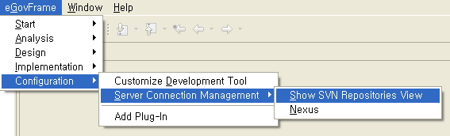
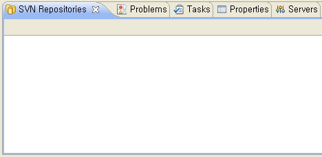
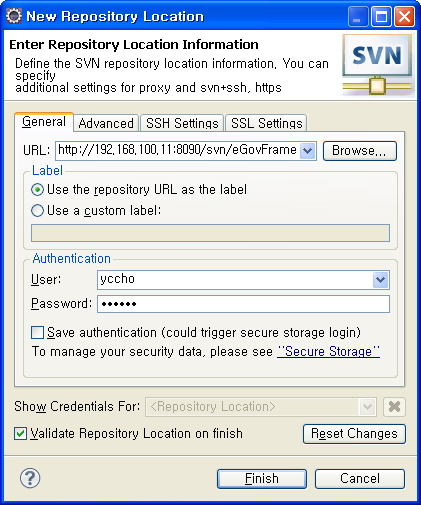

# SVN Repositories View

## 개요

전자정부 표준프레임워크에서는 개발환경의 소스관리도구로 오픈소스인 Subversion(SVN)을 사용하여 사용자의 PC에서 편리하게 소스 코드를 관리 할 수 있도록 한다.

## 설명

전자정부 표준프레임워크에서 형상관리도구로 Open Source Software인 SVN을 제공하고 이는 팀 프로젝트를 진행할 때 소스의 관리를 도와준다.

## 사용법

사용자가 eclipse 개발 환경에서 SVN Repository를 사용하기 위해서는 형상관리 소프트웨어인 SVN Connector를 update 해야한다.

1. 사용자의 eclipse 개발환경에서 Perspective를 eGovFrame으로 변경한다.

2. eGovFrame 통합메뉴 > Configuration > ServerConnection Management > Show SVN Repositories View 를 클릭한다.

   

3. 화면 하단에 SVN Repositories라는 View가 열리는 것을 확인한다.

   

4. New Repository Location 을 클릭하여 Repository Location을 등록한다.

   
