## 개요

Source Editor는 전자정부 표준프레임워크 개발 도구 통합을 위한 개방형 플랫폼으로, IDE(Integrated Development Environment) 기반으로 Edit 기능을 제공한다.

## 설명

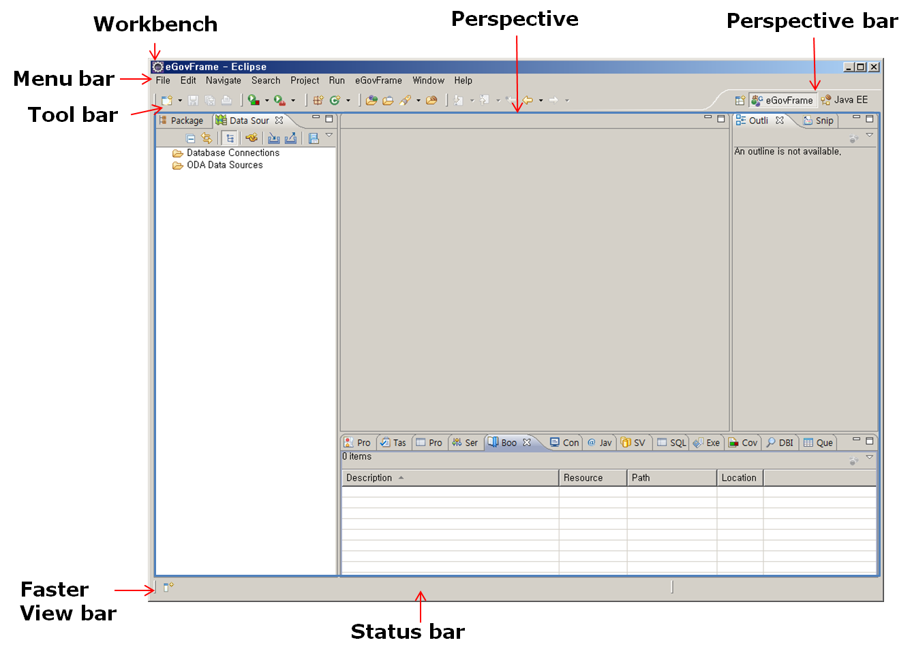

이클립스 워크벤치 사용자 인터페이스는 다양한 윈도우의 모임으로 각 창의 메뉴 모음, 도구 모음, 바로 가기 모음과 하나 이상의 Perspective가 포함되어 있고 주요 구성 영역은 다음과 같다.

| 영역          | 설명                                                                                               |
| ------------- | -------------------------------------------------------------------------------------------------- |
| Workbench     | WindowEditor, Menu Bar, toolbar, shortcut bar 등의 다양한 Window와 하나 이상의 Perspective 로 구성 |
| Perspective   | View와 Content editor로 구성된 집합                                                                |
| Views         | workbench 페이지 내에서 시각적 구성 요소로서 기본 작업을 위한 지원 역할에 사용                     |
| Editor        | 한 workbench 페이지 내에서 시각적 구성 요소로서 문서 또는 데이터 변경 등의 역할에 사용             |
| Menu bar      | 일반적으로 파일, 편집, 이동, 프로젝트, 창, 도움말 수준의 메뉴가 포함                               |
| Tool bar      | 툴 실행의 편의성 제공을 위해 제공된 아이콘                                                         |
| Short cut bar | Perspective 또는 View의 바로가기 아이콘                                                            |
| Status line   | 개발자 지원을 위한 콘텐츠 정보로서 현재의 라인과 컬럼 번호 등의 글로벌 상태 표시                   |

## 사용법

### Code Assist 메서드

Java Code 구현 중 현재 컨텍스트에 입력하던 내용을 완성하는 데 필요한 코드(메소드, 코드 템플릿 등)를 표시하여 개발을 지원하기 위한 도구이다.

1. Ctrl + Space키를 눌러 Code Assist popup 창에서 선택

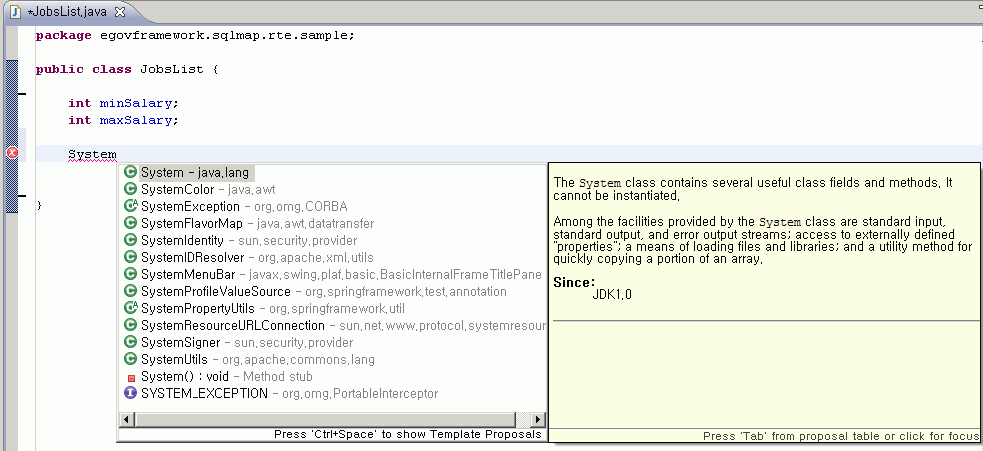

#### Code Assist 템플릿

1. Ctrl + Space키를 눌러 자동 생성된 템플릿 코드
2. 템플릿 설정은 Preferences 다이얼로그의 Java>Editor>Templates 페이지에서 새로운 템플릿을 정의하거나, 기존 템플릿을 편집, 제거할 수 있음

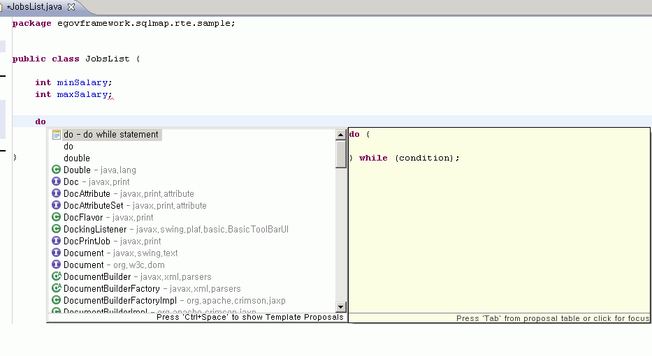

### Quick Fix

코드에 에러가 발생한 경우 해당하는 에러 부분에 빨간색 밑줄과 왼쪽 마커바에 에러표시 아이콘인 빨간색 X 표시되어 Quick Fix 기능 사용이 지원됨을 알려주어 컨텍스트의 문제 발생 시 문제에 대한 해결 가능한 방안을 제시해 주는 도구이다.

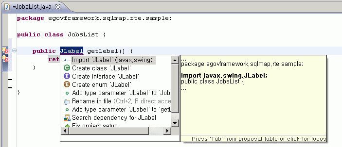

1. 왼쪽 마커바의 에러표시 아이콘을 클릭하여 나타난 해결방법 지원
2. 해당하는 에러 부분에 커서를 위치시켜 Ctrl + 1 키를 눌러 해결방법 지원

### 코드 스타일 적용

코드 스타일 기능을 통해 전자정부 프레임워크 코드 스타일 표준을 정의하여 표준화된 코드 스타일을 구성하도록 방안을 제시해 주는 도구이다.

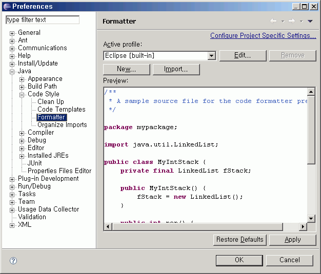

1. Preferences 다이얼로그의 Java>Code Style>Formatter 화면에서 Active Profile를 선택한 다음 Edit 버튼을 누름
2. Profile 다이얼로그에서 들여쓰기, 괄호, 공백, 제어문 구조, 주석 등의 코드 스타일을 지정 가능
3. Preview 패널을 통해 정의한 양식이 어떻게 보이는지 확인 가능

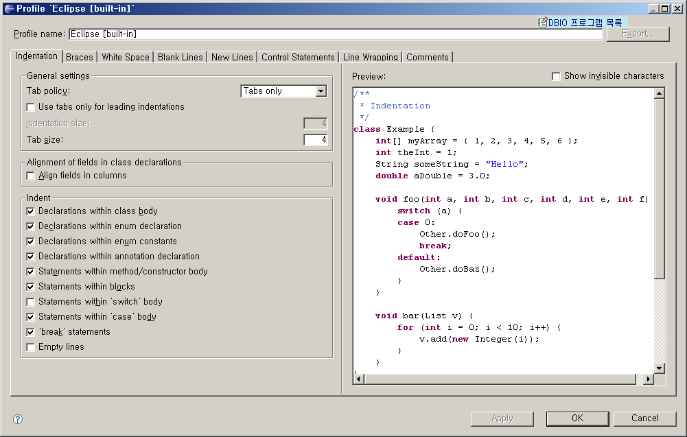

### 코드 템플릿 처리

전자정부 프레임워크 코드 템플릿을 정의하여 표준화된 코드를 소스코드 작성을 지원해주는 도구로 개발 생산성 및 유지보수성을 향상을 지원한다.

1. Preferences 다이얼로그의 Java> Editor > Templates 화면에서 Templates를 편집
2. Preview 패널을 통해 정의한 양식이 어떻게 보이는지 확인 가능
3. try 문 입력 시 try까지만 입력하고 Ctrl + Space 를 눌러서 Template 를 적용 가능하다.

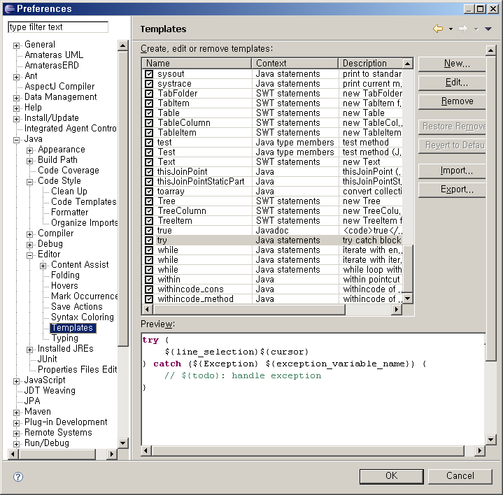

### Quick Type Hierarchy

메서드나 타입, 패키지에 대한 상속 구조를 표시해 주는 도구로 타입을 선택한 경우 해당 타입에 해당하는 상속구조가 표시되고, 메서드를 선택한 경우 메서드를 구현한 타입의 상속 구조가 표시된다.

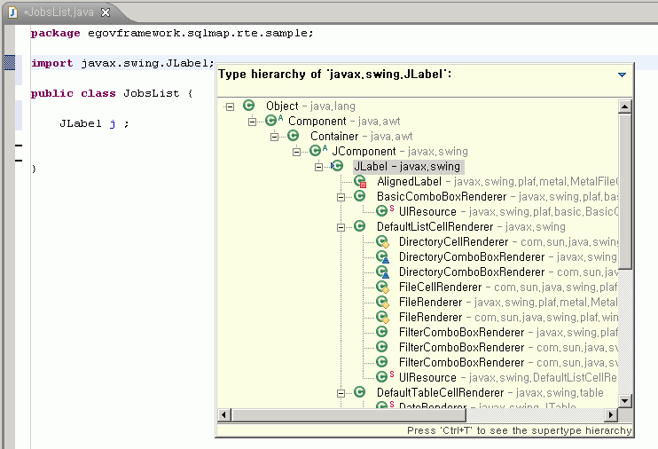

1. 에디터에서 메서드나 타입, 패키지를 선택하고 Ctrl + T를 누르면 Quick Type Hierarchy 팝업 뷰가 보임
2. 팝업 뷰에서 Ctrl + T를 누르면 슈퍼타입/서브타입 구조가 토글됨

### Quick Outline

Outline View와 같은 내용이 팝 업 창에 나타나며 찾고자 하는 메서드의 이름을 입력하면 입력하는 문자열에 해당하는 메서드들만이 팝업 창 목록에 나타나 빠르게 메서드로의 접근이 가능하다.

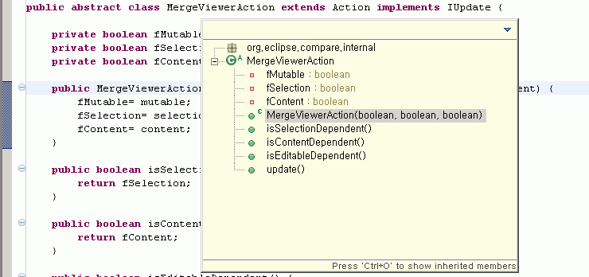

1. 에디터에서 Ctrl + O 를 누르면 Quick Outline 팝업 창이 보임
2. 팝업 뷰에서 Ctrl + O를 누르면 Inherited member 변수가 토글됨

### 소스 코드 네비게이션

소스코드 구현 시 다른 메서드나 클래스의 소스를 확인하고 다시 원래 코드의 위치로 돌아오는 것을 쉽게 지원해 준다

1. 해당 클래스나 메소드에서 F3(Open Declaration)을 누름
2. 원래 소스로 돌아가려면 Alt + 왼쪽 화살표 키(Back)

### Mark Occurrences

커서가 위치한 곳에 있는 지역변수, 상수, 필드, 메소드, 클래스 등의 코드 요소가 나타나는 곳이 모두 하이라이트되어 가독성 있게 표현해 주는 도구이다.

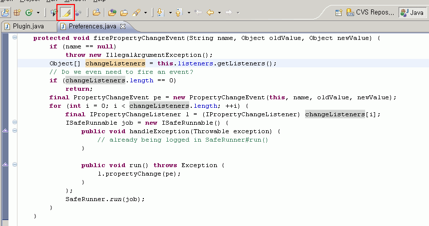

1. 툴바에서 “Mark Occurrences” 버튼 클릭 또는 Alt + Shift + O 키를 동시에 누름

### 로컬 히스토리

변경된 파일의 내역이 로컬 히스토리에 저장되며 현재 상태와 수정하기 전의 상태를 비교하거나, 예전 상태로 복구를 지원한다.

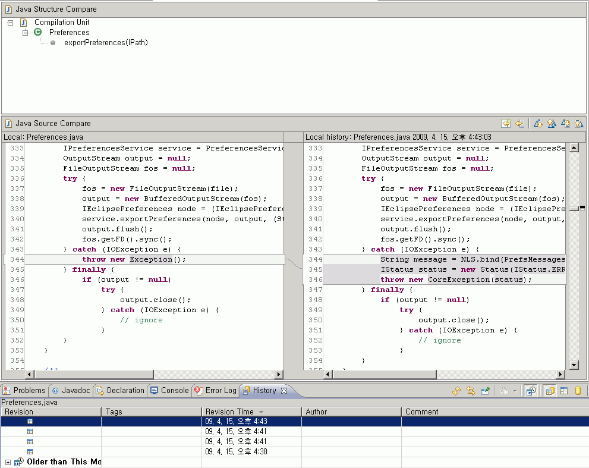

1. Package Explorer의 컨텍스트 메뉴에서 Compare With> History 통해 이전 버전과 비교
2. Package Explorer의 컨텍스트 메뉴에서 Replace With > Local History 통해 이전 버전으로 복구
3. Package Explorer의 컨텍스트 메뉴에서 Replace With > Previous From Local History 통해 최종 버전으로 복구

## 참고자료

* Eclipse Help: [http://help.eclipse.org/help32/topic/org.eclipse.jdt.doc.user/reference/ref-java-editor.htm](http://help.eclipse.org/help32/topic/org.eclipse.jdt.doc.user/reference/ref-java-editor.htm)
