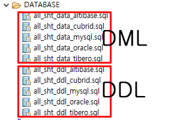

## 개요

eGovFrame 기반의 어플리케이션 개발 시 개발자 편의성을 위하여 기본적인 코드 등을 포함하고 있는 템플릿 프로젝트 자동 생성 마법사를 제공한다.

## 설명

eGovFrame기반의 전자정부 표준프레임워크 공통컴포넌트를 포함하고 있는 템플릿 프로젝트 자동 생성 마법사를 제공한다.

* Simple Homepage : 단순 홈페이지 기능 구현 시 필수적인 부분만 사용 가능하도록 경량화 된 실행환경 제공
  * 메인 페이지, 사용자 관리, 공지사항 관리, 게시판 관리, 안내 관리 기능을 제공한다.
* Portal Site : 포털 사이트 기능 구현 시 필수적인 부분만 사용 가능하도록 경량화 된 실행환경 제공
  * 포털 공지사항 관리 템플릿, 사용자 관리 템플릿, 권한 관리 템플릿, 포털 초기화면 관리 템플릿, 포털 FAQ 관리 템플릿, 포털 행사 참가 관리 템플릿 기능을 제공한다.
* Enterprise Business : 내부업무 기능 구현 시 필수적인 부분만 사용 가능하도록 경량화 된 실행환경 제공
  * 메인 페이지, 업무사용자 관리, 공지사항 관리, 게시판 관리, 권한 관리, 프로그램 관리, 메뉴 관리 기능을 제공한다.

## 사용법

1. 메뉴 표시줄에서 **File** > **New** > **eGovFrame Template Project**를 선택한다. (단 eGovFrame Perspective 내에서)
   또는, **Ctrl+N** 단축키를 이용하여 새로 작성 마법사를 실행한 후 **eGovFrame** > **eGovFrame Template Project**을 선택하고 **Next**를 클릭한다.

   
2. 생성하려는 Template 유형(단순 홈페이지, 포털 사이트, 내부업무 시스템)을 선택하고 **Next**를 클릭한다.

   
3. 프로젝트 명과 메이븐 설정에 필요한 값들을 입력하고 **Finish**를 클릭한다.

   
4. 서버를 실행하여 생성한 템플릿 프로젝트를 확인한다.

   1. 단순 홈페이지
      
   2. 포털 사이트
      
   3. 내부업무 시스템
      

### 참고사항

**Create a eGovFrame Template Project 페이지**

| 옵션                           | 설명                                                                                                                                                           | 기본값  |
| ------------------------------ | -------------------------------------------------------------------------------------------------------------------------------------------------------------- | ------- |
| Project Name                   | 새 프로젝트 이름을 입력한다.                                                                                                                                   | 공백    |
| Use default Workspace location | 체크 시 기본 작업공간에 프로젝트 명으로 프로젝트 디렉토리가 생성된다.``임의의 디렉토리 선택 시 옵션을 해제하고**Browse**버튼을 클릭하여 위치를 선택한다. | Checked |
| Target Runtime                 | 웹 어플리케이션을 실행할 타겟 서버를 선택한다.                                                                                                                 | None    |
| Dynamic Web Module Version     | 동적 웹 모듈 버젼을 선택한다.                                                                                                                                  | 3.1     |
| Group Id                       | Maven에서의 Group Id를 입력한다.                                                                                                                               | 공백    |
| Artifact Id                    | Maven에서의 Artifact Id를 입력한다.                                                                                                                            | 공백    |
| Version                        | Maven에서의 버젼을 입력한다.                                                                                                                                   | 1.0.0   |

**주의**
✔ 프로젝트 실행 시 target runtime을 현재 이클립스에서 사용하고 있는 web/was 서버(ex:tomcat)로 설정해 주어야 한다.
✔ 프로젝트 생성 후 EgovComCrossSiteHndlr.java 파일에서 javax.servlet.jsp.* 의 import 관련 에러가 나타나면 [jsp-api.jar import 가이드](./importjspapi-guide.md)
✔ 템플릿 프로젝트의 경우 데이터베이스가 구성되어야 정상적으로 동작한다. 전자정부에서는 데이터베이스 구성용 스크립트를 제공한다.

* 템플릿 프로젝트 설치 후 데이터베이스의 스키마 및 데이터 구성 방법은 다음과 같다.
  1. 템플릿 프로젝트를 설치한다.
  2. 템플릿 프로젝트 하위의 DATABASE 폴더의 스크립트를 실행한다. 스크립트는 DML과 DDL을 제공하며 각 템플릿마다 5가지 데이터베이스(Altibase, Cubrid, MySQL, Oracle, Tibero)를 지원한다.
     
