# Activity Diagram Editor

## 개요

UML 중 Activity Diagram 의 작성을 편리하게 지원하는 Editor 이다.

## 설명

* 기본 작업 메인화면은 다음과 같이 구성되어 있다.

  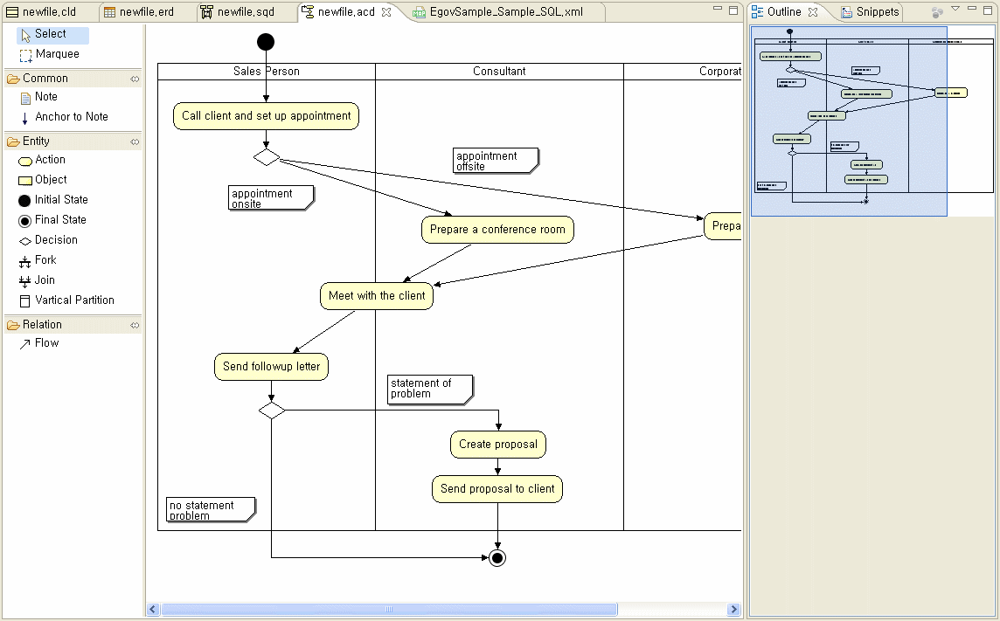

* ToolBar
  * Select : 편집창에서 개체를 선택하고 이동시키기 위해 사용한다.
  * Marquee : 편집창에서 여러 개체를 한번에 선택하기 위해 사용한다.
  * Note : 설명을 붙일 때 사용한다.
  * Anchor to Note : 편집창 위의 개체와 Note 개체를 연결시 사용한다.
  * Action : 업무 또는 오퍼레이션을 표시한다.
  * Object : 객체를 표시한다.
  * Initial State : Activity의 시작을 표시한다.
  * Final State : Activity의 종료를 표시한다.
  * Decision : 조건에 따른 분기를 표시한다.
  * Fork : 동시에 진행 가능한 작업 표시에 사용한다.
  * Join : 동시에 진행 가능한 작업 표시에 사용한다.
  * Vartical Partition : 영역을 표시한다.
  * Flow : 흐름을 표시한다.

  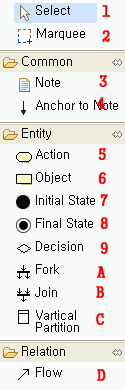

* Editor

  ToolBar가 제공하는 개체를 이용하여 Activity Diagram을 그리는 영역이다.

  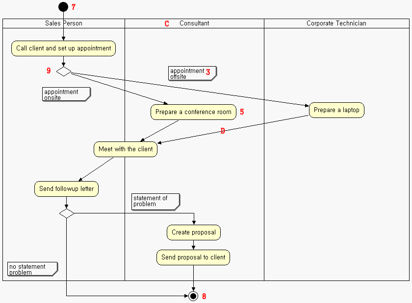

* Outline

  편집창에서 작성된 Diagram의 전체모습을 확인하기 위해 제공하는 Viewer. 푸른색 박스를 움직이면 해당 위치의 내용이 편집창에 나타난다.

  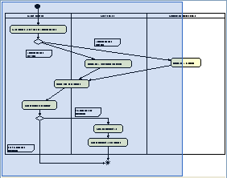

## 사용법

1. Package Explorer 에서 컨텍스트 메뉴 > New > Other > AmaterasUML > Activity Diagram 메뉴(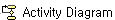)를 선택한 후 파일명을 입력한다.

   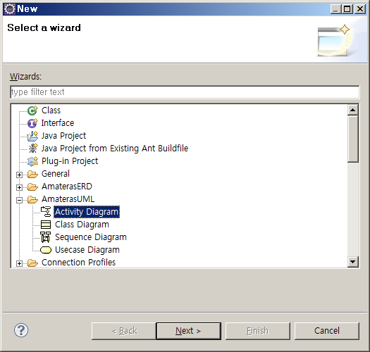

2. 툴바에서 Initial State 개체를 선택한 후 편집창에 그려 Activity 의 시작을 표시한다.

   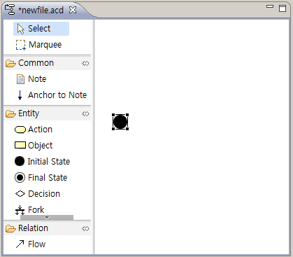

3. 툴바에서 Vitical Partition 을 선택한 후 편집창에 영역을 표시한다. [Sales Person, Consultant, Corporate Technician]

   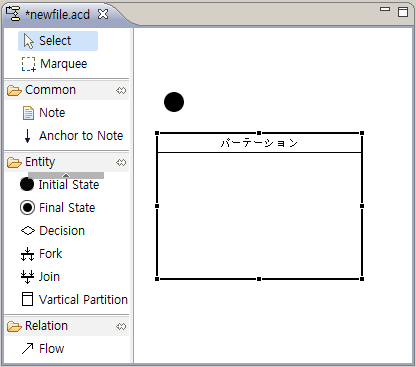

4. 더블클릭으로 Vitical Partition의 영역명을 부여한다. [Sales Person, Consultant, Corporate Technician]

5. 툴바에서 Action 을 선택한 후 편집창에 표시한다.

   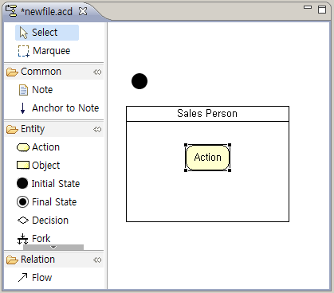

6. 더블클릭으로 Action 을 선택한 후 편집창에 표시하고 행위를 부여한다. (Call client and set up appointment, Prepare a conference room, Meet with the client…)

7. 툴바에서 Flow 를 선택한 후 편집창에서 개체간의 흐름을 표시한다.

   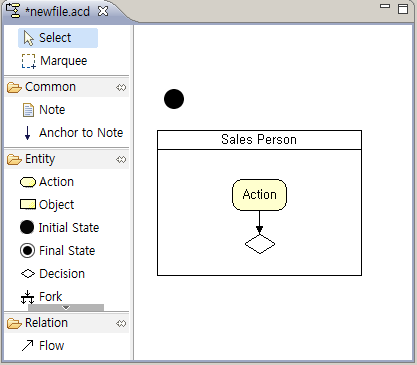

8. 툴바에서 Decision을 선택한 후 편집창에 표시하고 Note를 달아 분기조건을 나타낸다.

   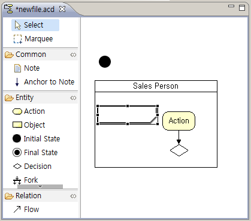

9. 툴바에서 Final State 를 선택한 후 편집창 표시하여 Activity의 종료를 나타낸다.

   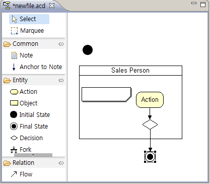

10. 작성내용을 저장한다.

## 환경설정

별도의 환경설정은 필요하지 않다.

## 샘플

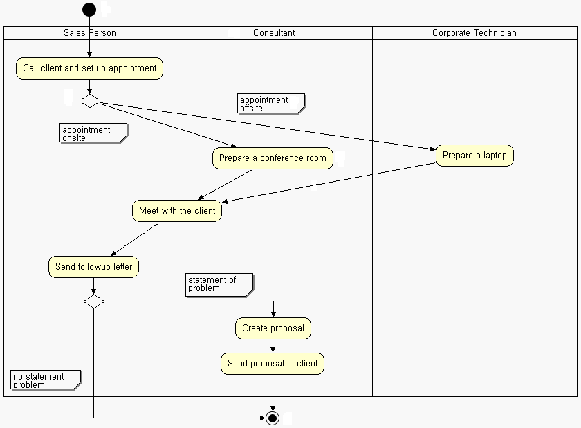