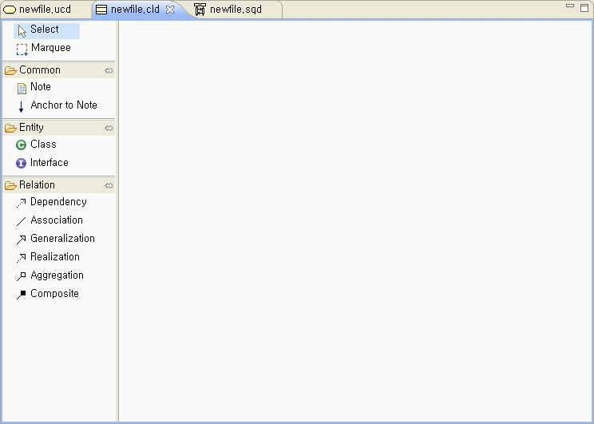
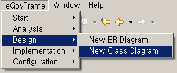
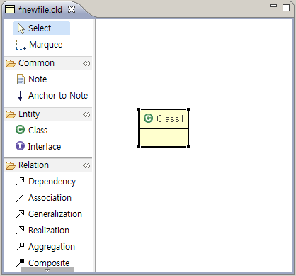
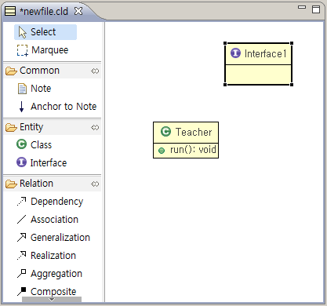
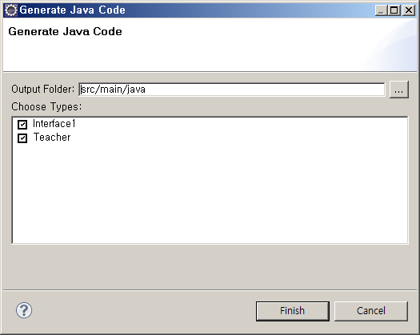
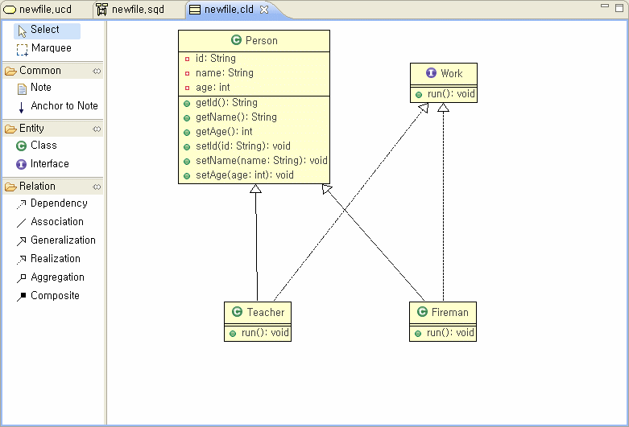

# Class Diagram Editor

## 개요

클래스 다이어그램을 편리하게 작성할 수 있는 기능을 제공한다.

## 설명

* Select : 편집창 상의 개체 선택 기능을 제공하는 아이콘이다.
* Marquee : 다수의 개체 선택 기능을 제공하는 아이콘이다.
* Note : 설명 붙이기 기능을 제공하는 아이콘이다.
* Anchor to Note : Note 와 개체의 연결 기능을 제공하는 아이콘이다.
* Class : Class 정의에 사용되는 아이콘이다.
* Interface : Interface 정의에 사용되는 아이콘이다.
* 화살표 : 관계 설명을 위한 아이콘이다.

## 사용법

1. eGovFrame > Design > New Class Diagram 을 선택하여 클래스 다이어그램을 생성한다.

   

2. 클래스 아이콘을 선택하여 편집창에 클래스를 생성한다.

   

3. 더블클릭으로 클래스 이름을 변경한다. [Teacher]

4. 생성한 클래스에 Attribute, Method 를 선언한다. [run()]

5. 인터페이스 아이콘을 선택하여 편집창에 인터페이스를 생성한다.

   

6. 더블클릭으로 클래스 이름을 변경한다. [Work]

7. 인터페이스의 Attribute, Method 를 생성한다. [run()]

8. 각종 화살표를 이용해 객체간의 관계를 설정한다.

9. 편집창의 컨텍스트 메뉴에서 Java > Export 를 선택하여 정의된 객체의 Java Source를 생성한다.

   

## 샘플

