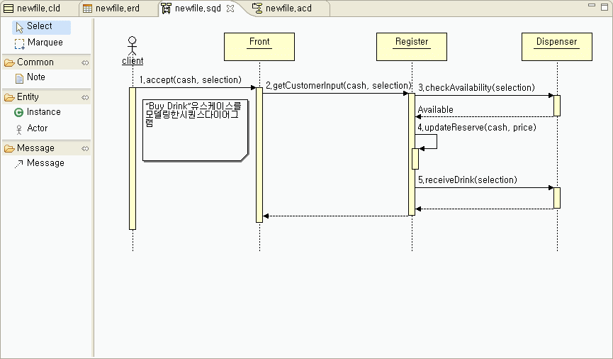
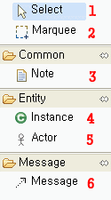
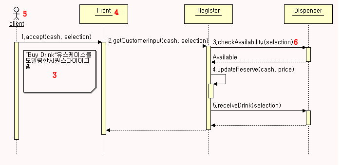
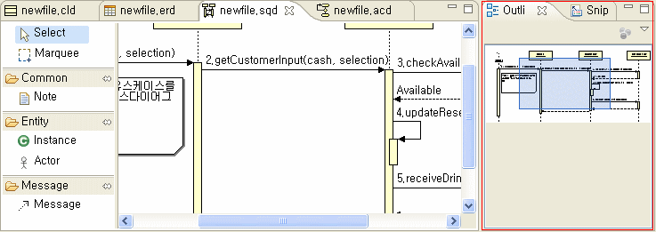
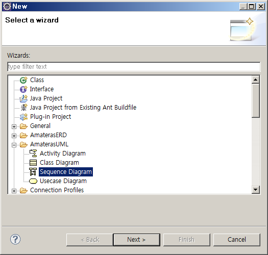
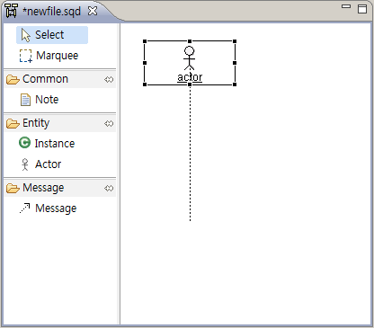
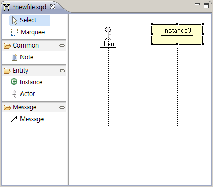
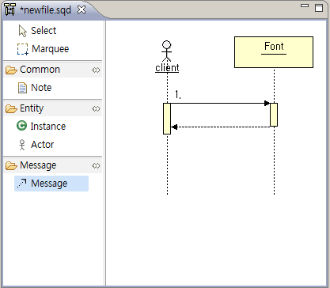
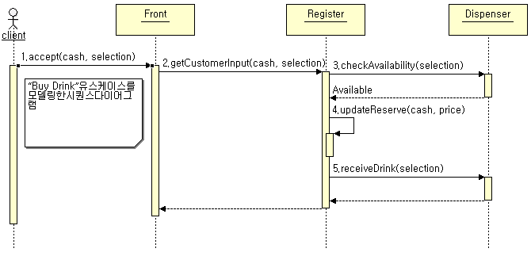

# Sequence Diagram Editor

## 개요

UML 중 Sequence Diagram 작성을 지원하는 Editor 이다.

## 설명

* ToolBar
  * Select : 편집창에서 개체를 선택하고 이동시키기 위해 사용한다.
  * Marquee : 편집창에서 여러 개체를 한번에 선택하기 위해 사용한다.
  * Note : 설명을 붙일 때 사용한다.
  * Instance : 객체의 인스턴스를 표시한다.
  * Actor : 행위자를 표시한다.
  * Message : 처리의 흐름을 표시한다.

  

* Editor

  ToolBar가 제공하는 개체를 이용하여 Sequence Diagram을 그리는 영역이다.

  

* Outline

  편집창에서 작성된 Diagram의 전체모습을 확인하기 위해 제공하는 Viewer. 푸른색 박스를 움직이면 해당 위치의 내용이 편집창에 나타난다.

  

## 사용법

1. Package Explorer 에서 컨텍스트 메뉴 > New > Other > AmaterasUML > Sequence Diagram 메뉴를 선택한 후 파일명을 입력한다.

   

2. 툴바에서 Actor 개체를 선택한 후 편집창에 생성한다.

   

3. 더블클릭으로 Actor 이름을 변경한다. [client]

4. 툴바에서 Instance 를 선택한 후 편집창에 생성한다.

   

5. 더블클릭으로 Instance 이름을 변경한다. [Front]

6. 툴바에서 Message 를 선택한 후 client와 Front에 생명선을 선택한다.

   

7. client와 Front의 호출관계를 표시한다. [accept(cash, selection)]

8. 작성내용을 저장한다.

## 샘플

