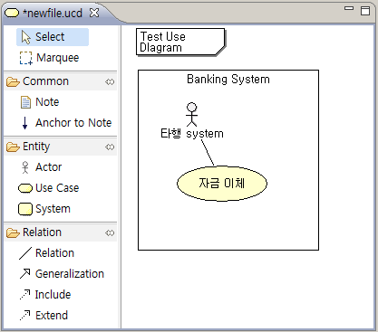
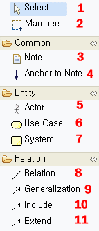
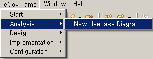
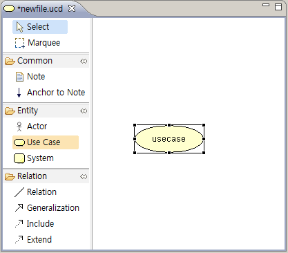
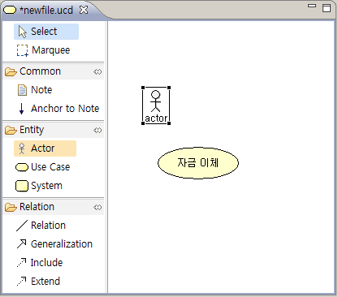
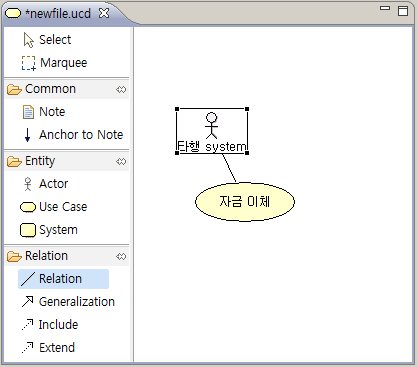
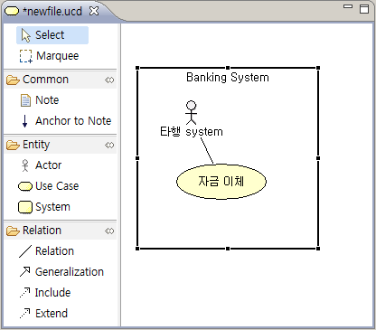
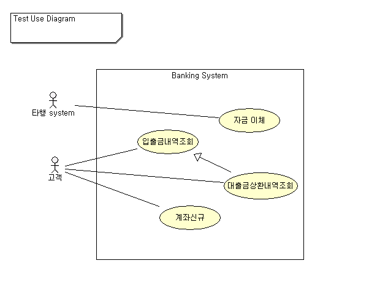

# Use Case Diagram Editor

## 개요

Use Case 를 그릴 수 있도록 툴바와 편집창을 제공한다.

## 설명

* Select : 편집창의 개체를 선택할 수 있도록 한다. 선택은 주로 개체의 이동을 위해 선택한다.
* Marquee : 영역을 선택하여 여러 개체를 선택할 수 있도록 한다. Select 와 다른 점은 개체를 이동시키지 못한다.
* Note : 설명을 달기위해 사용하는 개체다.
* Anchor to Note : Note와 Note가 설명하고 있는 개체를 연결하는 선이다.
* Actor : 실행유발개체를 표시하는 아이콘으로 사람, 시스템 등으로 사용될 수 있다.
* Use Case : Use Case 아이콘이다.
* System : System 영역을 표시다.
* Relation : 개체간의 관계를 긋는데 사용한다.
* Generalization : Use Case 에서 일반화 개념, 상속 개념을 표현할 때 사용한다.
* Include : Use Case 에서 포함관계를 나타낼 경우 사용한다.
* Extend : Use Case 에서 확장관계를 나타낼 경우 사용한다.

## 사용법

1. eGovFrame > Analysis > New Usecase Diagram 을 선택하여 파일을 생성한다.

   

2. Use Case 아이콘을 선택한 후 편집창에 올려 놓는다.

   

3. 더블클릭으로 Use Case 이름을 변경한다. [자금이체]

4. Actor 아이콘을 선택한 후 편집창에 올려 놓는다.

   

5. 더블클릭으로 Actor 의 명칭을 변경한다. [타행 system]

6. Relation 아이콘을 선택하여 Actor와 Usecase 간에 관계를 맺는다.

   

7. System 아이콘을 선택하여 영역을 그리고 System명을 붙인다.

   

## 샘플

