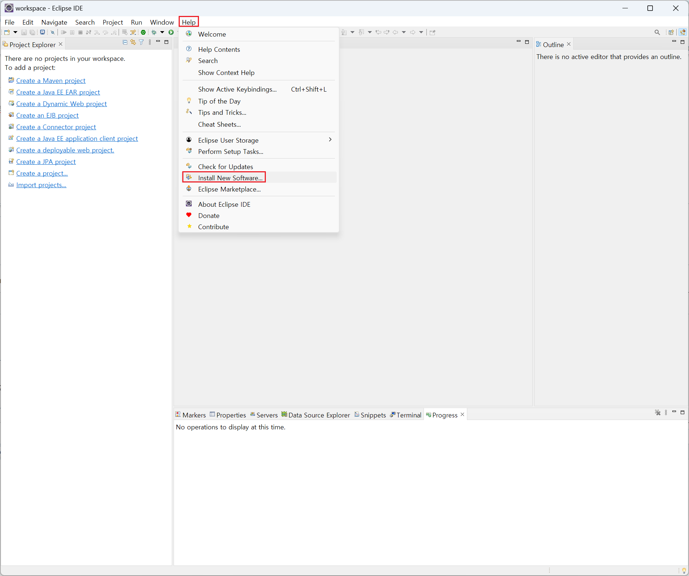
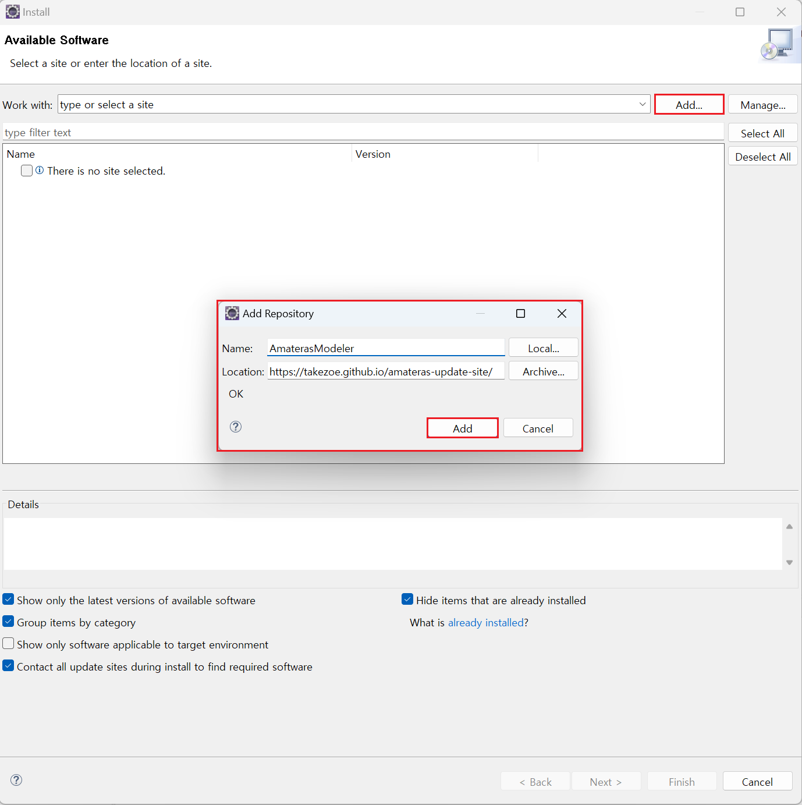
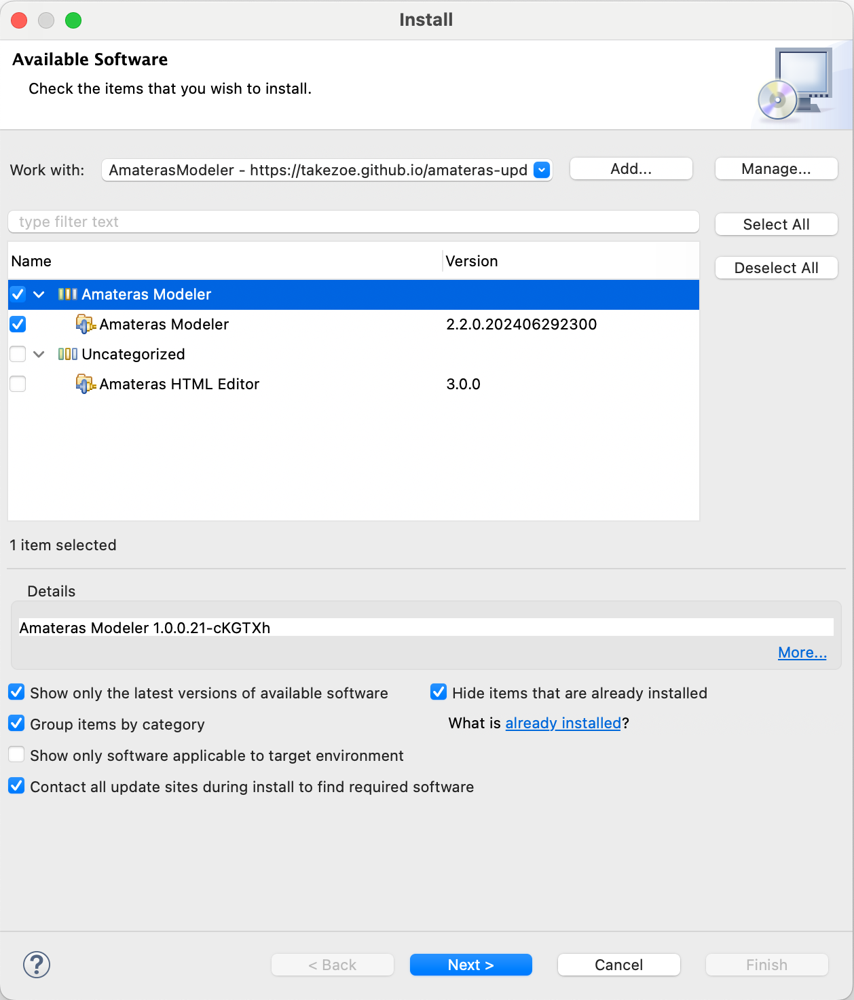

# UML Editor

## 개요

UML 작성도구로써 Activity Diagram, Class Diagram, Sequence Diagram, UseCase Diagram 작성이 가능하고 Class Diagram으로부터 정의된 클래스의 Java Code를 생성할 수 있는 기능을 제공한다.

타 UML 도구간의 호환은 Java Source Code를 통한 Class Diagram 소통이 전부 이지만(Source Code Import), 확장팩을 이용하여 더 많은 호환성을 가질 수 있다.

## 사용법

eGovFrame 에서 제공하는 개발환경을 다운받으면 이미 설치되어 있으므로 별도로 설치하지 않아도 된다. 각각의 사용법은 다음과 같다.

* [Use Case Diagram Editor](./uml-editor-use-case-diagram-editor.md)
* [Class Diagram Editor](./uml-editor-class-diagram-editor.md)
* [Sequence Diagram Editor](./uml-editor-sequence-diagram-editor.md)
* [Activity Diagram Editor](./uml-editor-activity-diagram-editor.md)

## 환경설정

* 기본설치

  1. Eclipse 창에서 Help - Install New Software를 선택한다.

     

  2. 우측 상단의 Add 버튼을 클릭하고 다음과 같이 입력한다. `https://takezoe.github.io/amateras-update-site/`

     

  3. Pending이 되면 필요한 플러그인을 선택한다.

     

  4. 메시지 확인 후 설치한다.

  5. 설치가 완료된 후 프로그램을 재시작 한다.

  - AmaterasModeler 에 대한 자세한 사항은 오픈SW 설치 정보 [개발자 개발환경 구성 가이드](../individual-install-guide/individual-install-guide.md)를 참고한다.

## 참고자료

* [https://github.com/takezoe/amateras-modeler](https://github.com/takezoe/amateras-modeler)