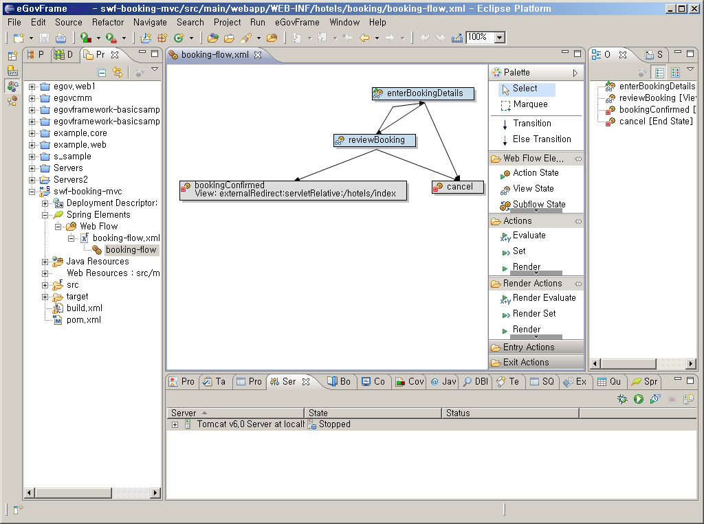
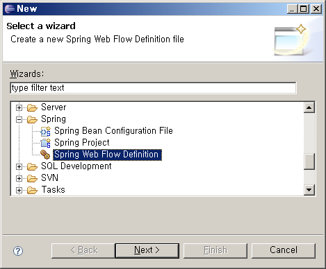

# WebFlow Editor

## 개요

Spring WebFlow 설정 파일의 유효성 검사 및 에디팅을 위한 유용한 기능을 제공한다.

Spring Web Flow는 웹애플리케이션 페이지의 흐름을 관리하기 위한 가장 훌륭한 해결법이 되는 것을 목표로 하고 있다.
이것은 애플리케이션이 커다란 애플리케이션 트랜잭션내에 각각의 단계를 통해 사용자를 가이드하기 위한 마법사처럼 복잡하게 제어되는 탐색(navigations)을 요구할때 사용하기 위한 강력한 컨트롤러이다.

## 설명

* Spring WebFlow Preview Release 3에 대해 100% 지원
* WebFlow Xml 설정 파일에 대한 전체 기능을 갖춘 그래픽 편집기
  * Drag'n'Drop 편집.
  * 편집하는 동안 문법 검증.
  * 인쇄 및 내보내기 (jpg, BMP) 기능.
  * Connection Routing을 포함한 Spring WebFlow 설정 파일에 대해 자동 레이아웃 기능.
  * 개발자에게 친숙한 XML 에디터 플러그인과 WebFlow Editor에서 같은 설정 파일에 대해 Side-by-side 편집 기능 제공.

## 사용법

1. 메뉴 표시줄에서 **File** > **New** > **Spring Web Flow Definition**을 선택한다. (단 eGovFrame Perspective내에서)
   또는, **Ctrl+N** 단축키를 이용하여 새로작성 마법사를 실행한 후 **Spring** > **Spring Web Flow Definition**을 선택하고 **Next**를 클릭한다.

   

2. 파일 위치를 선택하고 **File name**을 입력하고 **Finish**를 클릭한다.
3. **Project Explorer**에서 새로 작성된 WebFlow 설정 파일을 선택 마우스 오른쪽 버튼 클릭 후 **Open Graphical Editor**를 선택한다.
4. WebFlow를 작성 후 저장한다.

## 참고자료

* [Spring WebFlow Editor](http://springide.org/project/wiki/WebFlowEditor)