# 개발자 개발환경 설치가이드

## 개요

본 가이드는 전자정부 표준프레임워크에서 제공하는 개발자 개발환경의 사용 방법을 제공한다.

## Step 1. 개발환경 설치

### 개발자 개발환경 다운로드

1. 인터넷 웹브라우저를 통해 [eGovFrame 홈페이지](https://www.egovframe.go.kr/)에 접속하여 사이트 상위메뉴를 통해 "다운로드 > 개발환경> 4.x 다운로드"으로 이동한다.

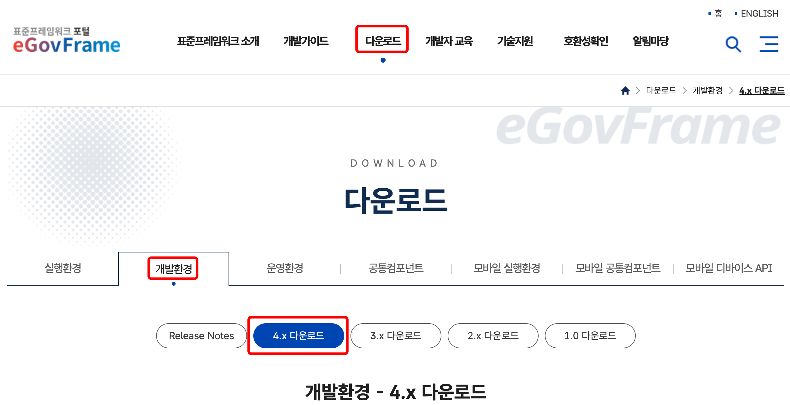

2. 운영체제에 따라 다운받을 개발환경 게시물을 선택한다.

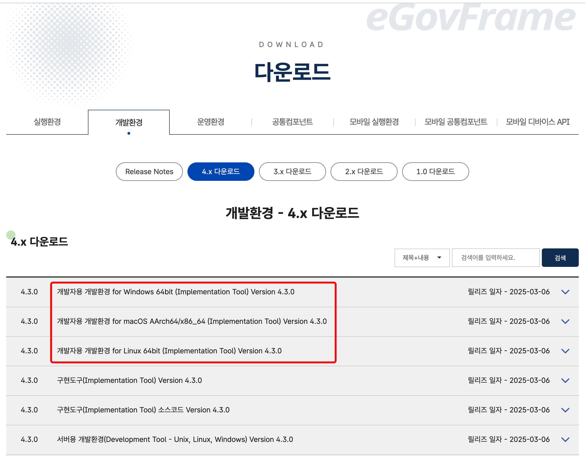

3. 첨부된 파일을 다운로드받아 압축을 해제한다.

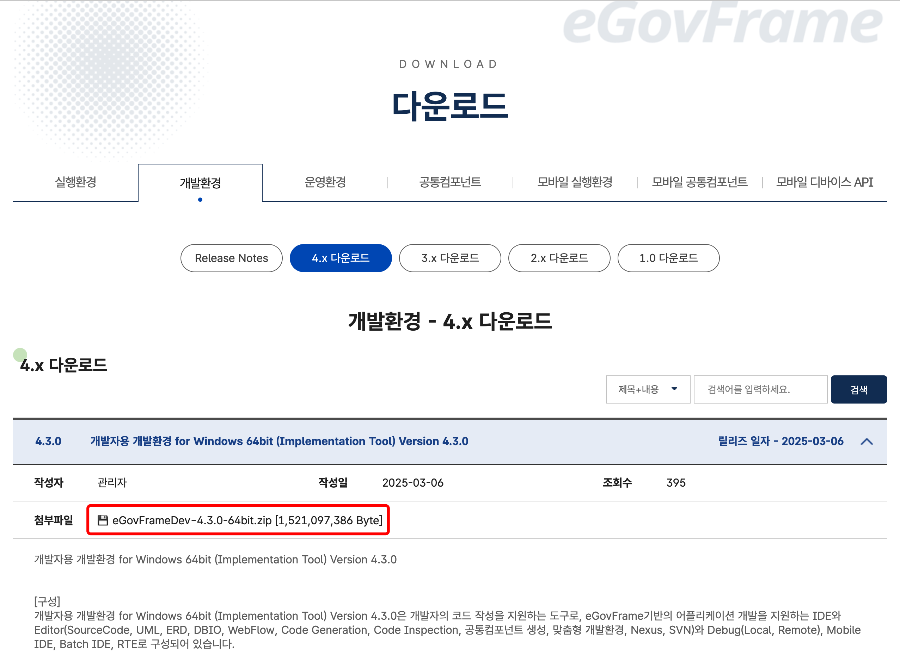

### 개발자 개발환경 실행

1. eclipse를 실행한다.

> **중요 사항**
>
> ✔ Fail to create Java Virtual Machine 오류가 발생할 경우 eclipse가 설치된 디렉토리의 **eclipse.ini** 파일에 **JVM 경로**를 지정해 주도록 한다.
> 개발자 개발환경을 사용하기 위해서는 해당 이클립스의 자바 버전이 설치되어야 한다.
> **이클립스 버전별 지원 자바 버전은 환경 설정에서 확인 가능하다.**
>
> ✔ 파일 인코딩은 **-Dfile.encoding=UTF-8** 설정을 통하여 UTF-8로 적용 가능하다.
> 이 옵션을 넣어야만 Code Generation 기능을 정상적으로 사용할 수 있다.
>
> ✔ UML에 오류가 발생할 경우 JVM 옵션으로 **–add-opens=java.desktop/java.beans=ALL-UNNAMED** 를 추가하도록 한다.
> 이 옵션의 의미는 java.desktop 모듈의 java.beans 패키지를 모든 unnamed 모듈에 대해 오픈하는 것으로서,
> classpath에 있는 코드가 java.beans 패키지의 클래스들에 접근할 수 있도록 합니다.

### 퍼스펙티브(Perspective) 전환

1. eclipse가 정상적으로 실행되면 우측 상단의 Perspective가 eGovFrame으로 되어있는지 확인한다.

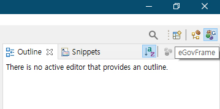

✔ 만약 Perspective가 eGovFrame이 아닐 경우 다음의 절차를 따른다.

- Perspective 좌측에 있는 아이콘을 클릭하여 "Open Perspective > eGovFrame"을 선택한다.

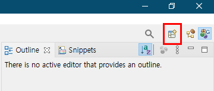
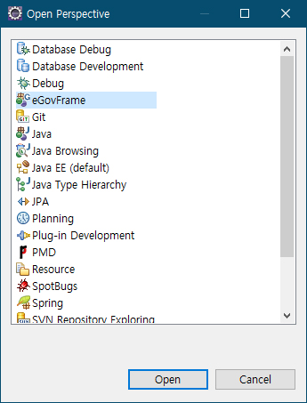

## Step 2. 프로젝트 생성 및 실행

### 프로젝트 생성

1. 메뉴 표시줄에서 **File** > **New** > **eGovFrame Web Project**를 선택한다.
   또는, **Ctrl+N** 단축키를 이용하여 새로작성 마법사를 실행한 후 **eGovFrame** > **eGovFrame Web Project**을 선택하고 **Next**를 클릭한다.

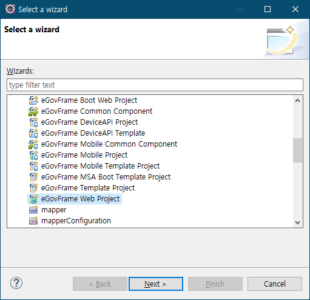

2. 프로젝트 명과 Maven 설정에 필요한 값들을 입력하고 **Next**를 클릭한다.

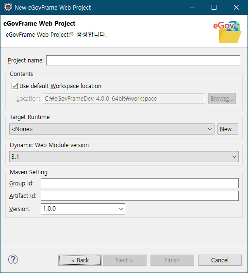

3. 예제 소스 파일 생성 여부를 체크하고 **Finish**를 클릭한다.

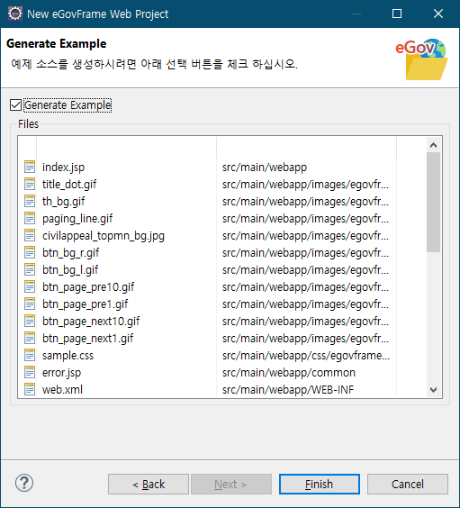

### 서버 설치

Tomcat 서버를 설치해 보도록 한다.

1. eclipse 하단의 Servers 탭을 클릭하고, 마우스 우클릭하여 "New > Server"를 선택한다.

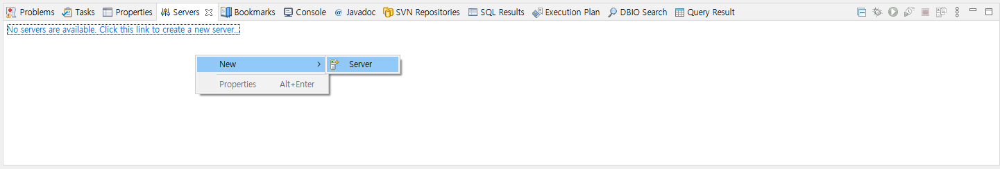

2. Apache > Tomcat v8.5 Server(또는 v9.0 Server)를 선택 후 Next를 클릭하고 Download and Install 버튼을 클릭하여 서버 설치를 완료한다.

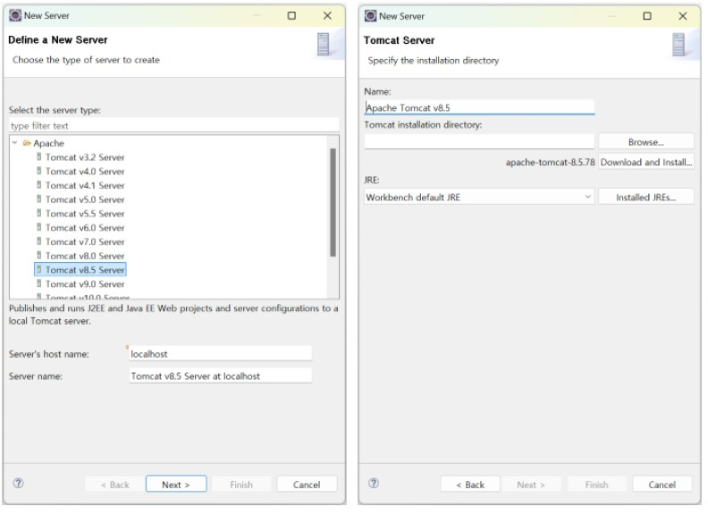

### 프로젝트 실행

1. 실행할 프로젝트를 마우스 우클릭하고 "Run As > Run on Server"를 선택한다.

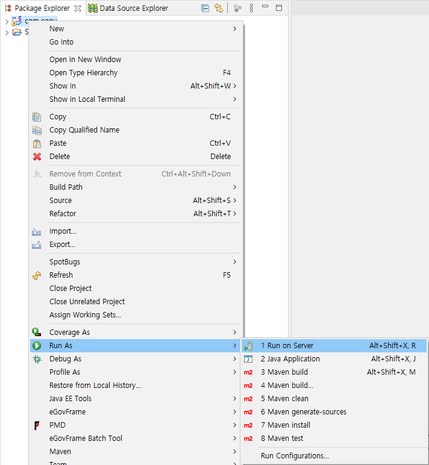

2. Choose an existing server를 선택하고 [서버 설치](#서버-설치)에서 설치한 서버를 선택 후 Next 버튼을 클릭하고 실행할 프로젝트를 Add한다.

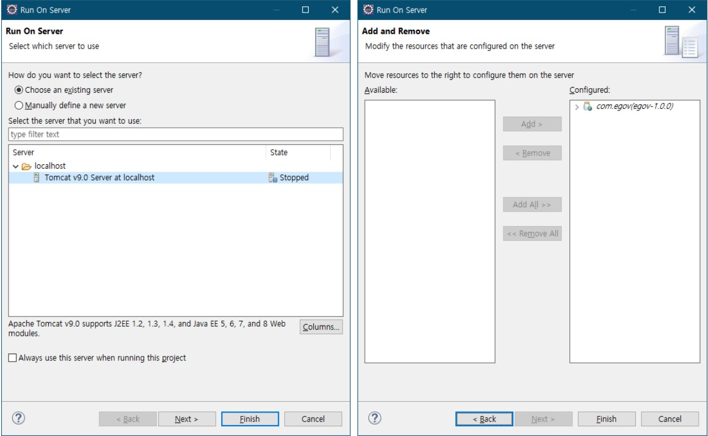

3. 다음과 같은 화면이 실행되는지 확인한다.

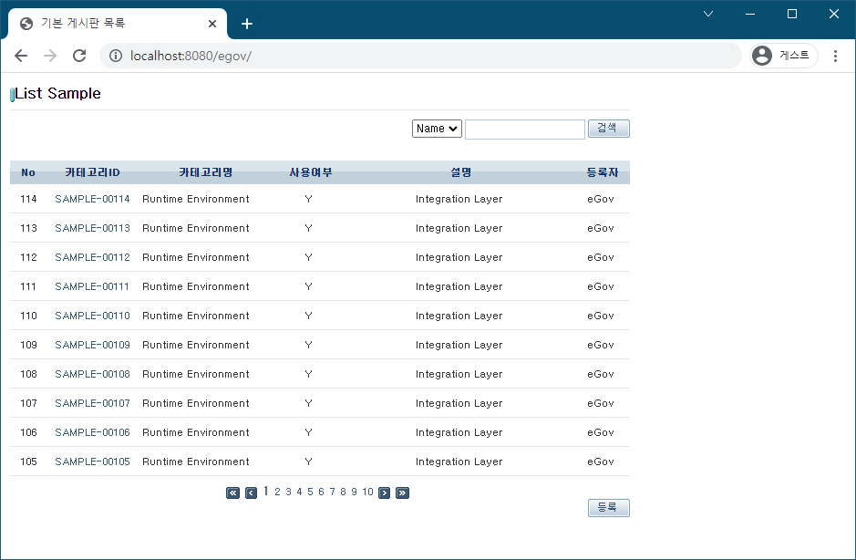

✔ 프로젝트 생성 후 "Could not open JDBC Connection for transaction" 메시지가 나타날 경우 HSQLDB 설정 가이드를 참고하여 HSQLDB를 연결한다.

## 기타 설정

### DB 정보 변경

전자정부에서는 MySql, Oracle, Altibase, Tibero, Cubrid, MariaDB, PostgreSQL을 지원한다. 본 가이드에서는 MySql로 DB 정보를 변경하는 예제를 실습해 보도록 한다.

1. pom.xml 파일에 다음과 같은 dependency를 추가한다.

```xml
<dependency>
    <groupId>org.apache.commons</groupId>
    <artifactId>commons-dbcp2</artifactId>
    <version>2.9.0</version>
</dependency>
<dependency>
    <groupId>mysql</groupId>
    <artifactId>mysql-connector-java</artifactId>
    <version>8.0.33</version>
</dependency>
```

2. context-datasource.xml 파일을 다음과 같이 수정하고 사용할 DB 정보를 입력한다.

```xml
<?xml version="1.0" encoding="UTF-8"?>
<beans xmlns="http://www.springframework.org/schema/beans"
       xmlns:xsi="http://www.w3.org/2001/XMLSchema-instance"
       xmlns:jdbc="http://www.springframework.org/schema/jdbc"
       xsi:schemaLocation="http://www.springframework.org/schema/beans http://www.springframework.org/schema/beans/spring-beans-4.0.xsd
       http://www.springframework.org/schema/jdbc http://www.springframework.org/schema/jdbc/spring-jdbc-4.0.xsd">

    <!-- 테스트 실행용 -->
    <jdbc:embedded-database id="dataSource" type="HSQL">
        <jdbc:script location="classpath:/db/sampledb.sql"/>
    </jdbc:embedded-database>

    <!-- hsql (테스트용 메모리 DB) -->
    <bean id="dataSource" class="org.apache.commons.dbcp2.BasicDataSource" destroy-method="close">
        <property name="driverClassName" value="net.sf.log4jdbc.DriverSpy"/>
        <property name="url" value="jdbc:log4jdbc:hsqldb:mem:localhost/sampledb"/>
        <property name="username" value="sa"/>
    </bean>

    <!-- Mysql -->
    <bean id="dataSource" class="org.apache.commons.dbcp2.BasicDataSource" destroy-method="close">
        <property name="driverClassName" value="com.mysql.jdbc.Driver"/>
        <property name="url" value="jdbc:mysql://127.0.0.1:3306/example"/>
        <property name="username" value="root"/>
        <property name="password" value=""/>
    </bean>

    <!-- Oracle -->
    <bean id="dataSource" class="org.apache.commons.dbcp2.BasicDataSource" destroy-method="close">
        <property name="driverClassName" value="oracle.jdbc.driver.OracleDriver"/>
        <property name="url" value="jdbc:oracle:thin:@127.0.0.1:1521:example"/>
        <property name="username" value="user"/>
        <property name="password" value="password"/>
    </bean>

</beans>
```

3. 프로젝트 마우스 우클릭 후 "Run As > Maven install"을 선택한다.

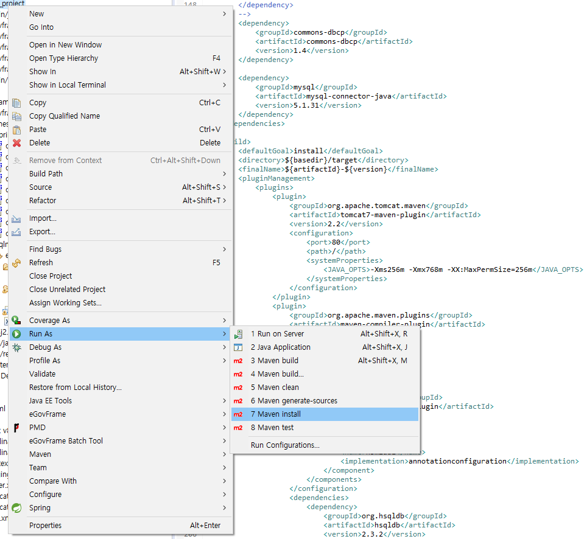

### Data Source Explorer 연결

Data Source Explorer연결 가이드를 참고한다.

### 다국어 지원 방안

✔ 개발자 개발환경의 영문 버전을 사용할 경우 eclipse 설치 디렉토리에 있는 eclipse.ini 파일을 다음과 같이 수정한다.

```
-Duser.language=en
-Duser.country=US
```

✔ 개발자 개발환경의 국문 버전을 사용할 경우 eclipse 설치 디렉토리에 있는 eclipse.ini 파일을 동일한 방법으로 수정한다.

```
-Duser.language=ko
-Duser.country=KR
```

### 성능 향상 방안

✔ 다음과 같은 설정을 통해 구현도구(eclipse)의 성능 및 속도를 높일 수 있다. 아래 설정은 필수 적용사항이 아니므로, 필요한 경우 참고자료로 활용한다.

#### 1. eclipse theme 기능 변경

1. Window » Preferences » General » Appearance » Theme를 Classic으로 변경.
   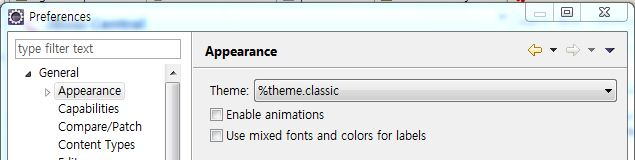
2. Use mixed fonts and colors for labels 체크를 해지
3. Apply 후 eclipse 재실행.

#### 2. eclipse.ini 파일 수정

필요에 따라 아래의 설정정보를 수정할 수 있다.메모리 설정의 경우, 각 컴퓨터의 메모리 용량에 따라 설정하여야 한다.(참고: [OpenJ9 Documentation](https://eclipse.dev/openj9/docs/xms/))

1. **Xverify:none**클래스 검사 생략. eclipse 실행 시간 단축
2. **Xms1024m**eclipse 실행 시 잡는 최소 메모리
3. **Xmx2048m**
   eclipse 실행 시 잡는 최대 메모리 (사용 가능한 메모리의 25%)
