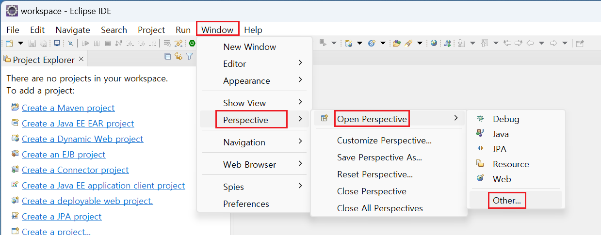

# Implementation Tool 수동 설치가이드

## 개요

본 가이드는 Eclipse에서 전자정부 프레임워크 플러그인을 설치하는 방법을 제공한다.
개발환경 4.3.0 기준으로 작성되었다.

## Step 1. 설치파일 다운로드

### Eclipse 다운로드

1. 인터넷 웹브라우저를 통해 ([eclipse 홈페이지](https://www.eclipse.org/downloads/packages/))에 접속하여 이클립스를 다운로드한다.
2. 이클립스 버전은 **4.31.0**(2024-03) 버전을 다운로드 받도록 한다.
3. 첨부된 파일을 다운로드받아 압축을 해제한다.

> ✔ C: 에 설치할 것을 권장한다.

### 플러그인 다운로드

1. 인터넷 웹브라우저를 통해 ([eGovFrame 홈페이지](https://www.egovframe.go.kr/))에 접속하여 사이트 상위메뉴를 통해 "다운로드 > 개발환경> 4.x 다운로드"으로 이동한다.

2. 구현도구 게시물을 선택한다.

3. 첨부된 파일을 다운로드받아 압축을 해제한다. 편의상 바탕화면에 압축을 풀 것을 권장한다.

## Step 2. 플러그인 설치

### Eclipse 실행

1. eclipse를 실행한다.

> **주의사항**
>
> ✔ Fail to create Java Virtual Machine 오류가 발생할 경우 eclipse가 설치된 디렉토리의 **eclipse.ini** 파일에 **JVM 경로**를 지정해 주도록 한다.
>
> ✔ 개발자 개발환경 4.3을 사용하기 위해서는 자바 17의 버전이 설치되어야 하며 OpenJDK 호환 가능하다.
>
> ✔ 플러그인 설치후 실행 시 설정파일 내부의 **한글**이 깨질 경우 **-Dfile.encoding=UTF-8** 옵션을 추가한다.

### 오픈SW 설치

1. Eclipse 창에서 Help - Install New Software를 선택한다.

2. 우측 상단의 Add 버튼을 클릭하고 다음과 같이 입력한다.

3. Pending이 되면 필요한 플러그인을 선택한다.

4. 메세지 확인 후 설치한다.
5. 설치가 완료된 후 프로그램을 재시작 한다.

> **참고**: 위의 과정과 동일하게 오픈SW 설치 정보 개발환경 설치가이드를 참고하여 필요한 플러그인을 설치한다.

### eGovFrame 플러그인 설치

#### 다운로드 파일을 통한 eGovFrame 플러그인 설치

1. Eclipse 창에서 Help - Install New Software를 선택한다.

2. 우측 상단의 Add 버튼을 클릭한 후 나오는 Add Repository 창에서 우측의 Local 버튼을 클릭한 후 다운받은 표준프레임워크 플러그인을 압축 해제한 폴더를 선택한다.

3. Pending이 되면 eGovFrame 전체를 선택한 후 Next를 누른다.

4. 약관에 동의한 후 Finish를 누른다.

5. 설치가 완료된 후 프로그램을 재시작 한다.

#### 서버를 통한 eGovFrame 플러그인 설치

1. Eclipse 창에서 Help - Install New Software를 선택한다.

2. 우측 상단의 Add 버튼을 클릭한 후 나오는 Add Repository 창에서 우측의 Location에 그림과 같이 주소를 입력한다.

3. Pending이 되면 eGovFrame 전체를 선택한 후 Next를 누른다.

4. 약관에 동의한 후 Finish를 누른다.

5. 설치가 완료된 후 프로그램을 재시작 한다.

### 정상 설치 확인

1. Eclipse 창에서 Window - Open Perspective - Other 를 클릭한다.

2. eGovFrame을 선택한 후 OK 버튼을 클릭한다.

3. 메인화면 우측 상단에서 eGovFrame Perspective를 클릭한다.
4. 메뉴에 eGovFrame 메뉴가 생긴 것을 확인한다.

## 성능 향상 방안

✔ 다음과 같은 설정을 통해 구현도구(eclipse)의 성능 및 속도를 높일 수 있다. 아래 설정은 필수 적용사항이 아니므로, 필요한 경우 참고자료로 활용한다.

### 1. eclipse theme 기능 변경

1. Window » Preferences » General » Appearance » Theme를 Classic으로 변경.

2. Use mixed fonts and colors for labels 체크를 해지
3. Apply 후 eclipse 재실행.

### 2. eclipse.ini 파일 수정

필요에 따라 아래의 설정정보를 수정할 수 있다.메모리 설정의 경우, 각 컴퓨터의 메모리 용량에 따라 설정하여야 한다. (1-2G : 256m, 2-3G, 512m, 4G- : 1024m 권장)

1. **Xverify:none**클래스 검사 생략. eclipse 실행 시간 단축
2. **Xms256m**eclipse 실행시 잡는 최소 메모리
3. **Xmx1024m**
   eclipse 실행시 잡는 최대 메모리
