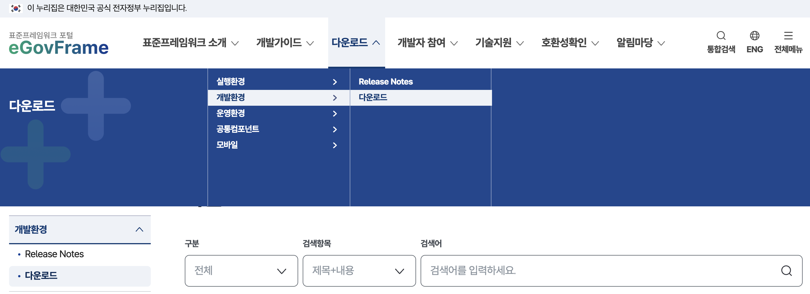
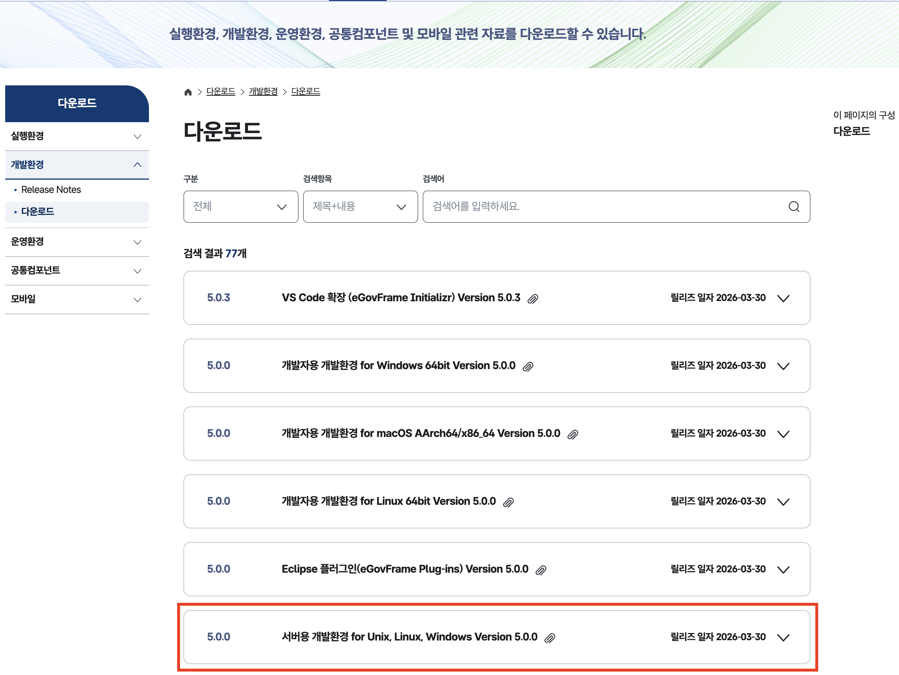
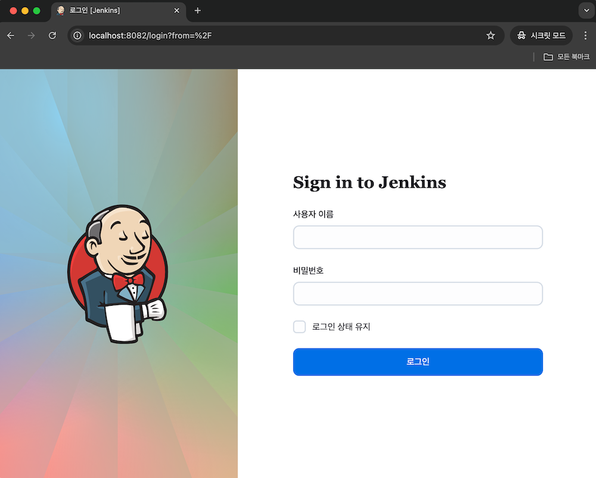
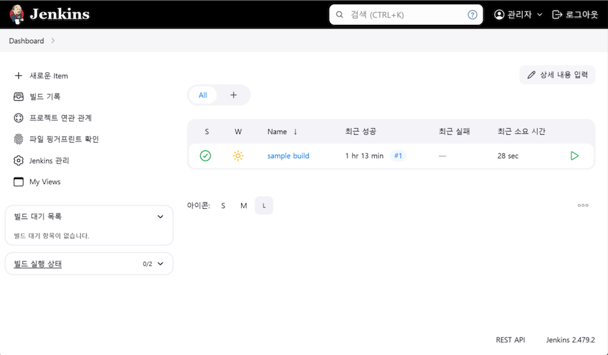
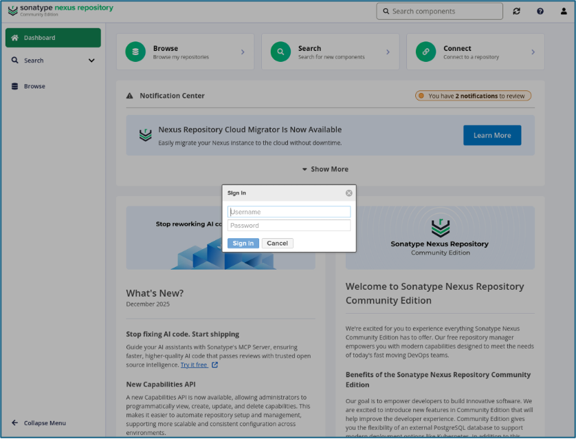
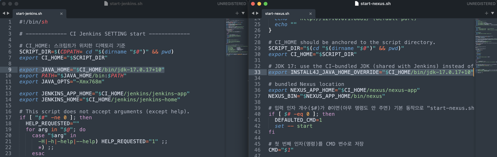

# 서버 개발환경 설치가이드

## 개요

전자정부 표준프레임워크에서 제공하는 서버 개발환경 구성 가이드를 제공한다.

## 설명

전자정부 표준프레임워크에서 제공하는 서버환경을 설치하기 위한 서버 환경 구성 가이드를 제공한다.

- **서버환경 구성(Windows)**: 윈도우 환경에서 전자정부 표준프레임워크이 제공하는 설치파일을 이용하여 서버 환경을 구성한다.
- **서버환경 구성(Unix 계열)**: Unix 계열(Aix, Linux, Solaris) 환경에서 전자정부 표준프레임워크이 제공하는 설치파일을 이용하여 서버 환경을 구성한다.
- **설치가이드**: 윈도우 환경 및 Unix 계열 설치가이드는 동일하며, Unix계열의 SVN 설치가이드를 별도로 제공한다.
  - [[표준프레임워크] CI 및 Nexus 환경구축 가이드](https://maven.egovframe.go.kr/publist/HDD1/public/egovframework_v5.0/2_DevelopmentEnvironment/eGovFrame-CI/guide/[표준프레임워크v5.0]CI및Nexus환경구축가이드.pdf)
  - [SVN 설치 가이드(리눅스용)](https://maven.egovframe.go.kr/publist/HDD1/public/egovframework_v5.0/2_DevelopmentEnvironment/eGovFrame-CI/guide/svn-installation-guide.pdf)

## 설치가이드

### 서버 개발환경 다운로드

1. 인터넷 웹브라우저를 통해 [eGovFrame 홈페이지](https://www.egovframe.go.kr/)에 접속하여 사이트 상위메뉴를 통해 "다운로드 > 개발환경> 다운로드" 화면으로 이동한다.

2. 서버 개발환경 게시물을 선택한다.

3. OS에 맞춰 첨부된 파일을 다운로드받아 압축을 해제한다.

### 서버환경 구성(Windows)

#### 1. 설치 파일

- eGovCI-5.0.0-Windows-64bit.zip (64bit용) 파일의 압축을 풀어 설치를 진행한다.

#### 2. 환경 정보

- Apache-ant-1.10.15
- Apache-maven-3.9.9
- Jenkins 2.528.3 (LTS)
- Nexus Repository 3.86.2
- OpenJDK 17.0.17+10 (LTS)
- VisualSVN-Server-5.4.4-x64.msi - 64bit

> ※ **주의사항**
> 
> - Nexus와 Jenkins는 JDK 17이상, svn은 별도로 설치 필요
> - TOMCAT 메모리 설정이 필요한 경우 : start-xxxxx.bat(시작파일)파일에서 set JAVA_OPTS 설정을 변경
> - 시작파일 : start-xxxxx.bat

#### 3. 포트 변경

- Jenkins : start-jenkins.bat 파일에서 –httpPort의 값을 수정
- Nexus : {CI-HOME}\nexus/sonatype-work/nexus3/etc/nexus.properties 파일에서 application-port의 값을 수정

#### 4. 서비스 실행

- Jenkins(CI) 실행
  - 서비스 실행 : `{CI-HOME}\start-jenkins.bat`

- Nexus 실행
  - 서비스 등록 : `{CI-HOME}\start-nexus.bat install` (관리자의 권한으로 실행된 cmd 또는 PowerShell에서 명령 실행)
  - 서비스 실행 : `{CI-HOME}\start-nexus.bat start`

> ※ **주의사항**
> 
> Nexus 서비스 등록은 Nexus 서비스 미등록 상태에서 Nexus 서버 구동 전 최초 1회에 한해 필요하다.

#### 5. 서비스 실행 확인

- Jenkins(CI) 확인

  - http://localhost:8082/ 로 들어가서 확인한다.

    

  - Jenkins(CI)가 정상작동하는지 확인한다.

    

- Nexus 확인

  - http://localhost:8081/nexus/ 로 들어가서 확인한다.

    

> ※ **주의사항**
>
> - 포트번호 3690 (SVN포트)과 8082 (JENKINS 포트) , 8081 (NEXUS 포트)이 방화벽으로 막혀있다면 방화벽설정에서 3690과 8081, 8082 포트를 허용해 주어야 한다.
> - Subversion(SVN) 설치 및 관리는 지원하지 않는다.(사용자 자체설치)

### 서버환경 구성(Unix 계열)

#### 1. 설치 파일

- eGovCI-5.0.0-Linux-64bit.tar.gz 파일의 압축을 풀어 설치를 진행한다.

#### 2. 환경 정보

- Apache-ant-1.10.15
- Apache-maven-3.9.9
- Jenkins 2.528.3 (LTS)
- Nexus Repository 3.86.2
- OpenJDK 17.0.17+10 (LTS) - OS_NAME="Linux", OS_ARCH="x86_64"

> ※ **주의사항**
>
> - Nexus와 Jenkins는 JDK 17이상, svn은 별도로 설치 필요
> - JAVA_HOME 설정이 필요한 경우 :
>   - start-jenkins.sh 파일에서 `export INSTALL4J_JAVA_HOME_OVERRIDE`를 강제로 지정
>   - start-nexus.sh 파일에서 `export JAVA_HOME`을 강제로 지정
> - TOMCAT 메모리 설정이 필요한 경우 : start-nexus.sh(환경설정)파일에서 CI_OPTS 설정을 변경
> - 실행파일 : start-xxxxx.sh

#### 3. 서버별 JDK 설정

- JDK는 사용자에 의해 시스템별로 자체 설치한다.(서버용 개발환경에서 기본으로 제공하는 JDK는 Linux x86_64 전용임)

- JDK PATH 설정 필요

  

#### 4. 포트 변경

- Jenkins : start-jenkins.sh 파일에서 –httpPort의 값을 수정
- Nexus : {CI-HOME}\nexus/sonatype-work/nexus3/etc/nexus.properties 파일에서 application-port의 값을 수정

#### 5. 서비스 실행

- Jenkins(CI) 실행
  - 서비스 실행 : `{CI-HOME}/start-jenkins.sh `

- Nexus 실행
  - 서비스 실행 : `{CI-HOME}/start-nexus.sh start`

#### 6. 서비스 실행 확인

- Jenkins(CI) 확인

  - http://localhost:8082/ 로 들어가서 확인한다.

    

  - Jenkins(CI)가 정상작동하는지 확인한다.

    

- Nexus 확인

  - http://localhost:8081/nexus/ 로 들어가서 확인한다.

    

> ※ **주의사항**
>
> - 포트번호 3690 (SVN포트)과 8082 (JENKINS 포트) , 8081 (NEXUS 포트)이 방화벽으로 막혀있다면 방화벽설정에서 3690과 8081, 8082 포트를 허용해 주어야 한다.
> - Subversion(SVN) 설치 및 관리는 지원하지 않는다.(사용자 자체설치)