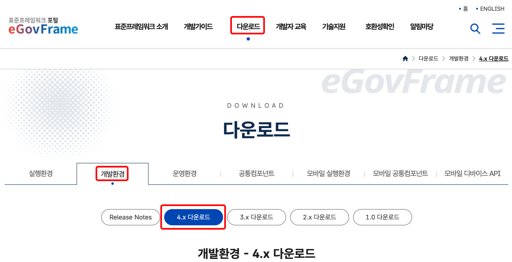

# 서버 개발환경 4.3.0 설치가이드

## 개요

전자정부 표준프레임워크에서 제공하는 서버 환경 4.3.0 구성 가이드를 제공한다.

## 설명

전자정부 표준프레임워크에서 제공하는 서버환경을 설치하기 위한 서버 환경 구성 가이드를 제공한다.

- **서버환경 구성(Windows)**윈도우 환경에서 전자정부 표준프레임워크에서 제공하는 설치파일을 이용하여 서버 환경을 구성한다.
- **서버환경 구성(Unix 계열)**Unix 계열(Aix, Linux, Solaris) 환경에서 eGovFrame에서 제공하는 설치파일을 이용하여 서버 환경을 구성한다.
- **설치가이드**윈도우 환경 및 Unix 계열 설치가이드는 동일하며, Unix계열의 SVN 설치가이드를 별도로 제공한다.
  - [[표준프레임워크] CI 및 Nexus 환경구축 가이드 v4.3](https://www.egovframe.go.kr/wiki/lib/exe/fetch.php?media=egovframework:dev4.3:egovci-4.3.0-installation-guide.pdf)
  - [SVN 설치 가이드(리눅스용)](https://www.egovframe.go.kr/wiki/lib/exe/fetch.php?media=egovframework:dev4.0:svn-installation-guide.pdf)

## 설치가이드

### 서버 개발환경 다운로드

1. 인터넷 웹브라우저를 통해 [eGovFrame 홈페이지](https://www.egovframe.go.kr/)에 접속하여 사이트 상위메뉴를 통해 "다운로드 > 개발환경> 4.x 다운로드"으로 이동한다.

2. 서버 개발환경 게시물을 선택한다.

3. OS에 맞춰 첨부된 파일을 다운로드받아 압축을 해제한다.

### 서버환경 구성(Windows)

#### 1. Install 구성

- eGovCI-4.3.0_64bit.zip (64bit용) 파일의 압축을 풀어 설치를 진행한다.

#### 2. 설치환경

- Apache-ant-1.10.15
- Apache-maven-3.9.9
- Jenkins 2.479.2 LTS
- Nexus OSS 2.15.2-03
- OpenJDK 1.8(8u432b06), OpenJDK 17(17.0.13+11)
- VisualSVN-Server-5.4.3-x64.msi - 64bit

> **참고사항**
> Nexus는 JDK 1.8 필요, Jenkins는 JDK 17이상, svn은 별도로 설치 필요
> TOMCAT 메모리 설정이 필요한 경우 : start-xxxxx.bat(시작파일)파일에서 set JAVA_OPTS 설정을 변경
> 시작파일 : start-xxxxx.bat

#### 3. 설치 구성 내역

- 사용 포트 변경

  * Jenkins : start-jenkins.bat 파일에서 –httpPort의 값을 수정
  * Nexus : {CI-HOME}\app\nexus-2.15.2-03-bundle\nexus-2.15.2-03\conf\nexus.properties 파일에서 application-port의 값을 수정
- 서비스 실행은 {CI-HOME}\start-jenkins.bat 파일을 관리자권한으로 수행하여 진행한다.
- Jenkins(CI) 설치확인

  * http://localhost:8082/ 로 들어가서 확인한다.

    

  * Jenkins(CI)가 정상작동하는지 확인한다.

    

- Nexus 설치확인

  * http://localhost:8081/nexus/ 로 들어가서 확인한다.

    

  * Nexus의 repository가 정상적으로 보이는지 확인한다.

    

> **✔ 주의사항**
>
> - 포트번호 3690 (SVN포트)과 8082 (JENKINS 포트) , 8081 (NEXUS 포트)이 방화벽으로 막혀있다면 방화벽설정에서 3690과 8081, 8082 포트를 허용해 주어야 한다.
> - Subversion(SVN) 설치 및 관리는 지원하지 않는다.(사용자 자체설치)

### 서버환경 구성(Unix 계열)

#### 1. Install 구성

- eGovCI-4.3.0.tar.gz 파일의 압축을 풀어 설치를 진행한다.

#### 2. 설치환경

- Apache-ant-1.10.15
- Apache-maven-3.9.9
- Jenkins 2.479.2 LTS
- Nexus OSS 2.15.2-03

> **✔ 주의사항**
>
> - Nexus - JDK 8 필요, Jenkins - JDK 17이상 필요, svn은 별도로 설치 필요
> - JAVA_HOME 설정이 필요한 경우 : setEnv.sh(환경설정)파일에서 export JAVA_HOME을 강제로 지정할 것
> - TOMCAT 메모리 설정이 필요한 경우 : setEnv.sh(환경설정)파일에서 CI_OPTS 설정을 변경
> - 실행파일 : start-xxxxx.sh

#### 3. 서버별 JDK 설정

- JDK 설치는 사용자에 의해 시스템별로 자체 설치한다.(서버용 개발환경에서 지원하지 않음)

  

- JDK PATH 설정 필요

#### 4. SVN 설치

- SVN(Subversion) 설치는 사용자에 의해 시스템별로 자체 설치한다.(서버용 개발환경에서 지원하지 않음)

#### 5. 설치 구성 내역

- Windows 환경 부분 참고
