# VS Code Extension 설치 가이드

## 개요

본 가이드는 Visual Studio Code(이하 VS Code)에서 전자정부 표준프레임워크 확장(Extension)을 설치하는 방법을 안내한다.

VS Code용 표준프레임워크 Extension의 명칭은 **eGovFrame Initializr in VSCode** 이다.

설치 방법은 다음 3가지 중에서 선택할 수 있다.
1. VS Code Marketplace에서 설치
2. 확장 패키지 파일(VSIX)로 설치
3. egovframe 프로필을 가져와 일괄 설치

## 요구사항

본 확장은 VS Code **October 2023 (version 1.84.0)** 이상에서 정상 동작한다. VS Code 버전이 1.84.0 미만이라면 최신 버전으로 업데이트한다.

VS Code 버전 확인 방법은 다음과 같다.
- Windows/Linux : 상단 "도움말(Help)" 메뉴 클릭 → "정보" 메뉴 클릭 → 버전
- macOS : 상단 "Code" 메뉴 클릭 → "Visual Studio Code 정보" 메뉴 클릭 → 버전

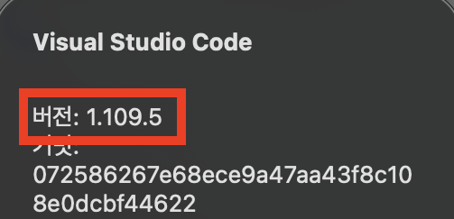

VS Code를 최신 버전으로 업데이트하는 방법은 다음과 같다.
- Windows : 상단 "도움말(Help)" 메뉴 클릭 → "업데이트 확인(Check for Updates)" 메뉴 클릭 → 업데이트 완료까지 잠시 대기 → "다시 시작 및 업데이트(Restart to Update)" 메뉴 클릭
- macOS : 상단 "Code" 메뉴 클릭 → "업데이트 확인(Check for Updates)" 메뉴 클릭 → 업데이트 완료까지 잠시 대기 → "다시 시작 및 업데이트(Restart to Update)" 메뉴 클릭

## 설치 방법 1. VS Code Marketplace에서 설치

### 설치 개요

외부 인터넷망 연결이 허용되어야 한다. 가장 일반적이고 간단한 설치 방법이다.

아래 방법으로 설치하면 기본적으로 최신 버전이 설치된다. 특정 버전을 설치하려면 확장 상세 화면에서 "설치" 버튼 우측의 톱니바퀴 아이콘을 클릭한 뒤 "특정 버전 설치" 메뉴를 이용한다. 가능하면 최신 버전 설치를 권장한다.

### 설치 방법

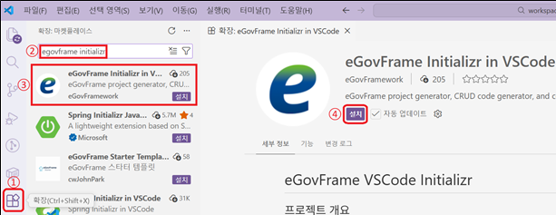

#### ⓵ 확장(Extension) 화면 열기

Activity Bar에서 확장(Extension) 아이콘을 클릭한다.

또는 다음 단축키로도 확장(Extension) 창을 열 수 있다.
- Windows/Linux : `ctrl + shift + X`
- macOS : `cmd + shift + X`

#### ⓶ Extension 검색

검색 입력란에 다음 텍스트를 입력한다: `eGovFrame Initializr in VSCode`

#### ⓷ Extension 창 열기

검색 결과 목록에서 eGovFrame Initializr in VSCode를 클릭하여 eGovFrame Initializr in VSCode 창을 연다.

#### ⓸ 설치

eGovFrame Initializr in VSCode 창 안에서 설치 버튼을 클릭하여 Extension을 설치한다.

#### ⓹ 재시작

명령 팔레트(Command Palette)를 열고 `Developer: Reload Window` 명령을 실행한다.
- Windows/Linux : `ctrl + shift + p` → `Developer: Reload Window`
- macOS : `cmd + shift + P` → `Developer: Reload Window`

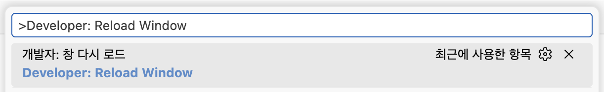

## 설치 방법 2. 확장 패키지 파일(VSIX)로 설치

### 설치 개요

특정 버전의 패키지 파일(VSIX)만 다운로드되어 있다면, 확장 설치를 위해 외부 인터넷망 연결이 불필요하다.

### 설치 방법

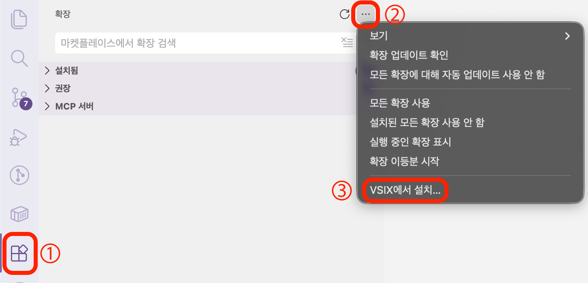

#### 🄋 Extension 패키지 파일(VSIX) 다운로드

[표준프레임워크 포털 - 개발환경 다운로드 메뉴](https://www.egovframe.go.kr/home/sub.do?menuNo=104) → "VS Code 확장 (eGovFrame Initializr) Version 5.0.x" 게시물 → 첨부파일에 vsix파일 다운로드

#### ⓵ 확장(Extension) 화면 열기

Activity Bar에서 확장(Extension) 아이콘을 클릭한다.

또는 다음 단축키로도 확장(Extension) 창을 열 수 있다.
- Windows/Linux : `ctrl + shift + X`
- macOS : `cmd + shift + X`

#### ⓶ 더 보기 클릭

Primary Sidebar에서 우측 상단 "···(보기 및 기타 작업)" 아이콘을 클릭

#### ⓷ VSIX 파일 선택

"···(보기 및 기타 작업)" 메뉴에서 "VSIX에서 설치" 메뉴를 클릭한다. 그 후 앞서 다운로드한 VSIX 파일을 선택하고 "설치" 버튼을 클릭한다.

설치가 완료될 때까지 잠시 대기한다.

#### ⓸ 재시작

명령 팔레트(Command Palette)를 열고 `Developer: Reload Window` 명령을 실행한다.
- Windows/Linux : `ctrl + shift + p` → `Developer: Reload Window`
- macOS : `cmd + shift + P` → `Developer: Reload Window`

## 설치 방법 3. egovframe 프로필을 가져와 일괄 설치

### 설치 개요

외부 인터넷망 연결이 허용됨을 전제한다.

egovframe 프로필에는 VS Code에서 표준프레임워크 프로젝트를 원활히 편집하고 구동하기 위해 **최소**한의 **필수** 또는 **편의** 확장들이 포함되어 있다. VS Code에 이 프로필을 적용하면, 프로필에 포함된 확장들이 외부 인터넷망을 통해 자동으로 다운로드된다.

egovframe 프로필을 가져와 확장들을 일괄 설치하면, 여러 확장을 개별로 설치하는 번거로움을 줄일 수 있다.

### Extension 구성

아래에 나열된 확장들이 다운로드된다. 그 밖에 필요한 확장이 있다면 추가로 설치해도 무방하다.

#### eGovFrame VSCode Extension
- eGovFrame Initializr in VSCode / eGovFramework
#### Java Extensions
- Extension Pack for Java / Microsoft
- Language Support for Java™ for Visual Studio Code / Red Hat
- Project Manager for Java / Microsoft
- Maven for Java / Microsoft
- Gradle for Java / Microsoft
- Test Runner for Java / Microsoft
- Debugger for Java / Microsoft
#### Spring & Spring Boot Extensions
- Spring Boot Dashboard / Microsoft
- Spring Boot Tools / VMware
- Spring Initializr Java Support / Microsoft
#### Server Extensions
- Community Server Connectors / Red Hat
- Runtime Server Protocol UI / Red Hat
#### 기타
- HTML CSS Support / ecmel
- XML / Red Hat
- Properties Editor / kuju63
- Docker / Microsoft
- Container Tools / Microsoft
- Auto Rename Tag / Jun Han
- Korean Language Pack for Visual Studio Code / Microsoft

### 설치 방법

#### ⓵ egovframe 프로필 다운로드

아래 링크를 클릭하여 VS Code용 egovframe 프로필 파일을 다운로드한다.

[egovframe 프로필](https://maven.egovframe.go.kr/publist/HDD1/public/egovframework_v5.0/2_DevelopmentEnvironment/eGovFrame-VSCode-Extension/egovframe.code-profile.zip)

#### ⓶ 프로필 창 열기

명령 팔레트(Command Palette)를 열고 `Preferences: Open Profiles (UI)` 명령을 실행하여 프로필 창을 연다.
- Windows/Linux : `ctrl + shift + p` → `Preferences: Open Profiles (UI)`
- macOS : `cmd + shift + P` → `Preferences: Open Profiles (UI)`

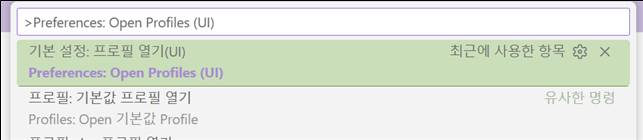

또는 GUI로도 프로필 창을 열 수 있다.
- VS Code 우측 하단 "Settings" 아이콘 → "Profile" 메뉴 → "Profiles" 메뉴

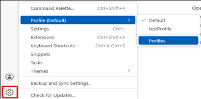

#### ⓷ 프로필 가져오기

프로필 창에서 "새 프로필" 옆 “v” → "프로필 가져오기" 메뉴

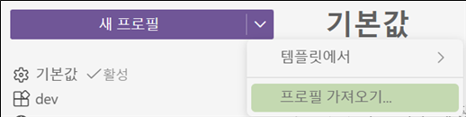

상단에 "파일 선택" 메뉴

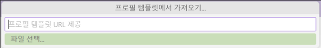

다운로드한 egovframe 프로필 선택 → 열기

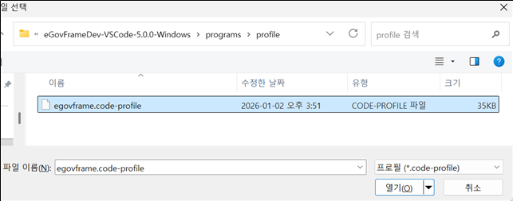

#### ⓸ 프로필 생성 및 적용

egovframe 프로필 화면 하단에 "만들기" 버튼 클릭

"✓(현재 창에 이 프로필 사용)" 버튼 클릭

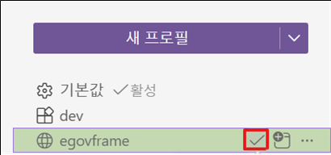

현재 창에 egovframe 프로필 적용 완료

이후 확장 자동 설치가 완료될 때까지 대기한다.

#### ⓹ 재시작

명령 팔레트(Command Palette)를 열고 `Developer: Reload Window` 명령을 실행한다.
- Windows/Linux : `ctrl + shift + p` → `Developer: Reload Window`
- macOS : `cmd + shift + P` → `Developer: Reload Window`

## 설치 결과

Activity Bar에 eGovFrame Initializr in VSCode 아이콘(e)이 뜬다.

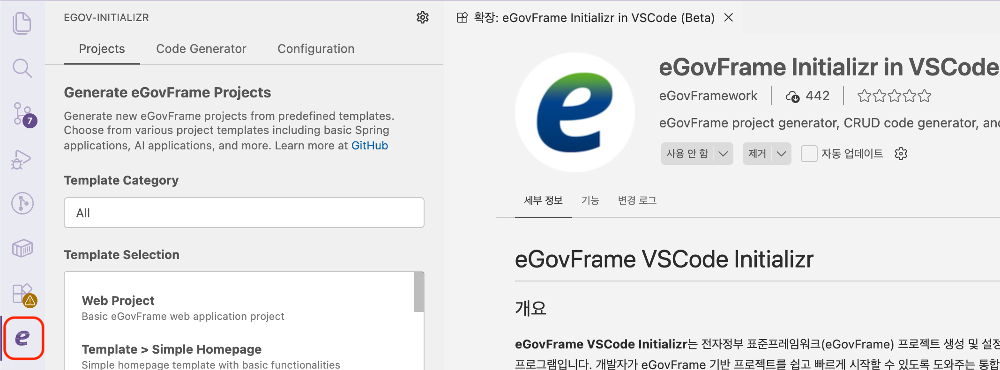