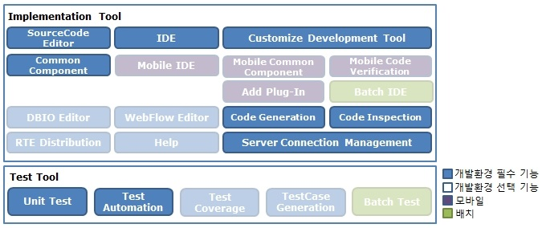

# 개발자 개발환경

## 개요

전자정부 표준프레임워크를 사용하는 개발자를 위한 개발환경에 대해 설명한다.

## 설명

개발자용 개발환경에서는 필수 기능으로 구성된 경량 개발환경과 필수 기능, 선택 기능 모두로 구성된 통합 개발환경을 제공한다.

### 경량 개발환경

전자정부 표준프레임워크에서는 개발환경을 경량화하기 위해 개발자들이 필수적으로 사용하는 기능을 선별하여 선별된 기능만이 설치되어 있는 경량 개발환경을 제공한다. 또한 필수 기능 이외의 기능들은 맞춤형 개발 도구를 통해 선택적으로 구성할 수 있도록 한다.

#### 구성도

Implementation Tool과 Test Tool에서 제공하는 전체 기능 중 개발자들이 필수적으로 사용하는 기능은 SourceCode Editor, IDE, Common Component, Customize Development Tool, Code Generation, Code Inspection, Server Connection Management, Unit Test, Test Automation 이다. 경량 개발환경은 위의 기능들로 구성되어 있다.

#### 구성내역

| 제공기능                     | 소프트웨어        | 설명                                                                                                                                                                |
| ---------------------------- | ----------------- | ------------------------------------------------------------------------------------------------------------------------------------------------------------------- |
| SourceCode Editor            | Eclipse           | Java 기반 개발 플랫폼                                                                                                                                               |
| IDE                          | eGovFrame IDE     | 전자정부 표준프레임워크 기반의 어플리케이션 개발 시 개발자 편의성을 위하여 eclipse기반의 Perspective, Menu, 프로젝트 생성 마법사, 템플릿 생성 마법사 등을 제공한다. |
| Common Component             | eGovFrame IDE     | 개발자의 편의성을 위하여 eGovFrame기반의 공통컴포넌트 254종의 설치 마법사를 제공한다.                                                                               |
| Server Connection Management | eGovFrame IDE     | 이클립스 도구를 통해 서버 연동 정보 관리를 용이하게 하는 기능을 제공한다.                                                                                           |
| Customize Development Tool   | eGovFrame IDE     | 전자정부 표준프레임워크에서는 프로젝트에서 필요 기능만을 선택적으로 구성할 수 있는 도구를 제공한다.                                                                 |
| Code Generation              | eGovFrame CodeGen | 전자정부 표준프레임워크 개발환경의 필수 기능인 템플릿 기반 Code Gen, 모델 기반 Code Gen이 포함되어 있다.                                                            |
| Code Inspection              | PMD, FindBugs     | 작성된 소스코드의 오류를 검사하는 도구이다.                                                                                                                         |
| Unit Test                    | JUnit             | 단위테스트 프레임워크로써 Eclipse 4.31.0에서 기본적으로 제공된다. (JUnit 4.13.2)                                                                                    |
| Test Automation              |                   | 개발자가 작성한 다수의 단위테스트 클래스(TestCase) 및 TestSuite을 자동으로 수행하고 그 결과 리포트를 생성하는 기능을 제공한다.                                      |

### 통합 개발환경

통합개발환경은 개발자들이 필수적으로 사용하는 기능과 개발의 편의성 향상을 위해 선택적으로 사용하는 기능이 모두 설치되어 있는 개발환경이다.

#### 구성도

통합 개발환경은 개발자 필수 기능, 선택 기능과 함께 모바일 개발환경이 포함되어 있다.

#### 구성내역

| 제공기능                     | 소프트웨어                   | 설명                                                                                                                                                                                                  |
| ---------------------------- | ---------------------------- | ----------------------------------------------------------------------------------------------------------------------------------------------------------------------------------------------------- |
| SourceCode Editor            | Eclipse                      | Java 기반 개발 플랫폼                                                                                                                                                                                 |
| IDE                          | eGovFrame IDE                | 전자정부 표준프레임워크 기반의 어플리케이션 개발 시 개발자 편의성을 위하여 eclipse기반의 Perspective, Menu, 프로젝트 생성 마법사, 템플릿 생성 마법사 등을 제공한다                                    |
| Common Component             | eGovFrame IDE                | 개발자의 편의성을 위하여 eGovFrame기반의 웹 공통 컴포넌트 254종의 설치 마법사를 제공한다.                                                                                                             |
| Customize Development Tool   | eGovFrame IDE                | 프로젝트에서 필요 기능만을 선택적으로 구성할 수 있는 도구를 제공한다.                                                                                                                                 |
| Server Connection Management | eGovFrame IDE                | 전자정부 표준프레임워크 개발환경의 서버 연동 정보 관리 기능이다.                                                                                                                                      |
| Mobile IDE                   | eGovFrame mIDE               | 전자정부 표준프레임워크 기반의 모바일 어플리케이션 개발 시 개발자 편의성을 위하여 eclipse기반의 Perspective, Menu, 모바일 표준 소스 코드 생성 마법사, 모바일 사이트 템플릿 생성 마법사 등을 제공한다. |
| Mobile Common Component      | eGovFrame mIDE               | 개발자의 편의성을 위하여 eGovFrame기반의 기존 웹 공통 컴포넌트 251종 중 게시판, 행사관리, 온라인 참여 등과 모바일 신규 공통 컴포넌트의 설치 마법사를 제공한다.                                        |
| Mobile Code Verification     | eGovFrame mIDE               | eGovFrame 모바일 프로젝트를 기반으로 생성한 소스 코드의 웹 표준 준수 여부를 검증하는 기능을 제공한다.                                                                                                 |
| Add plug-In                  | eGovFrame mIDE               | 전자정부 표준프레임워크에서는 모바일 기반의 프로젝트에서 필요 기능만을 선택적으로 구성할 수 있는 도구를 제공한다.                                                                                     |
| Batch IDE                    | eGovFrame bIDE               | 전자정부 표준프레임워크 기반의 배치 어플리케이션 개발 시 개발자 편의성을 위하여 eclipse기반의 Perspective, Menu, 배치 템플릿 생성 마법사 등을 제공한다.                                               |
| Code Generation              | eGovFrame CodeGen            | 전자정부 표준프레임워크 개발환경의 필수 기능인 템플릿 기반 Code Gen, 모델 기반 Code Gen이 포함되어 있다.                                                                                              |
| Code Inspection              | PMD, FindBugs                | 작성된 소스코드의 오류를 검사하는 도구이다.                                                                                                                                                           |
| DBIO Editor                  | eGovFrame DBIO               | DataBase 접근에 관한 표준적인 방법을 제공하는 Editor 이다.                                                                                                                                            |
| RTE Distribution             | eGovFrame RTE Distribution   | 전자정부 Runtime Environment Distribution 에디터이다.                                                                                                                                                 |
| WebFlow Editor               | Spring WebFlow               | Spring WebFlow 설정 파일의 유효성 검사 및 에디팅을 위한 유용한 기능을 제공한다.                                                                                                                       |
| Help                         | eGovFrame Help               | 전자정부 개발환경에 대한 도움말을 제공한다.                                                                                                                                                           |
| Unit Test                    | JUnit                        | 단위 테스트 프레임워크로써 Eclipse 4.31.0에서 기본적으로 제공된다. (JUnit 4.13.2)                                                                                                                     |
| Test Automation              |                              | 개발자가 작성한 다수의 단위테스트 클래스(TestCase) 및 TestSuite을 자동으로 수행하고 그 결과 리포트를 생성하는 기능을 제공한다.                                                                        |
| Test Coverage                | EclEmma                      | 개발자가 작성한 코드에 대해 테스트 코드가 있는지 그 커버하는 정도를 알려주고 그 결과를 리포팅하는 것에 대해 설명한다.                                                                                 |
| TestCase Generation          | eGovFrame TestCase Generator | 전자정부 표준프레임워크의 아키텍처 Tier별 테스트케이스 템플릿 생성 및 상황별 테스트케이스에 대한 코드블럭의 예시를 제공한다.                                                                          |
| Batch Test                   | JUnit                        | 배치 작업 테스트 마법사로써 전자전부 표준프레임워크 배치개발환경을 통해 생성한 배치 관련 구성을 모아 배치 테스트를 진행하는 마법사를 제공된다. (JUnit 4.13.2)                                         |

## 사용법

개발환경을 [다운로드](https://www.egovframe.go.kr)하여 설치할 디렉토리에 압축을 해제한 후 eclipse를 실행하면 개발환경을 사용할 수 있다.

맞춤형 개발환경을 구성하기 위해서는 Perspective를 eGovFrame으로 변경한 후 상단에 있는 eGovFrame통합메뉴의 Configuration > Customize Development Tool을 열고 필요한 기능만을 선택하여 설치한다.

사용시 기술지원은 포털의 질의응답을 이용할 수 있다.
