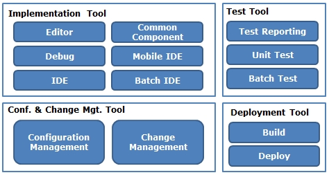
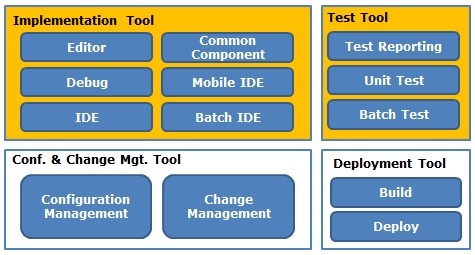
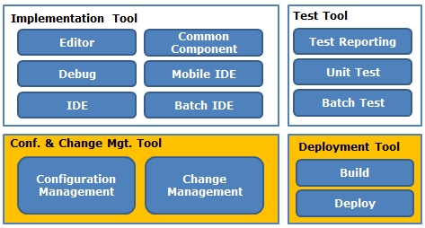
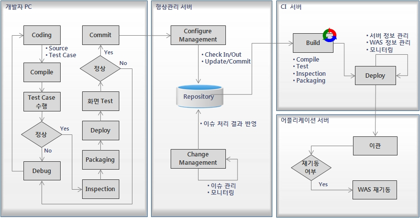

# 개발프레임워크 개발환경 소개

## 개요

전자정부 표준프레임워크의 개발환경에 대해 전체적인 개요를 설명한다.

## 설명

### 개발환경 목표

전자정부 표준프레임워크 개발환경은 비즈니스 프로그램 개발, 버전관리, 단위 테스트, 빌드 등의 개발 Life-Cycle 전반에 대한 지원 도구를 제공한다.

- Implementation Tool
- Test Tool
- Configuration & Change Management Tool
- Deployment Tool

| 구성요소                         | 설명                                                                      |
| -------------------------------- | ------------------------------------------------------------------------- |
| Implementation Tool              | 프로그램 개발, 테스트, 디버그 등 개발자 개별 개발환경을 제공              |
| Test Tool                        | 개발 프로그램에 대한 단위 테스트용 프로그램 작성 및 개별 배치 테스트 지원 |
| Conf. & Change & Batch Mgt. Tool | 개발 프로그램에 대한 형상 식별, 버전관리, 이슈 관리 및 모니터링 도구 제공 |
| Deployment Tool                  | CI (Continuous Integration)와 서버 이관 관련 도구 제공                    |

### 개발자 개발환경과 서버 개발환경

#### 개발자 개발환경

개발자 개발환경은 Implementation Tool(Editor, Debug, IDE, Common Component, Mobile IDE, Batch IDE)과 Test Tool(Test Reporting, Unit Test, Batch Test)로 구성되어있다.

개발자 개발환경의 세부 기능을 좀 더 자세히 살펴보면 **개발자들이 필수적으로 사용해야 하는 기능**과 **개발 편의성을 위해 선택적으로 사용하는 기능**으로 구분됨을 알 수 있다.

이에 따라 전자정부 표준프레임워크에서는 개발환경을 경량화하기 위해 개발자 필수 기능만으로 구성된 경량 개발환경을 제공한다. 경량 개발환경은 개발자들이 간편하게 설치하여 사용할 수 있으며 소규모 프로젝트에서 사용하기 용이한 개발환경이다.

또한 전자정부 표준프레임워크에서는 개발자 필수 기능과 개발 편의성 향상을 위한 선택적 기능을 모두를 설치한 통합 개발환경도 제공한다.

개발자는 프로젝트의 상황에 적합한 환경을 다운로드하여 사용하도록 한다.

#### 서버 개발환경

서버 개발환경은 Deployment Tool(Build, Deploy)과 Conf. & Change Mgt. Tool(Configuration Management, Change Management)로 구성되어 있다.

전자정부 표준프레임워크에서는 서버 개발환경 역시 프로젝트에서 필수적으로 사용하는 기능과 선택적으로 사용하는 기능으로 구분하였다.

프로젝트 상황에 따라 Deployment Tool과 Conf. & Change Mgt. Tool 중 일부 기능을 선택적으로 사용할 수 있다.

### 개발 프로세스

개발환경에서 제공하는 개발환경 도구를 기반으로 개발을 진행할 경우 제시될 수 있는 개발 프로세스이다.

개발 프로세스는 아래의 4개 영역으로 분류되며 각 영역에서 수행하는 상세 프로세스는 그림에서 확인할 수 있다.

- 개발자 PC
- 형상관리 서버
- CI 서버
- 어플리케이션 서버

## 환경 설정

### 기본 환경

**개발환경 4.3.0**

| 항목                                               | 권장버전                                                       | 비고                                                                                                                                                             |
| -------------------------------------------------- | -------------------------------------------------------------- | ---------------------------------------------------------------------------------------------------------------------------------------------------------------- |
| Java Development Kit                               | 17 이상                                                        | Mac 버전은 Eclipse 2024-09 (4.33) 버전을 사용하여 21 이상                                                                                                        |
| Servlet                                            | 3.1 이상                                                       |                                                                                                                                                                  |
| Eclipse IDE for Enterprise Java and Web Developers | 4.31.0 (2024-03) - Windows/Linux 4.33.0 (2024-09) - MacOS | [Windows/Linux 다운로드](https://www.eclipse.org/downloads/packages/release/2024-03/r)``[MacOS 다운로드](https://www.eclipse.org/downloads/packages/release/2024-09/r) |

**개발환경 4.2.0**

| 항목                               | 권장버전         | 비고                                                                  |
| ---------------------------------- | ---------------- | --------------------------------------------------------------------- |
| Java Development Kit               | 17 이상          |                                                                       |
| Servlet                            | 3.1 이상         |                                                                       |
| Eclipse IDE for Java EE Developers | 4.26.0 (2022-12) | [다운로드](https://www.eclipse.org/downloads/packages/release/2022-12/r) |

**개발환경 4.1.0**

| 항목                               | 권장버전         | 비고                                                                  |
| ---------------------------------- | ---------------- | --------------------------------------------------------------------- |
| Java Development Kit               | 11 이상          | Mac/Linux 버전은 Eclipse 2022-09 (4.25) 버전을 사용하여 17 이상       |
| Servlet                            | 3.1 이상         |                                                                       |
| Eclipse IDE for Java EE Developers | 4.23.0 (2022-03) | [다운로드](https://www.eclipse.org/downloads/packages/release/2022-03/r) |

**개발환경 4.0.0**

| 항목                               | 권장버전         | 비고                                                                  |
| ---------------------------------- | ---------------- | --------------------------------------------------------------------- |
| Java Development Kit               | 11 이상          |                                                                       |
| Servlet                            | 3.1 이상         |                                                                       |
| Eclipse IDE for Java EE Developers | 4.19.0 (2021-03) | [다운로드](https://www.eclipse.org/downloads/packages/release/2021-03/r) |

### WAS

| 이름          | 권장버전   | 자바호환성   | 비고                                                                                     |
| ------------- | ---------- | ------------ | ---------------------------------------------------------------------------------------- |
| Apache Tomcat | 8.5.x 이상 | JDK 7.0 이상 | Servlet 3.1 참고: [Tomcat 버전 호환성](https://tomcat.apache.org/whichversion.html) |

### Open Source Software 사용 현황

[전자정부 표준프레임워크 버전별 오픈소스SW 구성 참고](https://www.egovframe.go.kr/home/sub.do?menuNo=13)

> **참고사항**
> DBUnit, EasyMock, Emma, Ant 사용이 필요한 경우 제공된 pom.xml 파일에 있는 주석을 풀고 Maven Install을 실행하도록 한다.
