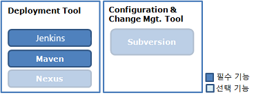

# 서버 개발환경

## 개요

전자정부 표준프레임워크에서는 경량화된 서버용 개발환경을 설치 할 수 있는 서버 개발환경 설치 파일을 제공한다.

## 설명

전자정부 표준프레임워크에서는 경량화된 서버용 개발환경을 구성 및 설치 할 수 있는 서버 개발환경 설치 파일 및 가이드를 제공한다.

서버 개발환경은 전자정부 표준프레임워크 서버 개발환경 설치 시 기본으로 설치되는 항목과 선택적으로 설치되는 항목으로 구분할 수 있다. 기본 설치 항목은 Tomcat, Jenkins, Maven으로 구성되어 있고, 선택 항목은 Nexus와 Subversion으로 구성되어 있다. 개발자는 프로젝트의 상황에 맞게 기본 설치 항목과 선택 설치 항목을 적절하게 사용할 수 있다.

### 구성 내역

| 서비스          | 소프트웨어 | 비고                                                                                                           |
| --------------- | ---------- | -------------------------------------------------------------------------------------------------------------- |
| 형상관리        | Subversion | 프로젝트에서 사용하는 파일들을 관리하기 위한 시스템으로써, 소스 파일의 일관성 있는 관리를 할 수 있게 해준다.   |
| Deploy          | Jenkins    | CI 서버로써 소스와 빌드 스크립트를 사용한 자동 빌드 및 빌드 결과를 개발자에게 피드백 하는 메커니즘을 제공한다. |
| 라이브러리 관리 | Maven      | POM(Project Management Object)을 이용하여 빌드에서부터 의존성 관리 및 배포를 관리 한다.                        |
| Nexus           | Nexus      | Maven repository manager로 프로젝트 또는 기업에서 필요로 하는 내부 리포지토리 구성을 위한 도구이다.            |

### 설치 구성

#### 기본 설치 항목

- **Tomcat**: 웹 애플리케이션 서버
- **Jenkins**: 지속적 통합(CI) 서버
- **Maven**: 빌드 및 의존성 관리 도구

#### 선택 설치 항목

- **Nexus**: Maven 저장소 관리자
- **Subversion**: 형상 관리 시스템

## 사용법

서버 개발환경(Windows, Unix 계열)을 [다운로드](http://www.egovframe.go.kr)하여 설치파일을 실행하면 서버 개발환경을 사용할 수 있다. 서버 개발환경을 설치하기 위해서는 서버 개발환경 설치가이드4.3.0를 참고한다.

사용시 기술지원은 포털의 질의응답을 이용할 수 있다.
