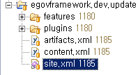

# 운영자 가이드

## 개요

전자정부 프레임워크 개발환경 구현도구의 기능을 추가하거나 개선하는 등의 변경 작업 이후 사용자에게 다시 배포하는 방법을 설명한다.

## 설명

전자정부 프레임워크 개발환경 구현도구 소스는 여러 개의 단위 플러그인 프로젝트로 구성되어 있으며, 이를 배포하기 위하여 피처 프로젝트, 업데이트 사이트 프로젝트를 사용한다.

* 피처 프로젝트 : 여러개의 단위 플러그인을 묶어서 플러그인 묶음을 하나의 단위로 쉽게 로딩하고 관리하기 위한 프로젝트이다.
* 업데이트 사이트 프로젝트 : 플러그인 묶음을 카테고리 단위로 분류하고 빌드하여 사용자에게 배포하기 위한 프로젝트이다.

전자정부 프레임워크 개발환경 구현도구에 기능을 추가하거나 개선한 이후에는 해당 단위 플러그인 프로젝트에 대한 버전을 변경하여 사용자가 버전이 변경되었음을 알 수 있도록 해야 한다. 그리고, update site 를 사용하여 update를 할 수 있도록 Feature 단위로 묶고 Build 하여 재배포를 해야 한다. 그러므로 수정후 재배포 순서는 다음과 같다.

* 단위 플러그인 프로젝트에 변경사항 적용 → Feature 프로젝트에 변경된 버전에 대한 내용 기술 → update 사이트에서 수정된 내용을 feature 단위로 빌드 → update site 를 통하여 배포

아래는 다음과 같은 과정을 자세히 기술한다.

**참고 : (플러그인 개발용) 이클립스 RCP 환경 구축**
[https://github.com/eGovFramework/egovframe-development/blob/main/README.md](https://github.com/eGovFramework/egovframe-development/blob/main/README.md)

## 배포 방법

### 1. 단위 플러그인 프로젝트 소스 변경

소스 변경 후에는 반드시 수정으로 인하여 다른 기능에 문제점이 발생하지 않는 지 확인해야 한다.

### 2. 버전 정보의 수정

단위 플러그인 프로젝트의 수정이 완료된 이후 단위 플러그인 소스 프로젝트 자체에서도 버전을 설정할 수 있는 데, 이를 관리하는 Feature 프로젝트의 버전 정보와 일치하지 않으면 관리하기가 어렵다. Feature 프로젝트는 자신의 버전 정보를 수정하면 단위 플러그인 프로젝트의 버전 정보를 강제적으로 일치시켜주는 기능을 제공한다. 따라서 버전 정보를 단위 소스 프로젝트에서 수정하기보다는 Feature 프로젝트에서 버전 정보를 수정한 후 옵션 버튼(Force Versions…)을 사용하여 버전 정보를 다음과 같이 수정할 것을 권장한다.

1. 변경된 플러그인 소스 프로젝트를 관리하는 feature 프로젝트를 찾아 feature.xml 을 연다.

2. feature.xml 의 Overview 탭에서 버전 정보를 수정한다.

3. feature.xml 의 Plug-ins 탭으로 이동하여 Versions… 버튼을 클릭한다.

4. Feature Versions 다이어로그창에서 Force feature version into plug-in and fragment manifests 를 선택하고 Finish 를 누른다.

### 3. Build 작업

1. egovframework.dev.update 프로젝트로 이동하여 site.xml 파일을 오픈한다.

2. site.xml 의 Site Map 탭에서 수정된 Featrue 의 이전버전을 찾아 delete 키를 눌러 제거한다.

3. Feature 를 추가할 Category 를 선택하고, 우측에 “Add Feature…” 버튼을 클릭한다.

4. Feature Selection 다이얼로그창에서 수정된 Feature 를 선택한 후 OK 버튼을 클릭한다.

5. 업데이트하고자 하는 feature 를 선택한 후에 Build 버튼을 클릭한다. 전체 build 할 경우에는 Build All 버튼을 클릭한다.

### 4. 개발환경 Update Site 를 통해 배포하기

배포방법에는 업데이트 사이트를 이용하여 사용자가 기존 개발환경에 수정된 버전을 업데이트하는 플러그인 업데이트 방법과, 기존의 개발환경에 수정된 버전을 미리 업데이트하여 이를 압축파일로 배포하는 방법이 있다.

#### 4.1 개발환경 Update site 를 이용한 플러그인 배포

1. egovframework.dev.update 프로젝트를 연다.

2. egovframework.dev.update 프로젝트 내에 있는 features 와 plugins 폴더에 신규 생성된 버전의 jar 파일과 수정된 site.xml 을 확인한다.
   (기존 버전의 jar 파일은 지워도 무방하다.)
3. 위 파일들을 ftp 나 svn 을 통해 업데이트 서버([https://www.egovframe.go.kr/update](https://www.egovframe.go.kr/update))에 업로드한다.
4. 사용자는 업데이트 사이트를 통해 수정된 개발환경을 업데이트한다. (업데이트 방법은 [개발환경 Implementation Tool Editor#UPDATE](../implementation-tool/editor.md) wiki 참조 ).

#### 4.2 신규 사용자를 위한 개발환경 압축파일 배포

1. 기존의 개발환경에서 업데이트 사이트[https://www.egovframe.go.kr/update](https://www.egovframe.go.kr/update)를 통해 개발환경을 업데이트한다. (업데이트 방법은 [개발환경 Implementation Tool Editor#UPDATE ](../implementation-tool/editor.md)wiki 참조 ).
2. 개발환경을 종료한 후 Workspace 설정 파일(설치폴더/configuration/.settings/org.eclipse.ui.ide.prefs)을 오픈하여 ``“RECENT_WORKSPACES=….”`` 줄 전체를 삭제한다.
3. 개발환경 전체 폴더 및 파일들을 압축하고 압축파일을 전자정부 개발환경 다운로드 게시판에 업로드한다.

### 제약사항

1. 변경된 소스를 실행하거나 디버깅하면 변경된 소스를 자동으로 빌드하여 실행하지만, Workspace에 문제가 있는 경우, 변경된 소스가 적용되지 않아 정상적인 기능 작동을 하지 않을 수 있다.
2. 변경된 소스를 Build하고자 할 때, Feature 프로젝트에 기술된 버전 정보와 단위 플러그인 프로젝트의 버전이 일치하지 않는 경우 build 시에 오류가 발생할 수 있으므로, 위 사용법을 참조하여 반드시 버전 정보를 일치시키도록 한다.
3. Code Inspection 의 경우 workspace 종속적인 부분으로 사용자가 직접 세팅해야 한다. (Code Inspection wiki 참조)

### Update Site 백업 및 복구

수정된 버전을 적용할 때 발생할 수 있는 문제점을 최소화하기 위하여 기존의 features, plugins 폴더와 site.xml 은 기존 버전명으로 압축하여 백업할 것을 권장한다. Update 후 문제가 발생하면, 신규로 설치된 항목을 모두 삭제한 뒤 백업된 압축파일을 압축해제하여 원상 복구하도록 한다.
