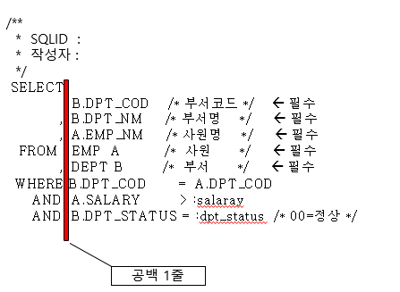
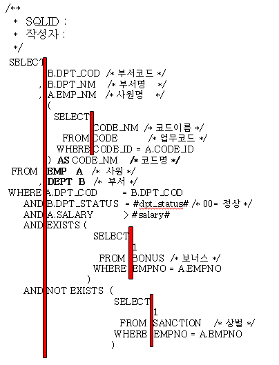
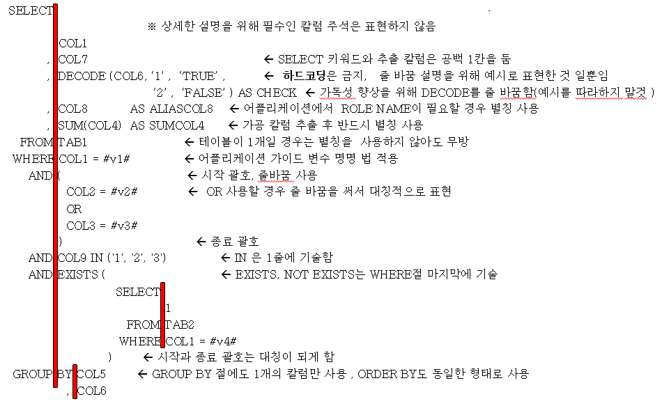
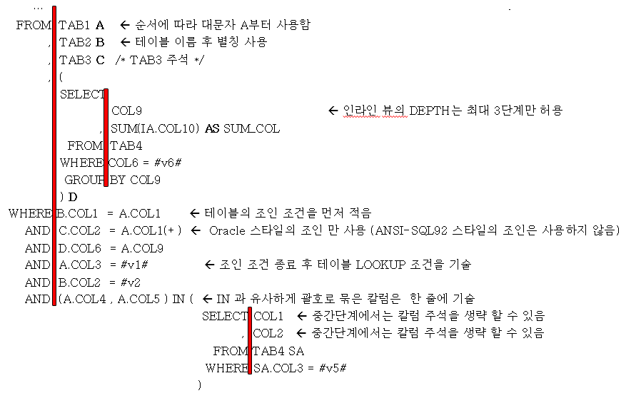
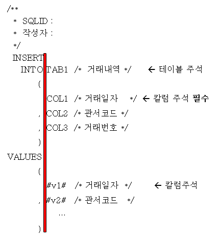
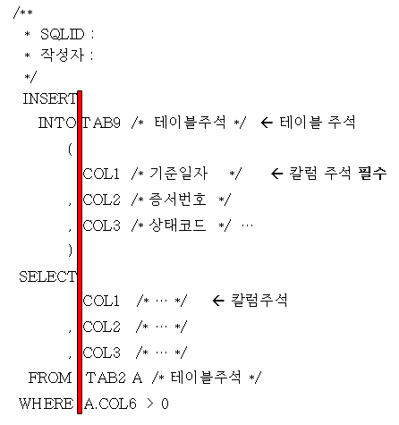
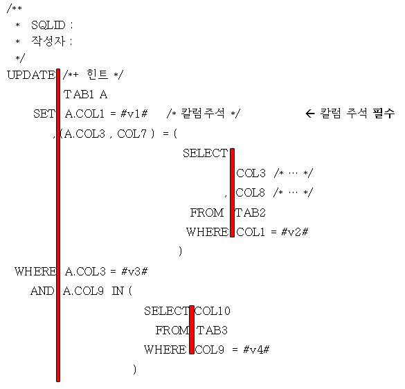
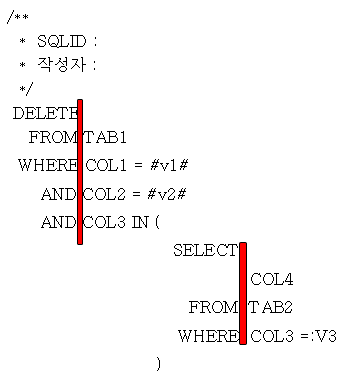

# SQL 작성 규칙

## 개요

본 가이드는 SQL 문법을 통일하여 가독성을 높일 수 있도록 가이드를 하기 위해 SQL 작성 규칙을 제공한다.

아래의 순서로 SQL 예시와 해당 규칙을 설명하는 방식으로 진행된다.
1. SQL 작성 규칙 정리
2. SQL 작성 규칙 예시
3. SELECT SQL 작성 예시
4. INSERT SQL 작성 예시
5. UPDATE SQL 작성 예시
6. DELETE SQL 작성 예시
7. 성능을 고려한 SQL 작성 원칙
8. 자주하는 질문 FAQ
 

# SQL 규칙 정리

| 번호 | 구분 | SQL 규칙 |
| --- | --- | ------ |
| 1 | 넓이 | 가로 최대 길이가 80칼럼 이하가 되도록 작성하길 권장하며 최대 120 칼럼을 넘지 않도록 함 |
| 2 | 대소문자 | 대문자 작성을 원칙으로 하며, 변수는 UI 네이밍룰에 맞추어서 작성 |
| 3 | 공백 | 공백(SPACE) 문자를 사용하며, 탭(TAB)은 사용하지 않음 |
| 4 | 컬럼명, 테이블명 | SQL문은 들여쓰기를 하여 가독성을 높일 수 있다.   반드시 어플리케이션에서 사용되는 칼럼명과 테이블 명 만을 SQL 구문에 기술하며,\* 등 테이블 전체 칼럼을 사용하는 것은 허용하지 않음 |
| 5 | 줄바꿈 | 줄 바꾸기는 키워드, 테이블, 칼럼에서 하는 것을 원칙으로 함   (단, 가독성 향상을 위해 임의로 줄 바꾸기를 할 수 있음) |
| 6 | 콤마 | 단어와 단어 사이, 콤마(,) 다음에는 한 칸을 띄운다. |
| 7 | 괄호 | 괄호 다음엔 공백을 두지 않는다. (단, EXISTS, 서브쿼리에서 괄호는 예시 참조) |
| 8 | 주석 | 주석은 /\* 와 \*/ 를 사용하고 “--“은 사용하지 않는다. |
| 9 | 힌트 | 힌트는 /*+ 와 */ 를 사용하고 “--+”은 사용하지 않는다.   개발자 임의의 힌트를 사용은 금지하며 튜닝 요소가 있을 경우 담당자와 협의하여 사용   ( 연속조회/최대값 조회를 위한 INDEX, INDEX_DESC 힌트는 사용가능, 그 이외에 어떠한 힌트도 사용불가 ) |
| 10 | 변수 | WHERE절에서  사용되는 모든 비교 값은 바인드 변수(Bind Variable)로 처리함을 원칙으로 하며   변수 이름은 어플리케이션 개발가이드에 따름 |
| 11 | ANSI | 가독성의 향상과 쉬운 유지보수를 위해서 ANSI SQL-92 표준의 조인 방식은 사용하지 않음   (업무적으로 FULL OUTER 조인이 사용될 경우는 허용함) |
| 12 | FROM절 | 인라인 뷰의 깊이는 최대 3단계까지만 허용함(권장 2단계) |
| 13 | 하드코딩 | DECODE, CASE WHEN에서 데이터 값을 하드 코딩하여 비교하는 형태는 허용하지 않음 |
| 14 | Static | Static Embeded SQL 사용을 원칙으로 함   Precompiler 제약에 의해서 반드시 Dynamic SQL로 구현되야 하는 MERGE INTO 문은 허용   임시 테이블이 생성되는 WITH 문은 Online 환경(센터컷 포함)에서는 허용하지 않음 ( 배치에서만 허용 ) |
 

# SQL 작성 규칙 예시
| SQL 예시 | SQL 규칙 |
| ---------- | ---------- |
|  |  SELECT 이후 반드시 공백 1칸을 주고 칼럼을 기술   1줄에 1개 컬럼 기술을 원칙으로 함   컬럼명 이후 공백을 주고  주석을 추가   컬럼명,테이블명의 구분 콤마(,)는 앞쪽에 기술  콤마 와 칼럼/테이블 명 사이에 공백 한 칸을 둠  FROM 절에 나타난 순서대로 알파벳 대문자 A , B ,… 순서로 사용  테이블 별칭 이후 공백을 주고 주석을 추가  SELECT , FROM, WHER , AND 가 오른쪽 맞춤이 되도록 정렬  ( SELECT의 “T”알파벳을 기준으로 정렬 )  WHERE 절의 조인 조건에 대해서는 주석은 필수가 아님   WHERE 절에서 조인 조건을 먼저 기술함    테이블 lookup 조건은 조인조건 이후에 기술 |
|   | FROM 절 테이블 별칭은 알파벳 대문자 A , B, C …  순서대로  기술   서브쿼리는 3개 이내로 사용 권장   칼럼 별칭은 반드시 AS를 사용한 후 별칭을 사용함   스칼라 서브쿼리 결과는 항상 칼럼 별칭을 사용함   EXISTS 절에서는 괄호 다음에 한 라인을 부여한다 |
 

# SELECT SQL 작성 예시
| SQL 예시 |
| ---------- |
|     |
 

# INSERT SQL 작성 예시
| SQL 예시 | SQL 규칙 |
| ---------- | ---------- |
|     | INTO, VALUES, SELECT, FROM, WHERE, AND, OR, 괄호, 콤마(,)등은 INSERT의 “T”자 기준으로 정렬한다.   INSERT 대상 칼럼 및 VALUES 절의 값들은 새로운 라인에서 시작괄호 ‘(‘ 다음에 빈칸 없이 바로 시작되고,   INSERT 기술이 모두 끝난 후 새로운 라인에 ‘(‘ 괄호가 위치하는 위치에 ‘)’를 정렬한다.   한 라인에 하나의 칼럼/값만 기술하고 콤마(,)는 새로운 라인에 기술 |
 

# UPDATE SQL 작성 예시
| SQL 예시 | SQL 규칙 |
| ---------- | ---------- |
|  | SET, FROM, WHERE, AND, OR, 콤마(,)등은 UPDATE의 “E”자 기준으로 정렬한다.   한 라인에 하나의 업데이트될 칼럼만 기술하고 콤마(,)는 새로운 라인에 기술한다.   업데이트될 컬럼은 첫 번째만 제외하고 콤마로 시작하고 콤마 뒤에 한 칸 띄운 후 칼럼과 변경 값을 기술한다. |
 

# DELETE SQL 작성 예시
| SQL 예시 | SQL 규칙 |
| ---------- | ---------- |
|  | 주석은 SQL  상단에 표기   FROM, WHERE, AND, OR, 콤마(,)등은 DELETE의 끝문자 “E”자 기준으로 정렬   WHERE절은 생략하지 않고 반드시 표기 |
 

# 성능을 고려한 SQL 작성 원칙
| 번호 | 내용 |
| ---------- | ---------- |
| 1 | 조회 , 변경에서 view를 통한 액세스는 허용하지 않음 |
| 2 | WHERE  조건 절은 항상 Static 하게 사용하는 것을 권장  ( iBatis “<isNotEmpty >” 등 문법을 악용하지 말 것 ) |
| 3 | 인라인 뷰의 최대 깊이는 메인 쿼리로부터 3단계 이하로 함 |
| 4 | 스칼라 서브쿼리 내에서 데이터를 가공하지 않도록 함   배치 프로그램에서 스칼라 서브 쿼리 사용을 금지함 ( 필요 시 별도 협의 할 것 ) |
| 5 | SELECT/WHERE 절에서 컬럼의 불필요한 가공 금지 ( index 스캔을 하지 못하는 주요 원인임 ) |
| 6 | 데이터 조회 나 변경은 꼭 필요한 대상 칼럼을 대상으로 해야 함 |
| 7 | 다수의 IF/ELSE 비교를 할 경우에는 DECODE 보다 CASE ~ WHEN 구문을 사용하도록 함 |
| 8 | 과도한 NVL 함수 사용을 금지 함 |
| 9 | 최대값을 갖는 ROW을 찾을 경우나 정렬된 데이터 추출 시 인덱스를 활용하여 sort 오퍼레이션을 최소화 해야 함 |
| 10 | Literal SQL 사용을 금지하고 항상 BIND 변수를 사용함 |
| 11 | HAVING보다는 WHERE 절에서 필터링을 함 |
| 12 | 온라인 환경에서 WITH 절 사용을 금지 함 |
| 13 | OR 논리 연산자 사용을 최소화 해야 함 |
| 14 | 조회 데이터의 UNIQUE 제약 조건이 없을 경우 UNION ALL 사용 ( UNION 사용금지 ) |
| 15 | 어플리케이션 Loop문장에서  INSERT, UPDATE, DELETE를 반복적으로 호출하지 말 것. ( Collection 객체로 한번에 처리) |
| 16 | FROM 절은 4개의 테이블 이하로 사용 (3개의 조인 조건) |
| 17 | 분석함수 사용은 통계화면을 제외한 화면에서는 사용하지 말 것 |
| 18 | Scalar Sub Query는 10,000건 이하의 테이블에서만 사용 |
 

# 자주하는 질문 FAQ
| 번호 | 구분 | 내용 |
| ---------- | ---------- | ---------- |
| 1 | 질문 | COUNT(*)와 COUNT(1) 중 어느 것이 빠른가? |
|   | 답변 | 오라클 내부적으로 똑같이 처리하므로 같다.   보편적으로 사용하는 직관적인 count(*)을 사용한다. |
| 2 | 질문 | 처음 실행 때는 느리지만 그 다음부터는 빠르다? |
|   | 답변 | SQL 처음 실행 시 원하는 값이 메모리(DB Buffer Cache)에 없으므로 물리적인 디스크를 읽어 데이터를 가져오고   두번째 이후부터는 메모리에서 가져오므로 처음과 두번째 이후의 어플리케이션 속도 차이가 난다. |
| 3 | 질문 | 데이터 건수가 너무 많아 성능개선이 어렵다 |
|   | 답변 | 조회조건에 해당하는 데이터가 어느 정도 이상을 넘어가면 인덱스를 이용하거나 풀스캔을 사용해도 성능개선이 어렵다.   조회 조건 중 데이터 범위를 줄일 수 있는 조건을 필수 조건으로 한다.   업무담당자와 협의하여 조회 조건 중에 기간범위, 해당범위 등을 이용하여 줄이도록 한다. |
| 4 | 질문 | ORA-01555 오류 ( Snapshot Too Old ) |
|   | 답변 | 일반적으로 배치프로그램에서 많이 발생하며 하나의 오브젝트에 대해 두 개 이상의 세션이 작업할 때 일어난다.   어플리케이션의 SELECT 문장 수행시간을 줄이거나 Commit 간격 시간을 늘려야 한다. |
| 5 | 질문 | ORA-01003 오류 ( No Statement Parsed ) |
|   | 답변 | 데이터베이스에서도 원인과 조치방법 모르는 오류   어플리케이션의 소스파일을 삭제한 후 새로운 파일에 소스를 작성하여 재실행하면 되는 경우가 많음. |
| 6 | 질문 | ORA-00600  오류 ( Internal Error Code ) |
|   | 답변 | 데이터베이스 버그일 가능성이 높은 오류   발생시 DBA에게 알려 DBMS와 관련된 후속 조치를 취할 수 있도록 한다. |
| 7 | 질문 | ORA-00060 오류 ( Deadlock ) |
|   | 답변 | 데드락 오류는 어플리케이션의 DML 작업이 모듈 별로 일관성을 유지하지 아닐 때 발생하는 오류이므로   모듈 별로 일관성을 유지하도록 어플리케이션을 수정함 ( AA간 협의하여 진행 할 것 ) |