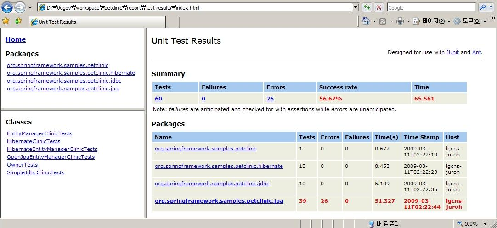

# Ant에서 생성한 테스트 결과 HTML 리포트

Ant를 통해 테스트를 실행하면 다음과 같은 항목들이 포함된 HTML 리포트가 생성됩니다.

| 항목         | 설명                                 |
| ------------ | ------------------------------------ |
| Tests        | 전체 TestCase 수                     |
| Failures     | 전체 실패한 TestCase 수              |
| Errors       | 전체 에러가 발생한 TestCase 수       |
| Success rate | 전체 성공한 TestCase 백분율          |
| Time         | TestCase가 수행되는 걸린 초단위 시간 |
| Time Stamp   | TestCase를 수행한 시각               |
| Host         | TestCase가 수행된 컴퓨터의 Host명    |

