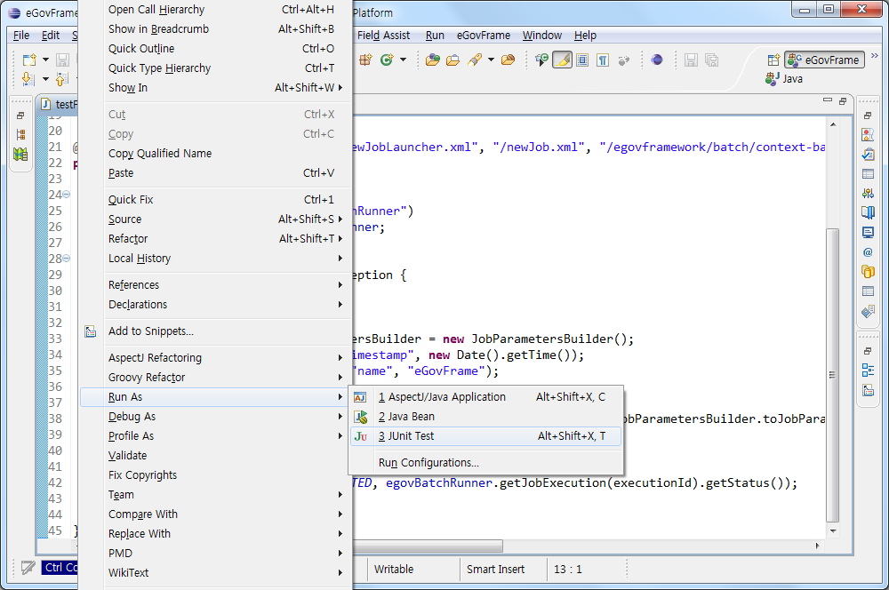

# Batch Job Test Wizard

## 개요

전자정부 표준프레임워크에서는 생성된 배치 파일들을 활용하여 간단한 테스트를 할 수 있는 테스트 마법사를 제공한다.

## 설명

배치 테스트시 필요한 항목들을 골라 테스트 파일을 생성해주고 JUnit을 통한 테스트를 진행한다.


✔ 배치 테스트 마법사를 통해 생성된 테스트 파일은 별도로 JUnit Test를 진행할 경우에도 사용가능하다.

## 사용법

1. 배치 테스트 마법사 시작하기
   * 메뉴 표시줄에서 **File** > **New** > **eGovFrame Batch Job Test**를 선택한다. (단 eGovFrame Perspective내에서)
   
     
   * 또는, 메뉴 표시줄에서 **eGovFrame** > **Test** > **Batch Job Test**을 선택한다. (단 eGovFrame Perspective내에서)
     
     
   * 또는, **Ctrl+N** 단축키를 이용하여 새로작성 마법사를 실행한 후 **eGovFrame** > **eGovFrame Batch Job Test**를 선택하고 **Next**를 클릭한다.
     
     
2. 배치 테스트 조건을 구성 혹은 선택하여 배치 테스트를 수행한다.
   * 신규 배치 테스트 수행
     * (1) eGovFrame기반으로 생성한 배치 프로젝트 중 하나를 선택하고 **Next**를 클릭한다.
       
       

     * (2) 선택한 프로젝트 내에 존재하는 **Job, Job Launcher 항목들** 중 테스트를 진행하고자 하는 항목을 선택한다.
       
       

     * (3) 배치 테스트시 Parameters를 추가할 경우 Job Parameters 우측의 **Add**를 클릭한다.
       ✔ 기본 timestamp를 Parameter로 사용할 경우 Job Parameters에 항목을 추가하지 않아도 된다.
     * (4) 기 등록한 Job Parameters 중 사용할 **Parameter**를 선택하고 **OK**를 클릭한다.
       
       

     * (5) 선택한 항목들을 기반으로 테스트 파일을 만들어 주기 위해 **Generate Batch Test File** 버튼을 클릭한다. (Job, Job Launcher를 선택한 경우에만 테스트 파일을 생성할 수 있다.)
       
       

       ✔ 정상적인 테스트를 위해 테스트 파일은 프로젝트 하단의 **src/main/java 혹은 src/test/java** 하단에 생성해야 한다.
     * (6) 테스트 파일 생성이 성공적으로 완료 되면 **Test** 버튼을 클릭하여 구성한 배치에 대한 테스트를 수행한다.
       
       

     * (7) 배치 테스트 마법사 하단의 **Result**를 통해서 배치 테스트의 성공/실패 여부를 확인한다.
       
       

   * 재사용 배치 테스트 수행
     * (1) eGovFrame기반으로 생성한 배치 프로젝트 중 하나를 선택하고 **Next**를 클릭한다.
       
       

     * (2) 선택한 프로젝트 내에 존재하는 배치 테스트 파일 선택을 위해 **Reuse**를 클릭한다.
       
       

     * (3) 전자정부 프레임워크 배치개발환경을 통해 생성한 배치 테스트 파일들에 대한 목록 중 재사용하려는 **배치 테스트 파일**을 선택한다.
       
       

     * (4) 선택한 테스트 파일을 사용하여 **Test** 버튼을 클릭하여 구성한 배치에 대한 테스트를 수행한다.
       
       

     * (5) 배치 테스트 마법사 하단의 **Result**를 통해서 배치 테스트의 성공/실패 여부를 확인한다.
       
       

3. 배치 테스트 마법사를 통해 생성된 테스트 파일은 배치 테스트 마법사가 종료된 이후에도 JUnit을 이용하여 사용할 수 있다. (생성된 테스트 파일에 대한 자세한 설명은 하단의 [참고사항](#참고사항)에서 확인할 수 있다.)
   * (1) 배치 테스트 마법사를 통해 생성된 테스트 파일 중 사용하려는 파일을 찾아 선택한다.
     
     

   * (2) 선택한 파일에서 **우클릭** > **Run As** > **JUnit Test**를 선택하여 배치 테스트를 수행한다. (JUnit에 대한 상세 설명을 [본 페이지](./test-case.md)에서 확인할 수 있다.)
     
     
     
   * (3) 테스트를 진행한 결과는 하단의 **JUnit View**에서 확인 가능하다.
     
     

### 참고사항

* 배치 테스트 마법사를 통해 생성된 파일의 구성 항목

```java
@RunWith(SpringJUnit4ClassRunner.class)
 
@ContextConfiguration(locations = { "/newJobLauncher.xml", "/newJob.xml", "/egovframework/batch/context-batch-job-launcher.xml", "/egovframework/batch/context-batch-datasource.xml" })
public class testFile{
 
	@Autowired
	@Qualifier("newJobLauncher.egovBatchRunner")
	private EgovBatchRunner egovBatchRunner;
 
	@Test
	public void testJobRun() throws Exception {
 
		String jobName = "TestJob";
 
		JobParametersBuilder jobParametersBuilder = new JobParametersBuilder();
		jobParametersBuilder.addLong("timestamp", new Date().getTime());
		jobParametersBuilder.addString("name", "eGovframe");
 
 
		String jobParameters = egovBatchRunner.convertJobParametersToString(jobParametersBuilder.toJobParameters());
 
		long executionId = egovBatchRunner.start(jobName, jobParameters);
 
		// Launcher 파일 내 Aysnc 설정이 존재 할 경우 Thread.sleep(10000)
		// if(egovBatchRunner.getJobExecution(executionId).getExitStatus().toString().contains("UNKNOWN")){
		//	Thread.sleep(10000);
		// }
 
		assertEquals(BatchStatus.COMPLETED, egovBatchRunner.getJobExecution(executionId).getStatus());
 
	}
}
```

| 구분        | 항목                  | 설명                                                               | 입력값                                                                                |
| ----------- | --------------------- | ------------------------------------------------------------------ | ------------------------------------------------------------------------------------- |
| 동기/비동기 | @RunWith              | Spring의 JUnit을 통한 테스트를 위한 등록                           | SpringJUnit4ClassRunner.class                                                         |
| 동기/비동기 | @ContextConfiguration | 배치 테스트를 위해 Job, JobLauncher 등의 구성 항목 위치 등록       | {“JobLauncher 위치”, “Job 위치”, ”(JobRepository 위치)”, ”(Datasource 위치)”} |
| 동기/비동기 | @Qualifier            | 구성한 Job, JobLauncher 등의 항목을 묶어줌                         | 선택한 JobLauncher 에 등록되어 있는 EgovBatchRunner클래서 등록 bean id                |
| 비동기      | Thread.sleep(10000);  | 선택한 Job 항목 내에 비동기 설정이 있는 경우 정상 동작을 위한 등록 | 10000                                                                                 |

✔ Thread.sleep(10000) : 일반적으로 Java Application으로 구동되기 때문에 Job이 수행된 직후 바로 종료된다. 따라서 안정적인 비동기식 Job을 성공시키기 위해 Thread.sleep을 추가시켰다. 10000이라는 시간은 Job이 수행되는 기본적인 시간을 감안해서 설정해 놓았고 그 이상의 시간이 소요되는 Job을 테스트 할 경우 시간을 늘려줄 필요가 있다.
