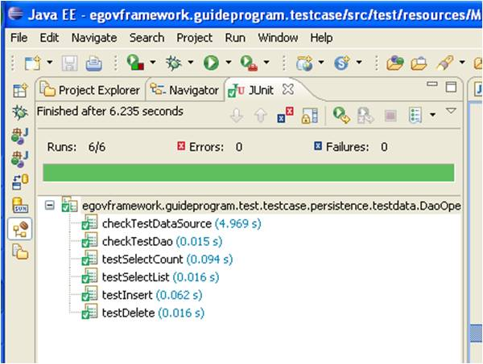

# DB Support

## 개요

데이터베이스 관련 단위 테스트를 수행하기 위한 Test Case 를 작성하고 실행하는 방법을 안내한다.

## 설명

DAO (Data Access Object) 클래스를 개발하는 경우 이에 대한 단위 테스트 케이스를 작성하기 위해 고려해야 할 사항은 다음과 같다.

* 데이터베이스 연결
* 테이블 생성 및 초기 데이터 입력
* DAO 클래스 실행 시 필요한 테스트 데이터 관리
* DAO 테스트 후 트랜잭션 Rollback 혹은 Commit 처리

이를 위해, 데이터베이스가 아직 준비 되지 않은 경우에는 개발자 로컬에 hsqldb, derby, mysql 과 같은 dbms를 임시로 설치하기도 한다.  
데이터베이스가 준비 되었다 하더라도 테이블 생성 스크립트를 작성하고 직접 dbms 와 연결하여 commit 후의 데이터를 확인해야 한다.  
또한, 프로그램이 수정 보완 되는 과정에서 여러 번 중복 테스트를 하기 위해서는 다시 dbms 에 접속하여 rollback 을 하는 등의 작업을 수행하기도 한다.

만약 dbunit / unitils / spring-test 등을 기본으로 몇 가지 Tip 을 적절히 이용하면 보다 손 쉽게 데이터베이스 관련 테스트 케이스 개발을 수행 할 수 있다.   
자세한 사항은 아래 사용법을 참조하도록 한다.

## 환경설정

Unit Test 환경설정과 동일하다.

## 사용법

### 데이터베이스 연결

먼저, 데이터베이스 준비(기동, DataSource 생성)에 대해 알아보자.  
테스트를 위해 사용할 수 있는 Database 가 준비되어 있고 이를 위한 접근 방법에 대한 안내까지 받았다면 고민할 필요는 없다.  
만약 이러한 상황이 아니라면, apache dbcp datasource 를 이용하여 생성하면 되고, springframework 를 사용하고 있다면 더더욱 간단히 해결될 수 있다.  
사실, egovframework 의 개발환경에서 제공하고 있는 CI Server 를 이용해 반복적으로 테스트를 수행하기 위해서는 테스트만을 위한 전용 DBMS 를 준비하는 것이 이상적이지만, 테스트 수행 후 깔끔하게 rollback 을 수행한다면 테스트 용 전용 DBMS 가 없어도 큰 무리는 없다.  

#### 프로퍼티 설정

```
# Properties for the PropertiesDataSourceFactory
database.driverClassName=org.hsqldb.jdbcDriver
database.url=jdbc:hsqldb:sampledb
database.userName=sa
database.password=
```

#### Test Case 작성

Test Case 작성 시 **`@RunWith(UnitilsJUnit4TestClassRunner.class)`** 을 선언하면 된다.

Unitils 는 springframework 와 달리 DataSource 가 아닌 TestDataSource 라는 것을 사용한다.   
이 TestDataSource 는 Unitils 설정에 따라 선언과 동시에 DataSource 를 Getting 하는 것 뿐 아니라 dbmaintain 과 같은 별도의 작업을 동시에 수행할 수 있다.  
 이는 다음에 설명하기로 하고, 여기서는 단순히 unitils 를 이용하여 TestDataSource 를 Getting 하는 예제만을 이해하도록 한다.

```java
@RunWith(UnitilsJUnit4TestClassRunner.class)
public class DataSourceGetTest_unitilsDataSource {
 
    /*
     * unitils.properties 에 설정 된 database 접근 정보를 기반으로 
     * 테스트 용 DataSource 를 만든 후 자동으로 injection 해 준다.
     * (unitils.properties 파일의 위치와 이름은 변경할 수 없다.)
     * 
     * @see  unitils.properties
     */
    @TestDataSource    
    private DataSource dataSource;
 
    @Test
    public void checkTestDataSource() {
        assertNotNull("dataSource를 정상적으로 get 했는지를 확인한다.", dataSource);
    }
}
```

### 테이블 생성 및 초기 데이터 입력

Unitils 를 이용하면 위처럼 TestDataSource 를 생성하거나, spring+unitils 조합의 DataSource 를 생성함과 동시에 테스트에 필요한 테이블을 생성하고 초기 데이터를 입력할 수 있다.

이 기능은 다음의 단계로 활용할 수 있다.

* 단위 테스트에 필요한 테이블을 생성하는 DML 스크립트 작성
* 이 DML 스크립트 실행 여부를 설정하고, 해당 디렉토리를 설정
* 테스트 케이스 수행 시 해당 기능 호출

현재는 'oracle', 'db2', 'mysql', 'hsqldb' and 'postgresql' 의 DBMS 만 지원한다.

#### 프로퍼티 설정

##### DBMS 의 종류, 스키마 정보 등을 설정

```
# This property specifies the underlying DBMS implementation. Supported values are 'oracle', 'db2', 'mysql', 'hsqldb' and 'postgresql'.
# The value of this property defines which vendor specific implementations of DbSupport and ConstraintsDisabler are chosen.
database.dialect=hsqldb
 
# A comma-separated list of all used database schemas. The first schema name is the default one, if no schema name is
# specified in for example a dbunit data set, this default one is used.
# A schema name is case sensitive.
database.schemaNames=PUBLIC
 
# Type of transaction manager that should be created:
# simple: a simple transaction manager that wraps the datasource to control transactions
# spring: a transaction manager that delegates actions to the transaction manager that is configured in the current spring context
# auto: this will first try to load the spring transaction manager. if spring is not available, it will load the simple transaction manager
transactionManager.type=auto
```

##### 데이터베이스 스키마 정보를 자동으로 update 할지를 설정

이 때 사용하는 sql 문을 저장해 둔 디렉토리 경로를 설정한다.  
dbMaintainer.disableConstraints.enabled 는 단위 테스트 수행 시 테이블간의 제약 조건을 제외한다는 것으로 true 로 지정하면 이 관계를 임시적으로 끊는 등의 별도 작업없이 진행이 되므로 유용하다.

```
# If set to true, the DBMaintainer will be used to update the unit test database schema. This is done once for each
# test run, when creating the DataSource that provides access to the unit test database.
updateDataBaseSchema.enabled=true
 
# Comma separated list of directories and files in which the database update scripts are located. Directories in this
# list are recursively searched for files.
dbMaintainer.script.locations=src/test/resources/META-INF/persistence/maintenance/hsqldb
 
# If set to true, an implementation of org.unitils.dbmaintainer.constraints.ConstraintsDisabler will be used to disable
# the foreign key and not null constraints of the unit test database schema.
# The ConstraintsDisabler is configured using the properties specified below. The property with key 'database.dialect'
# specifies which implementation is used.
dbMaintainer.disableConstraints.enabled=true
```

### DAO 클래스 실행 시 필요한 테스트 데이터 관리

데이터베이스 관련 CRUD 단위 테스트 수행 시, 테스트 수행 전에 데이터베이스에 필요한 데이터를 미리 저장해 두고 테스트 종료 후 이를 삭제하는 등의 작업을 좀 더 편리하게 수행할 수 있는 방법을 가이드한다.

Dbunit 은 이런 문제를 DBUnit 을 사용할 경우 유용한 기본적인 기능은 다음과 같다.

* XML 로 필요한 데이터를 선언 해 두면 단위 테스트 수행 시 이 데이터가 데이터베이스에 자동 저장된다.
* 데이터베이스 관련 테스트를 수행하고 그 결과값이 미리 XML 로 저장해 놓은 데이터와 자동으로 비교된다.
* 테스트 수행 후 트랜잭션 commit/rollback을 지정할 수 있다.

그러나, DBUnit 을 직접 테스트 코드에서 사용하기 위해서는 별도의 이 XML 파일을 Load 하는 등의 별도 프로그램 로직이 필요하여 사용하기에 불편함이 따른다.
이의 해소를 위해서 Unitils 는 DBUnit 관련한 기능을 Annotation만으로도 간단하게 사용할 수 있는 기능을 제공하므로, 이를 활용하는 방법을 안내한다.

#### 프로퍼티 설정

##### DBUnit 이용할 경우 트랜잭션 처리 방법 설정

DBUnit 을 이용해 데이터를 저장 혹은 삭제한 경우 commit/rollback 할런지를 설정하는 부분이다.
이 부분은 Test Case 를 작성할 때 동적으로 변경할 수 있으므로 우선은 disabled 로 선언 해 둔다.
(CI 등을 활용하여 주기적으로 반복 테스트를 수행할 경우에는 rollback으로 설정하는 것을 권장한다.)

```
# Default behavior concerning execution of tests in a transaction. Supported values are 'disabled', 'commit' and 'rollback'.
# If set to disabled, test are not executed in a transaction by default. If set to commit, each test is run in a transaction,
# which is committed. If set to rollback, each test is run in a transaction, which is rolled back.
DatabaseModule.Transactional.value.default=disabled
```

##### 사용하는 DBMS 의 종류, 스키마 정보 등을 설정

Unitils 는 여기서 언급된 종류의 DBMS를 지원하며 여기에 없는 DBMS 는 unitils 의 기능을 제한적으로 사용할 수 밖에 없으므로 설정하지 않는다.

```
# This property specifies the underlying DBMS implementation. Supported values are 'oracle', 'db2', 'mysql', 'hsqldb' and 'postgresql'.
# The value of this property defines which vendor specific implementations of DbSupport and ConstraintsDisabler are chosen.
database.dialect=hsqldb
 
# A comma-separated list of all used database schemas. The first schema name is the default one, if no schema name is
# specified in for example a dbunit data set, this default one is used.
# A schema name is case sensitive.
database.schemaNames=PUBLIC
 
# Type of transaction manager that should be created:
# simple: a simple transaction manager that wraps the datasource to control transactions
# spring: a transaction manager that delegates actions to the transaction manager that is configured in the current spring context
# auto: this will first try to load the spring transaction manager. if spring is not available, it will load the simple transaction manager
transactionManager.type=auto
```

##### 데이터베이스 스키마 정보를 자동으로 update 할지를 설정

이 때 사용하는 sql 문을 저장해 둔 디렉토리 경로를 설정한다.
dbMaintainer.disableConstraints.enabled 는 단위 테스트 수행 시 테이블간의 제약 조건을 제외한다는 것으로 true 로 지정하면 이 관계를 임시적으로 끊는 등의 별도 작업없이 진행이 되므로 유용하다.

```
# If set to true, the DBMaintainer will be used to update the unit test database schema. This is done once for each
# test run, when creating the DataSource that provides access to the unit test database.
updateDataBaseSchema.enabled=true
 
# Comma separated list of directories and files in which the database update scripts are located. Directories in this
# list are recursively searched for files.
dbMaintainer.script.locations=src/test/resources/META-INF/persistence/maintenance/hsqldb
 
# If set to true, an implementation of org.unitils.dbmaintainer.constraints.ConstraintsDisabler will be used to disable
# the foreign key and not null constraints of the unit test database schema.
# The ConstraintsDisabler is configured using the properties specified below. The property with key 'database.dialect'
# specifies which implementation is used.
dbMaintainer.disableConstraints.enabled=true
```

##### 테스트 수행 전 자동으로 입력할 데이터 정의

테스트 클래스 혹은 테스트 메소드 선언부에 **@DataSet (파일의 경로)** 와 같은 방법으로 호출한다.
XML 포맷의 데이터로서 작성 법은 다음과 같다.

```XML
<dataset>
    <테이블이름 컬럼이름1="값" 컬럼이름2="값"  ...... />
</dataset>
```

##### 테스트 수행 결과를 자동으로 비교할 데이터 정의

테스트 클래스 혹은 테스트 메소드 선언부에 **@ExpectedDataSet (파일의 경로)** 와 같은 방법으로 호출한다.
XML 포맷의 데이터로서 작성 법은 위와 동일하다.

```XML
<dataset>
    <테이블이름 컬럼이름1="값" 컬럼이름2="값"  ...... />
</dataset>
```

### DAO 테스트 후 트랜잭션 Rollback 혹은 Commit 처리

전체 Test Case 에 모두 적용시킬 수 있는 설정을 수행할 수도 있지만, 프로그램에서 선언하여 설정하는 것을 권장한다. 또한, springframework 을 이용하는 경우 해당 springframework 의 txManager 를 Test Case 클래스 선언부에 설정할 수도 있다. 자세한 방법은 샘플 프로그램을 보고 확인하도록 한다.

## 샘플

아래는 이클립스 메이븐 프로젝트의 예제이다.

예제는 다음의 내용으로 구성되어 있다.

* 테스트 대상
* 테스트 시나리오
* 환경 구성 정보
* 테스트 프로그램
* 테스트에 필요한 데이터
* 테스트 수행 결과

### 테스트 대상

#### DAO 구현 클래스 : NoticeDao.java

```java
@Repository("noticeDao")
public class NoticeDao extends SqlMapClientDaoSupport {
 
    /**
     * iBatis SqlMap 정보를 읽기 위한 sqlMapClient 세팅
     * @param sqlMapClient - 설정파일로부터 읽어온 정보 
    */
    @Resource(name = "sqlMapClient")
    public void setSuperSqlMapClient(SqlMapClient sqlMapClient) {
        super.setSqlMapClient(sqlMapClient);
    }
 
	/**
	 * 등록된 글의 수를 조회한다.
	 * @return	등록된 글의 수
	*/
	public int selectCount() {
		return (Integer) getSqlMapClientTemplate().queryForObject("selectCount");
	}
 
	/**
	 * id 에 해당하는 글을 조회한다.
	 * @param id - 등록된 글의 아이디
	 * @return 등록된 글의 정보가 담긴 NoticeVo
	*/
	public NoticeVo select(int id) {
		return (NoticeVo) getSqlMapClientTemplate().queryForObject("select", id);
	}
 
	/**
	 * 등록된 모든 글을 조회한다.
	 * @return	등록된 글의 목록을 담고 있는 NoticeVo 의 리스트
	*/
	@SuppressWarnings("unchecked")
	public List<NoticeVo> selectList() {
		return getSqlMapClientTemplate().queryForList("selectList", new NoticeVo());
	}
 
	/**
	 * 조회 조건에 해당하는 글을 조회한다.
	 * @param   searchNoticeVo  조회 조건을 담고 있는 NoticeVo 
	 * @return	등록된 글의 목록을 담고 있는 NoticeVo 의 리스트
	*/
	@SuppressWarnings("unchecked")
	public List<NoticeVo> selectList(NoticeVo searchNoticeVo) {
		return getSqlMapClientTemplate().queryForList("selectList", searchNoticeVo);
	}
 
	/**
	 * 글을 등록한다.
	 * @param 등록할 글의 정보를 담고 있는 noticeVo
	*/
	public void insert(NoticeVo noticeVo) {
		getSqlMapClientTemplate().insert("insert", noticeVo);
	}
 
	/**
	 * 글을 삭제한다.
	 * @param id - 등록된 글의 아이디
	*/
	public int delete(int id) {
		return getSqlMapClientTemplate().delete("delete", id);
	}
}
```

#### DAO 참조 클래스 : NoticeVo.java

```java
@Repository("noticeVo")
public class NoticeVo implements Serializable {
 
	private static final long serialVersionUID = 1L;
 
	/** id */
	private int id;
 
	/** title */
	private String title;
 
	/** contents */
	private String contents;
 
	/** registrationDate */
	private Date registrationDate;
 
	/** lastModifier */
	private String lastModifier;
 
	/** lastModifiedDate */
	private Date lastModifiedDate;
 
	/** fileCnt */
	private int fileCnt;
 
	/** retrievedCnt */
	private int retrievedCnt;
 
	/**
	 * getId
	 * @return
	*/
	public int getId() {
		return id;
	}
 
	/**
	 * getTitle
	 * @return
	*/
	public String getTitle() {
		return title;
	}
 
	/**
	 * getContents
	 * @return
	*/
	public String getContents() {
		return contents;
	}
 
	/**
	 * getRegistrationDate
	 * @return
	*/
	public Date getRegistrationDate() {
		return registrationDate;
	}
 
	/**
	 * getLastModifier
	 * @return
	*/
	public String getLastModifier() {
		return lastModifier;
	}
 
	/**
	 * getLastModifiedDate
	 * @return
	*/
	public Date getLastModifiedDate() {
		return lastModifiedDate;
	}
 
	/**
	 * getFileCnt
	 * @return
	*/
	public int getFileCnt() {
		return fileCnt;
	}
 
	/**
	 * getRetrievedCnt
	 * @return
	*/
	public int getRetrievedCnt() {
		return retrievedCnt;
	}
 
	/**
	 * setId
	 * @param id
	*/
	public void setId(int id) {
		this.id = id;
	}
 
	/**
	 * setTitle
	 * @param title
	*/
	public void setTitle(String title) {
		this.title = title;
	}
 
	/**
	 * setContents
	 * @param contents
	*/
	public void setContents(String contents) {
		this.contents = contents;
	}
 
	/**
	 * setRegistrationDate
	 * @param registrationDate
	*/
	public void setRegistrationDate(Date registrationDate) {
		this.registrationDate = registrationDate;
	}
 
	/**
	 * setLastModifier
	 * @param lastModifier
	*/
	public void setLastModifier(String lastModifier) {
		this.lastModifier = lastModifier;
	}
 
	/**
	 * setLastModifiedDate
	 * @param lastModifiedDate
	*/
	public void setLastModifiedDate(Date lastModifiedDate) {
		this.lastModifiedDate = lastModifiedDate;
	}
 
	/**
	 * setFileCnt
	 * @param fileCnt
	*/
	public void setFileCnt(int fileCnt) {
		this.fileCnt = fileCnt;
	}
 
	/**
	 * setRetrievedCnt
	 * @param retrievedCnt
	*/
	public void setRetrievedCnt(int retrievedCnt) {
		this.retrievedCnt = retrievedCnt;
	}
 
}
```

### 테스트 시나리오

 1. HSQLDB 를 이용 해 Notice 업무 수행을 위한 테이블을 생성(변경 시 업데이트만 수행)한다.
 2. selectList, selectCount 등의 메소드 실행을 위해 외부의 XML 로 정의해 둔 기초 데이터 3건을 자동 입력한다.
 3. insert / update / delete 메소드 실행을 위해 기초 데이터인 noticeVo 객체를 테스트 수행 전에 생성한다.
 4. selectList 의 select 결과에 대해 예상하는 값을 외부의 XML 파일로 저장해 두고 자동으로 비교해 본다.
 5. 중복 insert 가 발생 한 경우 예상 한 Exception 이 발생하는 지 확인한다.

unitils.properties 파일로, 여러 개의 unitils 관련 파일을 관리하고 싶을 경우 아래와 같이 해당 위치를 선언해두면 된다. 물론 동시에는 하나의 설정 값만 인식된다.

### 환경 구성

#### unitils.properties

```
unitils.configuration.localFileName=META-INF/persistence/unitils-local-hsqldb.properties
#unitils.configuration.localFileName=META-INF/persistence/unitils-local-oracle.properties
#unitils.configuration.localFileName=META-INF/persistence/unitils-local-mysql.properties
#unitils.configuration.localFileName=META-INF/persistence/unitils-local-altibase.properties
#unitils.configuration.localFileName=META-INF/persistence/unitils-local-tibero.properties
```

위에서 DBMS 별로 설정 파일을 구성해 놓은 이유는 DMBS 별로 설정해야 하는 값이 다르기 때문이다. 먼저 HSQLDB 를 사용하는 경우를 살펴보자.

#### unitils-local-hsqldb.properties

```
# HSQLDB 연결 정보 설정
database.driverClassName=org.hsqldb.jdbcDriver
database.url=jdbc:hsqldb:hsql://localhost/sampledb
database.userName=sa
database.password=
# 트랜잭션 처리 설정 ( 'disabled', 'commit', 'rollback' )
DatabaseModule.Transactional.value.default=disabled
# DataSet, ExpectedDataSet 사용을 위한 dms 정보 설정 ( 'oracle', 'db2', 'mysql', 'hsqldb', 'postgresql' )
database.dialect=hsqldb
# 스키마 이름 설정
database.schemaNames=PUBLIC
# 트랜잭션 매니저 설정 ( 'auto', 'spring', 'simple' )
transactionManager.type=auto
# 테이블 자동 생성 등의 스키마 관리 기능 사용 여부 및 DML 위치 설정
updateDataBaseSchema.enabled=true
dbMaintainer.script.locations=src/test/resources/META-INF/persistence/maintenance/hsqldb
dbMaintainer.disableConstraints.enabled=true
```

### 테스트 데이터

#### 테이블 자동 생성을 위한 DML : 001_initial.sql

```sql
CREATE TABLE NOTICE (
        NOTICE_ID                   INTEGER PRIMARY KEY,
        NOTICE_TITLE                VARCHAR(500) NOT NULL,
        NOTICE_CONTENTS             VARCHAR(4000) NOT NULL,
        NOTICE_REGISTRATION_DATE    VARCHAR(10) NOT NULL,
        NOTICE_LAST_MODIFIER        VARCHAR(100) NOT NULL,
        NOTICE_LAST_MODIFIED_DATE   DATE,
        NOTICE_FILE_CNT             INTEGER,
        NOTICE_RETRIEVED_CNT        INTEGER
    );
```

#### 데이터 자동 입력을 위한 XML : AutoInsertionTestDataTest_DataSet.xml
``` XML
<?xml version="1.0" encoding="UTF-8"?>
 
<dataset>
    <NOTICE NOTICE_ID="101"
            NOTICE_TITLE="101번 공지"
            NOTICE_CONTENTS="테스트용으로 자동 입력된 공지사항 101번입니다."
            NOTICE_REGISTRATION_DATE="2009-03-18"
            NOTICE_LAST_MODIFIER="OracleDataSetTest.xml"
            NOTICE_LAST_MODIFIED_DATE="2009-03-17"
            NOTICE_FILE_CNT="0"
            NOTICE_RETRIEVED_CNT="0"
    />
    <NOTICE NOTICE_ID="102"
            NOTICE_TITLE="102번 공지"
            NOTICE_CONTENTS="테스트용으로 자동 입력된 공지사항 102번입니다."
            NOTICE_REGISTRATION_DATE="2009-03-18"
            NOTICE_LAST_MODIFIER="OracleDataSetTest.xml"
            NOTICE_LAST_MODIFIED_DATE="2009-03-17"
            NOTICE_FILE_CNT="0"
            NOTICE_RETRIEVED_CNT="0"
    />
    <NOTICE NOTICE_ID="103"
            NOTICE_TITLE="103번 공지"  
            NOTICE_CONTENTS="테스트용으로 자동 입력된 공지사항 103번입니다."
            NOTICE_REGISTRATION_DATE="2009-03-18"
            NOTICE_LAST_MODIFIER="OracleDataSetTest.xml"
            NOTICE_LAST_MODIFIED_DATE="2009-03-17"
            NOTICE_FILE_CNT="0"
            NOTICE_RETRIEVED_CNT="0"
    />
</dataset>
```

#### 조회 결과와 자동으로 비교할 XML : AutoVerifyTestResultsTest_ExpectedDataSet.xml

``` XML
<?xml version="1.0" encoding="UTF-8"?>
 
<dataset>
    <NOTICE NOTICE_ID="201" 
            NOTICE_TITLE="201번 공지"  
            NOTICE_CONTENTS="테스트용으로 자동 입력된 공지사항 201번입니다."
            NOTICE_LAST_MODIFIER="OracleDataSetTest.class"
    />
</dataset>
```

### 테스트 수행결과

#### 콘솔 로그

**데이터 소스 생성하는 모습**

```
2009. 4. 28 오후 2:29:33 org.unitils.database.config.PropertiesDataSourceFactory createDataSource
정보: Creating data source. Driver: org.hsqldb.jdbcDriver, url: jdbc:hsqldb:sampledb, user: sa, password: <not shown>
```

**데이터베이스 스키마 업데이트 모습**

```
2009. 4. 28 오후 2:29:33 org.unitils.database.DatabaseModule updateDatabase
정보: Checking if database has to be updated.
2009. 4. 28 오후 2:29:34 org.unitils.dbmaintainer.DBMaintainer updateDatabase
정보: Database is up to date
```

**Spring Context Loading 모습**

```
2009. 4. 28 오후 2:29:34 org.springframework.context.support.AbstractApplicationContext prepareRefresh
정보: Refreshing org.springframework.context.support.ClassPathXmlApplicationContext@17a29a1: display name [org.springframework.context.support.ClassPathXmlApplicationContext@17a29a1]; startup date [Tue Apr 28 14:29:34 KST 2009]; root of context hierarchy
2009. 4. 28 오후 2:29:35 org.springframework.beans.factory.xml.XmlBeanDefinitionReader loadBeanDefinitions
정보: Loading XML bean definitions from class path resource [META-INF/persistence/connection/datasource-spring-with-unitils.xml]
2009. 4. 28 오후 2:29:35 org.springframework.beans.factory.xml.XmlBeanDefinitionReader loadBeanDefinitions
정보: Loading XML bean definitions from class path resource [META-INF/spring/context-common.xml]
2009. 4. 28 오후 2:29:37 org.springframework.beans.factory.xml.XmlBeanDefinitionReader loadBeanDefinitions
정보: Loading XML bean definitions from class path resource [META-INF/spring/context-sqlmap.xml]
2009. 4. 28 오후 2:29:37 org.springframework.context.support.AbstractApplicationContext obtainFreshBeanFactory
정보: Bean factory for application context [org.springframework.context.support.ClassPathXmlApplicationContext@17a29a1]: org.springframework.beans.factory.support.DefaultListableBeanFactory@1a7508a
2009. 4. 28 오후 2:29:37 org.springframework.core.io.support.PropertiesLoaderSupport loadProperties
정보: Loading properties file from class path resource [META-INF/spring/jdbc.properties]
2009. 4. 28 오후 2:29:37 org.springframework.beans.factory.support.DefaultListableBeanFactory preInstantiateSingletons
정보: Pre-instantiating singletons in org.springframework.beans.factory.support.DefaultListableBeanFactory@1a7508a: defining beans [dataSource,org.springframework.beans.factory.config.PropertyPlaceholderConfigurer#0,noticeDao,noticeService,noticeVo,emailController,org.springframework.context.annotation.internalCommonAnnotationProcessor,org.springframework.context.annotation.internalAutowiredAnnotationProcessor,org.springframework.context.annotation.internalRequiredAnnotationProcessor,sqlMapClient]; root of factory hierarchy
```

**XML 로 지정한 입력 DataSet 을 읽어오는 부분**

위 샘플에서는 클래스 상위에 선언을 했기 때문에 각 테스트 메소드 실행 전마다 호출되고 있음

```
2009. 4. 28 오후 2:29:37 org.unitils.dbunit.DbUnitModule getDataSet
정보: Loading DbUnit data set. File names: [D:\_dev\egov_dev\workspace\egovframework.guideprogram.testcase\target\test-classes\META-INF\persistence\testdata\AutoInsertionTestDataTest_DataSet.xml]
2009. 4. 28 오후 2:29:38 org.unitils.dbunit.DbUnitModule getDataSet
정보: Loading DbUnit data set. File names: [D:\_dev\egov_dev\workspace\egovframework.guideprogram.testcase\target\test-classes\META-INF\persistence\testdata\AutoInsertionTestDataTest_DataSet.xml]
2009. 4. 28 오후 2:29:38 org.unitils.dbunit.DbUnitModule getDataSet
정보: Loading DbUnit data set. File names: [D:\_dev\egov_dev\workspace\egovframework.guideprogram.testcase\target\test-classes\META-INF\persistence\testdata\AutoInsertionTestDataTest_DataSet.xml]
2009. 4. 28 오후 2:29:38 org.unitils.dbunit.DbUnitModule getDataSet
정보: Loading DbUnit data set. File names: [D:\_dev\egov_dev\workspace\egovframework.guideprogram.testcase\target\test-classes\META-INF\persistence\testdata\AutoVerifyTestResultsTest_ExpectedDataSet.xml]
2009. 4. 28 오후 2:29:38 org.unitils.dbunit.DbUnitModule getDataSet
정보: Loading DbUnit data set. File names: [D:\_dev\egov_dev\workspace\egovframework.guideprogram.testcase\target\test-classes\META-INF\persistence\testdata\AutoInsertionTestDataTest_DataSet.xml]
```

#### JUnit View



## 참고자료

* [JUnit 공식 사이트](http://www.junit.org/)   
* [DbUnit 공식 사이트](http://www.dbunit.org/)
